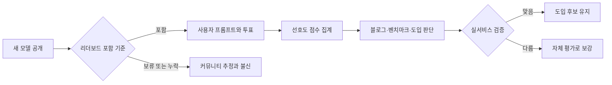

> 한 줄 요약: LM Arena 오픈 모델 누락 논란은 특정 모델의 순위 싸움이라기보다, 벤치마크 플랫폼이 어떤 모델을 보여주고 어떤 모델을 비워두는지 설명하라는 요구에 가깝다. 리더보드는 전체 목록이 아니라 운영자가 골라 보여주는 비교 화면이다.

## 무슨 일이 있었나

r/LocalLLaMA에 올라온 `Is LM Arena over?`라는 글은 LM Arena를 보던 오픈 모델 사용자들의 피로감을 보여준다. 작성자는 새 오픈 모델이 나올 때마다 LM Arena에서 폐쇄형 모델과 어느 정도 맞붙는지 확인해 왔는데, 최근에는 새로 공개된 오픈 모델, 특히 큰 모델이 아닌 경우가 잘 보이지 않는다고 했다.

작성자가 예로 든 것은, 제공된 요약 기준으로는 Qwen 3.6 계열과 Step 3.7 Flash다. 이 모델들이 왜 빠졌는지, 운영진이 일부러 제외했는지, 아직 평가 대기열에 있는지는 확인되지 않았다. 지금 말할 수 있는 것은 Reddit 커뮤니티에서 누락 체감이 불만으로 올라왔다는 점이다. 해석은 그다음 문제다.

쟁점의 범위도 나눠 봐야 한다. 이번 논란은 LM Arena가 모델 성능을 잘못 측정했다는 주장보다는, 리더보드에 어떤 모델이 올라오고 어떤 모델이 보이지 않는지에 관한 신뢰 문제에 가깝다. LocalLLaMA 같은 커뮤니티에서는 오픈 웨이트(open-weight) 모델, 로컬 실행, 양자화(Quantization), 비용 대비 성능이 모델 선택의 중요한 기준이 된다.

LM Arena는 두 모델의 답변을 익명으로 보여주고 사용자가 더 나은 답을 고르는 선호도 평가 플랫폼이다. 이 방식은 정적 벤치마크보다 실제 사용감에 가까운 면이 있다. 다만 모델 포함 기준과 표본 분포가 흐려지면, 리더보드 숫자보다 비어 있는 자리가 더 크게 보인다.

2025년 4월 Llama 4 Maverick 평가 때도 비슷한 긴장이 있었다. 당시 공개 배포판과 LM Arena에 올라간 실험 버전의 차이가 논란이 됐고, 리더보드가 실제 사용 가능한 모델을 얼마나 대표하느냐는 질문이 커졌다. 이번 Reddit 글이 새로운 사건 하나를 터뜨렸다기보다는, 이미 쌓여 있던 의심을 다시 건드린 쪽에 가깝다.

## 왜 사람들이 반응했나

### LM Arena 오픈 모델 누락은 왜 불편한가

리더보드에서 빠진 모델은 단순히 순위가 없는 모델로 끝나지 않는다. 많은 사용자는 리더보드에 없다는 사실을 경쟁력이 없거나 검증이 덜 된 상태로 받아들인다. 오픈 모델은 홍보 예산보다 커뮤니티 검증에 기대는 경우가 많아서, 노출 자체가 채택 가능성과 이어진다.

오픈 모델 생태계에서는 같은 계열 안에서도 크기, 추론 속도, 컨텍스트 길이, 라이선스, 양자화 품질이 갈린다. 가장 큰 모델만 보이면 현업에서 실제로 돌릴 만한 모델이 사라진다. GPU 예산이 제한된 팀에는 70B급 모델보다 작은 모델의 품질 변화가 더 직접적인 의사결정 포인트다.

사용자 입장에서는 이런 질문이 남는다.

- 왜 이 모델은 없나
- 아직 평가 중인가
- 비용이나 트래픽 문제로 제외됐나
- 안전성, 라이선스, 제공자 협조 같은 조건이 있었나
- 큰 모델 위주로 리더보드가 재편되고 있나

답이 없으면 사람들은 정책을 추정한다. 커뮤니티 논쟁은 대개 여기서 시작된다.

### 신뢰 문제: 리더보드는 측정기인가, 편집면인가

LM Arena 같은 플랫폼은 중립적인 온도계처럼 보이지만, 실제로는 편집면에 가깝다. 어떤 모델을 올릴지, 어떤 모델끼리 얼마나 자주 붙일지, 어떤 결과를 공개할지, 오래된 모델을 언제 내릴지 결정해야 한다. 운영 비용과 품질 관리 때문에 피하기 어려운 결정이다.

문제는 그 결정이 보이지 않을 때 생긴다. 사용자는 점수만 보지만, 점수 뒤에는 포함 기준, 표본 수, 프롬프트 분포, 제거 정책, 비공개 테스트 가능성 같은 운영 조건이 있다. 2025년 논문 `The Leaderboard Illusion`도 Chatbot Arena류 리더보드에서 비공개 테스트, 표본 배분, 모델 제거 정책이 결과 해석에 영향을 줄 수 있다고 지적했다.

이 말은 LM Arena가 쓸모없다는 뜻이 아니다. 영향력이 커진 만큼 더 많은 설명을 요구받는다는 뜻이다. 커뮤니티가 불편해하는 지점도 숫자 하나가 틀렸다는 것보다, 숫자가 만들어지는 과정에서 누가 어떤 권한을 갖는지에 가깝다.

### 비용 문제: 모든 모델을 다 올릴 수는 없다

운영진 관점도 있다. 새 모델은 계속 나온다. 오픈 모델은 파생 모델, 양자화 버전, 파인튜닝 버전까지 합치면 목록이 금방 불어난다. 모든 모델을 같은 품질로 서비스하려면 추론 비용, 지연 시간, 안전 필터, 장애 대응, 모델 제공자와의 연결 문제가 따라온다.

그래서 제외나 지연 자체가 곧 편향의 증거는 아니다. 다만 플랫폼이 커질수록 빠진 이유를 설명하는 일도 운영의 일부가 된다. “아직 미지원”, “평가 대기”, “라이선스 확인 중”, “충분한 투표 수 없음”, “제공자 엔드포인트 불안정”처럼 상태를 나눠 보여주기만 해도 불신은 꽤 줄어든다.

현업에서 비슷한 고민을 하다 보면, 평가표보다 상태표가 더 도움이 될 때가 있다. 점수는 비교를 빠르게 만들지만, 상태는 오해를 줄인다.

## 내가 보는 핵심

이번 이슈의 핵심은 `LM Arena가 끝났나`가 아니다. 더 정확한 질문은 `우리는 리더보드의 빈칸을 어떻게 읽어야 하나`다.

리더보드는 모델 생태계의 지도처럼 쓰이지만, 지도에는 항상 축척과 생략이 있다. 생략 규칙을 모르면 길을 잘못 든다. 특히 LLM 평가에서는 전체 평균 순위가 실제 업무 성능을 대신하지 못한다. 코딩, 한국어 문서 작성, 긴 컨텍스트 요약, 함수 호출(Function Calling), 비용 제한, 개인정보 입력 여부에 따라 좋은 모델이 달라진다.

이 흐름에서 가장 위험한 지점은 E에서 F로 넘어갈 때다. 리더보드 점수가 내부 의사결정 문서에 그대로 들어가면, 평가 목적이 사라진다. “1위 모델”이라는 문구는 강하지만, 실제 시스템은 지연 시간, 장애 격리, 데이터 보관, 계약 조건, 토큰 비용, 지역 규제에 묶인다.

오픈 모델에는 조건이 하나 더 붙는다. 재현 가능성이다. 폐쇄형 모델은 API 품질이 바뀌어도 사용자가 내부 가중치를 확인할 수 없다. 오픈 모델은 가중치, 추론 런타임, 양자화 방식, 프롬프트 템플릿을 직접 바꿀 수 있다. 그래서 리더보드보다 “내 환경에서 같은 결과가 나는가”가 더 큰 판단 기준이 된다.

LM Arena가 계속 유용하려면 단일 순위보다 맥락을 더 많이 보여줘야 한다. 어떤 모델이 빠졌는지, 왜 빠졌는지, 어떤 프롬프트군에서 강했는지, 표본이 충분한지, 공개 배포판과 평가판이 같은지 같은 정보가 필요하다. 순위는 입구이고, 설명은 신뢰를 유지하는 장치다.

## 앞으로 볼 기준

다음에 LM Arena, Chatbot Arena, 또는 다른 LLM 리더보드 논란을 볼 때는 모델 이름보다 먼저 아래를 확인하는 편이 낫다.

| 확인할 것 | 봐야 할 질문 |
|---|---|
| 모델 포함 기준 | 새 모델이 어떤 조건에서 올라오는가 |
| 버전 일치 | 리더보드 모델과 공개 사용 가능 모델이 같은가 |
| 표본 수 | 충분한 비교 투표가 쌓였는가 |
| 프롬프트 분포 | 내가 쓰려는 업무와 평가 프롬프트가 겹치는가 |
| 제거 정책 | 오래된 모델이나 불안정한 모델은 어떻게 내려가는가 |
| 공개 범위 | 원자료, 집계 방식, 신뢰구간을 볼 수 있는가 |
| 운영 조건 | 비용, 속도, 장애 대응, 데이터 처리 조건이 맞는가 |

실무에서는 리더보드를 버릴 필요가 없다. 다만 첫 번째 필터로만 써야 한다. 후보를 좁힌 뒤에는 실제 프롬프트, 실제 데이터 형태, 실제 비용 한도로 다시 검증해야 한다.

오픈 모델을 본다면 큰 모델 순위만 보지 말고, 실행 가능한 크기의 모델이 얼마나 빨리 반영되는지 봐야 한다. 커뮤니티가 Qwen이나 Step 같은 새 모델 누락에 민감한 이유도 여기에 있다. 그들에게 리더보드는 구경거리가 아니라 “이번 주에 무엇을 내려받아 테스트할지” 정하는 작업 도구다.

`Is LM Arena over?`라는 질문은 과격해 보이지만, 안쪽에는 꽤 현실적인 요구가 있다. 리더보드가 계속 기준점으로 쓰이고 싶다면 점수뿐 아니라 누락, 지연, 버전 차이까지 설명해야 한다. 모델 경쟁이 빨라질수록 신뢰는 1위 숫자보다 빈칸을 다루는 방식에서 갈린다.

## 참고 자료

- [선정 글감] [Is LM Arena over?](https://www.reddit.com/r/LocalLLaMA/comments/1ut0n1p/is_lm_arena_over/) (Reddit LocalLLaMA)
- [관련] [The Leaderboard Illusion](https://arxiv.org/abs/2504.20879) (arXiv)
- [관련] [Who Defines “Best”? Towards Interactive, User-Defined Evaluation of LLM Leaderboards](https://arxiv.org/abs/2604.21769) (arXiv)
- [관련] [Meta got caught gaming AI benchmarks](https://www.theverge.com/meta/645012/meta-llama-4-maverick-benchmarks-gaming) (The Verge)