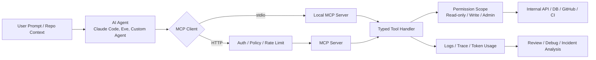

> 한 줄 요약: MCP 서버는 AI 에이전트에 기능을 붙이는 편한 어댑터가 아니라 모델이 호출하는 프로덕션 API다. 관건은 도구를 많이 여는 데 있지 않다. 권한, 관측성, 응답 크기, 실패 반경을 얼마나 좁힐 수 있느냐다.

## 왜 지금 MCP 서버와 AI 에이전트 보안이 이슈인가

MCP(Model Context Protocol)를 붙이면 Claude Code 같은 AI 에이전트가 로컬 CLI, 사내 API, 데이터베이스, GitHub 저장소를 직접 다룰 수 있다. 문제는 바로 그 지점에서 생긴다. 사람이 복사해서 붙여 넣던 JSON 응답을 모델이 직접 가져오는 순간, 생산성 이야기는 아키텍처와 보안 문제로 바뀐다.

이번에 다룬 Go 기반 MCP 서버 예시는 이 긴장을 잘 보여준다. `get_invoices(client_id, year)` 같은 도구 하나를 열면 모델은 자연어 대화 중 필요하다고 판단할 때 이 도구를 호출한다. 개발자는 긴 프롬프트 대신 도구 이름, 설명, 입력 스키마를 정의한다.

커뮤니티에서 이야기가 나오는 이유도 여기에 있다. MCP는 에이전트 생태계의 플러그인 규격처럼 보이지만, 실무에서는 사내 시스템의 새 진입점이 된다. 특히 HTTP로 노출되는 MCP 서버는 개인용 자동화 스크립트와 다르다. 인증, 권한, 로깅, 타임아웃, 감사 추적이 빠진 MCP 서버는 모델을 앞세운 공개 API에 가깝다.

2026년 7월 현재 사례를 보면 방향이 더 선명해진다. Anthropic은 내부 제품에서 Claude의 권한을 넓히면서 실패 확률보다 실패 반경을 제한하는 쪽으로 문제를 잡는다. Vercel은 GitHub 도구를 에이전트에 붙이되 쓰기 작업은 승인 기반으로 둔다. GitHub는 Copilot 코드 리뷰에서 더 좋은 도구를 넣었는데도 초기에는 비용이 늘고 검출 성능이 떨어졌다고 공개했다. 도구 자체보다 도구를 어떤 흐름에서 쓰게 만들었는지가 더 큰 변수였다는 얘기다.

## 커뮤니티에서 갈리는 지점

### MCP 서버를 내부 API처럼 봐야 할까, 개발자 도구처럼 봐야 할까?

개인 로컬에서 쓰는 `stdio` MCP 서버는 개발자 도구에 가깝다. Claude Code가 바이너리를 서브프로세스로 실행하고, 로컬 권한 안에서 도구를 호출한다. 이 경우 인증은 사실상 사용자의 머신과 OS 권한에 기대게 된다.

하지만 팀이 함께 쓰는 MCP 서버를 HTTP로 올리는 순간 성격이 달라진다. 이제는 네트워크 경계, 토큰, mTLS, 레이트 리밋, 감사 로그가 필요하다. 선정 글감이 지적하듯 `stdio`에서 프로토타입을 만든 뒤 팀 서버로 옮길 때 가장 흔한 함정은 무인증 로컬 모델을 그대로 네트워크 서비스로 승격하는 일이다.

이 차이는 배포 방식만의 문제가 아니다. 모델은 결정론적 클라이언트가 아니다. 사람이 보낸 프롬프트, 저장소에 섞인 지시문, 이슈 댓글, 문서 본문이 모두 도구 호출 판단에 영향을 줄 수 있다. 그래서 MCP 도구 하나는 REST 엔드포인트 하나보다 더 보수적으로 설계해야 한다.

### 권한을 많이 주면 생산성이 오를까?

에이전트 도입 논의에서 자주 나오는 낙관은 간단하다. 모델에게 더 많은 도구를 주면 더 많은 일을 자동화할 수 있다는 생각이다. 그런데 GitHub의 Copilot 코드 리뷰 사례는 반대 방향의 경고를 준다. 공유 Unix 스타일 도구인 `grep`, `glob`, `view`로 바꿨을 때 기대와 달리 리뷰 비용이 커지고 잡아내는 이슈가 줄었다. 이후 Pull Request를 읽는 방식에 맞춰 지시와 흐름을 다시 짜자 평균 리뷰 비용이 약 20% 낮아지고 품질은 유지됐다.

도구 품질만 올려서는 부족하다. 모델이 언제, 어떤 순서로, 얼마만큼 호출해야 하는지까지 설계해야 한다.

Vercel의 GitHub Tools도 같은 문제를 다른 방식으로 다룬다. `maintainer`, `code-review`, `issue-triage`, `ci-ops` 같은 프리셋으로 도구 범위를 나누고, `mergePullRequest` 같은 쓰기 도구는 기본적으로 승인을 요구한다. 읽기 도구도 대량 payload를 그대로 모델에 넘기지 않는다. 모델이 볼 내용은 줄이되 채널에는 전체 payload를 남겨 비용과 판단 재료를 분리한다.

Anthropic의 접근은 더 직접적이다. 인간 승인(Human-in-the-loop)은 안전장치처럼 보이지만, 승인 프롬프트가 많아지면 사용자는 덜 주의한다. 공개 글에서는 권한 요청의 약 93%가 승인됐다고 설명한다. 승인 버튼을 많이 띄우는 설계만으로는 안전을 보장하기 어렵다. 에이전트가 접근할 수 있는 환경 자체를 제한하고, 실패해도 피해가 작게 나도록 만들어야 한다.

## 아키텍처 관점에서 볼 점

### MCP 서버 아키텍처는 어디서 위험해질까?

MCP 서버는 모델과 시스템 사이의 어댑터다. 하지만 이 어댑터가 호출하는 대상은 결제 API, 고객 데이터베이스, 배포 시스템, GitHub 저장소일 수 있다. 그래서 설계 기준은 프롬프트 엔지니어링보다 API 게이트웨이, 작업 큐, 감사 로그에 더 가깝다.

이 흐름에서 실무자가 봐야 할 지점은 네 군데다.

- 모델 입력: 사용자 프롬프트뿐 아니라 저장소 파일, 이슈 댓글, 문서 본문도 간접 지시가 될 수 있다.
- MCP 도구 정의: 이름, 설명, 입력 스키마가 모델의 사용법을 결정한다.
- 권한 경계: 도구가 실제로 어떤 시스템 권한을 행사하는지 분리해야 한다.
- 관측성: 어떤 프롬프트가 어떤 도구 호출로 이어졌는지 나중에 재구성할 수 있어야 한다.

선정 글감에서 Go를 택한 이유도 이 경계와 맞닿아 있다. Go SDK는 입력 구조체에서 JSON Schema를 추론한다. `Year int`로 선언했는데 모델이 문자열을 보내면 핸들러에 도달하기 전에 거절된다. 모델을 신뢰할 수 없는 클라이언트로 본다면, 타입 검증은 편의 기능이 아니라 첫 번째 방어선이다.

### 도구는 데이터베이스 테이블 기준이 아니라 작업 기준으로 나눠야 한다

초기 MCP 서버에서 흔한 실수는 내부 모델을 그대로 노출하는 것이다. `get_client`, `get_invoice`, `get_line_item`을 따로 만들면 모델은 한 번의 업무를 처리하기 위해 여러 번 왕복 호출한다. 호출마다 토큰이 들고, 중간 결과가 컨텍스트에 쌓이며, 잘못된 연결 추론이 생길 여지도 커진다.

업무 기준 도구는 다르게 생긴다.

- 나쁜 예: `run_sql(query)`
- 덜 나쁜 예: `get_invoice(id)`, `get_line_items(invoice_id)`
- 더 나은 예: `get_client_billing_summary(client_id, year)`

마지막 도구는 권한도 좁고, 응답도 목적 중심이며, 모델이 해야 할 조합 작업이 줄어든다. 내부 API가 세밀하더라도 MCP 계층에서는 모델의 과업 단위로 다시 감싸는 편이 낫다.

### 응답은 REST 응답이 아니라 추론 재료다

MCP 도구 결과를 2,000줄 JSON으로 반환해도 시스템은 동작할 수 있다. 그러나 모델은 그 결과를 읽고 다음 판단을 해야 한다. 긴 JSON은 컨텍스트를 잡아먹고 비용을 늘리며, 실제로 필요한 근거를 흐린다.

GitHub가 대량 read 도구에서 모델에 보이는 내용을 줄이고 전체 payload는 별도 채널에 남기는 방식은 이 문제를 잘 짚는다. 모델에게는 판단에 필요한 축약본을 주고, 디버깅과 감사에는 원본을 남긴다. 이 둘을 같은 응답으로 해결하려고 하면 어느 쪽도 만족시키기 어렵다.

Google의 A2UI와 MCP Apps 논의도 같은 축에 있다. iframe 기반 앱은 자유도가 높지만 성능, 보안 캡슐화, 사용자 경험 단절 문제가 있다. 선언형 UI는 호스트가 안전하게 렌더링할 수 있지만 복잡한 클라이언트 로직에는 제약이 있다. 에이전트 UI에서도 원시 HTML이나 무제한 실행 환경을 줄 것인지, 제한된 선언형 payload를 줄 것인지가 아키텍처 선택이 된다.

## 실무에서 볼 점

### MCP 서버 도입 전에 확인할 조건

MCP 서버를 만들기 전에 먼저 답해야 할 질문은 어떤 모델을 붙일지가 아니다. 어떤 피해를 허용할 수 있는지다.

| 확인 항목 | 질문 | 설계 방향 |
| --- | --- | --- |
| 전송 방식 | 개인 로컬 도구인가, 팀 공용 서비스인가 | 로컬은 `stdio`, 공유는 HTTP와 인증 |
| 권한 범위 | 읽기 전용인가, 쓰기 작업이 있는가 | 도구별 최소 권한, 쓰기는 승인 또는 별도 워크플로 |
| 입력 검증 | 모델 인자가 타입과 범위를 벗어날 수 있는가 | 구조체 기반 스키마, enum, 범위 제한 |
| 응답 크기 | 모델이 실제로 읽어야 하는 정보인가 | 요약, 페이지네이션, Markdown 응답 |
| 실패 격리 | 잘못 호출되면 어디까지 피해가 번지는가 | 샌드박스, 제한 토큰, 격리 계정 |
| 관측성 | 나중에 호출 흐름을 재현할 수 있는가 | trace, tool input/output, token usage 저장 |

현업에서 비슷한 자동화 흐름을 만들다 보면, 처음에는 모델이 도구를 잘 호출하는지에만 관심이 쏠리기 쉽다. 그런데 운영에 들어간 뒤 더 자주 문제가 되는 것은 잘못된 호출보다 설명 불가능한 호출이다. 왜 이 도구를 불렀는지, 어떤 입력에서 파생됐는지, 결과를 보고 어떤 다음 행동을 했는지 남아 있지 않으면 장애 대응도 보안 리뷰도 어렵다.

Vercel의 Agent Runs가 제공하는 방향은 그래서 참고할 만하다. 에이전트 실행의 metadata, lifecycle event, reasoning, tool call, token usage, tool input/output을 조회할 수 있으면 에이전트를 블랙박스가 아니라 운영 대상 서비스로 다룰 수 있다. MCP 서버 자체 로그만으로는 부족하다. 에이전트의 결정 흐름과 도구 실행 로그를 함께 봐야 한다.

### 실패하기 쉬운 MCP 서버 패턴

첫 번째는 만능 도구다. `run_command`, `run_sql`, `update_record` 같은 도구는 만들기 쉽지만, 모델에게 너무 큰 자유도를 준다. 특히 `run_sql`에 쓰기 권한이 있으면 프롬프트 인젝션 한 번이 데이터 변경으로 이어질 수 있다.

두 번째는 승인 피로다. 모든 쓰기 작업에 승인 버튼을 붙였다고 해서 안전해지는 것은 아니다. 승인 요청이 많아질수록 사용자는 흐름을 유지하려고 누르게 된다. 승인은 마지막 방어선이어야지 기본 권한 모델을 대신할 수 없다.

세 번째는 내부 API의 권한을 그대로 물려주는 방식이다. MCP 서버가 서비스 계정 하나로 모든 고객 데이터를 읽을 수 있다면, 도구 입력에 `client_id` 제한을 걸어도 실제 격리는 약하다. 가능한 경우 사용자별 토큰 위임, tenant scope, read replica, row-level policy처럼 하위 시스템에서도 제한이 걸려 있어야 한다.

네 번째는 관측성을 나중으로 미루는 방식이다. 에이전트는 실패했을 때 재현이 어렵다. 동일한 프롬프트라도 컨텍스트, 모델 버전, 도구 설명, 주변 파일 상태에 따라 결과가 달라진다. 최소한 tool name, input, output summary, actor, approval state, request id, trace id는 남겨야 한다.

### Go MCP 서버가 맞는 경우와 아닌 경우

Go는 MCP 서버에 잘 맞는다. 타입으로 입력 경계를 세우고, `context.Context`로 취소와 타임아웃을 전파하며, HTTP 미들웨어 생태계를 그대로 쓸 수 있다. 특히 팀 공용 MCP 서버나 내부 API 어댑터처럼 오래 운영할 컴포넌트라면 장점이 크다.

반대로 빠른 실험, 노트북 기반 데이터 분석, LLM 애플리케이션 프레임워크와 강하게 엮인 프로토타입은 Python이나 TypeScript가 더 빠를 수 있다. 중요한 차이는 언어 우열이 아니다. 모델이 예측 불가능한 클라이언트라는 전제를 코드 경계에서 얼마나 강하게 표현할 수 있느냐다.

작은 개인 도구라면 단순한 Python MCP 서버로도 충분하다. 고객 데이터, 결제, 배포, GitHub merge, CI 조작처럼 피해 반경이 있는 작업으로 넘어가면 타입, 인증, 정책, 로그가 있는 서비스로 승격해야 한다.

## 정리

MCP 서버는 AI 에이전트가 실제 시스템을 만지는 계층이다. 그래서 편하고, 그만큼 위험하다. 좋은 MCP 서버는 모델이 많은 일을 하게 만드는 서버가 아니라, 모델이 해도 되는 일을 좁고 선명하게 만들어주는 서버다.

지금 만들고 있거나 쓰고 있는 MCP 도구 목록을 펼쳐서 각 도구 옆에 실제 권한, 최대 피해 반경, 응답 크기, 로그 위치를 적어보자. 그 네 칸을 채우기 어렵다면 아직 프롬프트 문제가 아니라 아키텍처 문제가 남아 있다.

## 참고 자료

- [선정 글감] [Build an MCP Server in Go (for Claude Code)](https://dev.to/ohugonnot/build-an-mcp-server-in-go-for-claude-code-2o2i) (DEV Community)
- [관련] [How we contain Claude across products](https://www.anthropic.com/engineering/how-we-contain-claude) (Anthropic Engineering)
- [관련] [Give your eve agent GitHub tools](https://vercel.com/changelog/github-tools-eve) (Vercel Blog)
- [관련] [Agent Runs now available in the Vercel MCP and CLI](https://vercel.com/changelog/agent-runs-vercel-mcp-cli) (Vercel Blog)
- [관련] [A2UI + MCP Apps: Combining the best of declarative and custom agentic UIs](https://developers.googleblog.com/a2ui-and-mcp-apps/) (Google Developers)
- [관련] [Better tools made Copilot code review worse. Here’s how we actually improved it.](https://github.blog/ai-and-ml/github-copilot/better-tools-made-copilot-code-review-worse-heres-how-we-actually-improved-it/) (GitHub Blog Engineering)