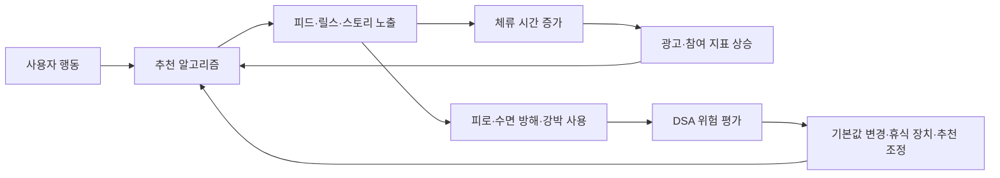

> 한 줄 요약: EU가 Meta의 무한 스크롤, 자동재생, 푸시 알림, 추천 알고리즘을 디지털서비스법(DSA) 위반 소지가 있는 중독적 설계로 문제 삼았다. 쟁점은 SNS 사용 시간을 줄이자는 캠페인이 아니라, 플랫폼의 성장 엔진을 규제 대상 시스템으로 볼 수 있느냐다.

## 무슨 일이 있었나

2026년 7월 10일, 유럽연합 집행위원회는 Meta가 Facebook과 Instagram의 중독적 설계 위험을 충분히 평가하고 완화하지 않았다고 판단했다. 대상은 디지털서비스법(Digital Services Act, DSA)상 대형 온라인 플랫폼의 위험 관리 의무다.

집행위원회가 지목한 기능은 익숙하다.

- 무한 스크롤(Infinite Scroll)
- 자동재생(Autoplay)
- 푸시 알림(Push Notification)
- 참여도를 높이는 개인화 추천 알고리즘
- Reels, Stories처럼 연속 소비를 유도하는 화면 구조
- 쉽게 닫을 수 있는 사용 시간 관리 도구

확인된 사실은 여기까지다. EU는 Meta의 현재 완화 조치가 충분하지 않다고 보고, 자동재생과 무한 스크롤을 기본값에서 끄는 방안, 더 실효성 있는 휴식 장치, 참여도 중심 추천 알고리즘의 수정 등을 요구했다.

다만 이 판단은 최종 제재가 아니다. Meta는 증거를 검토하고 공식 답변을 제출할 수 있다. 집행위원회의 판단이 확정되면 Meta는 전 세계 연간 매출의 최대 6%에 해당하는 과징금을 맞을 수 있다.

이번 조치는 따로 떨어진 사건도 아니다. 2026년 4월 EU 집행위원회는 Meta가 Facebook과 Instagram에서 13세 미만 아동 사용을 충분히 막지 못했다고 본 바 있다. 미국에서도 여러 주가 Meta를 상대로 청소년 중독 설계와 안전성 문제를 들어 거액의 제재를 요구하고 있다.

## 왜 사람들이 반응했나

이 뉴스가 커뮤니티에서 회자되는 이유는 Meta가 또 규제 대상이 됐기 때문만은 아니다. 누구나 쓰는 기본 UX 패턴이 법적 위험 관리의 대상이 될 수 있다는 신호라서다.

무한 스크롤과 자동재생은 겉으로 보기에 악의적인 기능이 아니다. 피드를 자연스럽게 이어주고, 동영상을 바로 보여주고, 사용자가 관심 가질 만한 콘텐츠를 추천한다. 제품팀 입장에서는 마찰을 줄이는 설계다.

문제는 그 마찰 제거가 사용자의 통제권을 약하게 만들 때다. EU는 이 지점을 중독적 설계(Addictive Design)로 보고 있다. 사용자가 더 보고 싶어서 머무르는지, 멈출 계기를 잃어서 머무르는지 구분해야 한다는 것이다.

### 신뢰 문제: 플랫폼이 자기 위험을 스스로 측정할 수 있나

DSA의 핵심은 불법 콘텐츠 삭제만이 아니다. 대형 플랫폼이 사회적 위험을 평가하고 완화해야 한다는 운영 의무에 가깝다.

여기서 가장 어려운 지점은 측정 주체다. 추천 알고리즘과 알림 시스템을 설계한 회사가, 그 시스템이 청소년과 취약한 사용자에게 끼치는 위험을 스스로 평가한다. 외부에서는 어떤 피드백 루프가 실제로 작동하는지 보기 어렵다.

이 구조에서 체류 시간은 제품 성공 지표이면서 규제 리스크의 입력값이 된다. 같은 숫자가 성장 대시보드에서는 좋은 신호이고, 위험 평가 보고서에서는 설명해야 할 부담이 된다.

현업에서 비슷한 고민을 해보면, 문제는 기능 하나를 켜고 끄는 데서 끝나지 않는다. 자동재생을 끄면 재생률이 떨어지고, 푸시 빈도를 줄이면 재방문율이 흔들린다. 추천 다양성을 높이면 즉각적인 클릭률은 낮아질 수 있다. 그래서 이번 이슈는 UX 윤리 논쟁인 동시에 KPI 설계 논쟁이기도 하다.

### 권한 문제: 기본값은 누구의 선택인가

EU가 요구한 방향 중 눈에 띄는 것은 기본값이다. 사용자가 원하면 끌 수 있는 기능이 아니라, 처음부터 자동재생과 무한 스크롤을 꺼야 한다는 쪽에 가깝다.

플랫폼은 보통 선택지를 제공했다고 말한다. 사용 시간 알림, 청소년 보호 설정, 알림 관리 메뉴가 있다는 식이다. 하지만 집행위원회는 그런 도구가 쉽게 무시될 수 있고 사용량을 의미 있게 줄이지 못한다고 봤다.

이 대목에서 논쟁이 갈린다.

| 관점 | 보는 문제 | 요구하는 변화 |
|---|---|---|
| 플랫폼 관점 | 사용자가 원해서 오래 머문다 | 선택권과 보호 도구 제공 |
| 규제 관점 | 설계가 멈춤을 어렵게 만든다 | 위험 기능의 기본값 변경 |
| 사용자 관점 | 끄는 법은 있지만 귀찮고 늦다 | 처음부터 덜 공격적인 설정 |
| 개발자 관점 | 참여 지표 최적화가 제품 언어가 됐다 | 지표와 위험 평가의 분리 |

사용자 선택권이라는 말은 그럴듯하지만, 기본값이 너무 강하면 선택권은 사후 변명처럼 보인다. 그래서 커뮤니티 반응도 날카롭다. 사람들은 내 시간을 내가 통제한다고 믿고 싶어 하지만, 동시에 피드가 자신보다 더 끈질기게 설계되어 있다는 것도 안다.

### 비용 문제: 규제는 Big Tech만 때릴까

과징금 규모만 보면 Meta 같은 거대 기업의 문제처럼 보인다. 하지만 DSA식 위험 평가가 반복되면 중간 규모 플랫폼도 영향을 받을 수 있다.

특히 추천 피드, 숏폼 영상, 알림 기반 재방문 설계를 가진 서비스라면 이런 질문을 피하기 어렵다.

- 청소년 사용 시간이 밤 시간대에 몰리는지 측정하는가
- 추천 알고리즘이 특정 취약 사용자군에 과도하게 작동하는지 보는가
- 사용 시간 제한 기능이 실제로 사용량을 줄이는지 검증했는가
- 알림과 자동재생의 기본값을 사용자가 이해할 수 있는가
- 참여도 최적화와 안전 목표가 충돌할 때 누가 결정하는가

이런 질문은 법무팀 문서만으로 답하기 어렵다. 로그 설계, 실험 설계, 추천 시스템, 제품 정책이 같이 움직여야 한다.

## 내가 보는 핵심

이번 사건의 핵심은 EU가 나쁜 콘텐츠가 아니라 나쁜 루프를 겨냥하기 시작했다는 점이다.

예전 플랫폼 규제는 주로 게시물 단위였다. 불법 콘텐츠를 지웠는가, 혐오 표현에 대응했는가, 신고 처리를 했는가 같은 질문이었다. 하지만 Meta 건에서 문제 된 것은 콘텐츠 하나하나가 아니다. 콘텐츠를 끝없이 이어 붙이고, 자동으로 재생하고, 사용자가 멈추기 전에 다음 자극을 주는 시스템이다.

이 변화는 다른 EU 규제 흐름과도 맞닿아 있다.

Chat Control 1.0 논쟁은 사적 메시지 스캔을 어디까지 허용할 것인가를 두고 격렬하게 갈렸다. 2026년 7월 초 유럽의회는 만료된 임시 규칙을 되살리는 절차를 빠르게 진행했다. 이후 의회 표결에서는 반대가 더 많았음에도 절대 과반 요건을 넘지 못해 임시적 스캔 허용이 2028년까지 이어질 수 있는 길이 열렸다는 비판이 나왔다. 이 사안은 아동 보호라는 목표와 사적 통신 감시라는 위험이 정면으로 부딪친다.

Google을 둘러싼 DMA 논쟁도 비슷한 긴장을 보여준다. EU는 경쟁 촉진을 위해 검색 데이터 공유와 Android 상호운용성 확대를 검토하지만, Google 보안 책임자들은 익명화된 검색 데이터도 재식별될 수 있고 Android 개방이 사기 위험을 키울 수 있다고 경고한다.

세 사안은 서로 다른 법과 제품을 다룬다. 하지만 반복되는 구조는 같다.

- 플랫폼을 닫아두면 독점과 권한 집중이 생긴다
- 플랫폼을 열어두면 개인정보와 보안 위험이 커진다
- 보호 기능을 기업 자율에 맡기면 이해상충이 생긴다
- 법으로 강제하면 구현 비용과 오작동이 생긴다

Meta의 중독적 설계 논쟁은 이 흐름 안에서 봐야 한다. EU가 묻는 것은 사용자가 SNS를 오래 쓰는 것이 나쁜가가 아니다. 플랫폼이 사용자의 취약한 순간을 수익 지표로 바꾸는 구조를 만들었을 때, 그 구조를 누가 설명하고 고칠 책임을 지느냐다.

### 기능이 아니라 피드백 루프를 봐야 한다

무한 스크롤만 떼어놓고 보면 별일이 아니다. 자동재생도 마찬가지다. 푸시 알림도 유용할 때가 많다.

하지만 이 기능들이 추천 알고리즘, 광고 모델, A/B 테스트, 성장 지표와 결합하면 다른 성격을 갖는다. 사용자가 조금 더 머물수록 모델은 더 많은 신호를 얻고, 더 많은 신호는 더 정교한 추천으로 이어지고, 더 정교한 추천은 다시 더 긴 체류 시간으로 돌아온다.

그래서 규제기관은 개별 UI보다 시스템 효과를 보기 시작한다. 이 관점은 개발자에게도 낯설지 않다. 장애도 보통 함수 하나 때문에만 터지지 않는다. 재시도, 큐 적체, 타임아웃, 캐시 무효화가 맞물리면 작은 문제가 장애 루프로 커진다. 중독적 설계 논쟁도 비슷하다. 버튼 하나가 아니라 루프가 문제다.

실제로 이런 상황에서는 다음 지표가 필요하다.

- 세션 길이 평균이 아니라 상위 5% 사용자의 과도한 사용 패턴
- 청소년 계정의 심야 사용량 변화
- 알림 발송 후 복귀율뿐 아니라 복귀 후 체류 시간
- 사용 시간 제한 알림을 닫은 뒤의 추가 사용 시간
- 추천 피드 다양성 변화와 반복 소비 패턴
- 보호 장치 활성화 여부가 아니라 보호 장치의 실제 효과

이런 데이터가 없으면 플랫폼은 우리는 도구를 제공했다는 말만 반복하게 된다. 반대로 규제기관은 중독적이라는 큰 단어만 던지게 된다. 둘 다 설득력이 부족하다.

## 앞으로 볼 기준

다음에 비슷한 뉴스를 볼 때는 벌금 규모보다 세 가지를 먼저 봐야 한다.

첫째, 규제가 콘텐츠를 겨냥하는지, 설계를 겨냥하는지 구분해야 한다. 콘텐츠 규제는 삭제와 신고 처리로 이어지지만, 설계 규제는 기본값, 추천 로직, 실험 지표, 데이터 보관 방식까지 건드린다. 후자가 훨씬 깊다.

둘째, 보호 대상이 누구인지 확인해야 한다. 이번 Meta 건은 미성년자와 취약한 성인을 명시한다. Chat Control은 아동 보호를 명분으로 사적 메시지 스캔을 다룬다. DMA의 Google 논쟁은 경쟁사와 사용자 보안이 얽힌다. 보호 대상이 넓어질수록 규제의 명분은 강해지지만, 부작용의 범위도 같이 넓어진다.

셋째, 회사가 제시한 완화 조치가 실제 행동을 바꾸는지 봐야 한다. 설정 메뉴를 추가했다는 말은 충분하지 않다. 기본값이 무엇인지, 사용자가 얼마나 쉽게 무시할 수 있는지, 실험 결과 사용량이 줄었는지, 취약 사용자군에서 효과가 있었는지가 더 중요하다.

플랫폼 입장에서는 불편한 방향이다. 하지만 이제 참여도 최적화만으로 제품 성공을 설명하기 어려워지고 있다. 추천 시스템은 더 많이 보게 만드는 기술인 동시에, 멈출 수 있게 만드는 책임도 져야 한다.

사용자에게는 이 논쟁이 조금 다르게 다가온다. 우리는 피드를 열 때마다 자유롭게 선택한다고 느낀다. 그런데 규제기관이 묻기 시작한 질문은 그보다 차갑다. 정말 선택한 것인가, 아니면 멈출 타이밍을 빼앗긴 것인가.

그 질문에 답하지 못하는 플랫폼은 앞으로 기능 설명만으로는 버티기 어렵다. 제품이 사람을 붙잡는 방식까지 운영 리스크가 되는 시대로 들어섰다.

## 참고 자료

- [선정 글감] [EU threatens Meta with fines over addictive features on Facebook and Instagram](https://techcrunch.com/2026/07/10/eu-threatens-meta-with-fines-over-addictive-features-on-facebook-and-instagram/) — TechCrunch
- [관련] [EU Parliament greenlights Chat Control 1.0](https://www.patrick-breyer.de/en/eu-parliament-greenlights-chat-control-1-0-breyer-our-children-lose-out/) — Patrick Breyer
- [관련] [EU now one step away from reviving private message scanning rules](https://cyberinsider.com/eu-now-one-step-away-from-reviving-private-message-scanning-rules/) — CyberInsider
- [관련] [Top Google Security Staff Warn Search Data Could Be Hacked if EU Rules Change](https://www.wired.com/story/top-google-security-staff-warn-search-data-could-be-hacked-thanks-to-eu-plans/) — WIRED Security