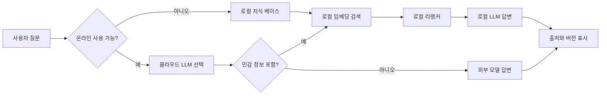

> 한 줄 요약: Local LLM Survival Kit 논의는 오프라인 AI에 대한 낭만보다, 인터넷·계정·API·정책이 끊겼을 때 지식 접근을 어떻게 유지할지에 가까운 문제다. USB 하나에 모델과 위키를 담는 상상은 출발점일 뿐이고, 실제 쟁점은 업데이트, 라이선스, 성능 저하, 개인정보, 운영 책임이다.

## 무슨 일이 있었나

Reddit LocalLLaMA에 Local LLM Survival Kit를 만들 수 있느냐는 제안이 올라왔다. 아이디어는 단순하다. USB 드라이브를 아무 PC나 노트북에 꽂으면 인터넷 없이도 LLM 기반 지식 베이스를 바로 쓸 수 있게 하자는 것이다.

제안된 구성은 대략 이렇다.

- Windows, macOS, Linux용 `llama.cpp` CPU 추론 바이너리
- 32GB 이상 RAM 환경용 Qwen 계열 35B MoE 모델의 Q4_K_M 양자화 버전
- 낮은 사양 또는 보조 처리용 Gemma 계열 소형 모델
- 정제된 영어 Wikipedia 덤프
- 의학, 공학 등 자유 라이선스 문헌
- SQLite와 압축 저장소
- 브라우저에서 접근할 수 있는 간단한 로컬 서버

확인된 사실은 여기까지다. 이 글은 제품 출시나 공식 프로젝트 발표가 아니라 커뮤니티 제안이다. 제공된 자료에는 정확한 게시일이 포함되어 있지 않으므로, 특정 날짜의 릴리스로 다루면 안 된다.

이 제안이 반응을 얻은 이유는 재난 대비용 장난감처럼 보여서만은 아니다. 클라우드 LLM 의존이 커진 상황에서 인터넷 연결, API 과금, 계정 정책, 데이터 반출 제한이 동시에 문제가 될 수 있다는 불안이 개발자 커뮤니티 안에 쌓여 있었기 때문이다.

비슷한 시점의 다른 LocalLLaMA 논의들도 같은 방향을 가리킨다. 양자화가 지식 질의에서는 크게 티가 나지 않아도 수학, 코딩, 에이전트 작업에서는 성능 차이가 벌어진다는 테스트가 공유됐다. 또 어떤 사용자는 유료 LLM 서비스를 이미 쓰고 있다면 로컬 LLM 전체를 굴리는 것보다 로컬 임베딩(Embedding)과 리랭커(Reranker)가 더 실용적이라고 주장했다.

결국 질문은 USB에 모델을 담을 수 있느냐가 아니다. 오프라인 AI를 신뢰할 만한 도구로 만들려면 무엇을 로컬에 두고, 무엇을 클라우드에 맡겨도 되는지 정해야 한다.

## 왜 사람들이 반응했나

### Local LLM Survival Kit가 건드린 불편함은 무엇인가

많은 사람이 클라우드 LLM을 편하게 쓴다. 문제는 편의성이 곧 통제권을 뜻하지 않는다는 점이다.

계정이 잠기거나, 요금 정책이 바뀌거나, 회사 보안 정책상 외부 API 사용이 막히거나, 네트워크가 불안정해지면 기존 워크플로가 한 번에 멈춘다. 문서 검색, 코드 보조, 번역, 요약, 질의응답을 모두 외부 모델에 붙여 놓은 팀일수록 장애 범위가 커진다.

Local LLM Survival Kit는 이 불안을 아주 물리적인 형태로 보여준다. USB 하나, 모델 파일, 압축된 지식 베이스, 로컬 서버. 사람들은 이 단순함에 반응한다. 복잡한 SaaS 구독이나 정책 문서 대신, 손에 잡히는 복원 가능성을 떠올리게 하기 때문이다.

다만 USB에 담겼다고 해서 시스템이 곧 자율적으로 돌아가는 것은 아니다. 모델은 오래된다. Wikipedia 덤프도 오래된다. 의료·공학 문헌은 라이선스와 출처 검증이 필요하다. 오프라인이라는 말은 최신성과 감사 가능성을 스스로 책임진다는 뜻이기도 하다.

### 왜 양자화 논쟁이 같이 붙나

이 제안에는 Q4_K_M 같은 양자화(Quantization) 모델이 등장한다. 대형 모델을 USB와 일반 PC RAM 안에 넣으려면 양자화는 거의 피할 수 없다.

문제는 양자화를 단순히 용량을 줄이는 기술로만 볼 수 없다는 점이다. 보조 레퍼런스의 한 테스트는 FP16과 여러 GGUF 양자화 수준을 비교하면서, 전체 평균 점수보다 능력별 차이를 봐야 한다고 주장했다. 요약에 따르면 한 27B 모델에서 Q4_K_M은 대화나 지식 작업에서는 2% 미만의 저하에 그쳤지만, 다단계 수학 정확도는 FP16 대비 약 9% 떨어졌다. Q5_K_M에서는 그 수학 격차가 거의 사라졌다고 한다.

또 다른 벤치마크 공유 글도 비슷한 결을 보인다. Qwen 3.6 양자화 테스트에서 지식 평가인 GPQA Diamond는 양자화별 차이가 작았지만, Terminal-Bench 2로 본 에이전트 작업에서는 낮은 정밀도에서 회귀가 크게 나타났다는 내용이다.

이건 Survival Kit에 꽤 큰 제약을 건다. 오프라인 위키 검색과 짧은 설명에는 Q4 모델이 충분할 수 있다. 반면 복잡한 절차를 따라가며 명령을 실행하거나, 코드 수정 계획을 세우거나, 다단계 계산을 해야 한다면 같은 모델도 다르게 무너질 수 있다.

현업에서 비슷한 고민을 하다 보면 평균 벤치마크 하나로 모델을 고르는 순간 문제가 생긴다. 고객 지원 검색과 코드 에이전트는 같은 LLM 사용처럼 보여도 실패 비용이 다르다. Survival Kit도 마찬가지다. 생존 키트라는 이름을 붙이려면 먼저 어떤 실패를 견딜 도구인지 정해야 한다.

### 로컬 LLM보다 로컬 검색 계층이 더 현실적일 수 있다

흥미로운 반론은 로컬 LLM 자체가 아니라 로컬 임베딩과 리랭커가 더 쓸모 있다는 주장이다. 이미 ChatGPT Pro 같은 유료 서비스를 쓰고 있다면, 범용 답변 생성은 클라우드 모델이 더 편하고 강력하다. 대신 문서를 벡터화하고, 검색 결과를 재정렬하고, 사내·개인 자료를 로컬에서 처리하는 부분은 외부 서비스로 대체하기 어렵다.

이 관점은 Local LLM Survival Kit의 방향을 바꾼다.

USB에 가장 큰 모델을 담는 것이 목표가 아닐 수 있다. 오히려 핵심은 다음 조합일 수 있다.

- 로컬 문서 저장소
- 로컬 임베딩 모델
- 로컬 리랭커
- 작은 생성 모델
- 필요할 때만 연결되는 외부 고성능 모델

이렇게 보면 Survival Kit는 인터넷이 완전히 끊긴 상황이 아니어도 의미가 있다. 민감한 문서의 색인과 검색은 로컬에서 처리하고, 외부 모델에는 최소한의 컨텍스트만 보낸다. 데이터 노출 범위를 줄이면서도 사용성은 유지할 수 있다.

### 브라우저 에이전트까지 넣으면 개인정보 문제가 커진다

barebrowse라는 보조 레퍼런스도 이 논의와 맞닿아 있다. 이 도구는 로컬 모델 에이전트에 브라우저를 붙이되, 원시 HTML 전체가 아니라 정리된 ARIA 스냅샷을 제공해 토큰 사용량을 줄이는 접근을 소개한다. Playwright 없이 기존 Chrome, Brave, Edge, Chromium을 CDP로 직접 다루고, 실제 브라우저 프로필의 쿠키를 재사용할 수 있다는 설명도 있다.

이 기능은 편리하다. 로그인된 페이지를 로컬 에이전트가 읽을 수 있고, 페이지 전체 HTML 대신 의미 구조만 전달하면 컨텍스트 낭비도 줄어든다.

동시에 위험도 분명하다. 로컬이라는 말이 곧 안전하다는 뜻은 아니다. 실제 브라우저 쿠키를 재사용한다면 에이전트는 사용자가 로그인한 서비스의 일부 화면에 접근할 수 있다. 오프라인 키트가 온라인 브라우저 자동화와 결합되는 순간 권한 경계가 흐려진다.

Local LLM Survival Kit가 단순 지식 베이스라면 리스크는 주로 최신성, 정확성, 라이선스에 있다. 하지만 브라우저 에이전트와 결합하면 세션 쿠키, 개인정보, 내부 문서, 접근 로그, 명령 실행 권한까지 봐야 한다.

## 내가 보는 핵심

### 오프라인 AI의 핵심은 모델 소유가 아니라 실패 범위 설계다

Local LLM Survival Kit를 보면 처음엔 모델 크기와 USB 용량이 눈에 들어온다. 그런데 실제 설계의 중심은 모델이 아니다. 실패 범위다.

인터넷이 없어도 되는가. 계정이 없어도 되는가. 특정 벤더가 없어도 되는가. 최신 정보가 없어도 되는가. 답이 틀렸을 때 사용자가 확인할 수 있는가. 이 질문에 답하지 못하면 로컬 LLM은 그저 느린 챗봇이 된다.

아래처럼 나누면 쟁점이 선명해진다.

이 구조에서 로컬 모델은 마지막 생성 단계의 하나일 뿐이다. 더 중요한 자산은 색인된 문서, 출처 메타데이터, 버전, 검색 품질, 그리고 어떤 질문을 로컬로 묶을지 정하는 정책이다.

### 생존 키트라는 이름이 오히려 기준을 높인다

생존 키트라는 표현은 매력적이지만 위험하다. 사람은 이름에 기대를 싣는다. USB에 담긴 모델이 의학, 공학, 보안, 법률 질문에 답한다면 사용자는 그 답을 일반 챗봇보다 더 신뢰할 수 있다. 인터넷이 안 되는 상황에서는 대안이 적기 때문이다.

그래서 이런 키트는 데모보다 운영 기준이 먼저 필요하다.

- 포함 문서의 라이선스를 확인했는가
- 문서 버전과 생성 날짜를 화면에 표시하는가
- 모델이 모르는 것을 모른다고 말하도록 설계했는가
- 검색 결과 원문을 함께 보여주는가
- 낮은 사양 장비에서 응답 시간이 현실적인가
- 양자화 모델의 실패 유형을 작업별로 테스트했는가
- 민감한 질문과 안전 관련 질문에 별도 경고가 있는가

특히 의료·공학 문헌을 넣겠다는 부분은 조심해야 한다. 자유 라이선스 문헌이라도 최신 가이드라인과 다를 수 있다. 오프라인 환경에서는 업데이트 지연이 바로 오답의 원인이 된다.

반대로 이 기준을 만족시키면 Survival Kit는 장난감에 그치지 않는다. 학교, 연구실, 현장 작업, 네트워크가 제한된 기관, 개인 아카이브에서 실용적인 도구가 될 수 있다.

### 클라우드 반대가 아니라 의존성 분해의 문제다

이 논의를 클라우드 LLM 대 로컬 LLM 싸움으로 보면 금방 빈약해진다. 클라우드 모델은 여전히 빠르고 강력하며 관리 부담이 적다. 로컬 모델은 비용 예측, 프라이버시, 오프라인 사용, 재현성에서 장점이 있다.

더 나은 질문은 어느 계층을 로컬에 둘 것인가다.

| 계층 | 로컬에 둘 때 장점 | 로컬에 둘 때 부담 |
|---|---|---|
| 원문 문서 | 외부 유출 감소, 오프라인 접근 | 업데이트·라이선스 관리 |
| 임베딩 | 민감 데이터 색인 가능 | 모델 교체 시 재색인 필요 |
| 리랭커 | 검색 품질 개선, 비용 절감 | 지연 시간과 평가 필요 |
| 생성 LLM | 완전 오프라인 답변 | 품질·속도·메모리 부담 |
| 브라우저 제어 | 로그인 맥락 활용 | 쿠키·권한·감사 리스크 |

이 표에서 보듯 로컬화는 전부 아니면 전무가 아니다. 많은 경우 가장 실용적인 출발점은 로컬 생성 모델이 아니라 로컬 검색 계층이다. 범용 대화는 외부 모델이 맡고, 내가 가진 자료를 찾고 줄이는 과정은 로컬에서 처리한다. 오프라인 요구가 강해질 때 작은 생성 모델을 붙이는 편이 더 현실적이다.

## 앞으로 볼 기준

### Local LLM Survival Kit를 볼 때 확인할 질문

다음에 비슷한 프로젝트나 제품이 나오면 모델 이름보다 먼저 아래를 봐야 한다.

- 이 키트가 견디려는 장애는 인터넷 단절인가, API 비용인가, 개인정보 반출인가, 계정 정책인가
- 포함된 지식 베이스의 출처와 갱신일이 화면에 표시되는가
- 답변마다 근거 문서와 문단 위치를 보여주는가
- 양자화 모델을 지식 질의, 수학, 코드, 에이전트 작업으로 나눠 평가했는가
- 낮은 사양 장비에서 실제 응답 시간이 사용 가능한 수준인가
- 브라우저 쿠키나 로컬 파일 권한을 쓰는 경우 권한 경계가 분리되어 있는가
- 온라인 모델을 함께 쓸 때 어떤 데이터가 외부로 나가는지 알 수 있는가

이 질문에 답이 없으면 Survival Kit라는 이름은 과하다. 반대로 답이 있다면 작은 USB 프로젝트라도 꽤 단단한 로컬 AI 플랫폼이 될 수 있다.

### 앞으로 필요한 것은 더 큰 모델이 아니라 더 정직한 모드 표시다

사용자에게 필요한 것은 항상 최고 성능 모델이 아니다. 지금 내가 오프라인 모드에 있는지, 문서가 언제 기준인지, 답변이 검색 근거를 가진 것인지, 모델이 낮은 정밀도에서 돌고 있는지 알 수 있어야 한다.

예를 들어 같은 질문에도 화면은 이렇게 말할 수 있어야 한다.

- 오프라인 문서 기준 답변
- 2026년 7월 이전 데이터 기준
- 검색 근거 3개 사용
- Q4 양자화 모델 사용
- 수학·코드 작업은 정확도 저하 가능

이런 표시가 없으면 사용자는 로컬 AI를 과신한다. 표시가 있으면 사용자는 판단할 수 있다. Local LLM Survival Kit의 가치는 모든 질문에 답하는 데 있지 않다. 연결이 끊겼을 때도 내가 어떤 근거 위에서 판단하고 있는지 보여주는 데 있다.

USB 하나에 AI를 담는 상상은 낭만적이다. 하지만 사람들이 거기에 반응한 이유가 낭만만은 아니다. 우리가 너무 많은 지식 작업을 보이지 않는 외부 조건 위에 얹어 놓았다는 감각이 있기 때문이다. 다음 단계는 더 큰 모델 파일을 넣는 일이 아니라, 끊겼을 때도 무너지지 않는 지식 흐름을 설계하는 일이다.

## 참고 자료

- [선정 글감] [Has anyone created a "Local LLM Survival Kit"?](https://www.reddit.com/r/LocalLLaMA/comments/1uspcg0/has_anyone_created_a_local_llm_survival_kit/) - Reddit LocalLLaMA
- [관련] [Has anyone tested how quantization hits different capabilities separately? My results are surprising.](https://www.reddit.com/r/LocalLLaMA/comments/1us7a22/has_anyone_tested_how_quantization_hits_different/) - Reddit LocalLLaMA
- [관련] [If You Already Pay for an LLM Service, Running Local Embeddings and Rerankers Feels More Useful Than Running Local LLMs](https://www.reddit.com/r/LocalLLaMA/comments/1us3li5/if_you_already_pay_for_an_llm_service_running/) - Reddit LocalLLaMA
- [관련] [I built barebrowse: give a local-model agent a browser without Playwright](https://www.reddit.com/r/LocalLLaMA/comments/1usg4cq/i_built_barebrowse_give_a_localmodel_agent_a/) - Reddit LocalLLaMA
- [관련] [Qwen 3.6 Q2-FP8 Terminal Bench 2 and GPQA Scores](https://www.reddit.com/r/LocalLLaMA/comments/1usclcz/qwen_36_q2fp8_terminal_bench_2_and_gpqa_scores/) - Reddit LocalLLaMA