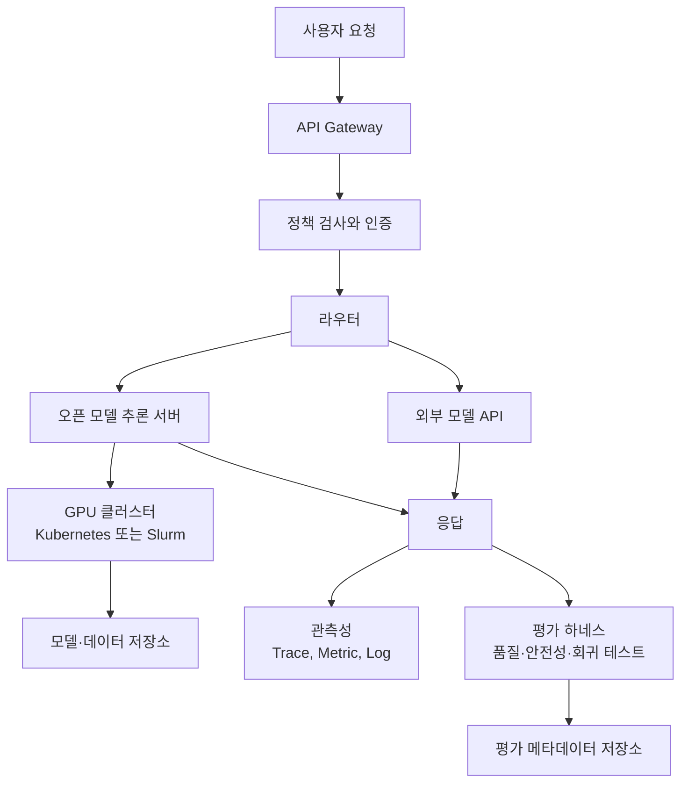

> 한 줄 요약: 오픈소스 AI를 쓴다는 말은 API 비용을 줄인다는 뜻에 그치지 않는다. 모델, 데이터, 평가, 보안, 관측성을 누가 책임질지 정하는 인프라 선택에 가깝다. 빌리지 않는 AI는 공짜 AI가 아니라 더 많은 운영 권한과 장애 책임을 함께 가져오는 구조다.

## 왜 지금 이슈인가

기업이 프런티어 모델 API로 시작했다가 규모가 커지면서 오픈소스 AI나 오픈 웨이트(Open-weight) 모델을 검토하는 흐름은 이제 비용만으로 설명하기 어렵다. TechCrunch가 전한 Hugging Face CEO 인터뷰의 핵심도 여기에 있다. API로 시작하면 빠르게 제품을 만들 수 있지만, 사용량이 늘고 내부 데이터·규제·제품 차별화가 얽히면 단순 호출 비용보다 통제권 문제가 더 커진다.

GitHub와 개발자 커뮤니티에서 나오는 질문도 현실적이다. 모델을 직접 고르면 정말 싸질까, 아니면 MLOps와 보안 비용이 더 커질까. 특정 벤더 API를 쓰면 품질과 운영은 편하지만 장애, 가격, 정책 변경을 그대로 받아들여야 한다. 반대로 오픈 모델을 직접 운영하면 추론 비용을 조정할 수 있는 대신 GPU 조달, 배포, 평가, 감사 로그, 데이터 이동 비용을 직접 책임져야 한다.

그래서 지금의 질문은 오픈소스 AI와 폐쇄형 AI 중 무엇이 더 나은가가 아니다. 더 정확히는 AI 워크로드를 어떤 플랫폼 경계 안에 둘 것인가다. 모델이 공개되어 있어도 데이터, 런타임, 평가 결과, 보안 정책이 한 벤더 안에 묶이면 운영 관점에서는 여전히 임대에 가깝다.

## 커뮤니티에서 갈리는 지점

오픈 모델 쪽 주장은 분명하다. 모델 가중치와 데이터셋을 직접 다룰 수 있으면 비용, 지연 시간, 커스터마이징, 검열·정책 리스크를 더 세밀하게 조정할 수 있다. 특히 사내 문서 검색, 코드 생성, 고객지원 자동화처럼 도메인 데이터가 품질을 좌우하는 영역에서는 모델 선택권보다 데이터 파이프라인 통제권이 더 중요해진다.

반대쪽 우려도 가볍지 않다. 모델을 내려받을 수 있다고 해서 곧바로 운영 가능한 AI가 생기지는 않는다. 보안 스캔, 취약한 의존성, 프롬프트 인젝션(Prompt Injection), 개인정보가 포함된 로그, 모델 평가 재현성, GPU 장애 대응까지 챙겨야 한다. API 하나를 대체하려다 사내에 작은 클라우드 사업자를 만든 꼴이 될 수 있다.

Hugging Face와 SkyPilot의 zero-egress storage 사례는 이 논쟁을 비용 구조 측면에서 보여준다. 모델과 데이터가 한 클라우드 리전의 버킷에 묶여 있고 GPU는 다른 클라우드에 있다면, 기업은 자기 데이터를 읽기 위해 교차 클라우드 전송 비용을 낸다. 이들은 Hugging Face Hub에 데이터를 두고 SkyPilot이 여러 클라우드, Kubernetes, Slurm, 온프레미스에서 GPU를 찾아 실행하는 방식을 제시한다. 핵심은 오픈 모델 자체가 아니라 데이터 중력(Data Gravity)을 줄이는 실행 구조다.

Microsoft Foundry Managed Compute의 Hugging Face 모델 지원은 다른 현실을 보여준다. 기업은 오픈 모델을 원하지만, 보안 스캔된 런타임, RBAC(Role-Based Access Control), 프라이빗 네트워킹, 정책 관리, 관측성, 과금 통합도 함께 원한다. 이 방식은 자유도보다 관리 가능성을 앞세운다. 오픈 모델을 쓰되 엔터프라이즈 제어면은 클라우드 플랫폼에 맡기는 식이다.

평가(Evaluation) 문제도 중요한 갈림길이다. Every Eval Ever와 Hugging Face Community Evals 연동은 같은 모델·같은 벤치마크라도 실행 조건에 따라 점수가 달라질 수 있다는 문제를 다룬다. 본문에 언급된 MMLU 사례처럼 LLaMA 65B가 서로 다른 점수로 보고된 이유는 단지 누가 틀렸기 때문이 아니다. 접근 방식, 생성 설정, 메트릭 정의, 실행 환경이 충분히 기록되지 않았기 때문이다.

오픈 모델을 도입한다는 말은 결국 다음 질문으로 나눠 봐야 한다.

| 질문 | API 중심 접근 | 오픈 모델 운영 접근 |
|---|---|---|
| 품질 책임 | 벤더 모델 업데이트에 의존 | 자체 평가 하네스(Test Harness) 필요 |
| 비용 구조 | 호출량·토큰 기반 | GPU·스토리지·운영 인력·전송 비용 |
| 보안 경계 | 벤더 약관과 네트워크 통제 | 모델, 데이터, 로그, 런타임 통제 직접 설계 |
| 이식성 | SDK와 API 호환성 중심 | 모델 포맷, 데이터 위치, 배포 런타임 중심 |

## 아키텍처 관점에서 볼 점

오픈소스 AI 인프라를 설계할 때 먼저 볼 것은 모델 서버가 아니다. 데이터가 어디에 있고, 평가 결과가 어떤 형식으로 남으며, 추론 요청과 로그가 어느 보안 경계를 통과하는지부터 봐야 한다.

이 구조에서 라우터는 단순한 부하분산 장치가 아니다. 비용, 지연 시간, 데이터 민감도, 모델 품질, 장애 상태에 따라 외부 API와 내부 모델을 나눠 태우는 정책 엔진에 가깝다. 예를 들어 개인정보가 포함된 요청은 내부 모델로 보내고, 일반 요약 요청은 외부 API로 보내는 식이다.

Kubernetes를 쓴다면 GPU 노드풀, 모델 캐시, 오토스케일링, 롤링 업데이트가 설계 대상이 된다. 모델은 컨테이너 이미지보다 훨씬 크고 콜드 스타트도 길다. 새 모델을 배포할 때 이미지 배포 시간보다 가중치 다운로드와 워밍업 시간이 장애 원인이 되기 쉽다.

데이터베이스 관점에서는 벡터 데이터베이스(Vector Database)나 검색 인덱스만 보면 부족하다. 원문 문서, 임베딩, 검색 결과, 프롬프트, 응답, 사용자 피드백, 평가 결과는 서로 다른 보존 정책을 가진다. 개인정보나 영업비밀이 프롬프트 로그에 남으면 모델 선택과 무관하게 보안 사고가 된다.

관측성(Observability)도 일반 웹 API와 다르다. 평균 지연 시간과 에러율만으로는 부족하다. 모델 버전, 프롬프트 템플릿 버전, 검색 인덱스 버전, 생성 파라미터, 평가 점수가 함께 남아야 한다. Every Eval Ever가 평가 메타데이터 표준화를 강조하는 이유도 여기에 있다. 운영 중 품질 저하를 재현하려면 누가 어떤 모델을 어떤 설정으로 호출했는지 기록돼야 한다.

장애 격리는 하이브리드 구조에서 더 까다롭다. 외부 API가 느려질 때 내부 모델로 우회할 수 있어도, 내부 모델이 같은 데이터 저장소나 같은 라우터를 공유하면 장애 전파는 그대로 남는다. 반대로 내부 GPU 클러스터가 포화될 때 외부 API로 넘기는 경로가 없다면 비용 절감 설계가 가용성 저하로 돌아온다.

## 실무에서 볼 점

오픈 모델 도입을 검토할 때 첫 번째 체크포인트는 비용표가 아니라 워크로드 형태다. 요청량이 안정적이고 도메인별 튜닝 가치가 크며 데이터 반출 제약이 강하다면 내부 운영의 장점이 커진다. 반대로 트래픽이 작고 품질 요구가 빠르게 변하며 모델 운영 경험이 부족하다면 API를 쓰는 쪽이 더 합리적일 수 있다.

두 번째는 평가 하네스다. 모델을 바꿨는데 응답이 좋아졌는지 나빠졌는지 사람이 샘플 몇 개를 읽고 판단하는 수준에 머무르면 운영 체계라고 보기 어렵다. 회귀 테스트, 금칙 응답 검사, 환각(Hallucination) 탐지, 도메인별 정답셋, 비용·지연 시간 측정이 배포 파이프라인에 들어가야 한다.

세 번째는 데이터 이동 비용이다. SkyPilot과 Hugging Face Storage 사례가 말하는 zero-egress는 단순한 요금 할인 이야기가 아니다. GPU는 남는 곳에서 빌리고, 모델과 데이터는 이동시키지 않는 구조가 가능할 때 멀티클라우드 AI가 현실적인 선택지가 된다. 데이터셋이 큰 조직일수록 이 차이는 더 빨리 드러난다.

네 번째는 보안 운영이다. 오픈 모델은 공급망 보안(Supply Chain Security) 문제를 피하지 못한다. 모델 파일, 토크나이저, 서빙 이미지, 커스텀 코드, 플러그인 도구가 모두 공격면이 된다. 에이전트(Agent)가 사내 시스템에 접근한다면 권한 위임, 감사 로그, 도구 호출 제한이 모델 품질보다 먼저 설계돼야 한다.

다섯 번째는 플랫폼 종속성이다. Foundry처럼 관리형 컴퓨트에 오픈 모델을 올리는 방식은 보안과 운영 부담을 크게 줄여준다. 대신 배포 방식, 로그 포맷, 평가 루프, 네트워크 정책이 해당 플랫폼의 추상화에 맞춰진다. 직접 운영은 자유롭지만 책임이 크고, 관리형 운영은 편하지만 이식성이 줄어든다.

현업에서 비슷한 고민을 하다 보면 오픈소스라는 단어가 결정을 흐리게 만들 때가 있다. 모델 라이선스가 열려 있어도 운영 데이터가 특정 클라우드에 묶이고, 평가 결과가 재현되지 않으며, 로그를 감사할 수 없다면 실제 통제권은 낮다. 반대로 폐쇄형 API를 쓰더라도 라우팅, 평가, 로그, 데이터 분리 설계가 잘 되어 있으면 교체 가능성은 남는다.

도입 전에 최소한 아래 항목은 확인해야 한다.

- 특정 모델 장애 시 대체 모델로 전환할 수 있는가
- 모델·프롬프트·검색 인덱스 버전이 응답과 함께 추적되는가
- 민감 데이터가 외부 API, 로그, 평가셋에 섞이지 않는가
- 비용 비교에 GPU 유휴 시간, 데이터 전송, 운영 대응 시간이 포함됐는가

## 정리

오픈소스 AI로 이동한다는 말은 빌리던 모델을 사내로 가져온다는 단순한 이야기가 아니다. 모델 선택권을 얻는 대신 평가 체계, 데이터 배치, 보안 경계, 관측성, 장애 대응을 직접 설계하겠다는 뜻에 가깝다.

지금 확인할 것은 하나다. 현재 쓰는 AI 기능에서 모델 이름을 바꿨을 때 품질, 비용, 지연 시간, 보안 로그를 같은 기준으로 비교할 수 있는가. 이 질문에 답하지 못한다면 오픈 모델 도입 여부보다 평가와 관측성부터 만드는 것이 먼저다.

## 참고 자료

- [선정 글감] [Hugging Face’s CEO on why companies are done renting their AI](https://techcrunch.com/2026/07/10/hugging-faces-ceo-on-why-companies-are-done-renting-their-ai/) — TechCrunch
- [관련] [Run AI workloads on any cloud, store on Hugging Face: zero-egress storage with SkyPilot](https://huggingface.co/blog/skypilot-hf-storage) — Hugging Face Blog
- [관련] [Hugging Face Models on Foundry Managed Compute](https://huggingface.co/blog/microsoft/foundry-managed-compute) — Hugging Face Blog
- [관련] [Featuring Every Eval Ever Results on Hugging Face Model Pages](https://huggingface.co/blog/eee-community-evals) — Hugging Face Blog