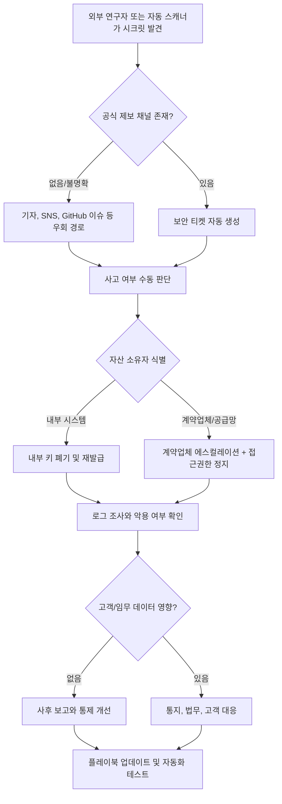

> 한 줄 요약: CISA incident playbook 부재 사건은 보안 사고 대응 실패가 도구 부족만으로 설명되지 않는다는 점을 보여준다. 공개 GitHub에 노출된 키보다 더 위험한 것은, 누가 어떤 권한으로 어떤 순서에 따라 판단할지 정해져 있지 않은 운영 구조다.

## 왜 지금 이슈인가

보안 사고 대응(Incident Response)을 자동화한다고 하면 보통 SIEM, SOAR, 시크릿 스캐너, 티켓 자동 생성, 알림 라우팅부터 떠올린다. 그런데 CISA 사례는 다른 질문을 던진다.

플레이북이 없으면 좋은 도구도 대기열에서 멈춘다.

TechCrunch가 전한 CISA 사건을 줄이면 이렇다. 한 보안 연구자가 CISA 계약업체 직원이 공개 GitHub 저장소에 올린 민감한 키와 인증정보를 발견했다. 연구자는 먼저 계약업체에 알렸지만 응답을 받지 못했고, 이후 보안 기자 Brian Krebs를 거쳐 CISA에 전달됐다. CISA는 저장소를 내리고 노출된 인증정보를 폐기하고 교체했으며, 고객 또는 임무 데이터 노출은 없었다고 밝혔다.

문제는 그 다음 문장이다. CISA는 사후 보고에서 초기 대응 중 필요한 플레이북을 그 자리에서 만들어야 했다고 밝혔다. 보안 조직이 사고를 맞닥뜨린 뒤에야 대응 절차를 조립했다는 뜻이다.

GitHub와 개발자 커뮤니티에서 이 사건이 자주 언급되는 이유도 여기에 있다. 공개 저장소에 시크릿이 올라가는 실수는 이미 익숙한 문제다. 시크릿 스캐닝도, 키 로테이션도, GitHub 보호 규칙도 새롭지 않다. 낯선 지점은 연방 사이버보안 기관조차 외부 연구자 제보, 계약업체 책임, 키 폐기, 증거 보존, 커뮤니케이션 채널을 하나의 실행 절차로 묶어두지 못했다는 사실이다.

이 사건은 Kubernetes, 클라우드, 데이터베이스, 블록체인 노드, AI 에이전트 운영과도 맞닿아 있다. 시스템은 점점 자동화되지만, 사고가 나는 순간의 권한과 책임은 여전히 사람과 조직 경계에 걸려 있다.

## 커뮤니티에서 갈리는 지점

### 보안 자동화는 어디까지 믿어야 할까?

한쪽에서는 이렇게 본다. 공개 저장소에 인증정보가 올라갔다면 시크릿 스캐닝, 커밋 차단, 자동 폐기, 짧은 수명 토큰으로 막았어야 한다. 이 말은 맞다. 장기 유효 키를 사람이 다루는 구조에서는 같은 사고가 언제든 반복된다.

다른 쪽에서는 자동화만으로는 부족하다고 말한다. 이번 사건의 병목은 탐지 기술이 아니라 접수와 판단이었다. 연구자가 어디로 알려야 하는지, 계약업체가 어느 SLA 안에 반응해야 하는지, 기자를 통해 들어온 제보를 누가 공식 사고로 승격하는지, 어떤 시스템의 키부터 폐기할지 정해져 있어야 했다.

두 입장은 충돌하지 않는다. 다만 먼저 보는 곳이 다르다.

| 관점 | 먼저 보는 것 | 놓치기 쉬운 것 |
|---|---|---|
| 도구 중심 | 시크릿 탐지, 자동 폐기, 접근 제어 | 조직 간 책임 경계 |
| 프로세스 중심 | 접수 채널, 플레이북, 승인권자 | 반복 가능한 기술 통제 |
| 위험 중심 | 노출 범위, 악용 가능성, 복구 시간 | 현장의 실행 비용 |

Schneier on Security가 소개한 Cybersecurity Mission Creep 논의도 이 지점과 연결된다. 너무 많은 문제를 사이버보안이라는 이름 아래 묶으면 긴급성과 예외 논리가 강해지고, 전문가 판단 뒤에 실제 정책 선택이 가려질 수 있다는 문제 제기다.

이 시각에서 CISA 사건을 보면, 보안이라는 말 자체가 해답이 되지 않는다. 공개 GitHub에 올라간 키를 폐기하는 일은 기술 대응이다. 연구자 제보 채널을 명확히 하는 일은 거버넌스다. 계약업체의 개발 환경을 통제하는 일은 공급망 관리다. 모두 보안 사고의 일부라고 부를 수는 있지만, 같은 팀과 같은 도구로 풀 수 있는 문제는 아니다.

### 공개 제보 채널은 친절함이 아니라 인프라다

현업에서 비슷한 고민을 하다 보면 외부 제보 채널은 문서 한 페이지로 취급되기 쉽다. security@example.com, vulnerability disclosure policy, HackerOne 페이지 정도가 있으면 충분하다고 보는 식이다.

하지만 실제 사고에서는 제보 채널이 데이터 플레인만큼이나 운영 인프라에 가깝다.

- 제보가 들어왔을 때 자동으로 보안 티켓이 생성되는가
- 외부 연구자에게 접수 확인을 보낼 수 있는가
- 계약업체 자산인지 내부 자산인지 빠르게 구분되는가
- 키 폐기 권한을 가진 담당자가 온콜(On-call)에 포함되는가
- 법무, 홍보, 고객 커뮤니케이션이 어느 시점에 붙는가

CISA는 연구자가 잠재 사고를 알릴 수 있는 채널이 명확하지 않았고, 이를 개선했다고 밝혔다. 이 대목은 대형 조직만의 문제가 아니다. SaaS, 핀테크, 블록체인 프로젝트, AI 에이전트 플랫폼 모두 외부 연구자가 문제를 발견할 수 있다. 접수 채널이 불분명하면 제보자는 소셜 미디어, 기자, GitHub 이슈, Discord 같은 우회 경로를 택하게 된다.

그 순간 사고 대응은 기술 절차에서 평판 리스크 관리로 바뀐다.

## 아키텍처 관점에서 볼 점

### 사고 대응 플레이북은 런북이 아니라 제어 평면이다

많은 팀이 플레이북을 문서 저장소에 있는 체크리스트 정도로 생각한다. 하지만 인증정보 노출 사고에서는 플레이북이 제어 평면(Control Plane) 역할을 한다. 어떤 이벤트를 사고로 볼지 판단하고, 어떤 권한을 호출하며, 어떤 자동화를 실행할지 정하기 때문이다.

아래 흐름에서 가장 위험한 구간은 탐지 이후부터 키 폐기 전까지다. 이 구간이 길어질수록 공격자는 노출된 인증정보를 시험해볼 시간을 얻는다.

이 다이어그램에서는 자동화할 수 있는 부분과 사람이 판단해야 하는 부분을 분리해서 봐야 한다.

자동화가 잘 맞는 영역은 비교적 명확하다.

- 공개 저장소 시크릿 스캔
- 키 식별과 소유 시스템 매핑
- 임시 권한 정지
- 티켓 생성과 온콜 호출
- 키 로테이션 작업 실행
- 감사 로그 보존

반대로 자동화만으로 밀어붙이면 위험한 영역도 있다.

- 외부 제보자의 신뢰도 판단
- 계약업체 과실과 내부 통제 책임 분리
- 고객 통지 범위 결정
- 공격자가 이미 접근했는지에 대한 해석
- 법적 보존 의무와 로그 삭제 정책 조정

Kubernetes 환경이라면 이 구조가 더 복잡해진다. 하나의 kubeconfig, 서비스 어카운트 토큰(Service Account Token), CI/CD 배포 키가 여러 네임스페이스와 클러스터에 걸쳐 있을 수 있다. 클러스터 내부 시크릿만 봐서는 부족하다. GitHub Actions, Argo CD, Terraform state, 컨테이너 레지스트리, 클라우드 IAM까지 따라가야 한다.

블록체인 인프라도 비슷하다. RPC 키나 검증자 운영 키가 노출되면 단순 API 남용을 넘어 자산 손실, 거버넌스 조작, 슬래싱(Slashing) 리스크로 번질 수 있다. AI 에이전트 시스템에서는 노출된 토큰이 모델 API 호출 비용뿐 아니라 내부 도구 실행 권한으로 이어질 수 있다.

그래서 사고 플레이북은 보안팀 문서에만 머물러서는 안 된다. 플랫폼 아키텍처 산출물에 가까워야 한다.

### 관측성 없는 플레이북은 실행되지 않는다

플레이북에 “노출된 키를 폐기한다”고 적는 것은 쉽다. 어려운 것은 이 키가 어디에서 쓰이는지 아는 일이다.

현장에서 실패하기 쉬운 지점은 대개 이쪽이다.

- 키 이름과 실제 사용처가 맞지 않는다
- 서비스 소유자가 퇴사했거나 팀이 바뀌었다
- 폐기하면 어떤 배치 작업이 실패하는지 모른다
- 로그 보존 기간이 짧아 악용 여부를 판단할 수 없다
- 계약업체가 동일한 키를 여러 환경에 재사용했다

이 문제는 데이터베이스 마이그레이션과 닮았다. 스키마를 바꾸기 전에 의존 서비스를 알아야 하듯, 키를 폐기하기 전에 의존 경로를 알아야 한다. 다만 보안 사고에서는 시간이 없다. 평상시에 자산 인벤토리와 권한 그래프를 만들어두지 않으면, 사고 중에는 추측으로 움직이게 된다.

좋은 사고 대응 구조는 다음 질문에 바로 답할 수 있어야 한다.

| 질문 | 필요한 데이터 |
|---|---|
| 이 키는 어느 시스템의 것인가 | 시크릿 메타데이터, IAM 태그, 소유 팀 |
| 마지막으로 언제 사용됐는가 | 인증 로그, API 게이트웨이 로그 |
| 어디서 사용됐는가 | 소스 IP, 워크로드 ID, 클러스터 네임스페이스 |
| 폐기하면 무엇이 멈추는가 | 서비스 의존성, 배포 파이프라인, 배치 스케줄 |
| 대체 키는 어떻게 배포되는가 | 시크릿 매니저, CI/CD, 런타임 재시작 정책 |

관측성(Observability)은 장애 원인 분석에만 필요한 것이 아니다. 보안 사고에서는 복구 판단의 근거가 된다.

## 실무에서 볼 점

### 도입 전에 확인할 조건

시크릿 관리와 사고 대응 체계를 손보려는 팀이라면 제품부터 고르기 전에 네 가지를 확인하는 편이 낫다.

첫째, 키 수명을 줄일 수 있는가. 장기 유효 키가 많으면 스캐너가 아무리 좋아도 사고 비용이 커진다. 가능하면 OIDC 기반 단기 토큰, 워크로드 아이덴티티(Workload Identity), 역할 기반 임시 자격증명으로 바꿔야 한다.

둘째, 외부 제보 채널이 실제로 작동하는가. 메일 주소가 있는지보다 누가 읽고, 몇 분 안에 확인하며, 어떤 티켓으로 전환되는지가 더 중요하다. 보안 연구자에게 자동 응답만 보내고 내부 티켓이 생성되지 않으면 채널이 없는 것과 크게 다르지 않다.

셋째, 공급망 경계가 플레이북 안에 들어와 있는가. 계약업체, 외주 개발자, SaaS 운영자, 오픈소스 메인테이너가 접근하는 저장소와 키는 내부 통제 밖으로 밀려나기 쉽다. 하지만 사고가 나면 고객은 그 경계를 세밀하게 구분하지 않는다.

넷째, 플레이북을 테스트하는가. 장애 훈련은 하면서 인증정보 노출 훈련은 하지 않는 팀이 많다. 실제로는 “가짜 키를 공개 저장소에 올렸을 때 감지부터 폐기까지 몇 분이 걸리는가” 같은 연습이 필요하다.

### 실패하기 쉬운 지점

가장 흔한 실패는 플레이북을 너무 넓게 쓰는 것이다. “보안 사고 발생 시 담당자에게 알림” 같은 문장은 사고 중에 거의 쓸모가 없다. 노출된 인증정보 사고라면 최소한 다음 단위로 쪼개야 한다.

- 공개 저장소 시크릿 노출
- 내부 저장소 시크릿 노출
- 로그 또는 스크린샷을 통한 토큰 노출
- CI/CD 변수 유출
- 클라우드 IAM 키 노출
- Kubernetes 서비스 어카운트 토큰 노출
- 고객 데이터 접근 가능성이 있는 키 노출

각 유형은 폐기 순서와 조사 범위가 다르다. 예를 들어 공개 GitHub에 올라간 클라우드 키라면 즉시 비활성화가 우선이다. 반면 운영 데이터베이스 접속 계정이라면 읽기 전용인지, 네트워크 접근 제한이 있는지, 앱 재시작 없이 교체 가능한지까지 같이 봐야 한다.

또 하나의 실패는 보안이라는 이름으로 모든 의사결정을 한 팀에 몰아주는 것이다. Schneier가 소개한 mission creep 논의처럼 사이버보안 프레임은 긴급성을 만들지만, 동시에 문제를 단순화할 위험이 있다. 모든 이슈를 보안팀이 최종 판단하는 구조가 빠르게 보일 수는 있다. 실제로는 자산 소유자와 플랫폼팀의 맥락이 빠져 복구가 늦어진다.

보안팀은 사고 분류와 위험 판단을 맡고, 플랫폼팀은 폐기, 배포, 관측성을 맡고, 서비스팀은 영향 범위와 고객 기능을 판단하는 구조가 더 현실적이다.

### 대안과 트레이드오프

플레이북 강화에도 비용이 있다. 너무 촘촘한 절차는 초기 대응을 늦출 수 있고, 모든 키 폐기를 승인 흐름에 넣으면 자동화의 장점이 사라진다. 반대로 자동 폐기를 과하게 적용하면 정상 배포가 멈추거나 운영 장애가 난다.

그래서 권한별로 대응 레벨을 나누는 접근이 낫다.

| 노출 대상 | 기본 대응 | 자동화 수준 |
|---|---|---|
| 낮은 권한의 개발용 토큰 | 폐기 후 재발급 | 높음 |
| 운영 읽기 권한 키 | 폐기 전 영향 확인 | 중간 |
| 쓰기 권한 또는 관리자 키 | 즉시 정지, 비상 승인 | 높음 |
| 고객 데이터 접근 가능 키 | 정지 + 로그 조사 + 통지 판단 | 혼합 |
| 공급망 계정 키 | 접근 차단 + 계약업체 확인 | 혼합 |

요지는 모든 사고를 같은 속도로 처리하지 않는 것이다. 위험이 큰 키는 즉시 끊어야 하고, 영향이 큰 키는 대체 경로를 준비해야 한다. 이 둘을 구분하지 않으면 보안 사고를 막으려다 서비스 장애를 만들 수 있다.

AI 에이전트 운영에서는 이 기준이 더 필요하다. 에이전트가 GitHub, Slack, Jira, 클라우드 콘솔, 데이터베이스에 연결되어 있다면 토큰 하나가 여러 도구 호출 권한으로 확장된다. 에이전트별 권한 범위, 호출 로그, 비상 정지 스위치가 없으면 사고 대응자는 노출된 키 하나가 실제로 무엇을 할 수 있는지 알기 어렵다.

## 정리

CISA 사례에서 남는 교훈은 “유명 기관도 실수한다”가 아니다. 보안 사고 대응은 탐지 도구보다 조직의 제어 평면에 더 가깝다는 점이다.

공개 GitHub에 올라간 키는 스캐너가 찾을 수 있다. 하지만 그 제보를 누가 받고, 어떤 사고로 분류하며, 어떤 권한을 정지하고, 어떤 로그로 악용 여부를 판단할지는 미리 설계해야 한다. 이 설계가 없으면 사고 초반의 가장 비싼 시간을 절차 조립에 써버린다.

당장 확인해볼 것은 하나다. 조직의 저장소에 가짜 시크릿을 하나 넣었다고 가정하고, 감지부터 폐기, 영향 분석, 사후 보고까지 누가 어떤 순서로 움직이는지 적어보자. 이름과 시스템과 시간이 비어 있다면, 아직 플레이북이 아니라 희망 사항에 가깝다.

## 참고 자료

- [선정 글감] [US cybersecurity agency CISA had to build its incident playbook during the incident, agency reveals](https://techcrunch.com/2026/07/10/us-cyber-agency-cisa-had-to-build-its-incident-playbook-during-the-incident-agency-reveals/), TechCrunch
- [관련] [Cybersecurity Mission Creep in the US](https://www.schneier.com/blog/archives/2026/07/cybersecurity-mission-creep-in-the-us.html), Schneier on Security