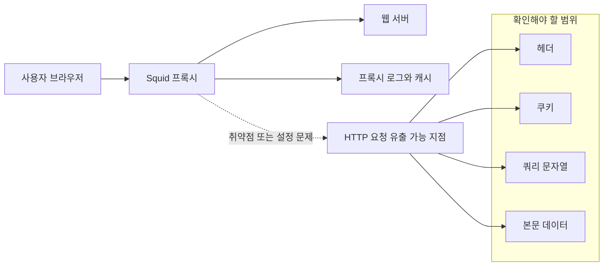

> 한 줄 요약: Squidbleed는 Squid 프록시 취약점 이름을 넘어, 오래된 네트워크 중간 계층이 여전히 HTTP 요청을 다루고 있다는 사실을 다시 보여준 사건이다. 커뮤니티가 반응한 지점도 버그 자체보다 프록시가 실패했을 때 누가, 어디까지, 어떻게 책임질 수 있느냐에 가깝다.

## 무슨 일이 있었나

2026년 7월 10일, Schneier on Security에 Friday Squid Blogging: “Squidbleed” Vulnerability라는 짧은 글이 올라왔다. 핵심은 29년 된 Squid 프록시 버그가 HTTP 요청을 유출할 수 있다는 내용이다.

공개된 본문만 보면 확인된 사실은 많지 않다.

| 구분 | 확인된 내용 |
|---|---|
| 날짜 | 2026년 7월 10일 게시 |
| 당사자 | Squid 프록시, Schneier on Security 글과 댓글 커뮤니티 |
| 범위 | HTTP 요청 유출 가능성 |
| 표현 | 29년 된 Squid 프록시 버그 |
| 미확인 | CVE 번호, 영향 버전, 패치 버전, 공격 조건, 실제 악용 여부 |

여기서 조심할 점이 있다. 본문에는 취약점의 세부 원인, 재현 방법, 영향받는 버전, 패치 여부가 적혀 있지 않다. 따라서 이 글에서 Squidbleed를 특정 구현 결함으로 단정하거나, 모든 Squid 배포가 위험하다고 말할 수는 없다.

다만 커뮤니티가 반응할 만한 이유는 있다. Squid는 일반 애플리케이션 라이브러리가 아니라 프록시(Proxy)다. 사용자의 HTTP 요청과 서버 사이에 서서 캐시, 필터링, 접근 제어, 로깅, 네트워크 경계 정책을 처리한다.

이 계층에서 요청이 샌다면 피해 범위는 애매해진다. 애플리케이션 로그가 샌 것인지, 네트워크 장비가 샌 것인지, 프록시 설정이 문제인지, 오래된 버그가 뒤늦게 발견된 것인지 경계가 흐려진다.

HTTP 요청에는 URL만 들어가지 않는다. 헤더(Header), 쿠키(Cookie), 인증 토큰, 쿼리 문자열(Query String), 사용자 입력 일부가 섞일 수 있다. HTTPS가 기본인 환경에서도 프록시가 복호화 지점에 있거나 내부 HTTP 구간을 처리한다면 상황은 달라진다.

## 왜 사람들이 반응했나

이 사건은 긴 기술 분석이나 공식 발표문에서 시작되지 않았다. 짧은 보안 블로그 글과 댓글 공간에서 말이 붙었다. 그 점이 이 이슈의 성격을 잘 보여준다.

커뮤니티가 불편해하는 지점은 대체로 네 갈래다.

| 쟁점 | 사람들이 반응하는 이유 |
|---|---|
| 신뢰 | 프록시는 보이지 않는 중간자라서 장애와 유출이 늦게 드러난다 |
| 권한 | 프록시는 앱보다 더 넓은 트래픽을 볼 수 있다 |
| 비용 | 오래된 인프라 계층은 교체와 검증이 어렵다 |
| 책임 | 앱, 네트워크, 보안, 운영 중 누가 소유자인지 흐려진다 |

첫째, 프록시는 평소에는 투명하게 동작해야 한다. 사용자가 의식하지 않아도 요청이 지나가고, 캐시가 동작하고, 접근 정책이 적용된다. 문제는 보이지 않는 계층일수록 사고가 났을 때 설명하기 어렵다는 점이다.

둘째, 오래된 버그라는 표현이 주는 불편함이 있다. 29년이라는 숫자는 단순히 오래됐다는 감상이 아니다. 그 사이 운영체제, 브라우저, TLS, 클라우드, 컨테이너, 제로 트러스트 같은 환경이 바뀌었다. 그런데 네트워크 중간 계층의 일부 전제는 그대로 남아 있었을 수 있다.

셋째, HTTP 요청 유출은 피해 판단이 어렵다. 데이터베이스 덤프처럼 테이블과 행 수가 분명하게 나오지 않는다. 어떤 요청이 흘렀는지, 그 안에 어떤 민감정보가 있었는지, 로그 보존 기간은 얼마였는지, 캐시에 남았는지까지 따져야 한다.

현업에서 비슷한 고민을 하다 보면 보안 사고의 크기는 취약점 이름보다 데이터 흐름표에서 결정된다. 같은 프록시 취약점이라도 인증 헤더를 통과시키는 프록시와 정적 파일 캐시만 처리하는 프록시는 위험이 다르다. 내부 관리자 도구 앞단에 있던 프록시와 공개 콘텐츠 CDN 뒤쪽에 있던 프록시도 전혀 다르다.

넷째, 댓글 흐름 자체도 눈에 띈다. Schneier 블로그의 댓글은 Squidbleed 하나에만 머물지 않고 AI 감시, 공공기록 접근, 디지털 포렌식, 플랫폼 권력 같은 이야기로 번진다. 겉으로는 산만해 보이지만 공통된 불안은 비슷하다.

누가 데이터를 볼 수 있는가.  
그 데이터가 나중에 어떤 용도로 쓰이는가.  
검증하기 어려운 기술 판단이 권한을 얻을 때 사용자는 무엇을 할 수 있는가.

Squidbleed가 프록시 취약점이라면, 댓글의 다른 논쟁들은 데이터가 모이는 지점에 대한 불신에 가깝다. 그래서 이 이슈는 단순 보안 패치 뉴스로만 읽히지 않는다.

## 내가 보는 핵심

이번 이슈의 핵심은 오래된 소프트웨어를 쓰면 위험하다는 뻔한 말이 아니다. 더 정확히는 중간 계층은 낡아도 쉽게 사라지지 않고, 사라지지 않는 계층은 계속 데이터를 본다는 점이다.

프록시는 애플리케이션 코드보다 덜 자주 리뷰된다. 비즈니스 로직이 아니기 때문에 제품 회의에서 잘 언급되지 않는다. 장애가 나면 모두가 보지만, 정상 동작할 때는 아무도 보지 않는다.

이런 계층은 보안 관점에서 세 가지 질문을 만든다.

- 이 계층이 실제로 볼 수 있는 데이터는 어디까지인가
- 이 계층의 로그와 캐시는 누가 얼마나 보관하는가
- 이 계층의 버전, 설정, 패치 책임자는 누구인가

Squidbleed라는 이름에만 끌리면 첫 번째 질문을 놓친다. 취약점이 있느냐보다 먼저 봐야 할 것은 프록시가 통과시키는 데이터의 민감도다.

예를 들어 같은 HTTP 요청이라도 아래처럼 위험도가 달라진다.

| 요청 유형 | 유출 시 위험 |
|---|---|
| 공개 이미지 요청 | 낮을 수 있음 |
| 검색 쿼리 포함 요청 | 사용자 관심사 노출 |
| 세션 쿠키 포함 요청 | 계정 탈취 가능성 |
| Authorization 헤더 포함 요청 | API 권한 탈취 가능성 |
| 내부 관리자 API 요청 | 운영 권한 노출 가능성 |

여기서 특히 까다로운 것은 쿼리 문자열이다. 많은 시스템이 GET 요청에 검색어, 이메일, 주문번호, 추적 ID를 넣는다. 프록시나 로드밸런서 로그에는 이런 값이 그대로 남기 쉽다. 취약점이 실제 요청 내용을 흘린다면, 피해 범위 산정은 URL 목록을 보는 일에서 끝나지 않는다.

또 하나의 핵심은 오래된 취약점의 시간차다. 29년 된 버그라는 표현이 취약한 코드가 29년 동안 모든 환경에서 같은 방식으로 악용 가능했다는 뜻은 아니다. 배포 방식, 설정, 네트워크 위치, 트래픽 종류에 따라 실제 위험은 달라진다.

그럼에도 사람들이 민감하게 반응하는 이유는 합리적이다. 인프라 계층의 버그는 발견 시점보다 도입 시점이 훨씬 앞서 있을 수 있고, 그 사이 쌓인 로그와 캐시는 과거의 요청을 현재의 사고로 끌고 올 수 있다.

보안팀 입장에서는 다음 두 문장을 분리해야 한다.

- 확인된 사실: Squid 프록시의 오래된 버그가 HTTP 요청 유출 가능성과 연결되어 언급됐다.
- 아직 확인할 것: 우리 환경의 Squid 버전, 설정, 트래픽 종류, 로그 보존, 패치 상태가 실제 위험을 만든다.

이 구분이 없으면 조직 안에서는 두 가지 반응만 남는다. 전부 위험하니 당장 끄자는 반응, 또는 자세한 정보가 없으니 넘어가자는 반응이다. 둘 다 운영 판단으로는 거칠다.

## 앞으로 볼 기준

다음에 Squidbleed 관련 공지나 패치 정보가 나오면, 제목보다 아래 항목을 먼저 봐야 한다.

- CVE 번호와 공식 보안 권고가 있는가
- 영향받는 Squid 버전 범위가 어디까지인가
- 기본 설정에서 재현되는가, 특정 설정이 필요한가
- 유출되는 HTTP 요청의 범위가 헤더인지, 본문인지, URL인지 구분되어 있는가
- 인증 토큰, 쿠키, 내부 API 요청이 노출될 수 있는가
- 패치 외에 설정 완화책이 있는가
- 로그와 캐시에 과거 요청이 남아 있는가
- 프록시 앞뒤로 TLS 종료 지점이 어디에 있는가
- 외부 공개 트래픽인지 내부 업무 트래픽인지 분리되어 있는가
- 사고 대응 시 사용자 통지나 토큰 폐기가 필요한 조건은 무엇인가

실제로 이런 상황에서는 소프트웨어 이름만 검색해서 패치 여부를 확인하는 것으로 부족하다. 프록시가 어느 경로에 놓여 있는지부터 그려야 한다. 특히 사내망, CI/CD, 패키지 저장소, 관리자 콘솔, 사내 API 앞단에 프록시가 있다면 일반 웹 트래픽보다 먼저 확인해야 한다.

운영팀은 인벤토리를 봐야 하고, 보안팀은 데이터 민감도를 봐야 하며, 개발팀은 요청에 민감정보를 실어 보내는 관행을 봐야 한다. 프록시 버그 하나가 여러 팀의 숙제를 동시에 드러내는 이유가 여기에 있다.

이번 사건에서 아직 말할 수 없는 것이 많다. CVE가 무엇인지, 패치가 어디까지 나왔는지, 실제 악용이 있었는지는 제공된 자료만으로 단정할 수 없다. 그래서 더 나은 질문은 이 취약점이 얼마나 큰가가 아니라, 우리 시스템에서 프록시가 실패하면 어떤 요청이 밖으로 보일 수 있는가다.

Squidbleed라는 이름은 지나갈 수 있다. 하지만 보이지 않는 중간 계층이 데이터를 본다는 사실은 남는다. 다음 보안 뉴스가 올라왔을 때도 같은 기준으로 보면 된다. 취약점 이름보다 데이터 흐름을 먼저 보고, 패치보다 책임 경계를 먼저 확인해야 늦지 않는다.

## 참고 자료

- [선정 글감] [Friday Squid Blogging: “Squidbleed” Vulnerability](https://www.schneier.com/blog/archives/2026/07/friday-squid-blogging-squidbleed-vulnerability.html) (Schneier on Security)