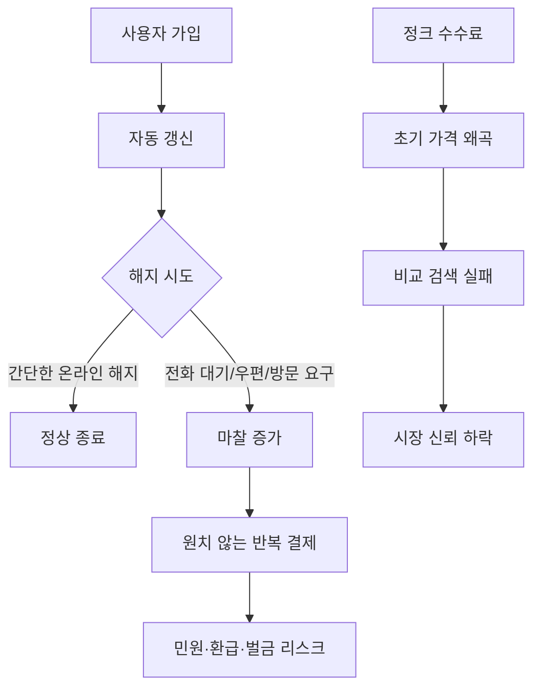

> 한 줄 요약: 뉴욕시 구독 해지 규제는 구독 서비스의 불편함만 다루는 이슈가 아니다. 기업이 가격과 해지 절차를 어디까지 감춰도 되는지, 플랫폼 설계가 소비자의 선택을 얼마나 어렵게 만들어도 되는지에 대한 기준 문제다.

## 무슨 일이 있었나

뉴욕시는 2026년 7월 10일 기만적인 구독 관행을 금지하는 새 규칙을 채택했다고 밝혔다. 시행일은 2026년 10월 1일이다. 헬스장, 스트리밍 서비스처럼 반복 결제가 붙는 구독 서비스 전반이 대상이다.

내용은 어렵지 않다. 가입은 몇 번의 클릭으로 되는데 해지는 전화 대기, 우편, 매장 방문처럼 번거롭게 만드는 방식이 규제 대상이 된다. 뉴욕시 소비자·노동자 보호국은 간단한 해지 방법을 제공하지 않는 기업에 사용자 구독 건당 525달러, 환급금, 추가 벌금을 부과할 수 있다고 설명했다.

같은 날 뉴욕시는 정크 수수료(junk fee) 규칙도 함께 제안했다. 판매자가 필수 추가 요금과 수수료를 포함한 총액을 처음부터 표시하도록 요구하는 내용이다. 이 규칙은 아직 확정된 것이 아니며, 공개 의견 수렴과 청문 절차를 거쳐야 한다.

확인된 사실과 해석은 나눠 봐야 한다.

| 구분 | 내용 |
|---|---|
| 확인된 사실 | 구독 해지 관련 새 규칙은 2026년 10월 1일 시행 예정 |
| 확인된 사실 | 위반 시 사용자 구독 건당 525달러 등 벌금과 환급 책임이 언급됨 |
| 확인된 사실 | 정크 수수료 총액 표시 규칙은 제안 단계 |
| 확인된 사실 | 뉴욕시는 미국 도시 중 처음으로 이런 금지 규칙을 시행한다고 밝힘 |
| 추정에 가까운 해석 | 다른 도시나 주가 비슷한 규칙을 따라갈 가능성 |
| 추정에 가까운 해석 | 전국 단위 플랫폼이 뉴욕시 기준에 맞춰 전체 UX를 바꿀 가능성 |

이 이슈가 Hacker News에서 292포인트와 170개 댓글을 모은 이유도 여기에 있다. 단순한 지방정부 소비자 규제가 아니라, 소프트웨어가 의도적으로 만든 마찰을 법이 어디까지 다룰 수 있느냐는 문제이기 때문이다.

## 왜 사람들이 반응했나

구독 해지 규제에 사람들이 반응하는 이유는 비슷한 경험을 해본 사람이 많기 때문이다. 가입 버튼은 눈에 잘 보이는데, 해지 버튼은 계정 설정 깊숙한 곳에 있다. 온라인으로 가입했는데 해지는 전화로만 받는다. 상담원은 할인 제안을 반복하고, 사용자는 원래 하려던 일보다 더 많은 시간을 쓴다.

이 문제는 사용성 불편으로 끝나지 않는다. 기업 입장에서는 해지 마찰이 잔존 매출을 만든다. 사용자 입장에서는 선택권을 행사하는 비용이 올라간다. 같은 화면을 두고도 기업은 리텐션 최적화라고 부르고, 소비자는 다크패턴(dark pattern)이라고 느낀다.

정크 수수료 논쟁도 구조가 비슷하다. 검색 결과에는 낮은 가격을 보여주고, 결제 직전이나 체크인 시점에 필수 수수료를 붙이면 사용자는 제대로 비교할 수 없다. 뉴욕시 관계자가 지적한 문제도 가격 경쟁이 아니라 가격을 숨기는 능력 경쟁이 된다는 점이다.

특히 뉴욕시 주거 시장에서는 영향이 클 수 있다. 기사에 따르면 뉴욕시 주민의 약 70%가 임차인이다. 임대 관리 회사가 보일러 관리비, 라이프스타일 요금 같은 필수 추가 비용을 붙이면 부동산 사이트에 표시된 임대료와 실제 월 부담액이 달라진다.

플랫폼 입장에서는 더 민감하다. 호텔, 렌터카, 티켓, 부동산, 헬스장, SaaS 구독까지 많은 디지털 판매 흐름은 가격 표시와 자동 갱신을 중요한 전환 지점으로 삼는다. 뉴욕시 규칙이 지역 규제라고 해도, 대형 플랫폼은 특정 지역 사용자만 별도 UX로 처리할지, 전체 UX를 바꿀지 판단해야 한다.

커뮤니티가 갈리는 지점은 대체로 네 가지다.

| 쟁점 | 소비자 관점 | 기업·플랫폼 관점 |
|---|---|---|
| 해지 절차 | 가입만큼 쉽게 해지해야 함 | 부정 해지, 계정 도용, 할인 제안 흐름도 고려해야 함 |
| 가격 표시 | 처음부터 총액을 알아야 비교 가능 | 수수료 구조가 지역·조건별로 달라 표시가 복잡함 |
| 자동 갱신 | 잊고 낸 돈이 많음 | 구독 모델의 예측 가능한 매출 기반 |
| 규제 범위 | 도시 단위라도 필요함 | 지역별 규칙이 늘면 운영 비용 증가 |

여기서 오해하기 쉬운 점이 있다. 이 규제는 구독 모델 자체를 금지하는 것이 아니다. 자동 갱신도 곧바로 불법이라고 말하는 것이 아니다. 문제는 사용자가 해지하려 할 때 불균형한 절차를 강요하거나, 실제 가격을 숨겨 선택을 왜곡하는 설계다.

## 내가 보는 핵심

이번 뉴욕시 구독 해지 규제에서 눈여겨볼 부분은 소비자 보호보다 인터페이스 책임이다. 화면 설계, 결제 흐름, 가격 표시, 알림 문구가 이제 단순한 UX 선택이 아니라 법적·운영적 리스크가 되는 흐름이다.

현업에서 비슷한 고민을 하다 보면 해지 버튼 하나에도 여러 부서의 이해가 얽힌다. 제품팀은 이탈률을 본다. 마케팅팀은 재구매 가능성을 본다. 재무팀은 반복 매출을 본다. 고객지원팀은 문의량을 본다. 법무팀은 규정 위반 가능성을 본다.

문제는 이 지표들이 같은 방향을 보지 않는다는 데 있다. 해지 단계를 하나 늘리면 단기 매출은 좋아질 수 있다. 하지만 민원, 환불, 카드사 분쟁, 앱스토어 리뷰, 규제 대응 비용이 뒤따르면 그 매출이 정말 좋은 매출인지 다시 계산해야 한다.

구독 해지와 정크 수수료는 서로 다른 주제처럼 보이지만 원리는 같다. 사용자가 의사결정해야 하는 순간에 필요한 정보를 늦게 주거나, 선택을 실행하는 비용을 높이는 방식이다.

이런 설계는 보통 작은 최적화에서 시작한다.

- 해지 버튼을 한 단계 안쪽으로 옮긴다
- 최종 결제 화면에서만 필수 수수료를 보여준다
- 월 가격은 작게, 할인 가격은 크게 보여준다
- 자동 갱신 안내를 약관 링크 안에 넣는다
- 해지 전에 상담원 연결을 필수로 둔다

각각은 사소한 변경처럼 보인다. 하지만 합쳐지면 사용자는 제품이 아니라 절차와 싸우게 된다. 그래서 커뮤니티 반응도 강하다. 개발자와 운영자는 이 구조가 우연히 만들어지는 것이 아니라 지표와 실험을 통해 의도적으로 강화될 수 있다는 점을 알고 있다.

뉴욕시가 말한 525달러 벌금은 숫자 자체보다 단위가 더 눈에 들어온다. 사용자 구독 건당 부과될 수 있는 구조라면, 대규모 서비스에서는 작은 UX 결함이 누적 리스크로 바뀐다. 해지 흐름 하나가 제품 부채(product debt)이자 컴플라이언스 부채(compliance debt)가 되는 셈이다.

정크 수수료도 마찬가지다. 가격 데이터가 여러 시스템에 흩어져 있으면 문제가 더 복잡해진다. 검색 페이지, 상세 페이지, 장바구니, 결제 페이지, 영수증, 광고 소재가 같은 총액 기준을 쓰지 않으면 사용자는 어느 화면을 믿어야 할지 알 수 없다.

이건 정책팀만의 일이 아니다. 가격 계산 API, 프론트엔드 표시 규칙, A/B 테스트 플랫폼, CRM 메시지, 환불 정책, 감사 로그가 같이 움직여야 한다. 규제가 들어오면 문구만 바꿔서는 부족하다.

## 앞으로 볼 기준

다음에 비슷한 구독 해지 규제나 정크 수수료 뉴스를 볼 때는 찬반보다 먼저 범위를 봐야 한다. 특정 회사를 겨냥한 규칙인지, 반복 결제와 가격 표시 전반을 다루는 규칙인지에 따라 파장이 달라진다.

첫째, 적용 대상이 누구인지 확인해야 한다. 뉴욕시 거주자에게만 적용되는지, 뉴욕시를 방문한 소비자도 포함되는지, 뉴욕시에서 영업하는 모든 온라인 사업자가 포함되는지에 따라 플랫폼 대응 방식이 달라진다. 기사에서는 구독 규칙은 뉴욕시 주민에게 적용되고, 정크 수수료 제안은 호텔이나 렌터카처럼 방문객을 상대하는 기업에도 영향을 줄 수 있다고 설명한다.

둘째, 해지의 쉬움이 무엇을 뜻하는지 봐야 한다. 단순히 온라인 해지 버튼만 있으면 되는지, 가입 경로와 같은 방식의 해지를 요구하는지, 추가 설문이나 할인 제안이 허용되는지에 따라 실제 UX는 크게 달라진다.

셋째, 총액 표시의 기준을 봐야 한다. 세금까지 포함인지, 필수 수수료만 포함인지, 조건부 요금은 어떻게 다루는지, 연간 수수료를 월 가격에 어떻게 반영하는지에 따라 구현 난도가 달라진다. 부동산 임대료처럼 주기와 명목이 다른 비용이 섞이면 더 까다롭다.

넷째, 집행 강도를 봐야 한다. 규칙이 있어도 민원 기반으로만 움직이는지, 감독기관이 적극적으로 조사하는지에 따라 기업의 우선순위가 바뀐다. 뉴욕시는 강한 집행과 큰 벌금을 예고했다는 점에서 커뮤니티가 더 크게 반응했다.

서비스를 운영한다면 지금 당장 볼 지점은 해지 흐름과 가격 표시 로그다. 사용자가 언제 어떤 가격을 봤고, 어떤 약관과 갱신 안내에 동의했으며, 해지 버튼을 찾기까지 몇 단계를 거쳤는지 재현할 수 있어야 한다. 규제가 아니어도 이 데이터는 분쟁 대응의 기본 자료가 된다.

또 하나는 지역별 정책 분기다. 뉴욕시, 캘리포니아, 유럽연합처럼 지역별 소비자 보호 규칙이 다를 때 프론트엔드에서만 분기하면 누락이 생기기 쉽다. 가격 계산과 해지 가능 상태는 서버 쪽 정책 엔진이나 공통 서비스에서 관리하는 편이 낫다.

마지막으로 제품 지표를 다시 읽어야 한다. 해지율이 낮은 것이 항상 좋은 신호는 아니다. 사용자가 만족해서 남는 것인지, 해지하기 어려워서 남는 것인지 구분하지 못하면 언젠가 비용으로 돌아온다.

뉴욕시의 이번 규칙은 한 도시의 소비자 보호 정책으로 시작했다. 하지만 질문은 더 넓다. 디지털 서비스가 사용자의 결정을 돕는 도구인지, 사용자의 피로를 매출로 바꾸는 장치인지 묻고 있다. 앞으로 구독 비즈니스를 보는 기준에는 가격과 기능뿐 아니라, 떠날 권리를 얼마나 정직하게 설계했는지도 들어가게 될 가능성이 크다.

## 참고 자료

- [선정 글감] [New York City to become first in US to ban deceptive subscription practices](https://www.theguardian.com/us-news/2026/jul/10/new-york-city-deceptive-subscriptions-ban) — The Guardian / Hacker News Best