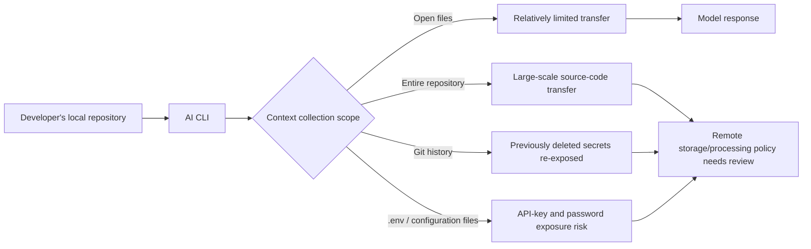

> **In short:** The crucial question in debates about AI coding CLIs is not only how well a model understands code. More immediately, it is when, where, and under what consent an entire repository and its secrets move. The Grok Build CLI report is unsettling not simply because of a possible product mistake, but because the trust boundary assumed by AI development tools is still far from settled.

## What happened

A report posted to Reddit's LocalLLaMA community describes observing Grok Build CLI v0.2.93 with `mitmproxy`. According to the report, the entire repository was uploaded as a Git bundle to Google Cloud infrastructure associated with xAI, even after the user explicitly instructed the tool not to open any files.

The reporter included `do not read or open any files` in the prompt. They also placed a canary file in the repository and claim that the file was restored when they `git clone`d the captured upload. The report further says that files read by the CLI were sent separately to `cli-chat-proxy.grok.com`, including values such as `API_KEY` and `DB_PASSWORD` from `.env` files.

It is important to separate what has been observed from what is being inferred here.

| Category | Details |
|---|---|
| Scope supported by the available evidence | The Reddit post and its linked reproduction material concern Grok Build CLI v0.2.93, a particular network capture, and a particular repository setup. |
| The reporter's claims | The full Git history and `.env` secrets were uploaded, and the model-improvement opt-out did not prevent the upload itself. |
| Points that still need independent confirmation | xAI's official explanation, server-side retention periods, deletion policies, and whether upload scope is consistent across versions. |
| The practical question already worth asking | If an AI CLI can send a repository remotely, its toggle labels must be verified against its actual data flows. |

Treating this solely as a story about xAI would miss the broader issue. Developers reacted because AI coding tools have entered the most sensitive trust boundary in the local development environment.

Code-generation tools need context to understand a repository. But the risk differs greatly depending on whether that context is a few open files, a partial index, the entire Git history, or the full working directory including `.env` files.

## Why did people react?

The first reason the developer community reacted strongly is that the term *opt-out* appears to have worked differently from what users expected.

Users commonly assume that disabling a toggle such as *Improve the model* means less of their code leaves their machine. But if the report is accurate, that toggle governs whether data is used for training rather than whether it is uploaded to perform the task at all. From the product's perspective, those may be separate policies. From the user's perspective, both involve their repository leaving their environment.

The second reason is Git history.

Secrets absent from the current working tree may still exist in older commits. Even after an API key has been rotated, internal URLs, customer names, infrastructure design, and deployment practices can remain in history. If an AI CLI creates a complete Git bundle, it can move far more information than the files the user can see in front of them.

The third reason is `.env`.

In practice, `.env` is one of the files most likely to be handled carelessly. It can exist locally even when it was never committed to Git. Once an AI tool reads local files and sends them remotely, established controls such as GitHub secret scanning and pull-request review do not help. The incident route now exists outside the repository.

The MIT LLM Serve Dashboard example offers a useful contrast. The related Reddit post introduces a dashboard for GPU utilization, per-model throughput, KV/context fill, and system status on a local LLM serving box. It also emphasizes that the frontend is a single `index.html`, the backend is a Python file built on the standard library, and there are no external requests.

By functionality alone, it is a small tool. Yet the community response was less about performance metrics than about its trust model. Claims that there are no external requests, no build step, and that the observed data stays local show what developers increasingly regard as reassuring.

The CISA case belongs on the same axis. According to TechCrunch, in May 2026 a CISA contractor employee uploaded sensitive keys and credentials that could be used to access government systems to a public GitHub repository. CISA responded after security researchers and a journalist flagged the issue. In its post-incident account, CISA said it had no prepared incident playbook at the time and had to develop response procedures as the incident unfolded.

The two cases look different, but they lead to the same question.

Once sensitive development material crosses a boundary, how can an organization know it happened, who must be notified, what must be discarded, and which keys must be rotated? The AI CLI debate is a usability debate, but it is also a debate about incident readiness.

## The core issue as I see it

This is not an argument that remote processing by AI coding tools is inherently wrong.

Large models may require remote inference. Repository-level context can also produce better answers. Insisting on local models alone brings different trade-offs in quality, speed, cost, and maintenance.

But uploading a repository should not be treated as a minor side effect of an autocomplete feature. It packages source code, configuration, history, developer habits, and sometimes information close to customer data, then sends it to an external system in one operation.

In day-to-day engineering work, this discussion usually unfolds along these lines:

- Developers want better context.
- Security teams want to know the scope of data transfer.
- Legal and privacy teams ask about retention and the purpose of further processing.
- Platform teams look for a way to enforce a consistent policy across every developer environment.
- Product teams want to use the tools without sacrificing productivity.

To balance those interests, data flows must be disclosed before UI toggles.

For example, if an AI CLI performs the following actions, documentation and product UI should describe them separately.

| Question | What needs to be answered |
|---|---|
| What will it send? | Open files, selected folders, the full repository, Git history, and whether ignored files are included. |
| When will it send it? | Immediately on launch, after prompt entry, or when a particular command runs. |
| Where will it send it? | API domains, object storage, region, and third-party processors. |
| How long will it retain it? | Retention periods for logs, caches, bundles, and session data. |
| What will it use it for? | Response generation, quality improvement, model training, or abuse detection. |
| How can it be prevented? | Allowlists, denylists, `.gitignore` support, secret redaction, and organization-level policy. |

What is particularly troubling in this report is that the meaning of *opt-out* may conflict with users' intuition. Saying that data will not be used to improve the model is not the same as saying that it will not be uploaded. Yet many users treat the two as the same safeguard.

If a product does not explain this distinction plainly, users may learn only afterward that their code has already moved. Once that trust is lost, feature quality alone is unlikely to restore it.

## What to evaluate next

When assessing AI coding-tool news, look at transfer boundaries before model performance.

First, determine whether full-repository upload is the default—and treat the inclusion of Git history as a separate question. History may contain secrets and internal information that developers believe were deleted.

Second, examine how the tool handles `.gitignore`, `.env`, and secret patterns. The fact that a file is not committed to Git does not reduce the risk of an AI CLI transferring it. A tool that can read local files creates a new path regardless of Git tracking status.

Third, do not take opt-out language at face value; read its scope. Training opt-out, telemetry opt-out, prompt-logging opt-out, and file-upload opt-out are different controls. If a product blends them together on one screen, operational risk remains.

Fourth, check whether organization-level controls exist. Relying on every individual developer to be careful does not scale. For company repositories, CLI policy files, centrally managed configuration, network egress controls, secret scanning, and key-rotation procedures should work together.

Fifth, define an incident playbook in advance. As the CISA case illustrates, credential-exposure incidents become harder after discovery. If no one has determined which repositories were transferred, which keys may have been included, which accounts to revoke, and whom to notify, the response becomes an improvised meeting.

This is not an argument to stop using AI coding tools. Standards are needed precisely because they are likely to remain in use.

A good AI CLI is not merely a tool that can read a great deal of code. It is one whose users can predict what it reads. A better AI CLI also lets organizations restrict and audit that scope.

The question left by the Grok Build CLI report is simple: do we want a tool that understands our repositories better, or one that lets us know how far our repositories have traveled? We should now demand both.

## Further reading

- [Selected source: Grok Build CLI uploads your whole repo, full git history + .env secrets, to xAI's cloud, and the opt-out doesn't stop it](https://www.reddit.com/r/LocalLLaMA/comments/1ut7tis/grok_build_cli_uploads_your_whole_repo_full_git/) (Reddit LocalLLaMA)
- [Related: Grok Build CLI wire-capture evidence gist](https://gist.github.com/cereblab/dc9a40bc26120f4540e4e09b75ffb547) (GitHub Gist)
- [Related: MIT LLM Serve Dashboard I am making open source](https://www.reddit.com/r/LocalLLaMA/comments/1ut3p89/mit_llm_serve_dashboard_i_am_making_open_source/) (Reddit LocalLLaMA)
- [Related: US cybersecurity agency CISA had to build its incident playbook during the incident, agency reveals](https://techcrunch.com/2026/07/10/us-cyber-agency-cisa-had-to-build-its-incident-playbook-during-the-incident-agency-reveals/) (TechCrunch)
