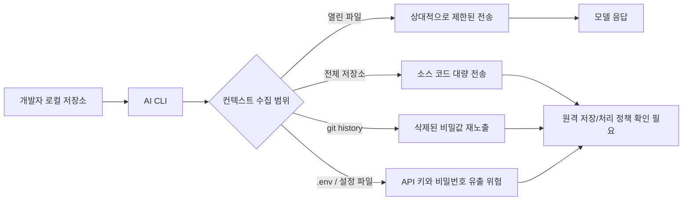

> 한 줄 요약: AI 코딩 CLI 논쟁에서 중요한 건 모델이 코드를 얼마나 잘 이해하느냐만이 아니다. 저장소 전체와 비밀값이 언제, 어디로, 어떤 동의 아래 이동하는지가 더 직접적인 문제다. Grok Build CLI 제보가 불편한 이유도 특정 제품의 실수라기보다, AI 개발 도구가 기본값으로 삼는 신뢰 경계가 아직 정리되지 않았다는 데 있다.

## 무슨 일이 있었나

Reddit LocalLLaMA에 올라온 제보는 Grok Build CLI v0.2.93을 `mitmproxy`로 관찰한 내용이다. 제보에 따르면 사용자가 명시적으로 파일을 열지 말라고 지시했는데도 전체 저장소가 git bundle 형태로 xAI 쪽 Google Cloud에 업로드됐다.

제보자는 프롬프트에 `do not read or open any files`를 넣었다. 저장소 안에는 canary 파일도 심어뒀는데, 캡처된 업로드를 `git clone`했을 때 그 파일이 그대로 복원됐다고 주장했다. CLI가 읽은 파일은 별도로 `cli-chat-proxy.grok.com`으로 전송됐고, `.env` 안의 `API_KEY`, `DB_PASSWORD` 같은 값도 포함됐다는 설명도 붙었다.

여기서는 확인된 내용과 해석을 나눠 봐야 한다.

| 구분 | 내용 |
|---|---|
| 확인된 범위 | Reddit 게시글과 연결된 재현 자료는 Grok Build CLI v0.2.93, 특정 네트워크 캡처, 특정 저장소 조건을 전제로 한다 |
| 제보자의 주장 | 전체 git history와 `.env` 비밀값이 업로드됐고, 모델 개선 opt-out은 업로드 자체를 막지 않았다 |
| 아직 별도 확인이 필요한 부분 | xAI의 공식 설명, 서버 측 보관 기간, 삭제 정책, 업로드 범위가 버전별로 같은지 여부 |
| 실무적으로 이미 따져야 하는 부분 | AI CLI가 저장소를 원격으로 보내는 구조라면, 토글 이름과 실제 데이터 흐름이 맞는지 검증해야 한다 |

이 글감을 xAI 하나를 비난하는 이야기로만 보면 중요한 부분을 놓치기 쉽다. 개발자들이 반응한 지점은 AI 코딩 도구 전반이 로컬 개발 환경의 가장 민감한 경계 안으로 들어왔다는 사실이다.

코드 생성 도구가 저장소를 이해하려면 컨텍스트가 필요하다. 다만 그 컨텍스트가 현재 파일 몇 개인지, 인덱싱된 일부인지, 전체 git history인지, `.env`까지 포함한 작업 디렉터리 전체인지에 따라 위험은 크게 달라진다.

## 왜 사람들이 반응했나

개발자 커뮤니티가 예민하게 반응한 첫 번째 이유는 opt-out이라는 단어가 기대와 다르게 작동했기 때문이다.

사용자는 보통 Improve the model 같은 토글을 끄면 내 코드가 외부로 덜 나간다고 기대한다. 하지만 제보 내용대로라면 해당 토글은 학습 사용 여부를 다룰 뿐, 작업 수행을 위한 업로드 자체를 막지 않는다. 제품 입장에서는 둘이 다른 정책일 수 있다. 사용자 입장에서는 둘 다 내 저장소가 외부로 이동하는 문제다.

두 번째 이유는 git history다.

현재 워킹트리에 없는 비밀값도 과거 커밋에 남아 있을 수 있다. 이미 rotate한 API 키라도 내부 URL, 고객명, 인프라 구조, 배포 습관은 history에 남는다. AI CLI가 전체 git bundle을 만든다면 사용자가 눈앞에서 보고 있는 파일보다 훨씬 넓은 정보가 이동한다.

세 번째는 `.env`다.

`.env`는 실무에서 가장 자주 실수하는 파일이다. Git에 올리지 않았더라도 로컬에는 존재한다. AI 도구가 로컬 파일을 읽고 원격으로 보내는 순간, GitHub secret scanning이나 PR 리뷰 같은 기존 방어선은 도움이 되지 않는다. 저장소 밖에서 사고가 난다.

여기서 MIT LLM Serve Dashboard 사례는 좋은 대비가 된다. 해당 Reddit 글은 로컬 LLM 서빙 박스의 GPU 사용률, 모델별 처리량, KV/context fill, 시스템 상태를 보여주는 대시보드를 소개한다. 동시에 frontend는 단일 `index.html`, backend는 표준 라이브러리 기반 Python 파일, 외부 요청 없음이라는 점을 강조했다.

기능만 보면 작은 도구다. 그런데 커뮤니티가 반응한 지점은 성능 숫자보다 신뢰 모델에 가깝다. 외부 요청이 없고, 빌드 단계가 없고, 관측 대상이 로컬에 남는다는 설명은 요즘 개발자들이 무엇을 안심 포인트로 보는지 보여준다.

CISA 사례도 같은 축에 있다. TechCrunch 보도에 따르면 2026년 5월, CISA contractor 직원이 정부 시스템 접근에 쓰일 수 있는 민감한 키와 credential을 공개 GitHub 저장소에 올렸고, 보안 연구자와 기자를 거쳐 CISA가 대응했다. CISA는 사후 보고에서 당시 준비된 incident playbook이 없어 사고 초기에 대응 절차를 만들며 움직여야 했다고 밝혔다.

두 사건은 달라 보이지만 결국 같은 질문으로 이어진다.

민감한 개발 자료가 한 번 경계를 넘었을 때, 조직은 그 사실을 어떻게 알 수 있고, 누구에게 알리며, 무엇을 폐기하고, 어떤 키를 교체해야 하는가. AI CLI 논쟁은 사용성 논쟁인 동시에 incident readiness 논쟁이기도 하다.

## 내가 보는 핵심

AI 코딩 도구의 원격 처리 자체가 문제라는 뜻은 아니다.

대형 모델을 쓰려면 원격 추론이 필요할 수 있다. 저장소 단위의 컨텍스트가 있어야 더 나은 답을 내는 것도 사실이다. 로컬 모델만 고집하면 품질, 속도, 비용, 유지보수에서 다른 문제가 생긴다.

다만 저장소 업로드를 자동완성 기능의 부가 동작 정도로 보면 안 된다. 그것은 소스 코드, 설정, 히스토리, 개발자 습관, 때로는 고객 데이터에 가까운 정보를 한 번에 묶어 외부 시스템에 넘기는 행위다.

현업에서 비슷한 고민을 하다 보면 논쟁은 대개 이렇게 흐른다.

- 개발자는 더 나은 컨텍스트를 원한다
- 보안팀은 전송 범위를 알고 싶어 한다
- 법무나 개인정보 담당자는 보관과 재처리 목적을 묻는다
- 플랫폼팀은 모든 개발자 환경에서 같은 정책을 강제할 방법을 찾는다
- 제품팀은 생산성 저하 없이 도구를 쓰고 싶어 한다

이 균형을 맞추려면 UI 토글보다 데이터 흐름이 먼저 공개되어야 한다.

예를 들어 AI CLI가 다음 동작을 한다면, 문서와 화면에서 분리해 말해야 한다.

| 질문 | 확인해야 할 답 |
|---|---|
| 무엇을 보낼까? | 열린 파일, 선택한 폴더, 전체 repo, git history, ignored 파일 포함 여부 |
| 언제 보낼까? | 실행 직후, 프롬프트 입력 후, 특정 명령 실행 시점 |
| 어디로 보낼까? | API 도메인, object storage, region, 제3자 처리자 |
| 얼마나 남길까? | 로그, 캐시, bundle, 세션 데이터 보관 기간 |
| 무엇에 쓸까? | 응답 생성, 품질 개선, 모델 학습, abuse detection |
| 어떻게 막을까? | allowlist, denylist, `.gitignore` 존중, secret redaction, org policy |

이번 제보에서 특히 불편한 지점은 opt-out의 의미가 사용자의 직관과 어긋난다는 데 있다. 모델 개선에 쓰지 않는다는 말은 업로드하지 않는다는 말이 아니다. 하지만 많은 사용자는 둘을 같은 안전장치로 받아들인다.

제품이 이 차이를 명확히 설명하지 않으면 사용자는 나중에야 내 코드가 이미 이동했다는 사실을 알게 된다. 그때 무너진 신뢰는 기능 품질만으로 회복하기 어렵다.

## 앞으로 볼 기준

앞으로 AI 코딩 도구 뉴스를 볼 때는 모델 성능보다 전송 경계를 먼저 봐야 한다.

첫째, 전체 저장소 업로드가 기본값인지 확인해야 한다. 특히 git history 포함 여부는 별도 항목으로 봐야 한다. history에는 삭제했다고 믿은 비밀값과 내부 정보가 남아 있을 수 있다.

둘째, `.gitignore`, `.env`, secret pattern을 도구가 어떻게 처리하는지 봐야 한다. 단순히 Git에 올라가지 않는다는 사실은 AI CLI 전송 위험을 줄여주지 않는다. 로컬 파일을 읽을 수 있는 도구라면 Git 관리 여부와 무관하게 새 경로가 생긴다.

셋째, opt-out 문구를 그대로 믿지 말고 범위를 읽어야 한다. 학습 opt-out, telemetry opt-out, prompt logging opt-out, file upload opt-out은 서로 다르다. 제품이 이를 한 화면에서 섞어 말한다면 운영 리스크가 남는다.

넷째, 조직 단위 제어가 있는지 봐야 한다. 개인 개발자가 매번 조심하는 방식은 오래가지 않는다. 회사 저장소라면 CLI 정책 파일, 중앙 관리 설정, 네트워크 egress 제어, secret scanning, 키 교체 절차가 같이 있어야 한다.

다섯째, 사고가 났을 때의 playbook을 미리 정해야 한다. CISA 사례가 보여준 것처럼 credential 노출 사고는 발견 이후가 더 어렵다. 어떤 저장소가 전송됐는지, 어떤 키가 포함됐는지, 어떤 계정을 폐기할지, 누구에게 알릴지 정해져 있지 않으면 대응은 즉석 회의가 된다.

AI 코딩 도구를 쓰지 말자는 얘기가 아니다. 계속 쓸 가능성이 높기 때문에 기준이 필요하다.

좋은 AI CLI는 많은 코드를 읽는 도구가 아니라, 무엇을 읽는지 사용자가 예측할 수 있는 도구다. 더 나은 AI CLI라면 조직이 그 범위를 제한하고 감사할 수도 있어야 한다.

Grok Build CLI 제보가 남긴 질문은 단순하다. 내 저장소를 더 잘 이해하는 도구를 원하는가, 아니면 내 저장소가 어디까지 이동했는지 알 수 있는 도구를 원하는가. 이제는 둘 다 요구해야 한다.

## 참고 자료

- [선정 글감] [Grok Build CLI uploads your whole repo, full git history + .env secrets, to xAI's cloud, and the opt-out doesn't stop it](https://www.reddit.com/r/LocalLLaMA/comments/1ut7tis/grok_build_cli_uploads_your_whole_repo_full_git/) (Reddit LocalLLaMA)
- [관련] [Grok Build CLI wire-capture evidence gist](https://gist.github.com/cereblab/dc9a40bc26120f4540e4e09b75ffb547) (GitHub Gist)
- [관련] [MIT LLM Serve Dashboard I am making open source](https://www.reddit.com/r/LocalLLaMA/comments/1ut3p89/mit_llm_serve_dashboard_i_am_making_open_source/) (Reddit LocalLLaMA)
- [관련] [US cybersecurity agency CISA had to build its incident playbook during the incident, agency reveals](https://techcrunch.com/2026/07/10/us-cyber-agency-cisa-had-to-build-its-incident-playbook-during-the-incident-agency-reveals/) (TechCrunch)