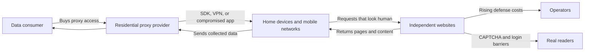

> **In brief:** Residential proxies and AI scrapers are not merely a traffic-growth problem. They shift the costs of competition for training data onto other people's devices and independent websites.

## What happened

On July 10, 2026, LWN reported that large-scale scraper traffic routed through residential proxies had intensified again. The concern is not clearly identified automated access, such as search-engine crawlers. It is traffic that appears briefly from vast numbers of home and mobile-network IP addresses, makes only a few requests from each address, and disappears.

That makes the problem much harder for site operators to handle. Over a few hours, requests can arrive from millions of unique IP addresses, with each IP fetching a page only two or three times before vanishing. User-Agent strings are not trustworthy. A bot may be suspected because it does not request images or CSS, but by then that IP often will not be used again.

LWN identified residential proxies as a major route for this traffic. Ordinary users' TVs, streaming boxes, phones, and apps can receive commands from a central control server, fetch web pages, and return the results. In some cases, malware infection is involved; in others, the arrangement is disclosed through consent language buried in free VPNs or app SDKs.

The confirmed facts can be separated as follows.

| Item | Confirmed facts | What remains uncertain |
| --- | --- | --- |
| LWN traffic | Large-scale scraper attacks were continuing as of July 2026 | The identities of the ultimate buyers have not been made public |
| NetNut and Popa | The FBI and industry partners seized domains related to NetNut, and security firms describe at least 2 million devices connected to the Popa botnet | The purpose of every customer's use and whether a specific AI company used the network directly |
| Defenses | Proof-of-work systems such as Anubis, login barriers, CAPTCHAs, and data-poisoning tools are spreading | Which defenses will be effective over the long term remains unclear |

Krebs on Security's coverage of the NetNut seizure made the discussion more concrete. The FBI seized hundreds of domains associated with NetNut, with Google, Lumen, and Shadowserver reportedly cooperating. Citing security-firm analysis, Krebs explained that NetNut infrastructure was connected to the Popa botnet and that household devices such as smart TVs and streaming hardware had been used as proxy nodes.

There is an important line to keep clear. LWN wrote that there is no evidence that large AI-model companies directly use these residential proxy networks. By contrast, crawlers from publicly identified large-model companies generally disclose their User-Agent strings and follow rules such as robots.txt to some degree.

Even so, that gap is precisely what made the community uneasy. Someone is paying to buy this traffic. Someone is taking material from the public web for training data or automation. Yet the costs are dispersed among site operators, real readers, and the owners of compromised devices.

## Why people reacted

The debate over residential proxies extends beyond whether web scraping is good or bad. It combines questions of who can read the public web, under what conditions, and who bears the cost.

Trust is the first thing to break down. Web-server operators have traditionally used signals such as IP addresses, User-Agent strings, robots.txt, and request frequency to distinguish people, search engines, and harmful bots. Residential proxies deliberately disrupt that signal system. Because the requests appear to come from household internet connections, blocking them can also block real readers.

Authorization is another major concern. Installing a free VPN or an app does not necessarily mean a user fully understands that their device may become a transit point for a third party's large-scale scraping. Even if some form of consent exists in the terms of service, ordinary users are unlikely to anticipate that their networks could be used for ad fraud, account-takeover attempts, or mass content collection.

The costs also shift to operators. Independent media outlets and small open-source project sites rarely have the extensive defensive infrastructure available to major platforms. As scraper traffic grows, so do server costs and the time required for caching, rate limiting, bot detection, and log analysis. Put up defenses, and real readers may instead have to solve CAPTCHAs or sign in.

There is regulatory risk as well. Krebs's reporting on NetNut shows that this issue can go beyond a debate over etiquette and lead to law-enforcement seizures. Responsibility becomes blurred when compromised devices, ambiguous consent, and resale or white-label arrangements are mixed together. A proxy vendor may point to legitimate market research or price comparison, while its actual customers can rent the network for far broader purposes.

Misunderstandings are common, too. Many discussions treat all AI scrapers as a single category. LWN's distinction is more useful in practice: crawlers that identify themselves and follow rules to some extent, commercial proxies intended to bypass defenses, and malware-based botnets are all forms of automated access, but they create different operational risks.

In day-to-day operations, trying to block all automated access in response to abusive traffic often backfires. It can also disrupt search visibility, archive preservation, accessibility tools, and security monitoring. The problem is not automation itself, but automation that avoids identification and accountability.

## The core issue as I see it

The heart of this issue is not scraping but concealed origin. The public web exists to be read, but that does not mean every method of access is justified. Millions of distributed requests that masquerade as human readers are not simply operating within the rules of public access; they are closer to breaking those rules.

Residential proxies target exactly the part of the system that is hardest to defend. Datacenter IP addresses are comparatively easy to block using reputation signals. Residential and mobile IP addresses, by contrast, are intermingled with real users. Raise the blocking threshold and readers are inconvenienced; lower it and the server may struggle to cope.

Proof of work is not a complete answer either. Systems such as Anubis, which impose a computational cost on visitors, may buy small sites some time. But as LWN notes, if an attacker can use millions of other people's devices, the computational cost falls not on the attacker but on compromised users.

The structure resembles cloud-cost optimization. A system is balanced only when the party that directly pays the costs also has decision-making power. With residential proxies, the data consumer gains the benefit, the proxy provider earns revenue, and the affected sites and device owners share the costs. The market's cost signals are broken.

That is why it is not enough to view this solely as a contest over the performance of bot-blocking tools. Defensive tools are necessary, but tools alone cannot fill the gaps in consent, accountability, and transparency. Once app stores, SDK distribution channels, VPN providers, proxy resellers, and data buyers can all say they are merely intermediaries, operators have to distrust every request.

Google's response to NetNut also looks incomplete on this point. Detecting NetNut-infected apps in the Play Store is helpful. But questions remain about why apps with residential-proxy functionality could circulate so easily through app stores, how SDKs should obtain user consent, and how far resellers should verify where their customers will use the network.

This is not only a problem for small sites. If public documentation, package repositories, community forums, bug trackers, and personal blogs all face the same pressure, the web's basic usability changes. Those who keep material open absorb the cost of defense; those who close it lose discoverability and public value.

## What to look for next

The next time news appears about AI scrapers, residential proxies, or botnet seizures, start by separating the sources of the traffic. Even when the activity is all called crawling, the assessment changes depending on whether it comes from an identifiable crawler, a commercial proxy, or a botnet built from compromised devices.

For operators, the following guidelines are practical.

- Do not rely on User-Agent strings alone. Consider whether images and CSS are requested, along with session persistence.
- Before blocking entire IP ranges, consider protecting high-cost endpoints, strengthening caching, and limiting anonymous requests.
- Classify automated access that should be preserved separately, including search engines, the Internet Archive, and security scanners.
- Evaluate CAPTCHAs and proof of work with the costs imposed on real readers included.
- When introducing a login barrier, separate documents that should remain part of the public web from functions that can reasonably be closed off.
- When adopting an app or SDK, check whether its terms allow device-network traffic to be used for third parties.

Policy needs clear standards, too. If a proxy provider claims ethical sourcing, users should at least be able to learn what traffic they are relaying. If the arrangement includes resellers, there should be verification of the end customer's intended use. App stores should make network-proxy capabilities more explicit within their permission models.

AI companies cannot avoid the same questions. If they operate public crawlers, they should clearly state what data they collect, how they handle robots.txt and deletion requests, and whether they use third-party data brokers or proxies. No specific company should be accused without evidence, but opaque supply chains invite suspicion.

Site operators have no completely clean option. Leave the site open and it can be abused; close it and readers and search engines are inconvenienced. Future decisions are therefore likely to focus less on perfect blocking than on limiting the scope of harm.

Returning to the initial tension, this is less about who has the right to read the web than about who bears the cost of that reading. If the public web is to remain open, automated access must not hide what it is, and costs and accountability must travel with it. If that boundary collapses, what remains is more logins, more CAPTCHAs, and a narrower web.

## References

- [Selected article] [An update on residential proxies and the scraper situation](https://lwn.net/SubscriberLink/1080822/990a8a5e2d379085/) - LWN / Hacker News Best
- [Related] [FBI Seizes NetNut Proxy Platform, Popa Botnet](https://krebsonsecurity.com/2026/07/fbi-seizes-netnut-proxy-platform-popa-botnet/) - Krebs on Security
