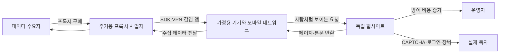

> 한 줄 요약: 주거용 프록시와 AI 스크래퍼 문제는 트래픽 증가만의 문제가 아니다. 남의 기기와 독립 웹사이트에 훈련 데이터 경쟁의 비용을 떠넘기는 구조가 문제다.

## 무슨 일이 있었나

2026년 7월 10일 LWN은 주거용 프록시(Residential Proxy)를 통한 대규모 스크래퍼 트래픽이 다시 강해졌다고 썼다. LWN이 문제 삼은 것은 검색엔진 크롤러처럼 출처가 분명한 자동 접근이 아니다. 수많은 가정용·모바일 네트워크 IP에서 몇 번씩만 접속하고 사라지는 트래픽이다.

사이트 운영자 입장에서는 훨씬 다루기 어렵다. 몇 시간 동안 수백만 개의 고유 IP에서 요청이 오고, 각 IP는 페이지를 두세 번만 가져간 뒤 사라진다. 사용자 에이전트(User-Agent)는 믿기 어렵다. 이미지나 CSS를 가져가지 않는 패턴으로 봇을 의심할 수는 있지만, 그때는 이미 해당 IP가 다시 쓰이지 않는 경우가 많다.

LWN은 이런 트래픽의 주요 경로로 주거용 프록시를 지목했다. 일반 사용자의 TV, 스트리밍 박스, 휴대전화, 앱이 중앙 제어 서버의 명령을 받아 웹페이지를 가져오고, 그 결과를 다시 전달하는 방식이다. 어떤 경우는 악성코드 감염이고, 어떤 경우는 무료 VPN이나 앱 SDK에 묻힌 동의 구조다.

확인된 사실은 다음처럼 나눌 수 있다.

| 항목 | 확인된 사실 | 아직 추정인 부분 |
| --- | --- | --- |
| LWN 트래픽 | 2026년 7월 기준 대규모 스크래퍼 공격이 계속되고 있음 | 누가 최종 구매자인지는 공개되지 않음 |
| NetNut·Popa | FBI와 업계 파트너가 NetNut 관련 도메인을 압수했고, 보안업체들은 Popa 봇넷과 연결된 장치를 최소 200만 대 규모로 설명 | 모든 고객의 사용 목적과 특정 AI 기업의 직접 사용 여부 |
| 방어 방식 | Anubis 같은 작업증명(Proof of Work), 로그인 장벽, CAPTCHA, 데이터 오염 도구가 확산 | 어떤 방어가 장기적으로 효과적일지는 불확실 |

Krebs on Security가 전한 NetNut 압수 사건은 이 논의에 현실감을 붙였다. FBI는 NetNut 관련 수백 개 도메인을 압수했고, Google, Lumen, Shadowserver 등이 협력한 것으로 알려졌다. Krebs는 보안업체들의 분석을 인용해 NetNut 인프라가 Popa 봇넷과 연결됐고, 스마트 TV와 스트리밍 장치 같은 가정용 기기가 프록시 노드로 쓰였다고 설명했다.

여기서 조심해야 할 선이 있다. LWN은 대형 AI 모델 회사들이 직접 이런 주거용 프록시 네트워크를 쓴다는 증거는 없다고 썼다. 오히려 공개적으로 식별되는 대형 모델 회사의 크롤러는 대체로 사용자 에이전트를 밝히고 robots.txt 같은 규칙도 어느 정도 따른다고 했다.

그럼에도 커뮤니티가 불편해한 지점은 바로 그 빈칸이다. 누군가는 돈을 내고 이런 트래픽을 사고 있다. 누군가는 공개 웹을 훈련 데이터나 자동화 자원으로 가져가고 있다. 하지만 비용은 사이트 운영자, 실제 독자, 감염된 기기 소유자에게 흩어진다.

## 왜 사람들이 반응했나

주거용 프록시 논쟁은 웹 스크래핑 찬반보다 넓다. 공개 웹을 누가 어떤 조건으로 읽을 수 있느냐, 그리고 그 비용을 누가 내느냐가 겹쳐 있다.

먼저 무너지는 것은 신뢰다. 웹 서버 운영자는 원래 IP, 사용자 에이전트, robots.txt, 요청 빈도 같은 신호로 사람·검색엔진·나쁜 봇을 구분해왔다. 주거용 프록시는 이 신호 체계를 일부러 흔든다. 집 인터넷 회선에서 온 요청처럼 보이기 때문에 차단하면 실제 독자까지 같이 막힐 수 있다.

권한 문제도 크다. 사용자가 무료 VPN을 설치했거나 어떤 앱을 깔았다고 해서, 그 기기가 제3자의 대량 스크래핑 경유지가 되는 것을 충분히 이해했다고 보기는 어렵다. 약관 어딘가에 동의가 있었더라도, 일반 사용자가 자기 네트워크가 광고 사기, 계정 탈취 시도, 대량 콘텐츠 수집에 쓰일 수 있다는 범위를 예측하기는 어렵다.

비용도 운영자 쪽으로 넘어간다. 독립 매체나 작은 오픈소스 프로젝트 사이트는 대형 플랫폼처럼 방대한 방어 인프라를 갖추기 어렵다. 스크래퍼가 늘면 서버 비용이 오르고, 캐시·레이트 리밋·봇 탐지·로그 분석에 시간이 들어간다. 방어 장벽을 세우면 이번에는 실제 독자가 CAPTCHA를 풀거나 로그인을 해야 한다.

규제 리스크도 있다. Krebs의 NetNut 보도는 이 문제가 예절 논쟁에 그치지 않고 수사기관의 압수까지 이어질 수 있음을 보여준다. 특히 감염된 장치, 모호한 동의, 재판매·화이트라벨 구조가 섞이면 책임 소재가 흐려진다. 프록시 판매사는 합법적 시장조사나 가격 비교를 말할 수 있지만, 실제 사용자는 그보다 훨씬 넓은 목적으로 네트워크를 빌릴 수 있다.

오해도 자주 생긴다. 많은 논의가 AI 스크래퍼 전체를 한 덩어리로 묶는다. 하지만 LWN의 구분은 꽤 실용적이다. 출처를 밝히고 규칙을 어느 정도 따르는 크롤러, 방어를 우회하려는 상업적 프록시, 악성코드 기반 봇넷은 모두 자동 접근이지만 운영 리스크는 다르다.

현업에서 비슷한 상황을 보면, 나쁜 트래픽을 막겠다고 모든 자동 접근을 막는 선택은 자주 역효과를 낸다. 검색 노출, 아카이브 보존, 접근성 도구, 보안 모니터링까지 같이 깨질 수 있다. 문제는 자동화 자체가 아니라, 식별과 책임을 피하는 자동화다.

## 내가 보는 핵심

이번 이슈의 핵심은 스크래핑이 아니라 출처 위장이다. 공개 웹은 읽히기 위해 존재하지만, 그 말이 어떤 방식의 접근도 정당하다는 뜻은 아니다. 사람이 읽는 것처럼 가장한 수백만 개의 분산 요청은 공개 접근의 규칙을 쓰는 것이 아니라 규칙을 망가뜨리는 쪽에 가깝다.

주거용 프록시는 방어하기 어려운 지점을 정확히 찌른다. 데이터센터 IP는 평판 기반 차단이 비교적 쉽다. 반면 가정용·모바일 IP는 실제 사용자와 섞여 있다. 차단 강도를 높이면 독자가 불편해지고, 낮추면 서버가 버티기 어렵다.

작업증명도 완벽한 답은 아니다. Anubis처럼 접속자에게 계산 비용을 부과하는 방식은 작은 사이트에 시간을 벌어줄 수 있다. 하지만 LWN이 지적하듯, 공격자가 남의 기기 수백만 대를 쓸 수 있다면 계산 비용은 공격자 본인이 아니라 감염된 사용자에게 넘어간다.

이 구조는 클라우드 비용 최적화와도 닮아 있다. 어떤 시스템이든 비용을 직접 내는 주체가 의사결정권을 가져야 균형이 맞는다. 그런데 주거용 프록시에서는 데이터 수요자가 이익을 얻고, 프록시 사업자가 매출을 얻고, 피해 사이트와 기기 소유자가 비용을 나눠 가진다. 비용 신호가 깨진 시장이다.

그래서 이 문제를 봇 차단 도구의 성능 경쟁으로만 보면 부족하다. 방어 도구는 필요하지만, 도구만으로는 동의·책임·투명성의 빈자리를 메우기 어렵다. 앱스토어, SDK 유통망, VPN 사업자, 프록시 리셀러, 데이터 구매자가 각자 나는 중간자일 뿐이라고 말하는 순간 운영자는 모든 트래픽을 의심해야 한다.

Google의 NetNut 대응도 이 지점에서 반쪽짜리로 보인다. Play Store에서 NetNut 감염 앱을 탐지하겠다는 조치는 도움이 된다. 다만 왜 앱스토어에 주거용 프록시 기능이 들어간 앱이 쉽게 유통될 수 있었는지, SDK가 사용자 동의를 어떻게 받아야 하는지, 리셀러가 고객 사용처를 어디까지 확인해야 하는지는 여전히 남는다.

이건 작은 사이트만의 문제가 아니다. 공개 문서, 패키지 저장소, 커뮤니티 포럼, 버그 트래커, 개인 블로그가 같은 압력을 받으면 웹의 기본 사용성이 바뀐다. 자료를 열어두는 쪽은 방어 비용을 떠안고, 닫아두는 쪽은 발견 가능성과 공공성을 잃는다.

## 앞으로 볼 기준

다음에 AI 스크래퍼, 주거용 프록시, 봇넷 압수 뉴스를 볼 때는 먼저 트래픽의 출처를 나눠 봐야 한다. 같은 크롤링이라도 식별 가능한 크롤러인지, 상업적 프록시인지, 감염 장치 기반 봇넷인지에 따라 판단이 달라진다.

운영자 입장에서는 다음 기준이 현실적이다.

- 사용자 에이전트만 믿지 말고, 이미지·CSS 요청 여부와 세션 지속성을 함께 본다.
- 전체 IP 차단보다 비용이 큰 엔드포인트 보호, 캐시 강화, 익명 요청 제한을 먼저 검토한다.
- 검색엔진, Internet Archive, 보안 스캐너처럼 보존할 자동 접근을 따로 분류한다.
- CAPTCHA나 작업증명은 실제 독자에게 부과되는 비용까지 포함해 판단한다.
- 로그인 장벽을 세울 때는 공개 웹으로 남겨야 할 문서와 닫아도 되는 기능을 분리한다.
- 앱이나 SDK를 도입할 때는 기기 네트워크를 제3자 트래픽에 쓰는 조항이 있는지 확인한다.

정책을 볼 때도 기준이 필요하다. 프록시 사업자가 윤리적 소싱을 말한다면, 최소한 사용자가 어떤 트래픽을 대신 전달하는지 알 수 있어야 한다. 리셀러 구조가 있다면 최종 고객의 사용처 검증이 있어야 한다. 앱스토어는 네트워크 프록시 기능을 권한 모델 안에서 더 분명히 드러내야 한다.

AI 회사 쪽도 같은 질문을 피하기 어렵다. 공개 크롤러를 운영한다면 어떤 데이터가 수집되는지, robots.txt와 삭제 요청을 어떻게 처리하는지, 제3자 데이터 브로커나 프록시를 쓰는지 명확히 말해야 한다. 증거 없이 특정 회사를 범인으로 몰 수는 없지만, 불투명한 공급망은 의심을 키운다.

사이트 운영자에게 완전히 깔끔한 선택지는 없다. 열어두면 남용되고, 닫으면 독자와 검색엔진이 불편해진다. 그래서 앞으로의 판단은 완벽한 차단보다 피해 범위를 줄이는 쪽에 가까워질 가능성이 크다.

처음의 긴장으로 돌아가면, 이 사건은 누가 웹을 읽을 권리가 있느냐보다 누가 그 읽기의 비용을 감당하느냐에 가깝다. 공개 웹이 계속 열려 있으려면 자동화된 접근도 자신을 숨기지 않아야 하고, 비용과 책임도 함께 따라와야 한다. 그 선이 무너지면 남는 것은 더 많은 로그인, 더 많은 CAPTCHA, 더 좁아진 웹이다.

## 참고 자료

- [선정 글감] [An update on residential proxies and the scraper situation](https://lwn.net/SubscriberLink/1080822/990a8a5e2d379085/) - LWN / Hacker News Best
- [관련] [FBI Seizes NetNut Proxy Platform, Popa Botnet](https://krebsonsecurity.com/2026/07/fbi-seizes-netnut-proxy-platform-popa-botnet/) - Krebs on Security