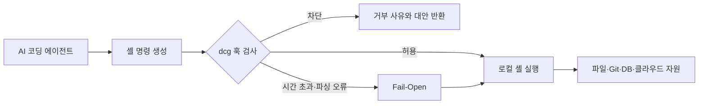

> 한 줄 요약: AI 코딩 에이전트가 `git reset --hard`, `rm -rf` 같은 파괴적 명령을 실행하지 못하게 막는 도구가 빠르게 관심을 모았다. 다만 명령 차단 훅은 마지막 안전망일 뿐, 권한 격리나 백업을 대신하는 보안 경계는 아니다.

## 무슨 일이 있었나

2026년 7월 14일 기준 GitHub Trending에 Destructive Command Guard(dcg)가 올라왔다. 제공된 스냅샷에는 누적 스타 3,706개, 당일 스타 1,290개가 표시됐다.

dcg는 Claude Code, Codex CLI, Gemini CLI, GitHub Copilot CLI, Cursor 등 AI 코딩 에이전트가 셸 명령을 실행하기 전에 개입하는 훅(Hook)이다. 위험한 명령으로 판단하면 실행을 막고 차단 이유와 더 안전한 대안을 반환한다.

대표적인 차단 대상은 다음과 같다.

- 커밋하지 않은 변경을 지울 수 있는 `git reset --hard`
- 디렉터리를 재귀 삭제하는 `rm -rf`
- 디스크를 덮어쓰거나 초기화하는 `dd`, `mkfs`
- 설정으로 활성화할 수 있는 `DROP TABLE`, `kubectl delete namespace`
- Docker 정리, 클라우드 인스턴스 종료, Terraform 파괴 작업

기본 설정에서는 `core.filesystem`과 `core.git`이 항상 활성화된다. 유닉스 계열에서는 `system.disk`도 기본으로 적용된다. 데이터베이스, Kubernetes, Docker, AWS·GCP·Azure 관련 규칙은 대부분 별도의 보안 팩을 켜야 한다.

프로젝트 문서에 따르면 단순한 문자열 검색보다 검사 범위가 넓다. 인라인 스크립트와 히어독(Heredoc)을 검사하고, `grep "rm -rf"`처럼 위험한 문자열을 찾는 경우와 실제 명령으로 실행하는 경우를 구분한다.



저장소에는 Codex CLI 0.125.0 이상을 위한 전용 연동도 명시돼 있다. `~/.codex/hooks.json`에 `PreToolUse` 훅을 병합하고, 차단 결과는 Codex가 처리할 수 있는 최소 JSON 필드만 표준 출력으로 전달한다.

이 내용은 프로젝트 문서에서 확인할 수 있다. 반면 dcg가 실제 사고를 얼마나 줄였는지, 오탐률이 어느 정도인지, GitHub Trending에서 받은 관심이 장기 사용으로 이어질지는 제공된 자료만으로 판단하기 어렵다.

스타 수는 관심이 늘어난 속도를 보여줄 뿐 설치 수나 보호 효과를 뜻하지 않는다. 구체적인 피해 사례도 제시되지 않았으므로 에이전트가 대규모 사고를 반복해서 일으키고 있다고 단정할 근거는 없다.

## 왜 사람들이 반응했나

### AI 코딩 에이전트에 왜 명령 차단이 필요할까?

AI 에이전트는 코드를 제안하는 데서 그치지 않고 저장소를 읽고 테스트를 실행하며 파일과 Git 상태까지 직접 바꾼다. 이런 편리함은 실행 권한에서 나오지만, 잘못된 판단이 실제 변경으로 이어질 가능성도 함께 커진다.

사람이 터미널에서 위험한 명령을 입력할 때는 경로나 현재 브랜치를 다시 확인할 여지가 있다. 에이전트는 계획 수립부터 명령 실행까지 한 흐름으로 처리하므로 잘못된 전제가 수정되지 않은 채 실행 단계까지 넘어갈 수 있다.

결국 문제는 특정 모델의 정확도에만 있지 않다. 복구하기 어려운 명령을 승인 한 번이나 자동 실행 설정에 맡겨도 되는지 따져야 하는 권한 설계 문제다.

### 신뢰 문제: 모델을 믿을까, 실행 경로를 통제할까?

dcg가 여러 에이전트를 지원한다는 점은 논점을 모델별 안전성에서 실행 경로 통제로 옮긴다. Claude와 Codex 중 어느 쪽이 더 조심스러운지 비교하는 대신, 어떤 에이전트를 사용하더라도 파괴적 명령 앞에서는 같은 정책을 적용한다.

이런 방식은 사용자가 규칙을 직접 확인할 수 있다는 장점이 있다. 모델의 판단은 업데이트, 프롬프트, 작업 문맥에 따라 달라지지만 `git reset --hard`를 막는 로컬 규칙은 동작 조건이 비교적 분명하다.

다만 GitHub 스타 증가만으로 사용자들이 어떤 이유로 관심을 보였는지는 알 수 없다. 현재 자료로 확인되는 사실은 파괴적 명령을 별도 계층에서 통제하려는 도구가 짧은 시간에 많은 관심을 받았다는 정도다.

### 사용성 문제: 많이 막을수록 안전해질까?

차단 규칙이 넓어지면 오탐(False Positive)도 늘어난다. 데이터베이스, Kubernetes, 클라우드, 컨테이너 팩이 기본으로 모두 활성화되지 않는 것도 일상적인 작업을 지나치게 방해하지 않으려는 선택으로 보인다.

dcg는 단일 명령에 사용할 수 있는 `DCG_BYPASS=1`, 일회성 허용 코드, 영구 허용 목록을 제공한다. 작업을 이어갈 우회 수단은 필요하지만, 반복해서 사용하다 보면 보호 장치가 쉽게 무시하는 경고창으로 바뀔 수 있다.

에이전트가 우회 환경변수를 사용하거나 설정 파일을 수정할 권한까지 가진 경우에는 보호 장치를 직접 꺼버릴 수도 있다. 보호 대상과 보호 장치가 같은 사용자 권한 아래 있다면 dcg는 강제 격리 장치보다는 실수를 줄이는 가드레일에 가깝다.

### 운영 문제: 차단기가 실패하면 어떻게 될까?

dcg는 시간 초과나 파싱 오류가 발생해도 작업을 막지 않는 페일 오픈(Fail-Open) 방식을 사용한다. 훅 장애로 모든 개발 명령이 중단되는 상황은 피할 수 있지만, 검사기가 처리하지 못한 명령은 그대로 실행될 수 있다.

| 선택 | 얻는 것 | 감수할 위험 |
|---|---|---|
| 페일 오픈 | 개발 흐름과 자동화의 가용성 | 검사 오류 시 위험 명령 통과 |
| 페일 클로즈(Fail-Closed) | 판단 불가 명령의 실행 차단 | 훅 장애가 전체 작업 중단으로 확대 |
| 승인 기반 실행 | 사람이 최종 판단 | 반복 승인으로 인한 피로와 습관적 허용 |
| 격리 환경 실행 | 피해 범위 자체를 제한 | 환경 구성과 데이터 동기화 비용 |

알맞은 방식은 작업 대상에 따라 다르다. 개인 브랜치의 로컬 테스트와 운영 데이터베이스 변경에 같은 실패 정책을 적용하면 오히려 위험할 수 있다.

## 내가 보는 핵심

에이전트는 이미 저장소와 셸에 직접 손댈 수 있는 권한을 받고 있다. 이제는 명령을 얼마나 잘 만드는지만 볼 것이 아니라, 잘못된 명령이 실행될 때 어디까지 영향을 미치는지도 따져야 한다. 실행 전 통제와 실행 후 복구를 따로 설계해야 하는 이유다.

dcg는 알아보기 쉬운 위험 명령을 실행 직전에 잡는다. Git, 파일시스템, 데이터베이스 보호 규칙을 팩으로 나누고 필요한 범위만 적용할 수 있어 구성 방식도 이해하기 쉽다.

하지만 패턴 기반 차단만으로 명령의 최종 효과를 전부 파악할 수는 없다. 직접 입력한 `rm -rf`는 잡더라도 정상적으로 보이는 스크립트 내부에서 파일이 삭제되거나, API 호출로 원격 자원이 제거되는 경우까지 모두 판별한다고 기대하기는 어렵다.

반대로 위험해 보이는 명령이 임시 컨테이너나 테스트 데이터베이스 안에서는 필요한 작업일 수도 있다. 명령 문자열만 봐서는 대상 자원의 가치와 복구 가능성, 현재 실행 환경을 모두 알 수 없다.

따라서 안전장치는 여러 단계로 나누는 편이 낫다.

- 1차: 에이전트에 필요한 디렉터리와 명령만 허용
- 2차: dcg 같은 훅으로 명백한 파괴 명령 차단
- 3차: 컨테이너, 가상 머신, 별도 워크트리로 실행 환경 격리
- 4차: Git 커밋, 스냅샷, 데이터베이스 백업으로 복구 경로 확보
- 5차: 운영·클라우드 변경에는 별도 자격 증명과 사람 승인 적용

실무에서는 차단 규칙의 개수보다 복구 가능 여부가 더 분명한 기준이 된다. 위험한 명령이 차단을 빠져나가도 작업물이 남아 있다면 복구할 수 있다. 백업이 없다면 완벽할 수 없는 훅 하나에 모든 안전을 의존하게 된다.

설치 방식도 같은 기준으로 살펴봐야 한다. 저장소의 빠른 설치 예시는 원격 `install.sh`를 내려받아 곧바로 셸에 전달한다.

```bash
curl -fsSL "https://raw.githubusercontent.com/Dicklesworthstone/destructive_command_guard/main/install.sh?$(date +%s)" \
  | bash -s -- --easy-mode
```

이 방식은 보호 도구를 설치하는 과정에서도 공급망 위험을 만든다. 제공된 설명에는 네이티브 Windows 설치기가 SHA-256 체크섬을 확인하고, `cosign`이 있으면 Sigstore 서명도 검증한다고 적혀 있다. 하지만 유닉스 설치 예시에 대한 검증 절차는 본문에서 확인되지 않는다.

조직에서 배포할 때는 태그나 버전을 고정하고 설치 스크립트와 릴리스 검증 방식을 먼저 확인하는 편이 안전하다. 안전 도구라고 해서 설치 경로까지 저절로 안전해지는 것은 아니다.

## 앞으로 볼 기준

### dcg를 도입하기 전에 무엇을 확인해야 할까?

- 실제 보호 범위가 기본 팩인지 추가 팩인지 구분한다.
- 에이전트가 훅 설정과 허용 목록을 수정할 수 있는지 확인한다.
- 시간 초과와 파싱 실패가 페일 오픈으로 처리된다는 점을 받아들일 수 있는지 판단한다.
- `DCG_BYPASS=1` 사용 기록을 남기거나 검토할 방법이 있는지 본다.
- CI의 스캔 모드와 로컬 실행 차단을 서로 다른 통제로 이해한다.
- 위험 명령이 통과했을 때 Git, 파일, 데이터베이스, 클라우드 자원을 복구할 수 있는지 시험한다.
- 설치 파일의 버전 고정, 체크섬, 서명 검증 절차를 확인한다.
- 오탐이 반복될 때 전체 비활성화 대신 규칙 단위로 조정할 운영자를 정한다.

### 다음 AI 에이전트 안전 뉴스를 볼 때의 판단 기준

새 도구가 막는 위험 명령의 개수만 봐서는 실제 안전 수준을 판단하기 어렵다. 기본으로 차단하는 범위, 검사 실패 시 동작 방식, 에이전트의 우회 수단 접근 권한, 차단 실패 후 복구 가능 여부를 함께 봐야 한다.

dcg가 다루는 문제는 AI를 믿을 수 있는지에 대한 찬반이 아니다. 실수할 수 있는 작업자에게 실행 권한을 어디까지 주고, 한 번의 잘못된 명령이 전체 작업을 지우지 않도록 경계를 어떻게 나눌지에 관한 문제다.

`git reset --hard`를 막는 것만으로는 부족하다. 차단을 우회하거나 검사에서 놓친 명령이 실행돼도 복구할 수 있어야 한다.

## 참고 자료

- [선정 글감] [Dicklesworthstone/destructive_command_guard — GitHub](https://github.com/Dicklesworthstone/destructive_command_guard)