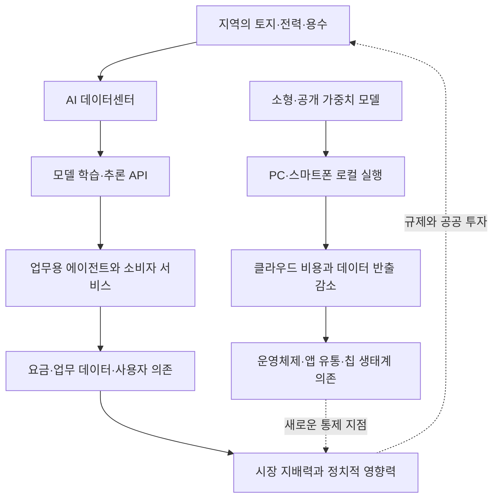

> 한 줄 요약: AI 데이터센터 반대는 전기·토지·환경 비용을 드러내는 데 유효하다. 다만 컴퓨팅이 스마트폰으로 이동하더라도 모델, 유통망, 과금 체계, 정치적 영향력까지 분산되는 것은 아니다.

## 무슨 일이 있었나

2026년 7월 13일, 보안 연구자 브루스 슈나이어와 데이터 과학자 네이선 E. 샌더스는 미국의 AI 데이터센터 반대 운동이 더 큰 위험을 가릴 수 있다는 글을 공개했다. 지역사회가 토지와 전력망, 환경 부담을 떠안는 데 비해 데이터센터가 만드는 일자리는 많지 않다는 문제의식에서 출발한 글이다.

미국에서 이 문제는 특정 정당의 노선만으로 설명되지 않는다. 주택이 부족한 지역에 데이터센터용 대규모 부지가 배정되고, 전력망 부담과 환경 비용은 주민에게 남지만 개발 수익은 기술기업과 투자자에게 집중된다는 불만이 서로 다른 정치 성향의 주민을 묶고 있다는 게 두 저자의 진단이다.

갈등이 뚜렷하게 나타난 사례는 미시간주 세일라인 타운십이다. 인구 약 3,000명의 지방정부가 OpenAI·Oracle 관련 데이터센터 계획을 거부했지만, 개발사와 소송을 벌인 뒤 합의가 이뤄져 공사가 진행되고 있다고 글은 전한다. 반면 자금과 인허가 준비가 덜 된 초기 제안은 주민 반대로 취소되기 쉽다.

이 차이는 데이터센터 반대 운동이 부딪히는 한계를 보여준다. 주민이 활용할 수 있는 수단은 공청회와 인허가 절차지만, 기업은 일부 후보지를 포기한 뒤 자본과 법무 인력을 성공 가능성이 높은 지역에 집중할 수 있다.

### 확인된 사실과 아직 검증이 필요한 주장

자료가 확인한 사실과 저자의 해석을 구분해서 읽을 필요가 있다.

| 구분 | 내용 | 읽을 때 주의할 점 |
|---|---|---|
| 사건 | 미국 여러 지역에서 AI 데이터센터 건설을 둘러싼 토지·전력·환경 갈등이 발생했다 | 지역마다 전력계약, 세제 혜택, 고용 조건이 다르다 |
| 사례 | 세일라인 타운십의 거부 이후 소송과 합의를 거쳐 사업이 진행됐다 | 합의문과 최종 인허가 조건을 함께 봐야 주민 부담을 판단할 수 있다 |
| 저자 제시 수치 | 미국 기업이 올해 데이터센터 인프라에 지출하는 금액을 약 7,500억 달러로 제시했다 | 글에 인용된 규모이며 개별 기업의 실제 집행액과는 구분해야 한다 |
| 전망 | 소형 모델과 온디바이스 AI가 확산되면 중앙 데이터센터 수요가 줄 수 있다 | 가능성이지 확정된 수요 전망은 아니다 |
| 정치적 해석 | 기업들이 데이터센터와 초지능 안전 논쟁을 전면에 세워 부와 권력의 집중을 가린다는 주장이다 | 기업의 의도를 입증한 사실이라기보다 저자들의 정치적 해석에 가깝다 |

사건과 저자의 해석을 한데 묶으면 논점을 구분하기 어려워진다. 데이터센터가 지역에 미치는 비용은 개별 사업의 계약과 인허가 자료로 검증해야 한다. 산업 지배력 문제는 시장 구조와 정책 자금의 흐름을 별도로 살펴봐야 한다.

## 왜 사람들이 반응했나

### AI 데이터센터는 왜 지역사회의 반발을 사나

주민이 먼저 마주하는 것은 추상적인 인공지능 위험이 아니다. 어느 부지를 내줄지, 신규 전력 수요가 요금과 송전 설비에 어떤 영향을 줄지, 세금 감면에 비해 고용이 얼마나 생길지가 당장의 문제다.

거래 조건도 대등하지 않다. 데이터센터 사업자는 여러 후보지를 비교할 수 있지만, 주민은 자신이 사는 지역의 전력망과 토지를 다른 곳으로 옮길 수 없다. 기업은 사업을 철회할 수 있지만 건설 이후 발생하는 소음과 용수 사용, 송전 설비 문제는 지역에 남는다.

따라서 이런 반발을 기술 혐오로만 설명하기는 어렵다. 주민이 요구하는 것은 AI 성능에 관한 설명이 아니라 비용을 누가 부담하는지, 계약을 누가 검증하는지, 문제가 생겼을 때 책임을 누가 지는지에 대한 답이다.

### 데이터센터가 줄면 AI 권력도 분산될까

한편 Reddit의 LocalLLaMA 커뮤니티에는 PrismML이 270억 파라미터 규모의 Qwen 계열 모델을 iPhone 17 Pro에서 실행할 수 있도록 압축했다는 주장이 올라왔다. 공개 당시 게시물은 출시 예고와 회사 측 설명을 옮긴 수준이었다. 실제 배포 파일과 메모리 사용량, 실행 속도, 배터리 소모가 확인되기 전에는 성능을 단정하기 어렵다.

이 게시물이 관심을 받은 이유는 이해하기 어렵지 않다. 실용적인 수준의 모델을 개인 기기에서 실행할 수 있다면 프롬프트와 문서를 외부 API로 보내지 않아도 된다. 호출당 과금과 네트워크 장애의 영향도 줄일 수 있다. 데이터센터 인허가에 머물던 논의를 사용자의 데이터 통제권으로 넓혀 볼 수 있는 사례다.

하지만 온디바이스 AI(On-device AI)가 곧 권력 분산을 뜻하는 것은 아니다. 모델 가중치가 공개되더라도 다음 요소는 특정 사업자에게 집중될 수 있다.

- 모델을 내려받는 앱스토어와 배포 채널
- 단말 운영체제와 가속기 접근 권한
- 모델 라이선스와 상업적 이용 조건
- 업데이트·안전 필터·서명 검증 체계
- 클라우드 기능과 로컬 기능을 나누는 제품 정책

추론 작업이 스마트폰으로 옮겨가더라도 통제면(Control Plane)은 플랫폼 회사에 남을 수 있다. 데이터센터 수만 확인해서는 이런 구조를 파악하기 어렵다.

### 왜 AI 토큰 비용 논쟁까지 연결되나

Computerphile이 다룬 에이전트형 AI의 토큰 소비 문제도 이 구조와 관련이 있다. 사용자가 보기에는 간단한 코딩 요청이어도 에이전트는 파일을 탐색하고 이전 대화를 다시 입력한다. 도구 실행 결과를 검토한 뒤 수정과 재시도도 반복한다. 화면에 표시되는 최종 답변보다 많은 토큰과 연산이 뒤에서 소비될 수 있다.

이 비용 구조는 실제 도입 과정에서 다음 문제로 이어진다.

- 사용자는 월정액 서비스로 생각했지만 사용량 제한이나 추가 과금을 마주할 수 있다.
- 조직은 업무를 자동화하고도 모델 호출량과 데이터 반출 범위를 파악하기 어려울 수 있다.
- 공급자가 연산 비용을 이유로 가격과 제한을 바꾸더라도 고객은 기존 워크플로 때문에 다른 서비스로 쉽게 옮기지 못할 수 있다.

에이전트가 사용하는 연산 자원은 데이터센터에서 제공된다. 그러나 데이터센터의 위치보다 더 직접적인 종속 문제는 사용량을 누가 측정하고 가격을 정하는지, 다른 모델로 옮기는 비용을 누가 통제하는지에 있다.

## 내가 보는 핵심

이번 논쟁에서 따져볼 문제는 데이터센터 건설의 찬반만이 아니다. AI를 운영하는 비용과 결정권이 어떤 계층에 집중되는지도 함께 봐야 한다.

이 흐름에서 데이터센터는 가장 눈에 잘 띄는 물리 계층이다. 주민은 공사 부지를 볼 수 있고 지방정부는 인허가를 심사할 수 있다. 반면 API 가격과 모델 전환 비용, 학습 데이터 계약, 앱 유통 정책, 정치자금은 여러 영역에 흩어져 있어 하나의 갈등 사안으로 다루기 어렵다.

이런 가시성 차이 때문에 논쟁이 개별 건설 계획에만 머물 수 있다. 그사이 기업이 의료·교육·법률·소프트웨어 개발의 업무 흐름을 차지하면 서비스 계약과 데이터 형식이 새로운 진입장벽이 될 수 있다.

그렇다고 데이터센터 반대를 잘못된 운동이라고 볼 이유는 없다. 지역 자원의 사용료를 제대로 산정하고 외부효과를 공개하도록 요구하는 일은 필요하다. 다만 성과를 착공 취소 건수로만 평가하면 기업이 다른 지역이나 연산 방식으로 옮겼을 때 문제가 해결됐다고 오해할 수 있다.

현업에서는 이 문제를 클라우드와 로컬 가운데 하나를 선택하는 문제로 단순화하기 쉽다. 실제로는 위험 항목별로 판단해야 한다.

| 위험 | 클라우드 중심 AI | 로컬·온디바이스 AI |
|---|---|---|
| 데이터 노출 | 외부 전송과 보관 정책 확인 필요 | 단말 탈취와 로컬 로그 보호 필요 |
| 비용 | 토큰·도구 호출·재시도에 따라 변동 | 단말 구매, 배포, 최적화 비용 발생 |
| 장애 | 네트워크와 공급자 API에 의존 | 기기 성능과 모델 호환성에 의존 |
| 통제권 | 가격·모델 종료·사용정책 변경 위험 | OS·칩·앱 유통 정책 변경 위험 |
| 전환성 | 독점 API와 에이전트 규격이 장벽 | 모델 형식과 하드웨어별 최적화가 장벽 |

클라우드와 로컬 가운데 어느 쪽을 택하더라도 공공성이 저절로 확보되지는 않는다. 컴퓨팅 자원의 분산과 권력의 분산은 별개의 문제다.

## 앞으로 볼 기준

### 다음 AI 데이터센터 뉴스에서 무엇을 확인해야 할까

첫째, 지역사회가 받는 대가를 총투자액이 아니라 계약 조건으로 확인해야 한다. 예상 고용 인원과 세금 감면 기간, 전력 증설 비용의 부담 주체, 용수 사용량, 폐쇄 후 원상복구 책임이 공개돼 있는지 살펴볼 필요가 있다.

둘째, 비용이 누구에게 넘어가는지 확인해야 한다. 사업자가 전력 확보 비용을 부담하는지, 그 비용이 일반 가정과 소상공인의 요금에 섞이는지에 따라 평가는 달라진다. 재생에너지 조달 역시 신규 발전을 늘리는 방식인지, 기존 물량의 명목만 바꾸는 방식인지 구분해야 한다.

셋째, 데이터센터 밖의 잠금 효과(Lock-in)를 살펴봐야 한다. 모델을 교체할 수 있는지, 대화와 벡터 데이터를 표준 형식으로 내보낼 수 있는지, 에이전트가 사용한 토큰과 도구 호출 내역을 감사할 수 있는지가 실무적인 판단 기준이다.

넷째, 온디바이스 AI 발표는 시연 영상보다 재현 조건을 확인해야 한다.

- 실제 공개된 모델과 라이선스가 있는가
- 양자화(Quantization) 이후 품질을 어떤 평가셋으로 측정했는가
- 메모리 점유량, 초당 토큰 수, 배터리 소모가 공개됐는가
- 완전한 로컬 실행인지 일부 요청을 서버로 보내는가
- 단말 제조사 밖에서도 같은 결과를 재현할 수 있는가

다섯째, AI 규제 논쟁에 자금을 대는 주체도 확인해야 한다. 안전을 강조하는 주장과 규제 완화를 요구하는 주장이 겉으로 충돌하더라도, 결과적으로 대형 사업자만 감당할 수 있는 제도를 만들 수 있다. 규제 강도만 볼 것이 아니라 신규 사업자와 공개 모델 개발자, 공공 연구기관도 해당 규칙을 감당할 수 있는지 따져봐야 한다.

AI 데이터센터가 계속 늘어날 수도 있고, 소형 모델이 예상보다 빠르게 일부 수요를 대체할 수도 있다. 어느 쪽이 현실이 되더라도 확인할 항목은 같다. 연산 장소가 바뀌었는지가 아니라 가격 결정권과 데이터 이동권, 모델 선택권, 정책 영향력이 실제로 분산됐는지를 봐야 한다.

개별 공사를 막는 데 논의가 그치면 기업은 서버를 다른 지역으로 옮길 수 있다. 데이터센터 사업을 평가할 때는 지역 자원 계약과 토큰 과금 체계, 모델 이동성, 정치자금의 흐름까지 함께 확인해야 한다.

## 참고 자료

- [선정 글감] [AI Data Centers and the Concentration of Wealth](https://www.schneier.com/blog/archives/2026/07/ai-data-centers-and-the-concentration-of-wealth.html) — Schneier on Security
- [관련] [Compressed Version of Qwen-3.6-27B coming from PrismML](https://www.reddit.com/r/LocalLLaMA/comments/1uv54fv/compressed_version_of_qwen3627b_coming_from/) — Reddit LocalLLaMA
- [관련] [Why AI Tokens are so Expensive](https://www.youtube.com/watch?v=-0HRzXk8vlk) — Computerphile