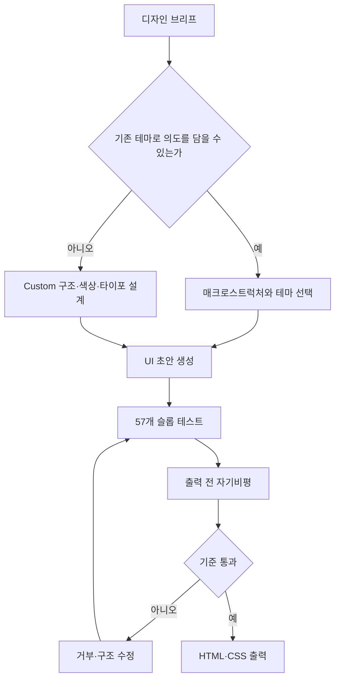

> 한 줄 요약: Hallmark의 Anti-AI-slop 접근이 AI 디자인의 창의성을 보장하는 것은 아니다. 생성 결과에서 반복되는 구조를 찾아내고, 기준에 맞지 않으면 거부하는 품질 검수 단계를 워크플로에 넣었다는 데 의미가 있다.

## 무슨 일이 있었나

AI로 만든 웹페이지도 이제 제법 그럴듯하다. 하지만 서로 다른 서비스의 랜딩 페이지를 요청해도 둥근 카드, 보라색 그라데이션, 과장된 히어로 문구 같은 익숙한 요소가 반복되곤 한다.

이런 결과를 흔히 AI 슬롭(AI slop)이라고 부른다. 단순히 못생긴 디자인을 뜻하지는 않는다. 적은 비용으로 빠르게 만들었지만 개성과 맥락이 부족해 누가 어떤 목적으로 만들었는지 드러나지 않는 결과물에 가깝다.

Hallmark는 이 문제를 다루는 오픈소스 프로젝트다. 저장소 설명에 따르면 Claude Code, Cursor, Codex에서 사용할 수 있는 디자인 스킬로, 전형적인 AI 생성물처럼 보이는 결과를 걸러내는 것이 목표다.

2026년 7월 15일 제공된 GitHub Trending 스냅샷에서 Hallmark는 별 5,852개를 기록했으며, 이 가운데 1,010개가 당일 증가분으로 표시됐다. 계속 변하는 수치이지만, 짧은 기간에 개발자들의 관심을 받은 것은 확인할 수 있다. 별의 수만으로 실제 도입률이나 결과물의 품질까지 판단할 수는 없다.

Hallmark는 프롬프트에 ‘예쁘게 만들어 달라’는 문장을 덧붙이는 방식과 다르다. 작업 요청에 맞는 전체 페이지 구조인 매크로스트럭처(Macrostructure)를 선택하고, 20개 테마 중 하나를 적용한 다음 57개 슬롭 테스트와 출력 전 자기비평을 수행한다.

기본 동작은 네 가지다.

| 명령 | 역할 | 결과 변경 여부 |
|---|---|---|
| `Build` | 새 UI를 만들고 슬롭 테스트를 수행 | 변경함 |
| `hallmark audit <target>` | 기존 코드를 안티패턴 기준으로 평가 | 변경하지 않음 |
| `hallmark redesign <target>` | 콘텐츠·정보구조·브랜드를 유지하며 전체 구조를 재설계 | 변경함 |
| `hallmark study <screenshot \| URL>` | 참고 디자인의 구조·글꼴 조합·색상 기준을 추출 | 분석 중심 |

정해진 테마로 요청의 의도를 표현하기 어렵다면 Custom 경로를 사용한다. 이 경우에도 같은 57개 게이트를 거친다. 기존 테마에서 색상만 바꾸는 대신 팔레트, 타이포그래피, 레이아웃을 새로 구성한다는 것이 저장소의 설명이다.

여기까지는 저장소에 명시된 내용이다. Hallmark가 모든 종류의 웹사이트에서 AI 특유의 인상을 제거하는지, 57개 검사가 인간 디자이너의 평가와 얼마나 일치하는지는 제공된 자료만으로 확인하기 어렵다. 서로 다른 결과를 보여주는 데모도 디자인의 다양성을 보여주는 사례일 뿐, 사용성이나 전환율을 입증하는 실험은 아니다.

## 왜 사람들이 반응했나

### Hallmark는 왜 빠르게 GitHub Trending에 올랐을까?

이 프로젝트가 다루는 문제는 생성 능력의 부족이 아니다. 코드를 쉽게 만들 수 있게 되면서 결과물이 획일화된다는 점이다.

Claude Code나 Codex에 랜딩 페이지를 요청하면 HTML과 CSS를 만드는 일 자체는 어렵지 않다. 그러나 요구사항이 모호할수록 모델은 학습 데이터에서 자주 등장한 무난한 조합을 선택한다. 실패할 가능성이 낮은 선택이 반복되면서 결과도 비슷해진다.

Hallmark는 이를 모델의 창의성 문제로만 보지 않는다. 출력 직전에 안티패턴을 검사하고, 기준을 통과하지 못하면 결과를 거부하도록 작업 절차를 구성한다. 프롬프트를 계속 다듬기보다 반복해서 적용할 수 있는 검수 절차를 둔 것이다.

이 구조에서는 모델의 미적 판단보다 사람이 정한 거부 기준이 더 중요한 역할을 한다. 현업에서도 초안을 빠르게 만드는 것보다 무엇을 문제로 볼지 정하고 그 기준을 팀에서 공유하는 일이 더 까다롭다.

반응을 나눠 보면 다음과 같다.

- 신뢰: 모델의 미적 판단을 그대로 받아들이지 않고 별도의 검사 단계를 둔다.
- 권한: `audit`는 문제를 보고하지만 코드를 직접 수정하지 않는다. 분석과 변경 권한을 구분할 수 있다.
- 비용: 초안은 빠르게 만들 수 있지만, 57개 검사와 재생성 과정에서 토큰과 작업 시간이 늘어날 수 있다.
- 사용성: 설치가 간단하더라도 제대로 활용하려면 구체적인 브리프와 브랜드 자료, 정보구조(Information Architecture)가 필요하다.

AI가 만든 것처럼 보이지 않는 디자인과 좋은 디자인은 같은 말이 아니다.

익숙한 그라데이션을 피하고 비대칭 레이아웃을 사용하면 다른 인상을 줄 수는 있다. 그렇다고 정보 탐색이 쉬워지거나 접근성이 개선되고, 실제 사용자의 행동을 더 잘 지원한다는 보장은 없다.

## 내가 보는 핵심

### Anti-AI-slop 규칙이 또 다른 템플릿이 되지는 않을까?

Hallmark에서 주목할 부분은 20개 테마나 데모 화면보다 생성 과정에 거부 기준을 넣었다는 점이다.

반대로 따져볼 문제도 있다. 특정 시점에 자주 보이는 AI 안티패턴을 57개 규칙으로 정의하면, 그 규칙을 피하는 방식이 새로운 유행으로 굳을 수 있다. 둥근 카드와 보라색 그라데이션 대신 거친 타이포그래피, 과감한 그리드, 인쇄물을 닮은 구성이 계속 등장한다면 반복되는 디자인의 종류만 바뀐 것이다.

Hallmark는 브리프에 따라 다른 형태를 만들고, 카탈로그에 맞지 않는 요청은 Custom으로 처리한다고 설명한다. 단순히 색상만 바꾸는 템플릿보다는 선택의 폭이 넓다. 그래도 결과의 다양성이 테마 개수에서 나오는지, 구조 선택의 폭이나 브리프 해석에서 나오는지는 따로 확인해야 한다.

57이라는 숫자 자체를 품질 지표로 볼 수도 없다. 검사 항목이 많더라도 다음 질문에 답하지 못하면 실제 작업 기준으로 쓰기 어렵다.

- 어떤 규칙에 걸렸는지 사람이 확인할 수 있는가?
- 규칙별 실패가 디자인 목적과 연결되는가?
- 접근성, 성능, 반응형 동작도 검사하는가?
- 브랜드가 의도적으로 사용하는 패턴을 예외 처리할 수 있는가?
- 규칙이 바뀌었을 때 기존 결과를 다시 평가할 수 있는가?

이런 점에서 `hallmark audit`가 코드를 수정하지 않고 펀치 리스트(Punch List)만 제공하는 방식은 실무에 적용하기 좋다. 에이전트가 진단과 수정을 한꺼번에 수행하면 무엇이 문제였고 왜 바뀌었는지 추적하기 어렵다. 감사와 변경을 분리하면 사람이 수정 범위와 비용을 먼저 판단할 수 있다.

`hallmark study`에는 별도의 주의가 필요하다. 참고 사이트에서 디자인의 DNA를 추출하되 픽셀 단위 복제와 유료 템플릿 복제를 거부한다고 설명하지만, 실제로 사용할 때는 저작권과 브랜드 혼동 가능성을 따로 검토해야 한다.

디자인의 구조와 색상 기준을 분석하는 것, 특정 사이트의 표현을 모방하는 것, 경쟁사의 인상을 재현하는 것은 각각 경계가 다르다. 도구가 복제를 거부한다고 명시했더라도 입력 자료와 산출물에 관한 권리 문제가 자동으로 해결되는 것은 아니다.

## 앞으로 볼 기준

### AI 디자인 스킬을 도입하기 전에 무엇을 확인해야 할까?

Hallmark를 곧바로 기본 생성기로 지정하기보다는 `audit`부터 시험해 볼 수 있다. 기존 페이지 몇 개를 평가한 뒤, 팀이 문제라고 보는 항목과 도구의 판단이 얼마나 일치하는지 확인하는 방식이다.

도입 여부를 판단할 때는 다음 항목을 확인할 필요가 있다.

| 확인할 항목 | 확인해야 하는 이유 |
|---|---|
| 규칙의 공개 범위 | 실패 원인과 수정 근거를 설명할 수 있어야 한다 |
| 브리프 민감도 | 비슷한 입력에서 테마만 바뀌는지 구조까지 달라지는지 확인해야 한다 |
| 거짓 양성(False Positive) | 의도적인 브랜드 표현을 슬롭으로 잘못 막을 수 있다 |
| 접근성 검사 | 독창성과 별개로 키보드 탐색, 명도 대비, 의미 구조가 필요하다 |
| 성능 영향 | 글꼴·이미지·효과 증가가 로딩 비용으로 이어질 수 있다 |
| 재현 가능성 | 모델과 규칙 버전이 바뀌어도 변경 이유를 추적할 수 있어야 한다 |
| 권리 검토 | 스크린샷·URL 학습과 산출물 유사성의 경계를 확인해야 한다 |
| 인간 승인 지점 | 생성, 감사, 재설계 중 어디서 사람이 결정할지 정해야 한다 |

시각적인 차이만 검수해서는 충분하지 않다. 화면은 독특해졌지만 핵심 버튼을 찾기 어려울 수 있고, 브랜드보다 도구가 정한 스타일이 더 강하게 드러날 수도 있다. 모바일 화면이나 저사양 환경에서 시각 효과가 제대로 작동하는지도 따로 확인해야 한다.

Hallmark의 인기를 사람들이 더 화려한 AI 디자인을 원한다는 뜻으로만 해석하기는 어렵다. 생성 결과가 많아질수록 무엇을 만들 수 있는지보다 어떤 결과를 통과시키지 않을지가 제품 품질에 영향을 준다는 문제의식에 가깝다.

Anti-AI-slop 도구를 평가할 때는 데모가 얼마나 낯설게 보이는지만 확인해서는 부족하다. 거부 기준을 누가 정했는지, 실패 이유를 확인할 수 있는지, 팀의 사용자·브랜드·운영 조건에 맞게 규칙을 조정할 수 있는지를 봐야 한다. AI 특유의 표현을 없앤 뒤 어떤 디자인 판단을 적용할 것인지는 결국 사용하는 팀이 정해야 한다.

## 참고 자료

- [선정 글감] [Nutlope/hallmark — Anti-AI-slop design skill for Claude Code, Cursor, and Codex](https://github.com/Nutlope/hallmark) — GitHub Trending