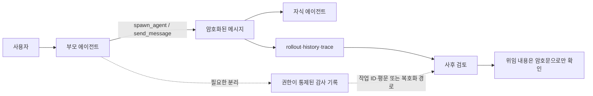

> 한 줄 요약: Codex 서브에이전트 프롬프트 암호화는 전달 내용을 가렸지만, 사용자가 나중에 위임 내용을 확인할 감사 기록도 함께 가렸다. 암호화와 관찰 가능성(Observability)은 둘 중 하나를 고를 문제가 아니다. 권한과 보존 정책을 따로 설계해야 한다.

## 무슨 일이 있었나

내가 실행한 에이전트가 다른 에이전트에게 무슨 일을 시켰는지 정작 나는 읽을 수 없다. 2026년 6월 Codex의 MultiAgentV2 메시지 암호화 변경을 두고 제기된 문제다.

OpenAI Codex 저장소의 PR `#26210`은 2026년 6월 5일 병합됐다. 이 변경은 `spawn_agent`, `send_message`, `followup_task`로 전달되는 메시지를 암호화된 페이로드로 취급한다.

6월 13일 등록된 이슈 `#28058`은 이 변경이 적용되고 MultiAgentV2가 활성화된 환경에서 사람이 읽을 수 있는 위임 기록이 사라졌다고 지적한다. 제보자가 확인한 범위는 upstream main과 해당 변경을 포함한 post-0.137.0 계열이다. 구독 유형이나 모델, 운영체제에 따른 문제는 아니라고 설명했다.

### Codex 서브에이전트 프롬프트 암호화는 무엇을 바꿨나?

이슈에 인용된 코드를 보면 `InterAgentCommunication::new_encrypted()`는 평문을 담는 `content`를 빈 문자열로 초기화한다. 실제 페이로드는 `encrypted_content`에만 저장한다.

```rust
pub fn new_encrypted(
    author: AgentPath,
    recipient: AgentPath,
    other_recipients: Vec<AgentPath>,
    encrypted_content: String,
    trigger_turn: bool,
) -> Self {
    Self {
        id: None,
        author,
        recipient,
        other_recipients,
        content: String::new(),
        encrypted_content: Some(encrypted_content),
        internal_chat_message_metadata_passthrough: None,
        trigger_turn,
    }
}
```

수신 측 기록을 만드는 `to_model_input_item()`도 `encrypted_content`가 있으면 암호문을 선택한다. 이후 이 항목이 대화 이력과 rollout에 저장되기 때문에, 나중에 사람이 확인하는 기록에도 읽을 수 있는 작업 지시가 남지 않는다.



여기까지는 공개된 코드와 이슈에서 확인할 수 있는 내용이다. 암호화가 어떤 위협을 막기 위한 것인지, 평문 제거가 의도된 제품 정책인지 구현 과정에서 생긴 부작용인지는 이 자료만으로 판단하기 어렵다.

모든 Codex 실행에서 같은 문제가 발생한다고 단정할 수도 없다. MultiAgentV2가 활성화돼 있고 해당 변경이 포함된 버전을 사용한다는 조건이 붙는다.

## 왜 사람들이 반응했나

이 글감은 수집 당시 Hacker News에서 264포인트와 160개 댓글을 기록했다. 이 숫자만으로 의견의 방향이나 합의를 판단할 수는 없다. 다만 단순한 표시 오류를 넘어 운영과 보안의 문제로 관심을 받았다는 점은 확인할 수 있다.

논란의 초점은 암호화 자체보다 통제권이 뒤집혔다는 데 있다. 사용자는 에이전트에게 업무를 맡겼지만, 그 에이전트가 다시 넘긴 지시는 사후에 검토할 수 없게 됐다.

### 암호화했는데 왜 더 불안할까?

암호화는 보통 신뢰를 높이는 기능으로 소개된다. 하지만 에이전트 시스템에서는 암호화로 인해 누가 무엇을 볼 수 없게 됐는지도 따져봐야 한다.

서브에이전트는 부모가 전달한 작업을 바탕으로 파일을 읽고 도구를 호출해 결과를 만든다. 원래 지시가 기록에 남지 않으면 사용자는 다음 내용을 확인하기 어렵다.

- 왜 이 자식 스레드가 생성됐는가
- 어떤 범위의 작업이 위임됐는가
- 예상하지 못한 도구 호출이 원래 지시에서 비롯됐는가
- 오류가 부모의 지시, 전달 과정, 자식의 해석 중 어디서 발생했는가
- 사고 조사나 비용 분석에서 해당 실행을 어떻게 재구성할 것인가

권한이 큰 도구를 사용하는 에이전트라면 이는 디버깅의 불편만으로 끝나지 않는다. 위임 메시지는 해당 실행이 시작된 근거이며, 부모와 자식 에이전트의 책임 범위를 확인할 수 있는 기록이기도 하다.

### 평문 감사 로그를 남기면 해결될까?

이슈 작성자는 암호화된 전달 필드와 별도로 사람이 읽을 수 있는 감사 필드를 저장하는 방안을 제안한다. 디버깅에는 직접적인 해법이지만, 보안 측면에서는 다른 문제가 생긴다.

서브에이전트 메시지에는 소스 코드나 고객 데이터, 내부 URL, 접근 토큰, 운영 지시가 섞일 수 있다. 전달 경로에서는 암호화하면서 같은 내용을 평문 로그로 장기간 보관한다면 보호 효과가 줄어든다.

따라서 암호화와 로그 중 하나를 선택하는 문제로 볼 수 없다. 누가 어떤 조건에서 내용을 복호화하거나 열람할 수 있는지, 얼마나 오래 보관할지, 어떤 민감정보를 제거할지를 함께 정해야 한다.

| 관점 | 암호문만 저장 | 평문 감사 사본 저장 |
|---|---|---|
| 기밀성 | 노출 면적이 작다 | 로그 접근자가 내용을 볼 수 있다 |
| 디버깅 | 위임 원인을 재구성하기 어렵다 | 작업 흐름을 빠르게 추적할 수 있다 |
| 사고 대응 | 행위와 지시의 연결이 끊길 수 있다 | 조사 근거가 남지만 유출 대상도 늘어난다 |
| 규제 대응 | 최소 수집에 유리할 수 있다 | 추적성에는 유리하지만 보존 근거가 필요하다 |
| 운영 비용 | 복호화·분석 도구가 필요하다 | 마스킹·권한 관리·삭제 정책이 필요하다 |

논란이 생긴 지점도 여기에 있다. 보안을 강화한다는 이유로 사용자가 자기 자동화의 행동 근거를 읽을 수 없게 되면, 기밀성은 높아져도 검증 가능성은 낮아진다.

## 내가 보는 핵심

이번 이슈는 프롬프트를 공개할 것인지보다 위임 증거를 누가 보유하고 열람할 수 있는지에 관한 문제다.

멀티에이전트 시스템에서 자식의 최종 답변만 보존해서는 실행 과정을 설명하기 어렵다. 부모가 어떤 목적과 제한을 전달했는지가 빠지면 결과와 원인을 연결할 근거가 사라진다.

현업에서는 로그를 많이 남기는 것과 관찰 가능성을 혼동하기 쉽다. 원문을 제한 없이 저장한다고 좋은 감사 기록이 되는 것은 아니다. 암호문과 타임스탬프만 남긴다고 책임 있는 기록이 되는 것도 아니다.

기록은 목적에 따라 나눌 필요가 있다.

- 전달 데이터: 수신 에이전트가 작업을 수행하는 데 필요한 원문
- 감사 데이터: 누가 누구에게 어떤 작업을 위임했는지 확인하는 기록
- 운영 데이터: 지연 시간, 토큰, 오류, 재시도 같은 상태 정보
- 보안 데이터: 열람·복호화·권한 변경 이력

감사 데이터에 전체 평문을 반드시 넣어야 하는 것은 아니다. 작업 유형과 정책 버전, 부모·자식 ID, 도구 권한, 메시지 해시(Hash), 민감정보를 제거한 요약을 기본으로 남길 수 있다. 원문은 별도의 암호화 저장소에 보관하고 필요한 경우에만 제한적으로 복호화하는 방식도 가능하다.

물론 자동 생성한 요약만 보존하면 원문의 내용과 다르게 기록될 수 있다. 해시는 위변조 여부를 확인하는 데는 도움이 되지만 메시지의 내용을 설명하지 못한다. 선택적 복호화는 열람을 통제하기 쉬운 대신 키 관리와 장애 대응이 복잡해진다.

방식마다 운영 비용과 한계가 있다. 제품은 암호화 적용 여부와 함께 감사 수준, 열람 권한, 실패했을 때의 동작도 사용자에게 알려야 한다.

## 앞으로 볼 기준

비슷한 AI 에이전트 보안 뉴스를 볼 때는 ‘암호화 지원’이라는 문구만 확인해서는 부족하다. 실제 제품의 신뢰 경계를 파악하려면 다음 내용을 살펴봐야 한다.

- 메시지는 전송 중, 저장 중, 모델 입력 중 어느 구간에서 암호화되는가
- 부모·자식 에이전트와 로컬 사용자 중 누가 내용을 읽을 수 있는가
- 위임 목적, 권한 범위, 발신자와 수신자 ID가 별도로 남는가
- 원문 열람에는 인증과 접근 통제가 적용되는가
- 누가 언제 감사 기록을 열람했는지 다시 감사할 수 있는가
- 비밀값과 개인정보를 자동으로 마스킹하거나 저장하지 않을 수 있는가
- 보존 기간과 삭제 정책을 프로젝트별로 설정할 수 있는가
- 암호화나 복호화가 실패했을 때 작업이 중단되는가, 기록 없이 계속되는가
- 조직이 자체 키를 관리하거나 감사 데이터를 외부 시스템으로 내보낼 수 있는가

Codex에서 앞으로 확인할 부분도 분명하다. 이 문제가 버그로 처리되는지, 의도된 보안 정책으로 설명되는지 살펴봐야 한다. 평문 사본 대신 권한 기반 복호화나 구조화된 감사 메타데이터가 도입되는지도 확인할 필요가 있다.

사용자가 처음 입력한 지시만 투명하고 이후의 위임이 보이지 않는다면, 멀티에이전트의 책임 경계는 첫 번째 분기부터 추적하기 어려워진다. 에이전트가 작업을 더 많이 나눠 맡을수록 확인해야 할 것은 최종 답변뿐 아니라 그 답변에 이른 위임 경로다.

## 참고 자료

- [선정 글감] [Regression: encrypted MultiAgentV2 messages remove readable task audit trail](https://github.com/openai/codex/issues/28058) — GitHub OpenAI Codex Issue