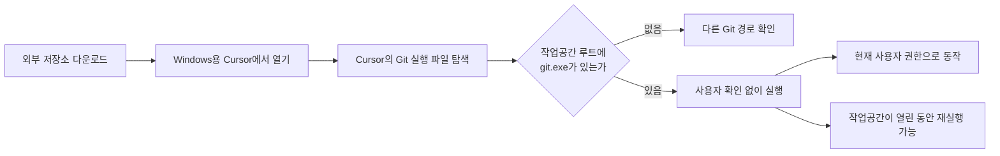

> 한 줄 요약: Cursor `git.exe` 취약점 의혹에서 문제는 AI가 아니라 신뢰 경계다. Windows용 Cursor가 저장소 루트의 실행 파일을 사용자 확인 없이 반복 실행한다는 보고가 맞다면, 저장소를 여는 것만으로 코드 실행을 허용하는 셈이다.

## 무슨 일이 있었나: Cursor git.exe 취약점의 확인 범위

보안업체 Mindgard는 2025년 12월 15일 Cursor에 취약점을 신고했다고 밝혔다. Windows에서 프로젝트를 열면 Cursor가 Git 실행 파일을 찾다가 작업공간 루트에 있는 `git.exe`까지 자동으로 실행한다는 내용이다.

재현 과정은 다음과 같다.

1. 공격자가 저장소 최상위 경로에 악성 `git.exe`를 넣는다.
2. 사용자가 해당 저장소를 Windows용 Cursor로 연다.
3. Cursor가 Git 경로를 확인하면서 저장소 안의 `git.exe`를 실행한다.
4. 작업공간이 열린 동안 같은 파일이 다시 실행될 수 있다.

Mindgard는 Windows 계산기 실행 파일의 이름을 `git.exe`로 바꾼 무해한 개념 증명(Proof of Concept, PoC)을 사용했다. 사용자가 별도 버튼을 누르지 않았는데도 계산기 창이 여러 번 열렸다. Sysinternals Process Monitor 기록에서는 `Cursor.exe`가 저장소 안의 `git.exe`를 실행한 부모 프로세스로 표시됐다.

Mindgard 글에 따르면 마지막으로 재현한 날짜는 2026년 4월 30일이고, 대상 버전은 Cursor 3.2.16이다. 공개 글은 2026년 7월 14일자로 표시돼 있지만, 페이지에는 이보다 앞선 6월 17일이 업데이트 날짜로 함께 적혀 있어 시간 순서가 맞지 않는다.

현재 확인된 내용과 Mindgard의 주장은 구분해서 볼 필요가 있다.

| 구분 | 현재 말할 수 있는 내용 |
|---|---|
| 직접 제시된 재현 | Windows의 Cursor 3.2.16에서 저장소 루트의 `git.exe`가 실행됐다는 로그와 PoC |
| Mindgard의 주장 | 최초 신고 후 6개월 넘게 수정과 충분한 답변이 없었으며 이후 버전에도 문제가 남아 있었다는 설명 |
| 아직 확인하기 어려운 부분 | 7월 14일 당시 최신 버전의 패치 여부, 모든 Windows 구성에서의 동일한 재현 여부 |
| 공개 자료에서 보이지 않는 것 | Cursor 공식 보안 권고, CVE 번호, 수정 버전, 독립 기관의 검증 결과 |

Mindgard에 따르면 Cursor의 보안 자동화 문제로 HackerOne 절차가 처음에는 시작되지 않았고, 다시 제출한 보고서도 한때 정보성 및 범위 밖으로 종료됐다. 이후 이의를 제기하자 HackerOne이 문제를 재현해 Cursor에 전달했지만, 그 뒤로 소통이 끊겼다고 한다. 이 과정은 현재 Mindgard의 설명으로만 공개돼 있다.

따라서 지금 단계에서 확정된 Cursor 제로데이라고 단정하기는 어렵다. 공개된 미패치 코드 실행 위험 보고라고 표현하는 편이 정확하다. 공격자는 저장소를 원격으로 전달할 수 있지만, 실제 실행은 사용자가 해당 저장소를 Cursor로 열 때 시작된다. 일반적인 네트워크 원격 코드 실행과는 조건이 다르다.

## 왜 사람들이 반응했나: 저장소를 여는 것만으로 코드가 실행된다면

이 글은 Hacker News에서 413포인트와 195개 댓글을 모았다. 공격 기법이 새로워서라기보다 개발자가 소스 코드를 검토하려고 저장소를 여는 순간, 아직 확인하지 않은 실행 파일이 먼저 동작할 수 있다는 점이 논란을 키웠다.

### 신뢰: 코드를 읽는 도구가 코드를 먼저 실행한다

개발자는 낯선 저장소의 소스가 위험할 수 있다는 사실을 알고 있다. 그래도 파일을 탐색하고 코드를 읽는 단계까지는 실행을 동반하지 않는다고 기대한다.

이번 보고가 맞다면 그 경계가 지켜지지 않는다. 빌드나 테스트, 확장 프로그램 설치, 터미널 명령처럼 사용자가 실행 위험을 예상할 만한 단계가 아니라 프로젝트를 불러오고 도구를 찾는 과정에서 코드가 실행된다.

### 권한: 승인 창이 없는 실행은 피해 범위를 숨긴다

PoC에서 계산기가 열렸다고 해서 가능한 영향도 계산기 실행에 그치는 것은 아니다. 보고된 경로대로라면 공격 코드는 Cursor와 같은 현재 사용자 권한으로 실행된다.

이 경우 해당 사용자가 접근할 수 있는 파일, 개발 자격 증명, 로컬 설정이 노출될 수 있다. 다만 이번 글에는 실제 정보 탈취나 피해 사례를 확인할 자료가 없다. 발생 가능한 영향과 이미 발생한 사고는 구분해야 한다.

### 운영: 한 번이 아니라 반복 실행될 수 있다

Mindgard의 실험에서는 작업공간을 열어 둔 동안 이름을 바꾼 계산기가 여러 번 실행됐다. 최초 실행을 알아차리지 못했더라도 같은 파일이 다시 실행될 수 있다는 의미다.

다만 공개된 설명만으로는 반복 주기와 정확한 호출 조건까지 확인하기 어렵다. Cursor의 어떤 기능이 Git 탐색을 다시 시작하는지, 설정에 따라 호출 횟수가 달라지는지는 별도 검증이 필요하다.

### 보안 절차: 취약점보다 침묵이 더 큰 논쟁이 됐다

조정된 취약점 공개(Coordinated Vulnerability Disclosure)가 작동하려면 연구자와 공급자 사이의 소통이 이어져야 한다. 공급자가 접수 여부나 재현 결과를 알리지 않고 수정 일정과 임시 완화책도 제시하지 않으면, 연구자는 계속 비공개로 둘지 전면 공개(Full Disclosure)할지 판단해야 한다.

전면 공개하면 공격자도 재현 정보를 얻을 수 있다. 반대로 공개를 미루는 동안 사용자는 위험을 모른 채 취약한 상태로 남을 수 있다. 이번 논쟁의 쟁점은 어느 공개 방식이 항상 옳으냐가 아니다. 공급자의 응답 부재로 생긴 부담을 연구자와 사용자가 떠안게 됐는지가 핵심이다.

## 내가 보는 핵심: AI IDE보다 실행 파일 탐색 순서의 문제다

이 사건을 AI 코딩 도구에서 발생한 보안 사고로만 보면 직접적인 원인을 놓치기 쉽다. 공개된 재현에는 프롬프트 인젝션(Prompt Injection)이나 모델 탈옥, 에이전트 권한 위임이 필요하지 않다.

문제는 실행 파일 검색 경로와 신뢰 경계다. 외부에서 받은 저장소가 코드와 문서의 저장 공간을 넘어 도구 실행 파일의 공급처로 취급됐고, IDE가 이를 명시적인 승인 없이 실행했다는 것이 Mindgard의 주장이다.

실무에서는 파일 내용 자체보다 어떤 프로그램이 그 파일을 실행 대상으로 선택하는지가 더 까다로운 문제가 되기도 한다. 저장소에 악성 바이너리가 들어 있는 것만으로는 실행되지 않는다. 하지만 신뢰받는 IDE가 그 파일을 자동으로 선택하면 공격자가 넣은 파일이 정상 개발 도구처럼 실행된다.

### 왜 PATH 문제보다 더 불편한가

사용자가 직접 작업공간을 `PATH` 앞부분에 추가했다면 구성 실수로 볼 여지가 있다. 이번 보고는 사용자의 `PATH` 설정이 아니라 Cursor의 탐색 로직이 현재 작업공간을 후보로 삼았다고 설명한다.

기본 동작으로 외부 저장소의 실행 파일을 선택한다면 제품도 방어책을 제공해야 한다. 안전한 탐색 순서를 적용하고 실행 전에 확인을 받거나, 작업공간 신뢰 상태에 따라 실행을 차단할 필요가 있다.

### 저장소 신뢰 기능만으로 충분한가

작업공간 신뢰(Workspace Trust) 화면이 있더라도 실제로 이 경로를 차단하는지는 따로 확인해야 한다. 경고창의 존재보다 Git 탐색이 경고 전후 어느 시점에 실행되는지가 중요하다.

사용자가 제한 모드를 선택하기 전에 `git.exe` 탐색이 끝난다면 신뢰 기능은 이번 경로를 막지 못한다. 패치가 적용됐다면 저장소 루트를 검색 대상에서 제외했는지, 신뢰 결정 전 실행을 금지했는지, 실행 파일의 출처를 표시하는지 확인해야 한다.

### 빠른 출시와 보안 대응은 같은 운영 지표여야 한다

Mindgard 글에는 신고 이후 출시된 버전 수가 197개 이상이라는 대목과 70개가 넘는다는 대목이 함께 나온다. 숫자가 서로 맞지 않으므로 정확한 배포 횟수로 인용하기는 어렵다.

다만 기능 업데이트가 잦은 제품에서 보안 보고가 여러 달 동안 접수와 분류, 수정 단계 사이를 오갔다면 개발 속도와 별개로 보안 대응 절차를 점검해야 한다. 버그 바운티 프로그램을 운영한다고 해서 취약점이 제때 처리되는 것은 아니다.

## 앞으로 볼 기준: Cursor 취약점 대응과 임시 완화책

먼저 자신의 사용 환경이 보고된 조건에 해당하는지 확인해야 한다.

- Windows용 Cursor를 사용하는가
- 출처를 충분히 검증하지 않은 저장소를 여는가
- 저장소 루트에 `git.exe`가 존재하는지 확인했는가
- Cursor 3.2.16 이후 버전의 보안 수정 내역을 확인했는가
- IDE 프로세스가 작업공간 안의 실행 파일을 시작하는지 관찰할 수 있는가

관리형 Windows 환경에서는 AppLocker나 Windows Defender Application Control 정책으로 개발 작업공간 경로에 있는 `git.exe`의 실행을 제한하는 방법이 제시됐다. 해시 기반 차단은 파일이 바뀌면 우회될 수 있어 경로 정책이 이 상황에 더 적합하다. 다만 정상 저장소에서 같은 이름의 실행 파일을 사용해야 하는 경우도 함께 차단될 수 있다.

Mindgard는 Windows 기본 정책만으로 특정 부모 프로세스에서 실행된 자식 파일만 차단하기는 어렵다고 설명한다. `Cursor.exe`가 작업공간 안의 실행 파일을 시작하는 경우만 골라 차단하려면 엔드포인트 탐지 및 대응(Endpoint Detection and Response, EDR) 제품이나 별도 통제가 필요할 수 있다.

개인 사용자는 패치 여부가 확인될 때까지 출처가 불분명한 저장소를 Windows Sandbox나 폐기 가능한 가상 머신에서 여는 편이 안전하다. 저장소를 복제하는 것만으로는 보고된 실행 조건이 충족되지 않는다. Cursor로 여는 시점부터 격리 환경을 사용하는 것이 중요하다.

향후 보안 공지가 나오면 단순히 취약점이 수정됐다는 문장만 보지 말고 다음 내용을 확인해야 한다.

- 영향을 받는 운영체제와 정확한 버전
- 최초 신고일과 공급자의 접수 확인일
- 재현 여부와 심각도 판단 근거
- 수정 버전과 실제 변경된 탐색 로직
- 패치 전 적용할 수 있는 임시 완화책
- 작업공간 신뢰 설정이 실행보다 먼저 적용되는지
- 이미 노출됐을 가능성을 조사할 로그와 프로세스 흔적

이번 보고에서 확인해야 할 것은 Cursor가 안전한지 위험한지를 한마디로 판정하는 일이 아니다. 개발 도구가 저장소 안에서 무엇을 데이터로 읽고 무엇을 프로그램으로 실행하는지 사용자가 알 수 있는지가 문제다.

저장소를 여는 동작이 곧 실행 승인으로 처리되면 코드 검토를 시작하기도 전에 신뢰 경계가 사라진다. 이후 패치 노트에서는 수정 완료라는 표현보다 작업공간이 실행 파일 검색 대상에서 실제로 제외됐는지를 확인해야 한다.

## 참고 자료

- [선정 글감] [Cursor 0day: When Full Disclosure Becomes the Only Protection Left](https://mindgard.ai/blog/cursor-0day-when-full-disclosure-becomes-the-only-protection-left) — Mindgard / Hacker News Best