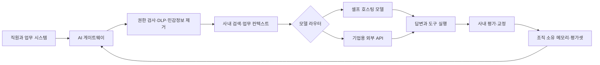

> 한 줄 요약: 기업 AI 데이터 보안에서 중요한 것은 누가 프롬프트를 보느냐보다 업무 맥락과 교정·평가 데이터가 어디에 쌓이고 누가 재사용할 수 있느냐다. 셀프 호스팅 AI는 만능 해법이 아니라 이 학습 과정의 통제권을 확보하는 방법 가운데 하나다.

## 무슨 일이 있었나

사내 규정과 고객 데이터를 읽는 AI가 틀린 답을 내놓으면 직원은 이를 바로잡는다. 이 과정에서 전달되는 정보에는 문서뿐 아니라 회사가 예외를 처리하고 결과를 판단하는 방식도 포함된다.

2026년 7월 12일 공개된 [The Reverse Information Paradox](https://snscratchpad.com/posts/reverse-information-paradox/)는 기업이 AI 사용료를 내면서 모델을 개선하는 데 필요한 독점 지식까지 제공한다고 주장했다. TechCrunch는 7월 13일 이 글을 Microsoft CEO 사티아 나델라의 견해로 소개했다. LocalLLaMA 커뮤니티에서는 셀프 호스팅 AI가 필요한 이유를 보여주는 주장으로 받아들였다.

글의 문제 제기는 입력 프롬프트에 그치지 않는다. 직원이 작성한 지시와 에이전트의 도구 선택 기록, 실패한 답을 교정한 내용, 사내 평가셋(Evaluation Set)이 쌓이면 경쟁사가 돈을 주고도 구하기 어려운 업무 지식이 된다는 것이다.

다만 확인된 사실과 예상 가능한 위험은 구분해서 봐야 한다.

| 구분 | 확인할 수 있는 내용 | 아직 입증되지 않은 해석 |
|---|---|---|
| 공개 발언 | 기업이 프롬프트·피드백·평가 데이터의 소유권과 모델 선택권을 유지해야 한다는 글이 공개됐다 | 상용 모델 업체가 고객의 영업비밀을 학습해 경쟁 사업에 사용하고 있다는 주장 |
| OpenAI 정책 | API와 기업용 제품의 입력·출력은 명시적으로 동의하지 않는 한 모델 학습에 쓰지 않는다고 밝히고 있다 | 학습에 쓰지 않는다는 약속이 모든 저장·검토·파생 데이터 처리를 금지한다는 해석 |
| Anthropic 정책 | 상용 API에서 보관한 데이터를 명시적 허락 없이 모델 학습에 사용하지 않으며, 조건을 충족하면 제로 데이터 보존(Zero Data Retention)을 신청할 수 있다 | 모든 Claude 제품과 기능이 같은 보존 조건을 적용받는다는 해석 |
| 셀프 호스팅 효과 | 추론 서버와 로그를 조직의 보안 경계 안에 둘 수 있다 | 로컬에서 실행하면 데이터 유출과 공급망 위험이 자동으로 사라진다는 주장 |

OpenAI API 문서에 따르면 입력과 출력은 기본적으로 학습에 사용되지 않는다. 다만 악용 모니터링 로그에는 고객 콘텐츠가 포함될 수 있으며, 일반적으로 최대 30일간 보관된다. 승인받은 조직은 제로 데이터 보존이나 수정된 악용 모니터링(Modified Abuse Monitoring)을 적용할 수 있다. 일부 상태 저장 기능과 외부 도구에는 별도 조건이 적용된다.

Anthropic도 상용 API에서 보관한 데이터를 명시적인 허락 없이 모델 학습에 사용하지 않는다고 설명한다. 제로 데이터 보존은 조직 단위로 활성화해야 한다. Console, Workbench, 소비자용 제품과 일부 상태 저장 기능, 제3자 연동에는 같은 조건이 적용되지 않는다.

현재 공개된 자료만으로 모델 업체가 기업 지식을 몰래 흡수한다고 단정하기는 어렵다. 그렇다고 학습 제외라는 문구만으로 전체 데이터 흐름이 통제된다고 볼 수도 없다.

## 왜 사람들이 반응했나

### 왜 셀프 호스팅 AI 이야기에 Microsoft CEO가 소환됐을까?

반응이 커진 데에는 발언자의 위치가 영향을 줬다. 클라우드와 기업용 AI 서비스를 판매하는 Microsoft의 CEO가 단일 모델 사업자에 대한 종속을 경고했다는 점을 셀프 호스팅 커뮤니티는 자신들의 우려를 뒷받침하는 근거로 받아들였다.

모든 이용자가 같은 해석을 내놓은 것은 아니다. 상용 계약을 어기고 고객 데이터를 학습에 사용하면 업체가 감당해야 할 평판 훼손과 사업 손실이 크기 때문에, 의도적인 영업비밀 탈취 가능성은 낮다는 반론도 나왔다.

일리가 있는 지적이다. 논의를 업체가 데이터를 훔치느냐는 질문으로 좁히면 셀프 호스팅의 필요성도 막연한 불안에 기대게 된다.

커뮤니티가 우려하는 범위는 그보다 넓다.

- 신뢰: 현재 약관을 믿을 수 있는지와 별개로, 약관이 바뀌거나 계정이 차단돼도 업무를 계속할 수 있는가
- 권한: 프롬프트와 메모리, 평가셋, 사용자 교정, 에이전트 실행 기록을 누가 소유하고 삭제할 수 있는가
- 비용: 토큰 요금이나 GPU 구매비에 보안 심사, 네트워크, 장애 대응, 운영 인력까지 더하면 어느 쪽이 유리한가
- 사용성: 로컬 모델의 품질 저하와 응답 지연을 직원들이 받아들일 수 있는가
- 규제: 개인정보와 의료·금융 정보, 국외 이전, 보존 기간에 관한 요구사항을 제품별로 입증할 수 있는가

### 384GB 로컬 AI 서버가 보여준 현실적인 고민

같은 시기 LocalLLaMA에는 한 회사가 RTX PRO 6000 Blackwell 네 장으로 구성된 총 384GB VRAM 장비를 검토한다는 게시물이 올라왔다. 작성자는 내부 정책과 데이터 관리, 사고 작업에 모델을 사용할 예정이며 평소에는 2~3명의 사용자가 집중적으로 쓰고 최대 10~20명이 동시에 접속할 것으로 예상했다.

검증된 도입 사례가 아니라 작성자가 공개한 구매 계획이다. 댓글에서 특정 모델 하나가 정답처럼 제시되지 않았다는 점은 실제 도입 과정의 고민을 드러낸다.

가장 큰 모델을 양자화(Quantization)해 구동하자는 의견이 있는가 하면, 내부 질의응답과 추론 작업을 분리해 여러 모델로 보내자는 제안도 있었다. 동시 접속자 수와 실제 동시 생성 요청 수는 다르며, 모델 일부가 VRAM 밖으로 밀려나면 다중 사용자 환경의 성능이 크게 떨어질 수 있다는 지적도 나왔다.

개인식별정보(PII)를 외부로 보내기 어렵다는 요구 때문에 셀프 호스팅을 검토할 수 있다. 하지만 장비부터 주문하고 나중에 워크로드를 따지면 보안 설계보다 비싼 용량 계획이 먼저 굳어질 수 있다.

## 내가 보는 핵심

### AI 데이터 보안은 저장 위치보다 학습 루프의 소유권 문제다

기업이 관리해야 할 자산은 원본 문서에 그치지 않는다. 어떤 답을 채택하거나 거절했는지, 어떤 예외를 승인했는지, 좋은 결과를 어떤 기준으로 판정했는지가 쌓이면서 AI는 조직의 업무 방식에 맞춰진다.

이 과정을 학습 루프(Learning Loop)라고 부를 수 있다.

이 구조에서는 모델을 교체 가능한 계산 엔진으로 취급한다. 게이트웨이와 권한 정책, 검색 인덱스, 평가셋, 교정 기록은 조직이 보유해야 할 업무 자산으로 분리한다.

외부 API를 쓰더라도 이러한 계층을 분리해 두면 공급자를 교체하거나 데이터 민감도에 따라 로컬 모델로 요청을 보낼 수 있다. 반대로 메모리와 에이전트 도구를 한 업체의 관리형 제품에 묶어 두면 학습 제외 약관이 있더라도 전환 비용은 커진다.

### 셀프 호스팅 AI vs 기업용 API, 무엇이 다른가?

| 방식 | 통제할 수 있는 것 | 새로 생기는 위험 | 어울리는 업무 |
|---|---|---|---|
| 기업용 관리형 API | 높은 모델 품질, 빠른 기능 도입, 계약 기반 보존 정책 | 약관·기능별 보존 차이, 공급자 종속, 외부 도구로의 데이터 전송 | 공개 정보 처리, 일반 문서 작성, 낮은 민감도의 자동화 |
| 전용 테넌트·프라이빗 클라우드 | 네트워크와 계정 경계, 지역 선택, 중앙 권한 관리 | 클라우드 설정 오류, 관리 계층 의존, 예상보다 복잡한 비용 | 규제 요구가 있으나 자체 GPU 운영이 어려운 조직 |
| 셀프 호스팅 모델 | 추론 데이터, 로그, 모델 버전과 배포 시점 | 모델 공급망, 취약한 관리 화면, GPU 장애, 백업 유출, 패치 지연 | 외부 반출이 금지된 문서, 폐쇄망, 반복량이 많은 안정된 업무 |
| 하이브리드 라우팅 | 민감도와 작업 난도에 따른 모델 선택 | 분류 오류, 게이트웨이 집중 장애, 복잡한 관측 체계 | 민감도와 품질 요구가 섞인 기업 환경 |

셀프 호스팅을 선택해도 신뢰 경계가 사라지지는 않는다. 경계와 책임이 조직 내부로 옮겨올 뿐이다. 모델 파일의 출처와 컨테이너 이미지, 드라이버, 추론 서버 인증, 프롬프트 로그, 백업, 관리자 권한을 조직이 직접 관리해야 한다.

로컬 모델이 웹 검색이나 SaaS, 모델 컨텍스트 프로토콜(Model Context Protocol) 서버를 호출하면 데이터는 다시 외부로 전송된다. 모델 가중치를 사내에 보관한다고 해서 에이전트의 전체 실행 경로까지 사내에 머무는 것은 아니다.

### 가장 큰 위험은 한 번의 유출보다 되돌릴 수 없는 종속이다

보안 검토에서는 프롬프트 유출이 먼저 거론되기 쉽다. 운영 측면에서는 공급자가 모델 서비스를 종료하거나 가격과 이용 조건을 바꾸는 상황도 고려해야 한다. 기억과 도구, 평가 기능을 다른 제품으로 이전하기 어려운지도 확인해야 한다.

실제 도입에서는 최고 성능 모델을 고르는 일보다 같은 평가셋을 여러 모델에서 실행할 수 있도록 만드는 일이 더 오래 영향을 미친다. 모델 순위는 자주 바뀌지만 사내 승인 기준과 실패 사례는 쉽게 바뀌지 않기 때문이다.

첫 설계 질문은 어떤 모델을 살 것인지가 아니라, 내일 이 모델을 쓸 수 없어도 핵심 업무가 돌아가는지여야 한다.

## 앞으로 볼 기준

### 다음 AI 데이터 정책 뉴스에서 확인할 여섯 가지

- 제품 범위: 소비자용 채팅, 기업용 워크스페이스, API에 같은 조건이 적용되는지 구분한다.
- 학습과 보존: 모델 학습 제외, 로그 미보관, 사람의 검토 금지는 각각 다른 약속이다.
- 기능별 예외: 파일과 대화 메모리, 배치 작업, 프롬프트 캐시, 웹 검색, 외부 도구의 보존 조건을 따로 확인한다.
- 파생 자산의 권리: 출력과 교정 기록, 평가셋, 미세조정 가중치를 다른 모델에서도 사용할 수 있는지 계약을 확인한다.
- 교체 가능성: 공급자별 API를 업무 코드에 직접 넣지 않고 게이트웨이와 평가 계층을 분리한다.
- 운영 증거: 셀프 호스팅 후보는 평균 벤치마크보다 실제 문서와 최대 컨텍스트, 동시 생성량, 장애 복구 시간을 기준으로 시험한다.

도입 검토표에는 데이터 등급별 처리 경로도 기록해야 한다. 예를 들어 공개 문서는 관리형 API로 보내고, 사내 일반 문서는 민감정보를 제거한 뒤 외부 API로 처리할 수 있다. 고객 개인정보와 영업비밀은 로컬 모델만 사용하도록 제한하는 식이다.

먼저 민감한 업무 하나를 골라 입력부터 검색 인덱스와 모델, 도구 호출, 로그, 평가 데이터까지의 흐름을 그려보는 것이 좋다. 각 단계에서 누가 어떤 데이터를 얼마나 오래 보관하는지 답할 수 없다면 클라우드와 셀프 호스팅을 비교하기에 앞서 데이터 흐름부터 확인해야 한다.

AI 사용료를 두 번 낸다는 경고에서 두 번째 비용이 반드시 데이터 탈취를 뜻하는 것은 아니다. 교정과 평가 기록이 특정 제품 안에만 쌓여 다른 모델로 옮길 수 없을 때도 전환 비용이 발생한다.

셀프 호스팅을 선택할 근거는 CEO의 발언이 아니라 조직의 운영 조건에서 나와야 한다. 학습 기록을 조직이 보유하고 필요할 때 모델을 교체할 수 있는 구조인지가 판단 기준이다.

## 참고 자료

- [선정 글감] [Some of y'all wonder why anyone would self host AI. Would you accept the opinion of the CEO of Microsoft?](https://www.reddit.com/r/LocalLLaMA/comments/1uwqgqs/some_of_yall_wonder_why_anyone_would_self_host_ai/) — Reddit LocalLLaMA
- [관련] [The Reverse Information Paradox](https://snscratchpad.com/posts/reverse-information-paradox/) — sn scratchpad
- [관련] [Satya Nadella has issued a shocking warning to companies using AI](https://techcrunch.com/2026/07/13/satya-nadella-has-issued-a-shocking-warning-to-companies-using-ai/) — TechCrunch
- [관련] [If you had a 384GB (4x Blackwell), what model would you put on it and why?](https://www.reddit.com/r/LocalLLaMA/comments/1uwv48k/if_you_had_a_384gb_4x_blackwell_what_model_would/) — Reddit LocalLLaMA
- [관련] [Data controls in the OpenAI platform](https://developers.openai.com/api/docs/guides/your-data#default-usage-policies-by-endpoint) — OpenAI
- [관련] [API and data retention](https://platform.claude.com/docs/en/manage-claude/api-and-data-retention) — Anthropic