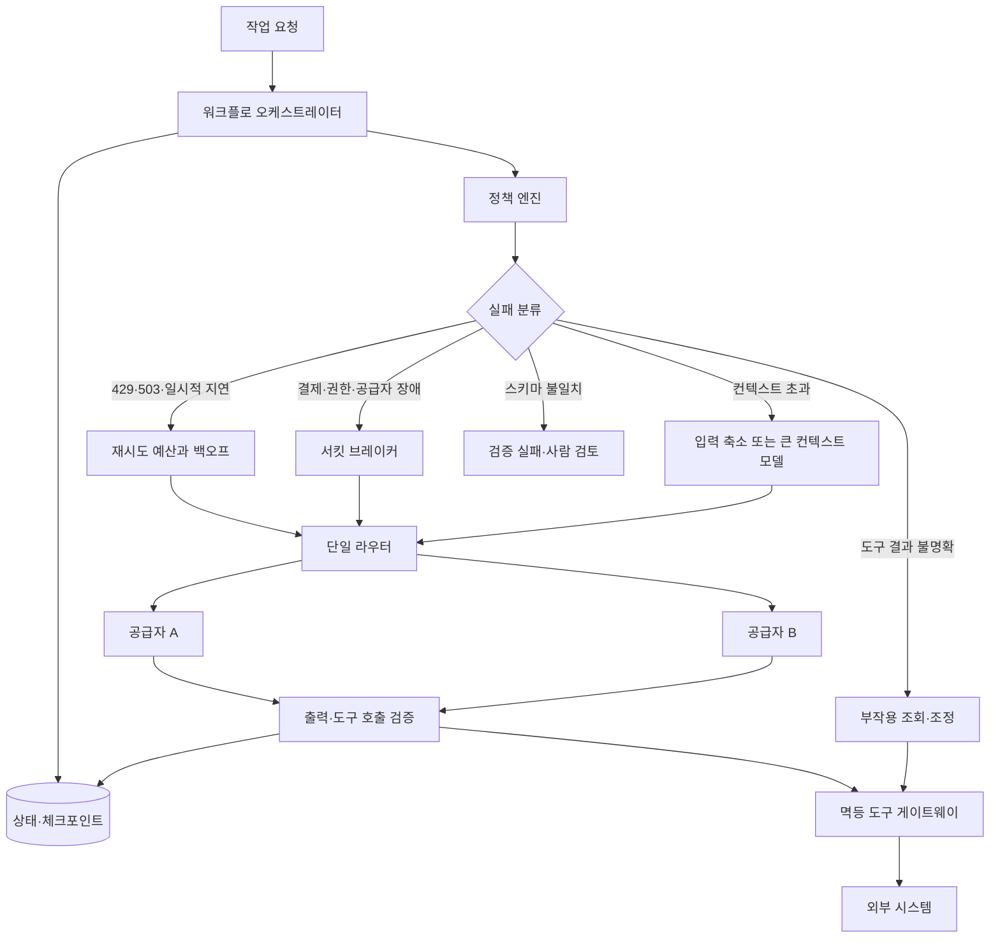

> 한 줄 요약: AI 에이전트 폴백(fallback)은 다른 모델로 요청을 한 번 더 보내는 기능이 아니다. 정책은 여러 계층에 둘 수 있지만 재시도를 실행하는 계층은 하나로 정하고, 체크포인트·멱등성·장애 격리까지 함께 설계해야 한다.

## 왜 지금 이슈인가

AI 에이전트 폴백을 검색하면 모델 라우터 설정이 먼저 나온다. 하지만 운영 중인 에이전트를 멈추게 하는 원인은 모델 성능보다 요금 한도, 429 응답, 지연, 컨텍스트 초과, 도구 호출 규격 차이 같은 평범한 문제인 경우가 많다.

이 글의 출발점은 OpenAI 사용량 제한과 결제 상태 때문에 에이전트 실행이 연달아 실패한 사례다. 개인의 경험만으로 전체 서비스의 장애 빈도를 판단할 수는 없다. 다만 결제와 할당량이 재무 문제를 넘어 런타임 의존성이 됐다는 점은 운영 설계에서 무시하기 어렵다.

에이전트는 일반적인 API 호출보다 장애의 영향 범위가 넓다. 한 번 실행되면 검색과 데이터 저장뿐 아니라 메시지 전송이나 티켓 생성까지 이어질 수 있다. 실행 중간에 모델을 바꿔 처음부터 다시 시작하면 복구가 아니라 도구를 중복 호출하는 장애로 이어질 수 있다.

외부 사기 탐지 호출 하나가 전체 거래 요청을 붙잡는 NestJS 사례도 구조는 같다. 느리거나 불안정한 의존성을 동기식 요청 경로에 넣으면 해당 의존성의 장애가 플랫폼 전체로 번진다. AI 모델도 같은 기준으로 관리해야 할 외부 의존성이다.

## 커뮤니티에서 갈리는 지점

### AI 에이전트에 멀티 프로바이더가 꼭 필요할까?

멀티 프로바이더 구성을 기본값으로 보는 쪽에서는 특정 공급자의 속도 제한이나 장애가 발생했을 때 다른 공급자로 전환해 가용성을 유지할 수 있다고 말한다. 비용이나 지연 시간, 컨텍스트 길이에 따라 모델을 선택할 수 있다는 장점도 있다.

반대쪽의 우려도 현실적이다. 공급자가 늘어날수록 인증과 청구 체계가 복잡해지고, 데이터 처리 지역이나 보존 정책도 따로 확인해야 한다. 프롬프트 호환성과 관측 지점도 공급자 수만큼 늘어난다. 단일 공급자의 장애를 피하려다 라우터와 프록시가 새로운 단일 장애점(Single Point of Failure)이 될 수도 있다.

| 접근 방식 | 얻는 것 | 놓치기 쉬운 위험 |
|---|---|---|
| 같은 공급자에 재시도 | 구현이 단순하고 출력 차이가 작음 | 장애 중인 시스템에 부하를 더할 수 있음 |
| 다른 공급자로 폴백 | 공급자 장애와 할당량 문제를 우회 | 도구 호출과 구조화 출력의 의미가 달라질 수 있음 |
| 저가 모델로 성능 저하 운전 | 비용과 처리량을 방어 | 조용히 품질이 낮아져 성공처럼 보이는 실패가 생김 |
| 워크플로를 중단하고 재개 | 부작용을 통제하고 상태를 보존 | 체크포인트와 상태 머신 구현이 필요 |
| 로컬 모델로 전환 | 외부 네트워크 의존도를 줄임 | 운영 자원과 모델 품질 검증 부담이 커짐 |

중요한 것은 멀티 프로바이더 도입 여부보다 실패한 실행을 어디까지 같은 작업으로 볼 것인지 정하는 일이다. 첫 번째 모델이 티켓 생성 도구를 호출한 뒤 응답만 유실됐다면 두 번째 모델에 같은 프롬프트를 보내서는 안 된다.

### 재시도와 폴백은 무엇이 다른가?

재시도(retry)는 같은 실행 조건에서 일시적인 문제가 사라지기를 기다리는 동작이다. 폴백은 공급자나 모델, 실행 경로, 처리 방식을 바꾸는 정책이다. 성능 저하 운전(degraded mode)은 일부 기능을 의도적으로 포기하고 나머지 작업을 이어가는 방식이다.

이를 모두 하나의 실패 처리 옵션으로 묶으면 오류 원인에 맞는 대응을 선택하기 어렵다. 429 응답과 결제 차단, 컨텍스트 초과, 콘텐츠 정책 거절은 서로 다른 문제다.

- 429 또는 일시적 503: `Retry-After`를 지키고 지수 백오프와 지터를 적용해 정해진 횟수만 재시도한다.
- 타임아웃: 워크플로에 남은 전체 데드라인을 확인한다. 도구 호출의 성공 여부가 불분명하다면 먼저 외부 시스템에서 처리 상태를 조회한다.
- 결제·권한·모델 접근 오류: 해당 경로의 서킷을 열고 미리 검증한 공급자로 전환한다.
- 컨텍스트 초과: 곧바로 다른 모델에 보내지 않는다. 입력 크기를 검사하고 내용을 요약하거나 검색 범위를 줄인 뒤, 필요하면 더 큰 컨텍스트를 지원하는 모델을 선택한다.
- 구조화 출력 검증 실패: 스키마 복구를 시도하되 다른 공급자의 출력이 같은 의미를 가진다고 가정하지 않는다.
- 콘텐츠 정책 거절: 다른 공급자를 이용해 정책을 우회하지 않는다. 요청을 수정하거나 사람의 검토가 필요한 상태로 전환한다.

## 아키텍처 관점에서 볼 점

### AI 에이전트 폴백 아키텍처는 어디에 둬야 할까?

에이전트 프레임워크와 LiteLLM 같은 라우터, 공급자 추상화 계층이 각각 재시도하면 한 번의 실패가 여러 요청으로 불어난다. AWS의 재시도 설계 자료에서도 호출 계층마다 재시도를 중첩할 경우 하위 의존성이 복구할 시간을 얻지 못하고 부하만 커질 수 있다고 설명한다.

정책을 결정하는 역할과 실제 요청을 다시 실행하는 역할은 분리할 필요가 있다. 에이전트는 작업의 품질과 비용, 보안 등급을 정하고 라우터는 오류를 분류할 수 있다. 다만 재시도와 폴백을 실행할 권한은 한 계층에만 둬야 한다.

이 구조에서는 모델이 응답했다고 작업을 완료 처리하지 않는다. JSON 스키마뿐 아니라 호출한 도구와 필수 인자, 접근이 허용된 데이터 범위, 이전 단계의 결과와 일치하는지도 확인해야 한다.

### 서킷 브레이커와 격벽은 어떻게 적용할까?

서킷 브레이커(Circuit Breaker)는 반복적으로 실패하는 공급자 호출을 일정 시간 차단해 복구할 시간을 준다. 격벽(Bulkhead)은 특정 에이전트나 공급자의 지연이 다른 워크플로의 동시 실행 슬롯까지 차지하지 않도록 큐와 실행 풀을 분리하는 방식이다.

외부 사기 탐지를 요청 경로에서 분리하는 사례처럼 오래 걸리는 에이전트 작업도 내구성 있는 큐(Durable Queue)에 넣는 편이 안전하다. 상태는 `queued`, `running`, `waiting_tool`, `completed`, `needs_review`처럼 구분해 기록한다. 다만 결제 승인이나 보안 판정처럼 결과를 확인하지 않고 진행할 수 없는 작업은 장애가 발생했을 때 승인 처리하지 말고 보류 상태로 끝내야 한다.

워크플로 전체에는 하나의 데드라인을 두고 각 단계가 남은 시간을 나눠 써야 한다. 공급자별 타임아웃만 따로 설정하면 앞 단계의 재시도가 시간을 모두 소비한 뒤 마지막 도구 호출을 시작하는 상황이 생긴다.

### 모델을 바꿔도 도구 호출은 같은가?

공급자마다 함수 호출(Function Calling), JSON 스키마 준수 수준, 병렬 도구 호출, 시스템 메시지 처리 방식이 다르다. 같은 OpenAI 호환 API 형식을 제공하더라도 실제 동작까지 같다고 볼 수는 없다.

따라서 폴백 후보는 모델 이름 목록이 아니라 기능 계약으로 관리해야 한다.

- 필수 도구 스키마를 정확히 생성하는가
- 지원하지 않는 파라미터를 알리지 않고 무시하지 않는가
- 긴 입력을 받았을 때 어떤 메시지를 잘라내는가
- 스트리밍이 중단된 뒤 도구 실행 여부를 확인할 수 있는가
- 민감정보가 허용된 지역과 보존 정책 안에서 처리되는가
- 같은 평가 세트에서 운영 기준을 충족하는 결과를 내는가

프록시의 `require_parameters` 같은 옵션을 사용하면 호환되지 않는 경로를 미리 제외할 수 있다. 그러나 이 설정만으로 애플리케이션 수준의 계약 테스트를 대체할 수는 없다.

## 실무에서 볼 점

### 도입 전에 무엇부터 확인해야 할까?

모든 에이전트에 멀티 프로바이더를 붙일 필요는 없다. 읽기 전용 요약 작업과 결제 취소 도구를 호출하는 작업은 실패했을 때의 비용이 다르다.

각 워크플로를 다음과 같이 나누면 폴백 범위를 정하기 쉽다.

- 읽기 전용: 정해진 횟수의 자동 재시도와 공급자 전환을 허용할 수 있다.
- 되돌릴 수 있는 쓰기: 멱등성 키와 실행 기록이 있을 때만 자동으로 복구한다.
- 되돌리기 어려운 쓰기: 자동 폴백보다 보류 처리와 사람의 검토를 우선한다.

외부 시스템을 변경하는 도구에는 실행 ID와 멱등성 키(Idempotency Key)를 전달해야 한다. 응답이 유실되더라도 같은 키로 기존 결과를 조회하거나 중복 요청을 거부할 수 있어야 한다.

### 폴백 테스트는 어떻게 재현할까?

정상 경로만 테스트해서는 실제 장애 상황을 확인하기 어렵다. 스테이징 환경에서 공급자 키를 무효화하고, 429를 반환하는 모의 서버를 구성하고, 스트리밍 도중 연결을 끊어 상태가 어떻게 기록되는지 확인해야 한다.

아래 시나리오는 자동화해 반복해서 확인할 만하다.

1. 첫 공급자가 호출 전에 실패하면 두 번째 공급자로 전환되는가
2. 도구 실행 후 모델 응답만 유실됐을 때 도구가 중복 실행되지 않는가
3. 두 공급자의 도구 인자 형식이 같은 계약 검증을 통과하는가
4. 재시도 예산을 소진하면 무한 루프 없이 보류 큐로 이동하는가
5. 주 공급자가 복구됐을 때 트래픽이 한꺼번에 몰리지 않는가
6. 폴백 모델의 결과가 성공 코드만 남기고 필수 단계를 건너뛰지 않는가
7. 민감정보가 허용되지 않은 공급자나 지역으로 넘어가지 않는가

요청 성공률만으로는 운영 상태를 파악하기 어렵다. 폴백 발생률과 오류 유형, 재시도로 늘어난 요청 수, 오래된 체크포인트, 중복 도구 호출 차단 건수, 출력 검증 실패율도 함께 확인해야 한다.

비용 지표도 별도 대시보드에만 두지 말고 운영 신호로 사용해야 한다. 남은 할당량과 모델 접근 권한을 미리 확인할 수 있다면 요청이 실패하기 전에 트래픽을 줄이거나 작업을 큐에 보관할 수 있다.

### 실패하기 쉬운 설계

- 에이전트와 프록시, SDK가 각각 재시도한다.
- 오류의 원인을 구분하지 않고 모든 요청을 다른 모델로 보낸다.
- 모델 응답이 도착하면 작업 전체를 성공으로 기록한다.
- 체크포인트 없이 긴 워크플로를 처음부터 다시 실행한다.
- 장애가 발생한 뒤에야 폴백 모델의 도구 호출 계약을 확인한다.
- 보조 공급자가 주 공급자와 같은 클라우드나 인증, 결제 경로에 묶여 있다.
- 저렴한 모델로 전환된 사실과 그에 따른 결과 품질 변화를 기록하지 않는다.

라우팅 계층이 많다고 가용성이 자동으로 높아지는 것은 아니다. 계층별 역할을 나누더라도 재시도 횟수와 전체 데드라인, 최종 실패 상태의 소유자는 한곳에서 확인할 수 있어야 한다.

## 정리

에이전트 폴백은 모델 API의 성공률보다 워크플로 상태와 도구의 부작용을 통제하는 문제에 가깝다. 외부 공급자에 장애가 생겼을 때 작업을 어디에서 멈추고, 어떤 상태에서 다시 시작할지 정해져 있어야 한다.

가장 먼저 확인할 항목을 하나 고른다면 스테이징에서 주 공급자 키를 무효화한 뒤 쓰기 도구가 중복 실행되는지 시험해볼 수 있다. 이 테스트를 통과하지 못한다면 현재의 폴백은 복구 경로가 아니라 같은 장애를 다시 실행하는 경로다.

## 참고 자료

- [선정 글감] [I thought fallback was a nice-to-have until OpenAI billing issues broke 3 agent runs in one week](https://dev.to/lars_winstand/i-thought-fallback-was-a-nice-to-have-until-openai-billing-issues-broke-3-agent-runs-in-one-week-pk7) (DEV Community)
- [관련] [Here is how I would use NestJS to stop one fraud check from freezing an entire fintech platform](https://dev.to/peacemelodi/here-is-how-i-would-use-nestjs-to-stop-one-fraud-check-from-freezing-an-entire-fintech-platform-2kcj) (DEV Community)
- [관련] [Timeouts, retries, and backoff with jitter](https://aws.amazon.com/builders-library/timeouts-retries-and-backoff-with-jitter/) (AWS Builders’ Library)
- [관련] [Circuit Breaker pattern](https://learn.microsoft.com/en-us/azure/architecture/patterns/circuit-breaker) (Microsoft Azure Architecture Center)