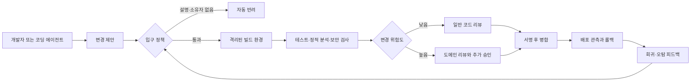

> 한 줄 요약: LLM 코딩 에이전트는 패치 생성 비용을 낮추지만, 검증과 설명, 책임에 드는 비용까지 줄여주지는 않는다. 그 결과 오픈소스와 조직의 리뷰 대기열이 먼저 포화될 수 있다.

## 왜 지금 LLM 코딩 에이전트가 이슈인가

리눅스 커널 개발에서 LLM 사용을 다룬 [메일링리스트 논의](https://lore.kernel.org/linux-media/CAHk-=wi4zC+Ze8e+p3tMv8TtG_80KzsZ1syL9anBtmEh5Z40vg@mail.gmail.com/)를 허용과 금지의 문제로만 보면 논점을 놓치기 쉽다. 중요한 것은 코드를 누가 입력했느냐가 아니다. 제출자가 변경 내용을 이해하고 검증했는지, 문제가 생겼을 때 책임질 수 있는지가 더 중요하다.

2026년 7월 기준으로 LLM은 코드 검색과 테스트 작성, 리팩터링 초안, 문서화 등에 쓰이고 있다. 하지만 오픈소스 프로젝트의 리뷰 시간과 메인테이너 수는 모델의 출력 속도에 맞춰 늘어나지 않는다.

이 차이는 개별 패치의 품질만 확인해서는 잘 드러나지 않는다.

- 패치는 몇 분 만에 만들 수 있다.
- 리뷰에는 여전히 기존과 같은 도메인 지식이 필요하다.
- 불필요하지만 그럴듯한 변경도 정상적인 패치와 같은 대기열에 들어간다.
- 버그가 발견되면 모델이 아니라 병합을 승인한 사람이 대응해야 한다.

[The LLM Critics Are Right. I Use LLMs Anyway](https://www.theocharis.dev/blog/llm-critics-are-right-i-use-llms-anyway/)에서도 이런 모순을 확인할 수 있다. 저자는 LLM에 대한 비판을 상당 부분 인정하면서도 도구를 계속 사용한다. 오픈소스 코딩 에이전트 하네스 프로젝트에서는 밀려드는 이슈와 PR을 대부분 자동으로 닫고 있다는 관계자의 발언도 소개한다.

해당 사례에서는 도구를 만드는 팀도 도구가 늘린 제출량을 그대로 처리하지 못했다. GitHub와 개발자 커뮤니티에서 논란이 이어지는 이유도 코드 생성 능력 자체보다 생성량과 처리량의 차이에 있다.

이 글은 공개 오픈소스와 일반적인 조직의 PR 파이프라인을 다룬다. 의료·자동차·금융 승인 로직처럼 별도의 규제와 안전성 검증이 필요한 소프트웨어에 자동 병합을 허용해도 된다는 뜻은 아니다.

## 커뮤니티에서 갈리는 지점

### AI 생성 코드와 인간 작성 코드는 다르게 취급해야 할까?

결과물이 같다면 작성 도구를 구분할 필요가 없다는 의견이 있다. 컴파일되고 테스트를 통과했으며 리뷰어가 승인했다면 IDE 자동 완성이나 코드 생성기, LLM을 서로 다르게 볼 이유가 없다는 주장이다.

반대 의견은 생성 방식에 따라 검증 비용이 달라진다는 점을 지적한다. 사람이 직접 작성한 패치에는 문제를 해결하면서 내린 판단이 어느 정도 반영된다. 반면 에이전트는 여러 후보를 적은 비용으로 만들 수 있다. 제출자가 내용을 충분히 검토하지 않았다면 패치 설명과 코드가 같은 모델의 잘못된 추론을 공유할 수도 있다.

실무에서는 AI 사용 여부보다 제출자가 무엇을 보증할 수 있는지를 기준으로 삼는 편이 낫다.

| 검증 항목 | 확인할 질문 |
|---|---|
| 문제 정의 | 실제 결함이나 요구사항이 재현되는가 |
| 변경 설명 | 제출자가 왜 이 구현이 맞는지 설명할 수 있는가 |
| 검증 독립성 | 생성에 사용한 추론과 다른 수단으로 테스트했는가 |
| 출처와 권리 | 제출할 권리가 있는 코드인지 확인했는가 |
| 운영 책임 | 회귀가 발생했을 때 수정하거나 되돌릴 담당자가 있는가 |

리눅스 커널의 [패치 제출 가이드](https://docs.kernel.org/process/submitting-patches.html)는 패치가 해결하는 문제와 변경 이유를 밝히고, 검토 가능한 형태로 제출하도록 요구한다. Signed-off-by도 단순한 이름표가 아니다. [Developer Certificate of Origin](https://developercertificate.org/)에 따라 해당 코드를 제출할 권리가 있음을 확인하는 절차다.

LLM을 사용했다고 해서 이 조건이 사라지지는 않는다. 학습 데이터의 출처를 제출자가 직접 확인하기 어려운 만큼 라이선스와 코드 출처 이력은 더 보수적으로 확인해야 한다.

### LLM을 공개하면 책임성이 높아질까?

LLM 사용 사실을 공개하면 리뷰어가 검증 범위를 정하는 데 도움이 된다. 다만 AI 생성 코드라는 표시가 책임까지 모델에 넘기는 면책 문구로 쓰여서는 안 된다.

패치에는 책임질 사람이 있어야 한다. 제출자는 모델의 도움 없이 다음 질문에 답할 수 있어야 한다.

- 기존 동작에서 어떤 불변조건을 보존해야 하는가?
- 이 변경이 실패하는 경로는 무엇인가?
- 테스트가 통과해도 놓칠 수 있는 상태는 무엇인가?
- 롤백하면 데이터나 외부 API에 어떤 흔적이 남는가?

이 질문에 답하지 못한다면 아직 제출할 준비가 끝나지 않은 패치다. 사람이 직접 커밋했는지, 에이전트가 만들었는지는 이 기준을 바꾸지 않는다.

## 아키텍처 관점에서 볼 점

### AI 코딩 에이전트 하네스는 어디까지 검증해야 할까?

코딩 에이전트 하네스(Harness)를 프롬프트 실행용 래퍼로만 보면 운영 과정의 위험을 놓치기 쉽다. 하네스는 생성기와 저장소 사이에서 제출 정책을 적용하고, 실행 환경과 자격 증명을 격리하며, 검증 결과를 기록해야 한다.

테스트 통과만으로 변경이 안전하다고 판단할 수는 없다. 에이전트가 구현과 테스트를 함께 만들면 둘 다 같은 잘못된 가정을 따를 수 있기 때문이다. 경계 조건을 잘못 해석해 구현에서 빠뜨리고 생성된 테스트에서도 같은 조건을 누락하면 CI는 통과한다.

따라서 검증에는 생성 과정과 독립된 판단 기준이 필요하다.

- 기존 회귀 테스트는 에이전트가 수정하지 못하도록 보호한다.
- 공개 API와 데이터 스키마의 호환성은 별도의 계약 테스트로 확인한다.
- 예제 기반 단위 테스트와 함께 퍼징(Fuzzing), 속성 기반 테스트, 정적 분석을 사용한다.
- 보안 관련 변경에는 공격자 관점의 리뷰 단계를 추가한다.
- 테스트 삭제나 검증 임계값 완화는 고위험 변경으로 분류한다.

### 프롬프트 전체를 기록하면 추적성이 좋아질까?

재현성을 확보하기 위해 모델명과 프롬프트, 도구 호출 기록을 모두 보관하자는 접근도 있다. 그러나 프롬프트에는 소스 코드나 고객 데이터, 내부 URL, 토큰이 포함될 수 있다. 모든 기록을 남기면 추적 자료가 새로운 유출 지점이 될 수 있다.

대화 전체를 보관하기보다 나중에 변경 경위를 확인하는 데 필요한 정보만 남기는 편이 안전하다.

- 변경을 요청하고 승인한 사람의 식별자
- 사용한 도구와 모델 계열, 정책 버전
- 접근한 저장소와 허용된 명령 범위
- 수행한 빌드·테스트의 고정된 버전과 결과
- 최종 diff의 해시와 승인 기록

비밀값은 처음부터 에이전트 컨텍스트에 넣지 않는 것이 좋다. 외부 네트워크와 패키지 설치, 배포 자격 증명은 작업별로 분리하고 기본적으로 접근을 허용하지 않아야 한다.

## 실무에서 볼 점

### LLM 코딩 에이전트를 도입하기 전에 무엇을 재야 할까?

LLM 도입 효과를 평가할 때는 생성된 코드 줄 수가 눈에 잘 띈다. 하지만 코드량이 곧 생산성을 뜻하지는 않는다. 변경량과 함께 리뷰 대기시간이나 회귀 대응 비용이 늘었다면 병목이 코드 작성에서 검증으로 이동했을 뿐이다.

도입하기 전에 현재 상태를 먼저 기록해야 한다.

- PR이 열리고 병합될 때까지 걸리는 시간
- 리뷰 한 건에 필요한 사람 시간
- 재작업 요청 비율과 주요 사유
- 배포 후 회귀 및 롤백 빈도
- 메인테이너별 대기열과 리뷰 편중
- 보안·라이선스 검사에서 발견되는 문제 유형

처음부터 저장소 전체에 쓰기 권한을 주기보다는 위험이 낮고 결과를 분명하게 판정할 수 있는 작업부터 맡기는 편이 낫다. 문서 링크 수정이나 반복적인 API 마이그레이션, 기존 테스트로 결과를 확인할 수 있는 리팩터링 등이 후보가 될 수 있다.

인증과 권한, 암호화, 동시성, 데이터 마이그레이션은 diff가 작아도 영향 범위가 크다. 테스트가 많다는 이유만으로 저위험 작업으로 분류해서는 안 된다.

### 자동 생성 PR을 막는 것만이 답일까?

전면 금지는 제출량을 줄일 수 있지만 유용한 보조 기능도 함께 제한한다. 반대로 제한 없이 허용하면 생성 비용을 리뷰어가 부담하게 된다. 두 방식 사이에서 다음과 같은 운영 규칙을 적용할 수 있다.

- LLM은 로컬에서 초안만 만들고 PR은 사람이 제출한다.
- 에이전트가 열 수 있는 PR 수와 diff 크기를 제한한다.
- 지정된 디렉터리와 이슈에만 쓰기 권한을 허용한다.
- 모든 PR에 담당자와 재현 절차를 요구한다.
- 메인테이너가 요청한 작업에만 봇 제출을 허용한다.
- 리뷰 대기열이 임계값을 넘으면 에이전트 제출을 자동으로 중단한다.

마지막 조건은 특히 중요하다. 생성 성공률이 높더라도 리뷰 대기시간과 반려율, 회귀 발생률이 함께 오르면 전체 개발 과정은 느려진다.

## 정리

LLM 코딩 에이전트를 둘러싼 갈등은 인간과 AI 중 누가 더 좋은 코드를 쓰는지를 가리는 문제가 아니다. 생성량과 검증 처리량의 차이를 누가 부담하는지, 병합된 변경을 누가 설명하고 복구할지가 쟁점이다.

모델의 성능에 기대기보다 검증 범위를 명확히 정해야 한다. 격리된 실행 환경과 독립적인 테스트, 제한된 권한, 담당자 지정, 제출 중단 조건이 없으면 에이전트가 개발 시간을 줄이기 전에 리뷰 부채부터 늘릴 수 있다.

현재 저장소에서 PR 생성량이 두 배로 늘어났을 때 리뷰어가 포기하게 될 작업을 확인할 필요가 있다. 보안·설계 검토나 회귀 대응 시간이 줄어든다면 에이전트를 추가하기 전에 리뷰 파이프라인의 처리 한도부터 조정해야 한다.

## 참고 자료

- [선정 글감] [Linus Torvalds on LLM usage in kernel development](https://lore.kernel.org/linux-media/CAHk-=wi4zC+Ze8e+p3tMv8TtG_80KzsZ1syL9anBtmEh5Z40vg@mail.gmail.com/), Linux Kernel Mailing List, Lobsters 논의
- [관련] [The LLM Critics Are Right. I Use LLMs Anyway](https://www.theocharis.dev/blog/llm-critics-are-right-i-use-llms-anyway/), Theocharis
- [관련] [Submitting patches: the essential guide to getting your code into the kernel](https://docs.kernel.org/process/submitting-patches.html), Linux Kernel Documentation
- [관련] [Developer Certificate of Origin](https://developercertificate.org/), DCO Community