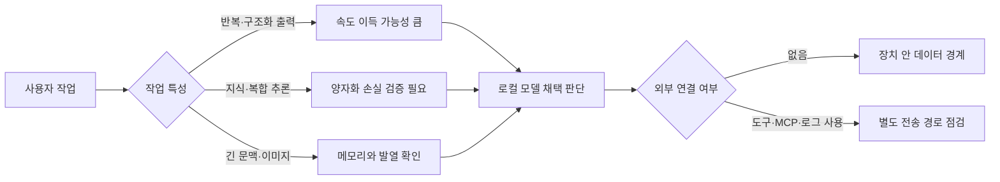

> 한 줄 요약: Bonsai 27B 아이폰 로컬 LLM 시연이 화제가 된 데는 27B 모델을 3.9GB에 담았다는 사실보다 더 살펴볼 부분이 있다. 모델 크기와 함께 양자화로 인한 품질 손실, 실제 처리 속도, 데이터가 오가는 범위를 확인해야 로컬 AI의 실용성을 판단할 수 있다.

## 무슨 일이 있었나

27B급 언어 모델은 스마트폰에서 실행하기 어렵다는 인식이 강했다. FP16 가중치만 단순 계산해도 약 54GB가 필요하기 때문이다. 그런데 PrismML이 Qwen3.6-27B를 기반으로 만든 Bonsai 27B를 아이폰에서 로컬로 실행하는 시연을 공개했다.

프로젝트 측 설명에 따르면 1비트 양자화(1-bit Quantization)를 적용한 모델 크기는 약 3.9GB다. 각 가중치를 부호 비트 하나로 표현하고 128개 가중치마다 FP16 스케일을 공유하는 binary g128 방식이다. 가중치 하나당 평균 약 1.125비트를 사용한다.

임베딩, 어텐션과 MLP 프로젝션, 언어 모델 헤드까지 이진화했다는 점도 눈에 띈다. 일부 계층을 높은 정밀도로 남겨 품질을 보완하는 방식과 달리, 프로젝트 설명상 별도의 고정밀 우회 계층을 두지 않았다.

제공된 벤치마크 요약에서는 15개 평가의 평균 점수가 FP16 모델 85.1, Bonsai 27B 76.1로 제시됐다. 단순 비율로 계산하면 약 89.5%다. 수학 영역은 손실이 비교적 작았지만, 지식과 추론 영역은 83.2에서 73.4로 더 크게 낮아졌다고 한다.

여기까지는 PrismML과 게시자가 공개한 결과다. 아직 독립 기관이 같은 조건에서 반복 검증한 결과는 아니다. 서로 다른 벤치마크 점수를 하나의 평균 비율로 합친 수치도 사용자가 체감하는 품질을 그대로 보여주지는 않는다.

아이폰에서 실행됐다는 설명에도 확인되지 않은 조건이 있다. 제공된 자료만으로는 정확한 아이폰 기종과 사용 가능 메모리, 초당 생성 토큰 수, 첫 토큰 지연, 발열, 전력 소모, 장시간 실행 안정성을 알 수 없다. Reddit 게시물의 정확한 게시 시각도 제공된 본문에서는 확인되지 않는다.

GitHub 데모 저장소는 27B 외에 8B, 4B, 1.7B 모델을 제공하며 Mac의 Metal과 CUDA·Vulkan·ROCm, CPU 실행 경로를 안내한다. 비전 입력과 도구 호출, MCP 연동, 256K 이상 문맥도 지원한다고 설명한다. 다만 자료 수집 당시 안내에는 27B 저장소가 비공개 상태여서 Hugging Face 토큰이 필요하다고 적혀 있었다. 누구나 바로 같은 결과를 재현할 수 있는 상태는 아니었다.

## 왜 사람들이 반응했나

### 왜 Bonsai 27B 아이폰 실행이 큰 반응을 얻었을까?

사람들이 먼저 주목한 것은 성능표보다 27B 모델이 휴대전화에서 실행됐다는 사실이었다. 서버나 고사양 데스크톱에서나 볼 법한 규모의 모델이 아이폰 화면에 등장했기 때문이다. 매개변수 수가 많으면 더 큰 하드웨어가 필요하다는 기존 예상과 차이가 컸다.

GitHub 데모 저장소가 자료 수집 당시 별 1,670개를 받았고 하루 동안 279개가 늘었다는 점도 높은 관심을 보여준다. 다만 별 수는 관심의 지표일 뿐, 품질이나 운영 준비도를 검증한 결과는 아니다.

커뮤니티에서는 다음과 같은 활용 가능성을 기대했다.

- 인터넷이 끊겨도 문서를 요약하고 질문할 수 있다.
- 프롬프트와 파일을 외부 추론 API로 보내지 않을 수 있다.
- 토큰당 API 비용 대신 보유한 장치의 자원을 사용할 수 있다.
- 앱 개발자가 클라우드 모델의 정책 변경이나 장애에 덜 영향을 받는다.
- 개인 지식베이스나 현장 업무처럼 데이터 반출이 부담스러운 작업에 활용할 수 있다.

반면 3.9GB라는 수치만 보면 저장 공간과 실행 성능을 혼동하기 쉽다. 모델 파일이 휴대전화에 들어가는 것과 쾌적하게 실행되는 것은 별개의 문제다. 모델 가중치 외에도 키-값 캐시(KV Cache), 실행 버퍼, 입력 이미지, 운영체제와 다른 앱이 사용할 메모리가 필요하다.

긴 문맥 지원 사양도 같은 기준으로 봐야 한다. 최대 문맥 길이가 256K라고 적혀 있어도 스마트폰에서 그 길이를 현실적인 속도와 메모리 사용량으로 처리할 수 있다는 뜻은 아니다. 기술적으로 지원하는 상한과 실제로 권장되는 운영 구간은 구분해야 한다.

### 1비트 양자화 품질은 숫자 하나로 판단하기 어렵다

평균 성능을 89.5% 유지했다는 표현은 눈에 띄지만, 실제로는 나머지 손실이 어떤 작업에 집중됐는지가 중요하다. 문체가 다소 거칠어지는 것과 사실관계의 세부 항목을 빠뜨리는 것은 같은 품질 저하로 볼 수 없다.

자료에 따르면 지식과 추론 영역의 감소 폭이 더 컸다. 일정 요약이나 초안 작성에는 사용할 수 있어도, 사내 규정을 확인하거나 근거 문헌을 연결하는 작업처럼 누락 비용이 큰 경우에는 별도의 검증 절차가 필요하다.

동일 계열 모델을 RTX 6000에서 비교한 DFlash 커뮤니티 테스트도 작업에 따른 성능 차이를 보여준다. 게시자는 Qwen3.6-27B를 기본 디코딩, 다중 토큰 예측(Multi-Token Prediction·MTP), DFlash로 실행해 각각 초당 44, 65, 98토큰을 기록했다고 보고했다.

작업별 결과는 크게 달랐다. 구조가 반복되는 JSON 생성에서는 DFlash가 초당 152토큰을 기록해 기본 방식보다 3.4배 빨랐다. 반면 창작 문장에서는 예측 실패가 늘면서 초당 42토큰에 그쳐 기본값인 44토큰보다 느렸다. MTP는 최고 속도가 낮았지만 테스트 범위에서는 기본값 아래로 떨어지지 않았다고 한다.

이 결과는 한 대의 GPU에서 네 가지 과제로 진행한 커뮤니티 실험이다. Bonsai의 아이폰 성능에 그대로 적용할 수는 없다. 다만 모델을 작게 만들거나 디코딩을 빠르게 하는 기술이 모든 작업을 같은 비율로 개선하지는 않는다는 점은 확인할 수 있다.

다른 커뮤니티 사용자는 4060 Ti 16GB 환경에서 Ternary-Bonsai-27B를 지식베이스 관리와 생산성 에이전트에 연결한 구성을 소개했다. Obsidian 저장소, AGENTS.md, 사용자 정의 확장, llama.cpp 계열 백엔드와 llama-swap을 조합한 사례다.

제공된 발췌에는 설정과 사용 목적만 담겨 있어 만족도나 정확성에 관한 최종 평가는 확인할 수 없다. 다만 사용자들이 단순 채팅보다 자신의 문서와 도구를 연결한 작업 흐름에서 모델이 안정적으로 작동하는지 확인하려 한다는 점은 드러난다.

## 내가 보는 핵심

이번 사례를 평가할 때는 대형 모델이 스마트폰에 들어갔다는 사실보다 실제 사용 조건을 봐야 한다. 로컬 AI에서는 모델 크기만으로 성능이나 활용도를 판단하기 어렵다.

같은 27B 모델이라도 정밀도, 커널 지원, 메모리 배치, 문맥 길이, 출력 유형에 따라 체감 성능이 달라진다. 3.9GB라는 배포 크기는 실행을 위한 첫 조건이다. 실제로 쓸 만한지는 작업별 성공률과 장시간 운영 비용으로 판단해야 한다.

현업에서 로컬 모델 도입을 검토할 때는 로컬 실행을 곧바로 보안과 같은 뜻으로 받아들이기 쉽다. 추론이 장치 안에서 이뤄져도 도구 호출이 외부 API를 실행하거나 MCP 서버가 원격에 있고 대화 로그가 동기화된다면 데이터는 장치 밖으로 나간다.

Bonsai 데모는 비전 입력과 에이전트 도구 호출을 지원한다. 그만큼 확인해야 할 입력 경로와 권한 범위도 늘어난다. 화면 캡처나 PDF에 포함된 프롬프트 인젝션(Prompt Injection)이 실제 도구 실행으로 이어지지 않도록 권한을 제한해야 한다.

- 파일 읽기 권한과 쓰기 권한을 분리한다.
- 외부로 데이터를 보낼 수 있는 도구는 호출 전에 확인을 받는다.
- 모델이 만든 인자와 실행 결과를 감사 로그에 남긴다.
- 개인 문서와 업무 문서의 저장 영역을 분리한다.
- 앱의 분석 SDK, 충돌 보고, 클라우드 백업 범위를 확인한다.

로컬 모델의 비용 구조도 API와 다르다. 요청당 청구액은 줄어들 수 있지만 배터리 소모와 발열 제한, 모델 다운로드 용량, 버전 배포, 장치별 커널 호환성은 운영 측에서 관리해야 한다. 파일 크기가 작다고 해서 전체 운영 비용까지 낮은 것은 아니다.

도입 전에 물어야 할 것은 모델이 몇 B인지보다 어떤 실패를 허용할 수 있는지다. 초안 작성 결과는 사람이 검토할 수 있지만, 일정 등록이나 파일 변경처럼 실제 상태를 바꾸는 도구 호출은 한 번의 오류로도 피해가 생길 수 있다.

| 확인할 주장 | 필요한 검증 | 판단 기준 |
|---|---|---|
| 아이폰에서 실행된다 | 기종, 메모리 압박, 토큰 속도, 발열 | 목표 장치에서 20분 이상 반복 실행 |
| 품질을 약 90% 유지한다 | 업무별 정답률과 누락률 | 평균 점수보다 치명적 오류 비율 |
| 256K 이상 문맥을 지원한다 | 실제 최대 입력과 처리 시간 | 자주 쓰는 문서 크기에서 측정 |
| 로컬이라 안전하다 | 네트워크, 로그, MCP, 백업 경로 | 데이터 흐름이 정책 경계 안에 있는지 |
| API보다 저렴하다 | 배포·지원·전력·저장 비용 | 월간 총소유비용으로 비교 |
| 도구 호출이 가능하다 | 권한 통제와 실패 복구 | 쓰기 작업에 승인과 롤백이 있는지 |

## 앞으로 볼 기준

### 로컬 LLM과 클라우드 LLM 중 무엇을 선택해야 할까?

다음 로컬 LLM 소식을 평가할 때는 모델 파일 크기보다 먼저 작업의 성격을 구분하는 편이 낫다.

- 반복적이고 결과를 검증하기 쉬운 작업: JSON 변환, 문서 분류, 초안 생성
- 사실 누락에 따른 비용이 큰 작업: 지식 검색, 규정 해석, 연구 자료 연결
- 외부 상태를 바꾸는 작업: 메시지 전송, 파일 수정, 일정 등록, 결제

반복적이고 검증하기 쉬운 작업은 공격적인 양자화와 추론 가속의 이점을 얻기 쉽다. 누락 비용이 큰 작업에는 원문 인용과 검색 기반 생성(Retrieval-Augmented Generation·RAG), 상위 모델을 이용한 재검증이 필요하다. 외부 상태를 바꾸는 작업은 모델 성능보다 권한 분리와 승인 절차를 먼저 갖춰야 한다.

제품 발표를 볼 때는 다음 항목을 확인할 필요가 있다.

1. 모델 파일 크기가 아니라 실행 중 최대 메모리는 얼마인가.
2. 어떤 장치와 운영체제에서 측정했는가.
3. 첫 토큰 지연과 지속 생성 속도는 얼마인가.
4. 짧은 데모가 아니라 장시간 실행에서도 속도가 유지되는가.
5. 원본 모델 대비 손실이 어떤 작업에 집중되는가.
6. 가중치와 실행 코드, 평가 방법을 실제로 내려받아 재현할 수 있는가.
7. 비전·도구 호출·MCP 사용 시 어떤 데이터가 네트워크로 나가는가.
8. 모델이 틀렸을 때 중단, 재시도, 상위 모델 전환 경로가 있는가.

이번 시연만으로 스마트폰이 서버를 완전히 대체했다고 보기는 어렵다. 다만 지금까지 서버 비용이나 데이터 반출 문제 때문에 시도하기 어려웠던 작업을 작은 장치에서 시험할 수 있는 선택지는 늘었다.

3.9GB라는 모델 크기만으로 실제 사용성을 판단할 수는 없다. 내 문서에서 어떤 내용을 빠뜨리는지, 반복 요청에서 발열로 속도가 얼마나 낮아지는지, 도구 호출 과정에서 데이터가 어디로 전달되는지를 함께 확인해야 한다. 다음 시연에서는 휴대전화에서 실행되는지에 더해, 어떤 작업을 어느 정도까지 안정적으로 맡길 수 있는지를 살펴볼 필요가 있다.

## 참고 자료

- [선정 글감] [Bonsai 27B runs locally on an iPhone - a 27B model in 3.9GB](https://www.reddit.com/r/LocalLLaMA/comments/1uyz9n2/bonsai_27b_runs_locally_on_an_iphone_a_27b_model/) (Reddit LocalLLaMA)
- [관련] [DFlash makes Qwen3.6 27B 2.2x faster with no quality loss](https://www.reddit.com/r/LocalLLaMA/comments/1uyay0w/dflash_makes_qwen36_27b_22x_faster_with_no/) (Reddit LocalLLaMA)
- [관련] [User experience of Bonsai-Ternary-27B on 4060Ti 16GB](https://www.reddit.com/r/LocalLLaMA/comments/1uz0z0t/user_experience_of_bonsaiternary27b_on_4060ti/) (Reddit LocalLLaMA)
- [관련] [PrismML-Eng/Bonsai-demo](https://github.com/PrismML-Eng/Bonsai-demo) (GitHub)