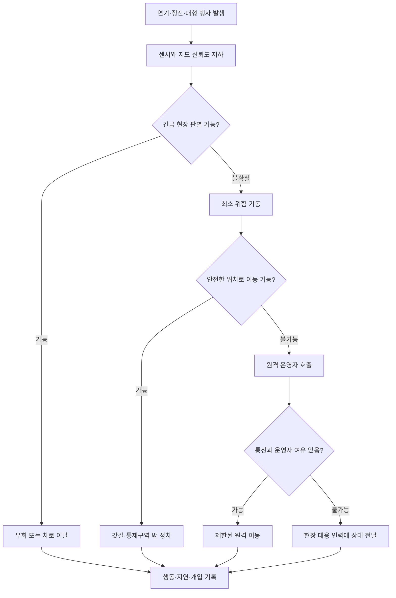

> 한 줄 요약: Zoox 로보택시 리콜의 핵심은 연기 감지 성능에만 있지 않다. 시야가 가려지고 통신이나 현장 통제가 불안정한 상황에서 차량이 스스로 길을 비울 수 있는지가 문제다.

## 무슨 일이 있었나: Zoox 로보택시 리콜

2026년 6월 20일, Zoox 로보택시 한 대가 짙은 연기로 뒤덮인 화재 현장에 들어갔다. 당시 현장에는 교통 통제용 콘이 설치되지 않은 상태였다.

미국 도로교통안전국(NHTSA)에 제출된 내용에 따르면 차량은 방향을 바꾸려다 급제동하고 멈췄다. 원격 운영자(Teleoperator)가 차량을 후진시킨 뒤에야 소방 인력이 콘을 설치할 수 있었다.

당시 탑승자는 없었으며 Zoox와 NHTSA가 파악한 인명 피해도 없다. 사건이 발생한 장소는 공개되지 않았다.

Zoox는 7월 7일 리콜을 결정하고 보유 차량 105대에 소프트웨어 업데이트를 배포했다. 회사는 특정 상황에서 짙은 연기를 감지하고 대응하는 기능을 기존 비상 현장 인식 체계에 추가했다고 설명했다.

공개된 내용은 여기까지다. 업데이트가 모든 종류의 연기나 화재 현장, 통신 장애에 대응하는지는 확인되지 않았다. Zoox도 적용 범위를 ‘특정 상황’으로 한정해 설명했다.

### 소프트웨어 업데이트와 리콜은 무엇이 다른가

이번 조치는 정비소에서 부품을 교체하는 전통적인 리콜과는 형태가 다르다. 무선 업데이트(OTA Update)로 수정했지만 안전 관련 결함을 고치는 조치이기 때문에 규제상 리콜로 처리됐다.

차량 105대가 모두 같은 사고를 겪었다는 뜻은 아니다. 문제가 발생할 수 있는 소프트웨어 구성을 사용하는 차량 전체에 수정본을 적용한 것이다.

업데이트가 빠르게 배포됐다고 해서 수정 효과까지 검증됐다고 볼 수는 없다. 어떤 조건에서 테스트했고, 대응에 실패하면 차량이 어떻게 움직이는지도 확인해야 한다.

Zoox는 회사가 경험한 이 유형의 사건은 이번이 유일하다고 밝혔다. 다만 2025년에도 급제동 문제와 승용차 충돌, 전동 스쿠터 관련 사고로 소프트웨어 리콜을 진행했다. 각 사건의 원인이 같다는 근거는 없다. 다만 자율주행차에서는 차량의 행동을 결정하는 코드가 반복해서 리콜 대상이 될 수 있다.

### NHTSA 경고는 리콜 이후에 나왔다

NHTSA의 조너선 모리슨 행정관은 7월 8일 자율주행 업체들에 긴급 대응 인력을 방해하지 말라는 서한을 보냈다. 긴급 현장을 감지하고 제대로 대응하지 못한다면 기능이 충분하지 않은 것이며, 이런 상황을 드문 극단 사례로 취급해서는 안 된다는 내용이었다.

Zoox가 리콜을 결정한 것은 이 서한이 나오기 하루 전이다. NHTSA의 경고 때문에 리콜이 시작됐다고 단정하기는 어렵다. 규제 당국과 사업자가 비슷한 시기에 같은 위험을 문제로 인식했다고 보는 편이 정확하다.

이 서한은 새로운 법규나 처벌 결정이 아니다. 자율주행 업체들에 즉각적인 개선을 요구한 규제 당국의 경고다.

## 왜 사람들이 반응했나: 연기는 엣지 케이스가 아니다

공개된 두 보도만으로 특정 커뮤니티의 반응이나 다수 의견을 판단할 수는 없다. 다만 개발자와 도시 운영자에게 이 사건이 중요한 이유는 분명하다. 정상 주행 성능보다 시스템이 실패했을 때 누가 통제권을 갖는지가 드러났기 때문이다.

### 신뢰: 멈추는 것만으로 안전한가

장애물을 만났을 때 정지하는 행동은 대체로 보수적인 선택이다. 그러나 화재 현장이나 구급차 이동로 한가운데에서는 멈춘 차량이 또 다른 장애물이 된다.

이번 차량은 충돌하지 않았지만 원격 운영자가 후진시키기 전까지 현장 대응을 방해할 수 있었다. 자율주행차의 최소 위험 기동(Minimal Risk Maneuver)은 단순히 멈추는 데서 끝나서는 안 된다. 상황에 따라 차로를 비우고 사람의 지시를 따르면서 추가 위험을 만들지 않아야 한다.

### 권한: 현장 지휘관과 차량 중 누가 우선인가

긴급 현장에서는 평소 교통 규칙만으로 해석하기 어려운 신호가 나온다. 연기와 점멸등이 시야를 방해하고, 임시 통제선이나 수신호에 따라 역방향으로 이동해야 할 수도 있다.

차량이 이런 상황을 이해하지 못하면 원격 운영자는 어디까지 개입할 수 있을까. 소방관이나 경찰관이 차량을 즉시 정지시키거나 이동시킬 수 있는지도 정해져 있어야 한다. 통신이 끊겼을 때 차량이 어느 방향으로 물러날지도 중요하다. 이런 권한과 절차가 실제 안전성을 좌우한다.

### 비용: 한 대의 예외가 도시 전체의 장애가 된다

개별 차량에서는 드문 사건이라도 축제나 정전, 산불 연기처럼 여러 차량이 같은 조건에 놓이면 계산이 달라진다. 차량마다 따로 발생하는 희귀 사고가 아니라 같은 원인으로 수십 대가 함께 멈추는 상관 장애(Correlated Failure)가 되기 때문이다.

샌프란시스코에서는 7월 4일 불꽃놀이 행사에 약 10만 명이 몰린 가운데 Waymo 차량들이 움직이지 못하거나 전력이 떨어져 주요 도로를 막았다. 시 교통 셔틀도 정체에 갇혔다. 2025년 12월 정전 때에도 다수의 차량이 멈춘 것으로 보도됐다.

대니얼 루리 샌프란시스코 시장은 자율주행차가 평소뿐 아니라 계획된 대형 행사와 돌발 사고에서도 안정적으로 작동해야 한다며 캘리포니아주 규제 당국에 기준 강화를 요청했다. 차량을 즉시 활성 차로 밖으로 이동시키는 능력도 요구 사항에 포함됐다.

아직 확정된 주 규정은 아니다. 시장이 주 교통 당국에 제도화를 요청한 단계다.

### 규제: 운전대를 없애기 전에 대체 수단이 있는가

Zoox 차량에는 운전대와 페달이 없다. 상용 운행을 하려면 일부 연방 자동차 안전기준에 대해 NHTSA의 면제를 받아야 한다. NHTSA는 완전 자율주행용 차량에서 브레이크 페달 요건을 없애는 방안도 제안한 상태다.

물리적 조작 장치를 제거하면 그 역할을 소프트웨어와 원격 운영 체계가 맡아야 한다. 차량 내부에서 운전자가 즉시 개입할 수 없기 때문에 복구 시간과 통신 장애 대응은 편의 기능이 아니라 안전 설계에 해당한다.

정체와 긴급 대응 지연은 도시가 감당하지만 운행 기준을 정하는 권한은 주와 연방 규제에 나뉘어 있다. 샌프란시스코 시장의 요구에는 이런 권한 차이도 반영돼 있다.

## 내가 보는 핵심: 자율주행의 ODD는 도시 비상상황까지 포함해야 한다

자율주행 시스템은 운행설계영역(Operational Design Domain, ODD) 안에서 성능을 검증한다. 보통 지역과 도로 종류, 날씨, 속도 등이 조건으로 제시되지만 실제 도시는 정해진 목록대로만 움직이지 않는다.

화재 연기와 정전, 대규모 행사, 임시 차단선은 도시에서 반복해서 발생한다. NHTSA가 긴급 현장을 엣지 케이스로 부르지 말라고 한 이유도 여기에 있다.

이번 사건을 연기 감지 모델의 문제로만 설명하기는 어렵다. 감지 결과가 경로 계획에 어떻게 반영되는지, 원격 운영자가 언제 개입하는지, 현장 인력에게 어떤 권한이 있는지까지 이어서 봐야 한다.

감지 기능을 개선하면 B에서 C로 넘어가는 정확도는 높아질 수 있다. 그러나 통신이 끊기거나 원격 운영자 호출이 한꺼번에 몰리는 상황, 차량이 이동할 공간이 없는 상황에 대응하지 못하면 도시 규모의 장애는 그대로 남는다.

이런 시스템을 검토할 때는 평균적인 자율주행 성공률보다 다음 내용을 먼저 확인해야 한다.

- 연기나 정전으로 센서 신뢰도가 낮아졌을 때 어떤 속도와 경로를 선택하는가
- 차로 한가운데 정지하지 않도록 보장하는 최소 위험 기동이 있는가
- 원격 운영자가 동시에 몇 대를 지원할 수 있으며 대규모 행사에서 용량이 어떻게 달라지는가
- 통신이 끊겨도 현장 대응 인력이 차량 상태를 확인하고 이동을 요청할 수 있는가
- 긴급 명령을 가장한 신호나 원격 조작 탈취를 막기 위한 인증과 감사 로그가 있는가
- 화재·사고 현장의 영상과 위치 데이터에 누가 접근하고 얼마나 보관하는가
- 업데이트 이후 동일 조건을 어떤 시나리오로 재현했고 결과를 규제 당국에 어떻게 제출했는가

원격 개입을 늘리면 차량을 복구할 가능성은 높아진다. 대신 통신 의존성과 운영 비용이 늘고, 영상 데이터 노출과 원격 명령 탈취 위험도 커진다. 현장 대응 기관이 차량을 직접 제어할 수 있으면 빠르게 길을 비울 수 있지만 인증 절차가 허술하면 공격 경로로 악용될 수 있다.

설계의 초점은 자동화와 수동 개입 가운데 하나를 선택하는 데 있지 않다. 개입 권한을 제한하고 모든 명령을 기록하며, 연결이 끊겨도 차량이 예측 가능한 상태로 전환되게 해야 한다.

## 앞으로 볼 기준: 다음 로보택시 리콜에서 확인할 것

비슷한 발표가 나오면 업데이트를 배포했다는 사실보다 적용 범위와 실패 시 행동을 확인해야 한다.

| 확인 항목 | 물어볼 질문 | 경계할 표현 |
|---|---|---|
| 적용 범위 | 어떤 연기 농도·거리·조명·도로 조건을 검증했나 | 일부 상황에서 개선 |
| 최소 위험 기동 | 정지가 아니라 활성 차로를 비울 수 있나 | 필요시 안전하게 정지 |
| 원격 운영 | 통신 장애와 동시다발 호출을 어떻게 처리하나 | 사람이 언제든 개입 |
| 긴급 대응 연동 | 소방·경찰의 수신호와 임시 통제를 어떻게 인식하나 | 비상 차량 감지 지원 |
| 집단 장애 | 정전·행사 때 전체 차량을 분산하거나 회수할 수 있나 | 개별 차량 테스트 완료 |
| 검증 근거 | 재현 조건과 실패율, 배포 후 관찰 결과가 공개됐나 | 문제 해결 완료 |
| 데이터·보안 | 현장 영상 접근과 원격 명령을 어떻게 통제하나 | 업계 표준 보안 적용 |

Zoox 사례 한 건만으로 모든 자율주행차가 긴급 현장에 부적합하다고 단정할 수는 없다. 원격 운영자가 차량을 이동시켰고 알려진 인명 피해도 없었다.

하지만 한 번뿐이었다는 설명만으로 끝낼 일도 아니다. 대규모 행사에서는 여러 차량이 같은 조건에 놓이고, 긴급 현장에서는 잠깐 멈춘 차량도 소방차나 구급차의 이동을 막을 수 있다.

확인해야 할 것은 감지 모델의 성능만이 아니다. 차량이 판단하지 못했을 때 도시와 현장 인력이 통제권을 되찾을 수 있어야 한다. 다음 리콜 공지에서는 업데이트 속도와 함께 이런 복구 절차가 공개됐는지 살펴볼 필요가 있다.

## 참고 자료

- [선정 글감] [Zoox issues software recall after a robotaxi got confused by heavy smoke](https://techcrunch.com/2026/07/17/zoox-issues-software-recall-after-a-robotaxi-got-confused-by-heavy-smoke/) — TechCrunch
- [관련] [San Francisco mayor pushes for tougher rules after the Waymo traffic fiasco](https://techcrunch.com/2026/07/16/san-francisco-mayor-pushes-for-tougher-rules-after-the-waymo-traffic-fiasco/) — TechCrunch