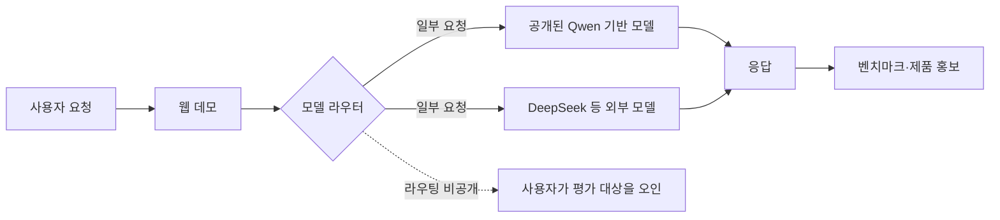

> 한 줄 요약: Basalt Labs의 HLE 99.44% 주장보다 먼저 확인할 것은 Qwen2.5-7B-Instruct 기반 공개 모델과 DeepSeek로 의심받은 웹 서비스가 같은 평가 대상이었는지다. 모델 라우팅을 썼다면 사용자가 무엇을 평가하는지 밝혀야 벤치마크를 검증할 수 있다.

## 무슨 일이 있었나

2026년 7월 19일 기준, Reddit의 LocalLLaMA 커뮤니티에 Basalt Labs의 모델 공개와 벤치마크 주장을 문제 삼는 게시물이 올라왔다. 제목에는 Basalt Labs가 도구를 사용한 HLE(Humanity’s Last Exam)에서 99.44%를 기록했다고 주장했지만, 공개 모델은 Qwen2.5-7B-Instruct 기반이고 웹사이트에서 제공하는 모델은 DeepSeek라는 의혹이 담겼다.

확인할 수 있는 범위부터 짚어야 한다. 현재 제공된 Reddit 자료에는 본문과 검증 로그가 없고 게시물 제목만 있다. 아래 내용은 확인된 사실이 아니라 커뮤니티 사용자의 주장이다.

| 구분 | 현재 자료에서 말할 수 있는 내용 |
|---|---|
| 확인된 사실 | LocalLLaMA에 Basalt Labs의 모델 정체성과 HLE 점수를 문제 삼는 게시물이 등록됐다 |
| 커뮤니티 주장 | 도구 사용 조건에서 HLE 99.44%를 내세웠다 |
| 커뮤니티 주장 | 공개 가중치는 Qwen2.5-7B-Instruct 기반이다 |
| 커뮤니티 주장 | 웹사이트의 실제 응답 모델은 DeepSeek다 |
| 아직 확인되지 않은 부분 | 모델 식별 방법, 요청별 라우팅 여부, HLE 실행 설정, 원시 결과와 재현 로그 |

게시물 제목에 쓰인 사기라는 표현도 확정된 판정이 아니라 의혹 제기다. 모델 카드와 서버 설정, API 응답, 평가 코드가 공개되지 않은 상태에서는 고의로 사용자를 속였는지 알 수 없다. 모델 라우팅(Model Routing)을 제대로 설명하지 않았거나 탐지 과정에서 다른 모델로 잘못 판단했을 가능성도 있다.

그렇다고 Basalt Labs의 설명 책임이 사라지는 것은 아니다. 99.44%처럼 매우 높은 수치를 제품 홍보에 썼다면 어떤 모델을 사용했고, 어떤 도구와 데이터에 접근했으며, 어떻게 채점했는지 검증할 수 있어야 한다.

## 왜 사람들이 반응했나

### HLE 99.44%는 왜 강한 의심을 부르나

숫자가 워낙 높기 때문이다. 점수가 높을수록 사용자는 그 결과가 모델 자체의 능력인지, 검색이나 코드 실행 같은 외부 도구를 포함한 시스템의 성능인지 구분하려 한다.

도구 사용 조건의 HLE 점수라면 적어도 다음 질문에는 답해야 한다.

- 평가에 사용한 정확한 모델 체크포인트는 무엇인가
- 검색, 브라우저, 코드 실행기 중 어떤 도구를 허용했는가
- 도구가 접근한 데이터의 시점과 범위는 어디까지인가
- 문제별 시도 횟수와 재시도 정책은 어떻게 설정했는가
- 답안 채점에 별도 모델을 사용했는가
- 실패한 실행과 중단된 요청도 분모에 포함했는가
- 평가 코드와 원시 출력, 비용 내역을 공개할 수 있는가

이 정보가 없으면 99.44%가 모델의 성능인지 에이전트 시스템의 성능인지 구분하기 어렵다. 같은 숫자라도 로컬에서 내려받은 공개 가중치의 결과와 외부 검색을 사용하는 서버 제품의 결과는 의미가 전혀 다르다.

### 공개 모델과 웹 데모가 달라도 되는가

웹 데모가 공개 가중치와 다른 모델을 쓰는 일은 있을 수 있다. 부하와 비용, 안전 필터, 요청 난이도에 따라 여러 모델로 요청을 보내는 라우터를 둘 수 있기 때문이다.

문제는 사용자가 그 사실을 알 수 있었느냐다. 공개 모델을 시험하는 페이지처럼 보이는데 실제 요청은 다른 모델로 전달된다면, 사용자는 다운로드할 수 있는 모델의 품질을 평가했다고 오해할 수 있다.

이 다이어그램은 확인된 구성을 그린 것이 아니다. 공개 모델과 웹 응답이 다르다는 의혹을 설명할 수 있는 가설 가운데 하나다. 웹사이트가 처음부터 다른 모델만 제공했을 수도 있고, 여러 모델을 섞었을 수도 있다. 모델 판별 자체가 틀렸을 가능성도 남아 있다.

### 왜 모델 라우팅 설명이 변명이 될 수 없는가

Hugging Face에 2026년 7월 15일 공개된 IBM Research 글은 모델 선택을 시스템 최적화 문제로 설명한다. 단순 분류만으로는 실제 운영 조건을 다룰 수 없다는 취지다. 같은 CodeAct 에이전트로 AppWorld Test Challenge의 417개 작업을 수행했을 때 Claude Sonnet 4.6은 총 79달러, 작업당 0.19달러였고 GPT-4.1은 총 155달러, 작업당 0.37달러였다고 한다.

표면적인 토큰 가격만 보면 반대 결과를 예상할 수 있다. 하지만 반복되는 컨텍스트의 캐시 적중률과 캐시 읽기 가격이 실제 비용을 바꿨다는 설명이다. 라우팅 결과는 모델 이름만으로 정해지지 않는다. 캐시와 도구 호출, 추론 단계, 실패율, 재시도까지 함께 따져야 한다.

웹 데모가 다른 모델을 선택했다는 이유만으로 곧바로 부정행위라고 할 수 없는 이유다. 그렇다고 운영자가 라우팅을 숨긴 채 단일 모델의 성능처럼 홍보해도 된다는 뜻은 아니다. 시스템 최적화 결과를 공개 가중치 하나의 능력으로 포장하면 비용을 줄이기 위한 운영 방식이 모델 정체성 문제로 번진다.

## 내가 보는 핵심

이번 논쟁에서 봐야 할 것은 성능 주장을 나중에라도 추적하고 검증할 수 있느냐다. 모델 파일만 공개해서는 부족하다. 어떤 모델을 어떤 조건에서 평가했는지 확인할 수 있는 기록도 함께 있어야 한다.

그 기록에는 다음 내용이 이어져야 한다.

- 배포한 가중치의 저장소, 버전, 해시
- 웹 서비스가 실제 호출한 모델과 라우팅 규칙
- 시스템 프롬프트와 허용한 도구
- 벤치마크 데이터 버전과 평가 코드
- 문제별 원시 출력과 채점 결과
- 실행 시점의 비용, 지연시간, 캐시 및 재시도 정책

하나라도 빠지면 사용자는 같은 결과를 재현하기 어렵다. 특히 모델 이름과 웹 데모 설명 옆에 벤치마크 점수가 함께 표시되면 사용자는 모두 같은 시스템을 가리킨다고 받아들이기 쉽다.

현업에서 라우터를 넣는 이유는 현실적이다. 쉬운 요청은 저렴한 모델로 보내고 복잡한 요청은 성능이 더 좋은 모델로 넘기면 비용과 품질을 조절할 수 있다. 하지만 제품 내부의 최적화 방식과 외부에 공개하는 성능 주장은 구분해서 문서화해야 한다.

웹 서비스에는 요청을 실제로 처리한 모델을 확인할 수 있는 추적 ID를 제공할 수 있다. 벤치마크 보고서에는 단일 모델 평가인지 라우팅된 에이전트 평가인지 표시해야 한다. 공개 가중치의 모델 카드에도 웹 데모와 구성이 다르다면 그 차이를 눈에 띄게 적어야 한다.

커뮤니티의 모델 식별이 항상 정확하다고 볼 수도 없다. 문체나 일부 질문의 응답만으로 기반 모델을 추정했다면 시스템 프롬프트나 양자화, 미세조정, 디코딩 설정 때문에 잘못 판단할 수 있다. 이런 의혹을 반박하려면 말로만 해명하기보다 요청 로그와 모델 버전, 평가 구성을 공개하는 편이 낫다.

## 앞으로 볼 기준

유난히 높은 오픈 모델 점수나 웹 데모가 등장하면 순위표를 보기 전에 평가 대상의 범위부터 확인해야 한다.

- 점수가 다운로드 가능한 가중치에서 나온 것인가
- 웹 데모와 공개 모델이 같은 체크포인트를 사용하는가
- 모델 라우팅이 있다면 사용자에게 고지했는가
- 도구 사용 점수를 모델 단독 점수와 분리했는가
- 평가 설정과 원시 출력으로 제3자가 재현할 수 있는가
- 비용과 지연시간에 캐시, 실패, 재시도가 포함됐는가
- 주장에 문제가 제기됐을 때 수정 이력과 해명이 남는가

현재 자료만으로는 Basalt Labs를 둘러싼 의혹의 사실 여부를 판정하기 어렵다. 그래도 커뮤니티가 왜 반응했는지는 알 수 있다. 공개 모델을 시험했다고 생각했는데 실제로는 다른 모델의 응답을 받은 것일 수 있다는 의심은 점수 오류보다 모델 정체성에 대한 신뢰를 더 크게 흔든다.

99.44%가 사실인지 따지기 전에 물어야 할 게 있다. 그 점수를 만든 시스템과 사용자가 내려받는 모델이 정말 같은 대상인가. 답은 홍보 문구가 아니라 재현 가능한 로그와 평가 설정에서 나와야 한다.

## 참고 자료

- [선정 글감] [Basalt Labs의 HLE 점수와 서비스 모델에 관한 의혹 제기](https://www.reddit.com/r/LocalLLaMA/comments/1uztylz/basalt_labs_pulling_a_generationally_dumb_scam/) (Reddit LocalLLaMA)
- [관련] [Model Routing Is Simple. Until It Isn’t.](https://huggingface.co/blog/ibm-research/model-routing-is-simple-until-it-isnt) (Hugging Face Blog / IBM Research)