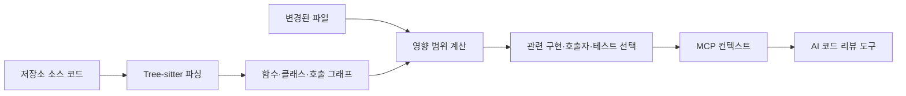

> 한 줄 요약: code-review-graph는 82배 토큰 절감을 앞세워 GitHub Trending에 올랐다. AI 코드 리뷰에서 모델 성능만큼 어떤 코드를 읽힐지 정하는 컨텍스트 관리가 중요해졌다는 사례다.

## 무슨 일이 있었나

AI 코드 리뷰 도구가 저장소를 이해하려면 관련 파일을 정확히 골라야 한다. 이 과정이 어긋나면 같은 코드를 반복해서 읽거나 변경의 영향을 받는 파일을 놓친다. 저장소가 커질수록 토큰 비용이 늘고 검토 시간과 결과의 일관성도 흔들린다.

2026년 7월 19일 수집된 GitHub Trending 스냅샷에서 `tirth8205/code-review-graph`는 누적 20,007개 스타, 당일 356개 스타로 표시됐다. 특정 시점의 수치이므로 현재 값이나 장기적인 채택 규모를 뜻하지는 않는다.

code-review-graph는 저장소를 트리시터(Tree-sitter)로 파싱해 함수, 클래스, 임포트, 호출 관계, 상속, 테스트 연결을 그래프로 저장한다. 파일이 바뀌면 호출자와 의존 파일, 관련 테스트를 추적해 변경 영향 범위(Blast Radius)를 계산한다. 이렇게 추린 부분만 모델 컨텍스트 프로토콜(Model Context Protocol, MCP)을 거쳐 AI 도구에 전달한다.



초기 빌드가 끝나면 파일 저장이나 지원되는 커밋 훅을 감지해 변경분만 다시 파싱한다. 프로젝트 설명에 따르면 500개 파일 규모의 초기 빌드는 약 10초, 2,900개 파일 규모의 증분 재색인은 2초 미만이 걸린다. 제공자가 공개한 측정 결과일 뿐, 모든 언어와 저장소에서 보장되는 성능은 아니다.

설치 명령은 Codex, Cursor, Claude Code, Gemini CLI, Kiro, GitHub Copilot 등 감지된 플랫폼의 MCP 설정을 작성한다. 지원 플랫폼에는 훅과 스킬을 설치하고 플랫폼 규칙에 그래프 사용 지침을 추가한다.

```bash
pip install code-review-graph
code-review-graph install
code-review-graph build
```

GitHub Action으로도 쓸 수 있다. 풀 리퀘스트마다 함수별 위험도, 영향을 받는 실행 흐름, 테스트 공백을 하나의 갱신형 댓글로 남긴다. 필요하면 위험 점수를 병합 차단 조건으로 설정할 수 있다. 프로젝트가 말하는 로컬 우선(Local-first)은 그래프 생성과 조회가 CI 러너 안에서 처리된다는 의미다.

공개 자료로 확인되는 기능은 여기까지다. 커뮤니티 전체가 비용 절감 효과에 동의한다거나 기존 코드 검색을 대체했다고 판단할 근거는 없다. GitHub Trending 진입과 스타 증가 속도는 관심도를 보여줄 뿐 만족도나 정확도를 입증하지는 않는다.

## 왜 사람들이 반응했나

### AI 코드 리뷰에서 토큰 낭비가 왜 불편할까?

AI 코딩 도구 사용량이 늘면서 토큰 비용도 눈에 보이기 시작했다. 더 까다로운 문제는 컨텍스트가 크다고 리뷰 품질까지 좋아지지는 않는다는 점이다.

관련 없는 파일이 많이 들어가면 핵심 변경이 묻힌다. 반대로 검색 결과 몇 개만 읽히면 간접 호출자나 설정 파일, 테스트 코드처럼 이름만으로 찾기 어려운 관계를 놓칠 수 있다. 개발자에게 필요한 것은 무조건 작은 컨텍스트가 아니라 필요한 관계를 유지하면서 줄인 컨텍스트다.

code-review-graph가 관심을 받은 이유도 이 문제를 직접 건드렸기 때문이다. 모델을 바꾸거나 프롬프트를 늘리는 대신 저장소 앞단에 계속 갱신되는 구조 지도를 두자는 접근이다.

### 82배 토큰 절감은 어디까지 믿어야 할까?

프로젝트는 6개 오픈소스 저장소와 13개 커밋을 사용한 평가에서 질문당 토큰 사용량 중앙값이 약 82배 줄었다고 밝혔다. 범위는 38배에서 528배다. 자주 인용되는 528배는 FastAPI에서 측정된 단일 최댓값이다.

| 저장소 | 전체 코퍼스 기준 토큰 | 그래프 조회 토큰 | 제시된 감소율 |
|---|---:|---:|---:|
| FastAPI | 951,071 | 2,169 | 528.4배 |
| code-review-graph | 208,821 | 2,495 | 93.0배 |
| Gin | 166,868 | 1,990 | 91.8배 |
| Flask | 125,022 | 1,986 | 71.4배 |
| Express | 135,955 | 3,465 | 40.6배 |
| HTTPX | 89,492 | 2,438 | 38.0배 |

문제는 비교 기준인 전체 코퍼스 읽기가 실제 에이전트가 매번 쓰는 비용의 상한에 가깝다는 데 있다. 프로젝트 설명도 유능한 에이전트라면 식별자를 검색해 유력한 파일만 읽으므로 이 기준이 현실적인 기본값은 아니라고 인정한다.

별도로 제공한 에이전트 기준선에서는 문자열 검색 결과 상위 3개 파일과 그래프 조회 비용을 비교한다. 또 다른 공식 평가에서는 변경 범위가 아주 작을 때 그래프 응답이 변경 파일 자체보다 커져 절감 비율이 1 아래로 내려가기도 한다. 그래프가 영향 관계와 코드 조각을 함께 반환하기 때문이다.

따라서 82배를 AI 코드 리뷰 비용이 언제나 82분의 1로 줄어든다는 약속으로 받아들이면 안 된다. 전체 저장소를 입력하는 방식과 특정 질문 집합을 비교한 결과다. 재현 설정과 고정된 저장소 SHA가 공개돼 검증하기는 쉽지만, 실제 효과는 팀의 언어 구성과 질문 유형으로 다시 측정해야 한다.

### 정확도 수치에도 같은 주의가 필요하다

프로젝트가 제시한 변경 영향 분석의 평균 F1은 0.71이다. 13개 평가 커밋에서 재현율 1.0을 기록했다고 하지만 정답 데이터가 같은 그래프의 호출·임포트 간선으로 만들어졌다. 독립적인 정답과 비교해 100%를 탐지했다는 뜻은 아니다.

이 차이를 빼놓으면 그래프가 실제 장애 가능성을 모두 찾아낸다고 오해하기 쉽다. 정적 관계 그래프는 동적 디스패치, 런타임 설정, 문자열 기반 라우팅, 리플렉션, 외부 서비스 계약처럼 소스 구조에 직접 드러나지 않는 연결에 약할 수 있다.

프로젝트가 PHP의 Composer PSR-4, Blade, Laravel Route와 Eloquent 관계 등 일부 프레임워크 의미를 따로 보강한 점도 일반 구문 트리만으로는 부족하다는 사실을 보여준다. 지원 언어가 많다는 것과 각 생태계의 의미를 같은 깊이로 해석한다는 것은 다른 이야기다.

### 로컬 우선이면 코드가 외부로 나가지 않을까?

그래프 데이터베이스가 로컬에서 만들어지고 CI 러너 안에서 조회되는 점은 장점이다. 다만 로컬 우선이라는 표현이 전체 데이터 흐름까지 로컬에서 끝난다는 뜻은 아니다.

MCP가 고른 코드 조각을 외부 호스팅 AI 모델에 전달하면 그 조각은 여전히 조직 밖으로 나갈 수 있다. code-review-graph는 전송 범위를 줄일 수 있지만 연결된 AI 제공자의 데이터 보존이나 학습 정책까지 바꾸지는 않는다.

확인할 경계는 다음과 같다.

- 그래프 생성 과정에서 소스가 어디에 저장되는가
- MCP 서버가 어떤 파일과 메타데이터를 반환할 수 있는가
- AI 클라이언트가 받은 컨텍스트를 어느 모델로 전송하는가
- CI 로그와 풀 리퀘스트 댓글에 민감한 함수명이나 코드 조각이 남는가
- 캐시와 그래프 데이터베이스가 언제 삭제되는가

특히 풀 리퀘스트 댓글은 저장소 접근 권한을 가진 더 많은 사람에게 노출될 수 있다. 로컬 처리 여부만 확인하고 출력 결과의 공개 범위를 놓치면 데이터 통제에 빈틈이 생긴다.

## 내가 보는 핵심

내가 이 프로젝트에서 눈여겨본 부분은 그래프 기술 자체보다 AI에 읽힐 코드를 고르는 계층이 독립된 도구가 됐다는 점이다. 코드 리뷰 품질은 모델과 프롬프트뿐 아니라 컨텍스트 선택 방식에도 크게 좌우된다.

기존에는 에이전트가 `grep`, 파일명 검색, 임포트 추적을 작업할 때마다 수행했다. code-review-graph는 이 탐색 결과를 계속 갱신되는 인덱스로 옮긴다. 반복 작업은 줄지만 인덱스가 최신인지, 파서가 코드를 제대로 해석했는지, 간선이 정확한지를 따로 관리해야 한다.

현업에서 이런 도구를 검토할 때는 토큰 절감률보다 누락 비용부터 따져야 한다. 관련 없는 파일 하나를 더 읽는 데는 몇천 토큰이 들 수 있다. 반면 결제나 권한 검사의 간접 호출자를 놓치면 장애나 보안 사고로 이어질 수 있다.

그래프는 리뷰어를 대신하는 판정기보다 조사 범위를 제안하는 검색 계층으로 쓰는 편이 안전하다. 위험도가 높은 변경이라면 그래프 결과와 함께 다음 경로도 확인해야 한다.

- 변경 파일과 직접 의존 관계
- 소유권 규칙과 코드 오너(Code Owners)
- 테스트 실행 결과와 커버리지 변화
- API·이벤트·데이터베이스 스키마 변경
- 런타임 호출 추적과 운영 관측 데이터
- 인증, 결제, 개인정보 처리 경로에 대한 수동 검토

자동 설치가 건드리는 범위도 넓다. 명령 하나가 여러 AI 도구의 MCP 설정을 쓰고 훅이나 스킬을 설치하며 플랫폼 규칙에 지침을 추가한다. 저장소 분석 도구에 설정 변경 권한까지 주는 셈이다.

프로젝트 설명에 따르면 제거할 때는 작업 트리 루트를 정규화하고 저장소가 아닌 디렉터리를 거부하며 자신이 소유한 항목만 삭제한다. 공유 설정은 원자적으로 교체하고 `uninstall --dry-run`으로 변경 대상도 미리 확인할 수 있다. 제거 절차는 꼼꼼하게 설계됐지만 설치 전에 변경 목록을 따로 확인하는 운영 절차는 여전히 필요하다.

## 앞으로 볼 기준

### code-review-graph 도입 전에 무엇을 확인해야 할까?

첫 번째는 비교 대상이다. 전체 저장소 입력 방식이 아니라 현재 사용하는 에이전트의 검색 방식과 비교해야 한다. 같은 변경과 같은 질문을 사용해 입력 토큰, 응답 시간, 관련 파일 누락, 리뷰 지적의 유효성을 함께 기록해야 한다.

두 번째는 그래프가 실패하는 조건이다. 언어를 지원한다는 설명만 보지 말고 팀이 쓰는 프레임워크와 코드 생성 방식, 모노레포 빌드 시스템, 런타임 라우팅까지 관계로 표현되는지 작은 표본으로 확인해야 한다.

세 번째는 최신성이다. 훅이 비활성화되거나 워크트리가 복구됐을 때 그래프가 오래된 상태로 남는지 살펴봐야 한다. 브랜치 전환과 리베이스 뒤에 어떻게 다시 맞춰지는지도 확인 대상이다. 인덱스 속도보다 오래된 인덱스를 감지하는 장치가 더 중요할 수 있다.

네 번째는 권한과 공급망이다. 설치 프로그램이 수정하는 MCP 설정, 플랫폼 규칙, 훅 파일을 버전 관리하거나 변경 전후로 비교할 수 있어야 한다. GitHub Action은 태그만 믿기보다 가능한 범위에서 커밋 SHA를 고정하고 최소 권한을 적용해야 한다. 외부 기여자의 풀 리퀘스트에 시크릿이 노출되지 않는지도 확인해야 한다.

다섯 번째는 병합 차단 기준이다. 위험 점수를 곧바로 게이트로 사용하면 오탐이 개발 흐름을 막고 팀은 금세 경고를 무시하게 된다. 초기에는 댓글만 남기는 관찰 모드로 운영하며 실제 결함과의 상관관계를 모은 뒤 차단 임계값을 정하는 편이 낫다.

비슷한 도구가 몇십 배의 컨텍스트 절감을 내세울 때는 숫자보다 먼저 물어야 한다. 덜 읽게 만들었을 때 무엇을 놓치는가.

컨텍스트 창이 길다고 코드 리뷰가 저절로 좋아지지는 않는다. 어떤 도구에 코드 선택을 맡길지, 그 선택이 틀렸다는 사실을 어떻게 감지할지가 실제 운영에서 더 중요하다.

## 참고 자료

- [선정 글감] [tirth8205/code-review-graph (GitHub)](https://github.com/tirth8205/code-review-graph)