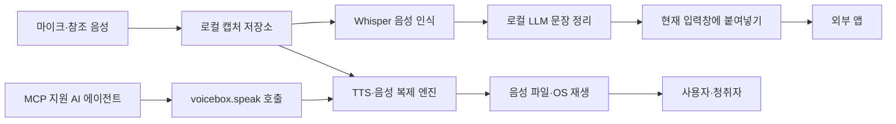

> 한 줄 요약: Voicebox를 볼 때 따져야 할 것은 음성을 얼마나 그럴듯하게 만드느냐가 아니다. 내 목소리와 녹음 파일을 누가 관리하고, 운영체제와 AI 에이전트에 어떤 권한을 줄 것인지가 더 중요하다.

## 무슨 일이 있었나

오픈소스 AI 음성 스튜디오 Voicebox가 GitHub Trending 상위권에 올랐다. 제공된 스냅샷에서 저장소는 별 43,097개를 기록했고, 하루 증가량은 629개로 표시됐다.

스냅샷에는 Trending 집계 시각이 적혀 있지 않다. 이 수치는 장기적인 사용자 만족도나 보안 검증 결과가 아니라, 특정 시점에 개발자의 관심이 빠르게 모였다는 사실만 보여준다.

Voicebox는 ElevenLabs와 WisprFlow의 기능을 한 애플리케이션에 합친 로컬 우선(Local-first) 대안이라고 소개한다. 몇 초 분량의 참조 음성으로 목소리를 복제하고, 텍스트 음성 변환(Text-to-Speech, TTS), Whisper 기반 음성 인식(Speech-to-Text, STT), 전역 단축키 받아쓰기, MCP 연동을 한곳에서 처리한다.

저장소에 기재된 기능은 다음과 같다.

| 영역 | 저장소에서 확인되는 기능 |
|---|---|
| 음성 생성 | 7개 TTS 엔진, 최대 23개 언어 |
| 음성 복제 | 참조 오디오를 이용한 제로샷 복제 |
| 받아쓰기 | Whisper 기반 STT와 전역 단축키 |
| 편집 | 장문 자동 분할, 크로스페이드, 다중 트랙 Stories 편집기 |
| 에이전트 연동 | MCP 서버와 REST API를 통한 음성 출력 |
| 실행 환경 | macOS, Windows, Docker, Linux 빌드 지원 |
| 로컬 데이터 | 원본 녹음, 변환문, 음성 프로필을 로컬 데이터 디렉터리에 보관 |

프로젝트 설명에 따르면 모델과 음성 데이터, 녹음 캡처는 기기 밖으로 전송되지 않는다. 생성 작업은 직렬 큐로 처리해 그래픽처리장치(GPU) 경합을 줄이고, 실패한 작업은 재시도할 수 있다.

여기까지는 저장소가 공개한 설계와 기능이다. 실제 배포 바이너리가 모든 네트워크 통신을 차단하는지, 포함된 모델과 의존성의 라이선스가 상업적 이용까지 허용하는지, 업데이트 과정에서 어떤 정보가 전송되는지는 저장소 설명만으로 확인할 수 없다.

정책이나 규제가 바뀐 사건도 아니다. 이번에 확인된 사실은 Voicebox가 음성 복제와 받아쓰기, AI 에이전트 발화를 하나의 로컬 애플리케이션으로 묶었고 GitHub에서 빠르게 관심을 얻었다는 데까지다.

## 왜 사람들이 반응했나

### 로컬 AI 음성 복제가 해결하는 불편은 무엇인가

음성 작업은 데이터 경계가 모호한 분야다. 일반적인 클라우드 서비스에서는 사용자가 녹음한 원본과 복제용 샘플, 생성할 문장, 생성된 결과물이 서버로 이동할 수 있다.

그 문장이 미공개 제품명이나 고객 상담 내용, 의료 기록, 회의 메모라면 전송 여부부터 검토해야 한다. Voicebox는 이 과정을 로컬 기기 안에서 처리하겠다고 제안한다.

입력과 출력이 같은 로컬 파이프라인에 들어온다는 점이 눈에 띈다. 받아쓴 내용을 다듬어 복제 음성으로 읽거나, AI 에이전트의 답변을 특정 목소리로 출력하는 작업을 하나의 인터페이스에서 구성할 수 있다.

로컬에서 실행한다고 신뢰 문제가 사라지는 것은 아니다. 신뢰할 대상이 클라우드 사업자에서 애플리케이션 바이너리와 다운로드한 모델, 로컬 저장소, 운영체제 권한, 사용자의 백업 정책으로 옮겨간다.

### GitHub Trending의 반응은 지지와 같은가

이번 스냅샷에는 GitHub 토론이나 이슈 댓글, 보안 감사 결과가 포함돼 있지 않다. 개발자 커뮤니티가 특정 기능을 지지했다거나 음성 복제 논쟁이 벌어졌다고 단정할 근거는 없다.

확인할 수 있는 것은 별 수와 일일 증가량이다. 별은 관심이나 나중에 다시 찾아보려는 의사를 나타낼 수 있지만, 실제 설치 수나 지속 사용률, 안전성에 대한 승인을 뜻하지는 않는다.

구독형 음성 서비스의 비용과 데이터 전송을 피하고 싶은 사용자에게 Voicebox는 매력적이다. 동시에 타인의 음성을 손쉽게 복제해 에이전트가 그 목소리로 말하게 만들 수도 있다.

이 기능은 접근성 도구로 쓸 수도 있고 사칭에 악용할 수도 있다. 그래서 Voicebox에는 일반적인 데스크톱 TTS 앱보다 확인해야 할 문제가 많다.

### 음성 소유와 사용 동의는 같은 말이 아니다

프로젝트는 사용자가 소유한 목소리로 에이전트와 대화할 수 있다고 설명한다. 하지만 음성 파일을 가지고 있다는 사실과 그 목소리를 복제할 권리가 있다는 사실은 다르다.

회의 녹음이나 영상 클립, 메신저 음성 파일을 기술적으로 불러올 수 있더라도 당사자가 복제와 재사용에 동의했다고 볼 수는 없다. 팀이나 서비스에서 음성 프로필을 공유한다면 생성물 표시 방식과 이용 목적, 보관 기간, 삭제 절차도 정해야 한다.

음성 복제 기능이 로컬에서 실행돼도 청취자가 겪을 사칭 위험까지 기기 안에 머무르지는 않는다. 생성된 오디오가 메신저나 영상 플랫폼으로 나가는 순간 문제의 범위도 기기 밖으로 넓어진다.

### 개인정보를 안 보내도 운영체제 권한은 남는다

Voicebox의 전역 받아쓰기는 macOS에서 접근성(Accessibility)과 입력 모니터링(Input Monitoring) 권한을 사용한다. 현재 선택된 입력창에 문장을 넣기 위해 클립보드 내용을 잠시 저장했다가 복원하는 방식도 설명돼 있다.

기능에 필요할 수는 있지만 상당히 넓은 권한이다. 어느 앱에서든 단축키를 감지하고 현재 입력 대상을 알아야 전역 받아쓰기가 작동하기 때문이다.

현업에서 비슷한 도구를 검토하다 보면 로컬 실행 여부만 확인하고 권한 검토를 끝내기 쉽다. 실제로 확인해야 할 질문은 다음과 같다.

- 마이크 녹음은 사용자가 명시적으로 누른 동안에만 이뤄지는가
- 캡처 원본과 변환문은 어디에, 얼마나 오래 남는가
- 운영체제 백업이나 동기화 대상에 해당 폴더가 포함되는가
- 클립보드 복원 실패나 애플리케이션 충돌 시 민감한 내용이 남는가
- 접근성 권한을 철회하면 어떤 기능이 중단되는가

## 내가 보는 핵심

### 로컬 우선과 비공개는 왜 같은 말이 아닐까

Voicebox 사례는 로컬 우선 애플리케이션에서 흔히 생기는 문제를 보여준다. 데이터가 외부 서버로 전송되지 않으면 제3자가 보관하거나 전송 중 노출될 위험은 줄어든다. 그 대신 사용자가 패치와 디스크 암호화, 계정 분리, 백업, 삭제를 직접 관리해야 한다.

캡처 기능을 보면 차이가 더 분명하다. Voicebox는 받아쓰기와 앱 내 녹음, 업로드한 오디오의 원본과 변환문을 보존한다. 이를 다시 변환하거나 음성 프로필 샘플로 지정할 수도 있다.

재사용하기에는 편하지만 보관되는 데이터도 늘어난다. 로컬 저장은 자동 삭제가 아니라 저장 위치가 내 컴퓨터라는 뜻이다.

AI 에이전트 연동도 마찬가지다. `voicebox.speak` 같은 도구 호출 하나로 에이전트가 복제된 목소리를 쓸 수 있다. 편리한 만큼 에이전트에 새로운 출력 채널과 권한을 주는 셈이다.

프로젝트는 에이전트가 말할 때 화면 오버레이를 띄우고 음성 프로필 이름을 표시한다고 설명한다. 사용자가 백그라운드 발화를 알아차리는 데는 도움이 된다.

오버레이만으로 권한 문제가 해결되지는 않는다. 어떤 클라이언트가 MCP 서버에 접속할 수 있는지, 임의의 텍스트를 읽게 할 수 있는지, 외부에서 REST API에 접근할 수 있는지, 로그에 민감한 문장이 남는지는 따로 확인해야 한다.

### 일곱 개 엔진은 선택권이면서 검토 대상이다

Voicebox는 Qwen3-TTS, LuxTTS, Chatterbox, TADA, Kokoro 등 여러 엔진을 바꿔가며 사용할 수 있다. 엔진마다 지원 언어와 그래픽 메모리 사용량, 감정 표현, 장문 생성 성능이 다르기 때문이다.

엔진을 바꿀 수 있어 특정 공급자에 덜 묶인다. 대신 모델마다 라이선스와 출처, 하드웨어 요구 조건, 생성 품질이 다르므로 각각 확인해야 한다.

감정 태그도 모든 엔진에서 같은 방식으로 동작하지 않는다. 프로젝트 설명에 따르면 `[laugh]`, `[sigh]` 같은 태그를 해석하는 엔진은 Chatterbox Turbo다. 일부 다른 엔진은 태그를 문자 그대로 읽을 수 있다.

50,000자 장문 생성 역시 전체 문장을 한 번에 같은 품질로 합성한다는 뜻은 아니다. 문장 경계에서 텍스트를 나누고 각 조각을 생성한 뒤 크로스페이드로 연결한다. 조각 사이에서 억양이나 속도, 화자 특성이 미세하게 달라지는지 직접 테스트해야 한다.

이 차이를 감춘 채 모든 엔진을 같은 기능처럼 소개하면 사용자는 특정 모델의 오류를 제품 전체의 결함으로 받아들이기 쉽다. 실무에서는 모델 이름과 버전, 시드, 효과 체인, 사용한 원본을 결과물과 함께 기록해야 문제를 재현하고 조건을 확인하기 쉽다.

## 앞으로 볼 기준

### Voicebox 설치 전에 무엇을 확인해야 할까

개인용 실험과 조직 배포에는 다른 기준이 필요하다. 다운로드 전에 아래 항목부터 확인해야 한다.

| 확인 항목 | 실제 질문 |
|---|---|
| 음성 권리 | 복제할 목소리의 당사자 동의를 증명할 수 있는가 |
| 데이터 경로 | 원본 음성, 변환문, 생성물이 저장되는 정확한 경로는 어디인가 |
| 네트워크 | 실행 중 외부 연결이 발생하며 목적과 대상이 문서화돼 있는가 |
| 운영체제 권한 | 접근성, 입력 모니터링, 마이크 권한이 필요한 기능에만 사용되는가 |
| 에이전트 접근 | MCP와 REST 인터페이스를 호출할 수 있는 클라이언트가 제한되는가 |
| 모델 조건 | 선택한 TTS·STT 모델의 라이선스가 이용 목적과 맞는가 |
| 삭제와 백업 | 캡처, 프로필, 모델 캐시를 삭제하거나 별도로 백업할 수 있는가 |
| 결과물 표시 | 합성 음성임을 청취자에게 알릴 방법이 있는가 |
| 성능 | 사용하는 기기의 메모리와 GPU에서 원하는 지연 시간을 내는가 |
| 복구 | 생성 큐 실패, 앱 충돌, 저장소 손상 시 원본을 복구할 수 있는가 |

Linux는 저장소 설명 기준으로 미리 빌드된 바이너리가 아직 없어 소스 빌드가 필요하다. macOS의 Apple Silicon과 Intel, Windows, Docker도 설치 경로와 가속 방식이 다르다. 데모에서 본 생성 속도를 자신의 환경에 그대로 대입해서는 안 된다.

### 다음 음성 AI 뉴스에서 확인할 기준

로컬이라는 표현보다 데이터 흐름을 먼저 봐야 한다. 입력이 어디에서 시작해 어떤 모델과 저장소를 거치고 어느 인터페이스로 나가는지 그릴 수 있어야 한다.

음성 파일을 보유했는지보다 복제와 배포에 동의받았는지가 중요하다. 에이전트에 그 음성을 연결할 권한이 있는지도 확인해야 한다.

기능 목록과 함께 권한 범위도 봐야 한다. 전역 단축키와 자동 붙여넣기, MCP, REST API는 사용성을 높이지만 공격 표면(Attack Surface)도 넓힌다.

Voicebox의 인기는 로컬 음성 AI에 수요가 있다는 신호로 볼 수 있다. 다만 별 4만여 개라는 수치보다 실제 사용에서 중요한 기준은 내 목소리가 내 의도 안에서만 쓰이는지다.

로컬 실행 여부만 확인하고 끝낼 수는 없다. 설치한 뒤에도 저장 위치와 운영체제 권한, 에이전트 접근 범위를 계속 관리해야 한다.

## 참고 자료

- [선정 글감] [#4 jamiepine/voicebox: GitHub Trending](https://github.com/jamiepine/voicebox)