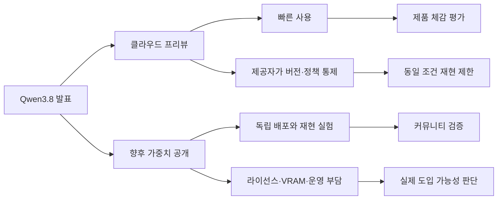

> 한 줄 요약: Qwen3.8 발표에서 주목할 부분은 2.4조 개라는 파라미터 수보다 실제 가중치 공개와 라이선스다. 현재 나온 것은 클라우드 프리뷰와 출시 예고이며, 로컬에서 검증할 수 있는 체크포인트는 아직 공개되지 않았다.

## 무슨 일이 있었나

2026년 7월 19일, 알리바바 Qwen 팀은 Qwen3.8을 곧 출시하고 오픈 웨이트(open-weight)로 공개하겠다고 밝혔다. 발표문에 따르면 모델 규모는 2.4T, 즉 2조 4천억 파라미터다.

Qwen3.8-Max-Preview는 알리바바의 Token Plan, Qoder, QoderWork에 먼저 배포됐다. 현재 사용자는 가중치를 내려받는 대신 이 서비스에서 프리뷰 모델을 시험할 수 있다.

7월 19일 발표에서 확인된 내용과 아직 공개되지 않은 정보는 다음과 같다.

| 구분 | 7월 19일 발표에서 확인된 내용 | 아직 확인되지 않은 내용 |
|---|---|---|
| 모델 규모 | 2.4T 파라미터라고 명시 | 전체·활성 파라미터 구분, 아키텍처 |
| 사용 경로 | Token Plan, Qoder, QoderWork 프리뷰 | 독립 실행용 체크포인트 |
| 공개 방식 | 오픈 웨이트로 공개할 예정 | 공개 날짜, 라이선스, 제공 포맷 |
| 성능 | 주요 프런티어 모델에 견줄 만한 수준이라고 주장 | 벤치마크 조건, 제3자 재현 결과 |
| 운영 조건 | 별도 설명 없음 | 요구 VRAM, 양자화 가능성, 추론 비용 |

Qwen 팀은 Qwen3.8을 강력한 프런티어 모델 가운데 하나이자 Fable 5 다음 수준이라고 표현했다. 다만 평가에 사용한 데이터와 추론 설정은 발표문에 나오지 않았다. 현재로서는 검증된 순위가 아닌 제작사의 성능 주장으로 보는 편이 정확하다.

이번 발표는 Qwen3.8의 오픈 웨이트 공개가 완료됐다는 소식이 아니라 곧 공개하겠다는 예고다. 지금 이용할 수 있는 클라우드 프리뷰와 앞으로 배포될 가중치는 구분해서 봐야 한다.

## 왜 사람들이 반응했나

Hacker News에서 이 발표는 320포인트와 165개 댓글을 모았다. Reddit LocalLLaMA에도 곧바로 “VRAM을 준비하라”는 제목의 글이 올라왔다. 댓글의 입장을 하나로 묶기는 어렵지만, 게시물 제목부터 로컬 실행 가능성에 관심이 쏠렸음을 보여준다.

2.4T라는 숫자는 기대만큼이나 현실적인 부담을 떠올리게 한다. 대형 모델을 직접 운영하려는 개발자에게 총 파라미터 수는 필요한 메모리와 GPU 구성, 통신 비용에 직접 영향을 준다.

가중치를 파라미터당 2바이트인 16비트로 단순 계산하면 저장 공간만 약 4.8TB다. 4비트로 환산해도 약 1.2TB이며, 실제 추론 환경에서는 양자화 메타데이터와 캐시, 런타임 오버헤드가 추가된다. 이는 배포 사양이 아니라 대략적인 규모를 확인하기 위한 계산이다. 혼합 전문가 모델(Mixture of Experts, MoE)인지, 요청마다 몇 개의 파라미터가 활성화되는지는 아직 공개된 정보만으로 판단할 수 없다.

커뮤니티의 VRAM 농담도 여기서 나온다. 가중치를 다운로드할 수 있는 것과 감당할 만한 비용으로 실행할 수 있는 것은 별개의 문제다.

### Qwen3.8 오픈 웨이트는 오픈소스와 같은가

아니다. 오픈 웨이트는 일반적으로 학습된 가중치를 내려받을 수 있다는 뜻이다. 학습 데이터와 정제 과정, 전체 학습 코드, 평가 도구까지 공개된다는 의미는 아니다.

실제 도입을 검토하려면 다음 항목을 함께 확인해야 한다.

- 상업적 이용과 재배포가 허용되는가
- 파생 모델 공개에 추가 조건이 붙는가
- 학습 데이터와 안전성 평가가 어느 정도 설명되는가
- 추론 코드와 토크나이저가 재현 가능한 형태로 제공되는가
- 양자화 모델을 누가, 어떤 조건에서 검증했는가
- 모델 카드에 알려진 실패 유형과 지원 언어가 적혀 있는가

이 정보가 빠져 있다면 오픈 웨이트라는 표현만으로 개방성을 평가하기 어렵다. 가중치를 내려받을 수 있어도 독립적인 검증과 운영이 가능한지는 라이선스와 부속 자료를 함께 살펴봐야 한다.

### 왜 클라우드 프리뷰와 가중치 공개를 구분해야 할까

클라우드 프리뷰에서는 제공자가 모델 버전과 시스템 프롬프트, 안전 필터, 추론 설정을 관리한다. 사용자는 결과를 시험할 수 있지만 같은 조건을 외부에서 재현하기는 어렵다.

가중치가 공개되면 모델을 자체 환경에 배치하고 양자화 방식이나 추론 엔진을 바꿔가며 검증할 수 있다. 대신 하드웨어 비용과 보안 패치, 장애 대응, 라이선스 준수는 운영자가 맡아야 한다.

프리뷰를 통해 발표 당시의 사용 경험은 확인할 수 있다. 실제 시스템에 도입할 수 있는지는 체크포인트와 라이선스, 기술 보고서가 나온 뒤에 판단해야 한다.

## 내가 보는 핵심

이번 반응은 모델 발표가 언제 신뢰를 얻는지를 보여준다.

예고 단계에서 확인할 수 있는 정보는 제작사가 공개한 모델 크기와 경쟁 모델 비교, 체험 경로 정도다. 가중치가 공개되면 외부에서 독립 평가와 양자화, 언어별 성능 측정, 실패 사례 재현을 시도할 수 있다.

오픈 웨이트를 예고했다면 실제 가중치와 검증에 필요한 자료까지 제공해야 한다. 다음 조건이 갖춰져야 공개가 실제 사용으로 이어진다.

- 가중치를 실제로 내려받아 사용할 수 있어야 한다.
- 아키텍처와 평가 조건을 확인할 자료가 있어야 한다.
- 감당할 수 있는 비용과 명확한 라이선스로 배포할 수 있어야 한다.

이 조건이 빠지면 공개된 가중치의 활용 범위도 제한된다. 특히 2.4T처럼 모델 규모가 크면 파일을 다운로드할 수 있는 사람과 제대로 실행하고 검증할 수 있는 사람 사이의 차이가 커질 수 있다.

현업에서 모델 도입을 검토할 때는 벤치마크 순위보다 먼저 확인할 문제가 있다. 사내 데이터가 외부로 전송돼도 되는지, 필요한 지연시간을 맞출 수 있는지, 모델 버전을 고정할 수 있는지, 장애가 발생했을 때 이전 버전으로 돌아갈 수 있는지부터 살펴봐야 한다.

자체 호스팅이 모든 환경에 적합한 것은 아니다. 클라우드 API는 초기 구축과 확장 대응이 비교적 쉽고, 오픈 웨이트 배포는 데이터 경로와 모델 버전을 직접 관리하기 좋다. Qwen3.8은 사용자가 이 두 운영 방식 가운데 실제로 선택할 수 있는 조건을 제공하는지로 평가할 필요가 있다.

## 앞으로 볼 기준

Qwen3.8 가중치가 공개되면 모델 크기보다 다음 항목을 먼저 확인할 만하다.

### Qwen3.8을 로컬에서 실행할 수 있을까

2.4T가 총 파라미터 수인지, 토큰마다 실제로 활성화되는 파라미터가 몇 개인지 확인해야 한다. MoE 구조라면 연산량은 전체 규모보다 작을 수 있지만 모든 가중치를 저장하고 GPU 사이에서 전달하는 문제는 남는다.

공식 양자화 모델과 지원 추론 엔진도 중요하다. FP8, INT8, 4비트 같은 형식만 비교해서는 부족하다. 양자화에 따른 정확도 손실과 지원 컨텍스트 길이, 처리량이 함께 공개됐는지 살펴봐야 한다.

최소 실행 구성과 권장 구성도 구분해야 한다. 모델을 겨우 불러올 수 있는 환경과 서비스에 필요한 응답 속도를 내는 환경은 다르다.

### Qwen3.8과 클라우드 API 중 무엇을 선택해야 할까

다음 질문에 답하면 선택 범위를 좁힐 수 있다.

- 입력 데이터가 외부 사업자의 서버로 전송돼도 되는가
- 월간 호출량에서 API 비용과 GPU 운영비 중 어느 쪽이 예측 가능한가
- 특정 모델 버전을 장기간 고정해야 하는가
- 출력 필터와 시스템 설정을 직접 통제해야 하는가
- 장애 대응과 보안 업데이트를 맡을 운영 인력이 있는가
- 라이선스가 상업적 사용과 파생 모델 배포를 허용하는가

프리뷰 성능이 좋아도 이 조건을 충족하지 못하면 도입하기 어렵다. 최고 성능이 아니어도 비용과 통제 범위가 명확한 모델이 실무에서는 더 적합할 수 있다.

### 다음 발표에서 확인할 것

- 정확한 가중치 공개일과 다운로드 경로
- 라이선스 원문과 지역·용도별 제한
- 총 파라미터와 활성 파라미터
- 모델 카드와 기술 보고서
- 평가 데이터, 비교 모델 버전, 추론 조건
- 다국어 및 한국어 독립 평가
- 프리뷰와 공개 체크포인트의 동일성
- 양자화별 메모리 요구량과 품질 변화
- 보안, 프롬프트 인젝션, 도구 호출 관련 평가
- 커뮤니티가 재현한 결과와 실패 사례

지금 관심이 쏠리는 지점은 2.4T라는 숫자 자체보다 공개 약속이 실제 실행 가능한 가중치로 이어지는지다.

가중치가 공개되면 저장과 추론 비용, 라이선스 제약, 벤치마크 재현 여부를 직접 확인할 수 있다. Qwen3.8에 대한 평가는 그 결과가 나온 뒤에야 가능하다.

## 참고 자료

- [선정 글감] [Qwen3.8 is launching and going open-weight soon](https://twitter.com/Alibaba_Qwen/status/2078759124914098291) (Qwen)
- [관련] [Hacker News 토론](https://news.ycombinator.com/item?id=48966120) (Hacker News)
- [관련] [Prepare your (v)ram - Qwen3.8 is coming!](https://www.reddit.com/r/LocalLLaMA/comments/1v0lewq/prepare_your_vram_qwen38_is_coming/) (Reddit LocalLLaMA)