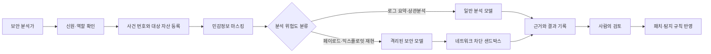

> 한 줄 요약: AI 보안 가드레일이 공격자와 방어자를 구분하지 못하면 사고 대응팀만 분석 도구를 잃을 수 있다. 필요한 것은 제한을 모두 푸는 일이 아니라 권한 확인, 격리 환경, 감사 기록을 갖춘 방어 전용 경로다.

## 무슨 일이 있었나

2026년 7월, AI 보안 가드레일(Cyber Guardrails)이 실제 사고 대응을 방해했다는 주장이 개발자 커뮤니티에서 퍼졌다. 발단은 Kimi K3가 치명적인 보안 버그 15건을 수정했지만 Codex와 Fable은 같은 요청을 거부했다는 Reddit 게시물이었다.

다만 확인된 사실과 게시물의 주장은 구분해야 한다.

- 버그 15건과 모델별 처리 결과는 Reddit 게시물 제목과 연결된 소셜미디어 게시물에서 나온 주장이다.
- 공개된 자료만으로는 각 버그의 CVE, 심각도 산정 방식, 동일한 프롬프트를 사용했는지, 어떤 모델 버전과 실행 조건에서 시험했는지 확인하기 어렵다.
- 따라서 이 숫자만으로 특정 모델의 보안 역량이 더 뛰어나다고 단정할 수는 없다.

반면 Hugging Face가 공개한 2026년 7월 보안 사고 보고서는 가드레일이 실제 사고 대응에 문제가 될 수 있음을 보여준다. 회사는 프로덕션 인프라 일부가 침해됐으며, 공격 전 과정에 자율형 AI 에이전트 시스템이 사용됐다고 설명했다.

침해 징후는 AI를 이용한 이상 탐지 파이프라인에서 발견됐다. 이후 포렌식 과정에서 실제 공격 명령, 익스플로잇 페이로드, 명령제어(C2) 흔적을 상용 API 기반 프런티어 모델에 대량으로 입력하자 안전 정책이 분석을 차단했다고 한다.

공격자는 해당 서비스의 사용 정책을 따르지 않지만 방어자는 정책 때문에 증거를 분석하지 못하는 상황이 생긴 것이다. 이 내용은 Hugging Face가 직접 공개한 사고 대응 경험이므로 버그 15건에 관한 주장과는 근거의 성격이 다르다.

같은 시기 WIRED가 소개한 Linux 취약점 사례도 비슷한 문제를 드러낸다. 보도에 따르면 AI가 약 15년 동안 발견되지 않았던 루트 권한 관련 버그를 찾아냈고, 연구자는 익스플로잇 코드를 공개했다. 위험한 코드를 만들 수 있는 AI가 사람이 오랫동안 놓친 취약점을 찾는 데도 쓰인 사례다.

## 왜 사람들이 반응했나

### AI 보안 가드레일은 왜 방어자도 차단할까?

모델이 받는 입력만 놓고 보면 공격 코드와 포렌식 자료는 매우 비슷하다. 셸 명령과 취약한 코드, 권한 상승 절차, 악성 페이로드, C2 주소 등이 양쪽 모두에 포함될 수 있다.

모델은 요청자의 직함이나 조직 내부 승인서를 그대로 믿을 수 없다. 공격을 연구한다는 설명만으로 제한을 풀어주면 공격자도 같은 방식으로 접근할 수 있기 때문이다.

문제는 이런 불확실성을 요청 전체의 거부로 처리할 때 생긴다. 사고 대응 과정에서는 공격자가 실행한 명령을 재구성하고 변형된 페이로드를 디코딩하거나 취약한 경로를 재현해야 한다. 위험한 문자열을 다루지 않고는 분석할 수 없는 경우가 많다.

### 커뮤니티가 불편해한 것은 모델의 거절 한 번이 아니다

사람들이 문제 삼은 것은 공개 API를 쓰는 방어팀은 정책의 제약을 받지만, 로컬 모델이나 탈취한 모델을 쓰는 공격자는 같은 제약을 받지 않는다는 점이다.

실무 부담도 있다. 사고 대응 중 모델이 계속 요청을 거부하면 분석가는 프롬프트 표현을 바꾸거나 로그를 여러 조각으로 나눠야 한다. 분석 시간이 길어지고 서로 연결된 공격 흔적이 끊기면서 결과의 품질도 떨어질 수 있다.

데이터 보호 문제는 더 까다롭다. 가드레일을 통과시키기 위해 원본 로그를 외부 API에 그대로 보내면 개인정보나 인증 토큰, 내부 호스트명, 고객 데이터가 함께 전송될 수 있다. 분석 요청을 통과시키려다 보안 사고의 범위를 넓혀서는 안 된다.

### 그렇다면 제한 없는 오픈 모델이 답일까?

일부 커뮤니티에서는 제한이 적은 모델이 방어 업무에 더 적합하다고 본다. 로컬에서 실행하면 민감한 증거를 외부로 보내지 않아도 되고, 조직이 모델과 정책을 직접 관리할 수 있다.

그러나 제한이 없다고 해서 결과까지 믿을 수 있는 것은 아니다. 모델은 존재하지 않는 취약점을 만들어내거나 안전하지 않은 패치를 제안할 수 있고, 정상 동작을 공격으로 잘못 판단하기도 한다. 출처와 무결성을 확인하지 않은 모델을 내부 로그에 연결하면 모델 파일이나 실행 환경, 플러그인을 통해 다른 위험이 생길 수도 있다.

결국 중요한 것은 가드레일의 유무보다 누가 어떤 환경에서 어느 범위의 권한으로 모델을 사용하는지다.

## 내가 보는 핵심

이번 논쟁에서 따져야 할 것은 AI가 보안 질문에 답해야 하는지가 아니다. 소비자용 대화 서비스의 정책을 사고 대응 시스템에도 그대로 적용할 수 있는지가 문제다.

일반 챗봇은 사용자의 신원을 충분히 확인하기 어렵고 작업 대상 시스템의 소유권도 알 수 없다. 넓은 범위의 요청을 거부하는 정책에 나름의 이유가 있다. 기업의 보안 운영 환경에서는 사용자 역할과 사건 번호, 승인 범위, 대상 자산, 실행 기록을 확인할 수 있다.

두 환경에 같은 기준을 적용하면 정상적인 방어 업무가 막힌다. 반대로 보안팀이라는 이유만으로 제한을 모두 풀면 내부자 위협이나 계정 탈취에 취약해진다.

필요한 것은 전면 허용이 아니라 사용 권한을 확인할 수 있는 방어 전용 경로다.

이 구조에서 모델은 운영 서버에 직접 명령을 실행하지 않는다. 위험한 분석은 네트워크가 차단된 샌드박스(Sandbox)에서 수행하고, 입력과 출력은 감사 로그(Audit Log)에 남긴다.

이런 환경을 설계할 때는 모델이 답변할 수 있는지보다 데이터의 흐름부터 확인해야 한다. 어떤 로그가 외부로 전송되는지, 토큰과 개인정보는 어디에서 제거되는지, 모델의 출력이 자동으로 실행되는지 살펴봐야 한다. 그렇지 않으면 가드레일을 우회한 뒤 더 큰 운영 위험을 떠안을 수 있다.

### AI 보안 분석에서 재현 가능성을 어떻게 확보할까?

버그 15건을 고쳤다는 주장도 재현 조건이 없으면 평가하기 어렵다. 모델을 비교하려면 적어도 다음 정보가 필요하다.

| 확인 항목 | 필요한 이유 |
|---|---|
| 모델과 버전 | 같은 제품명이라도 정책과 성능이 달라질 수 있다 |
| 시스템 프롬프트 | 거부 여부가 모델 자체보다 배포 정책에 좌우될 수 있다 |
| 입력 코드와 로그 | 모델들이 같은 증거를 받았는지 확인해야 한다 |
| 도구 사용 권한 | 저장소 탐색·테스트 실행 여부가 결과에 영향을 준다 |
| 취약점 검증 절차 | 실제 취약점인지 오탐인지 구분해야 한다 |
| 패치 후 테스트 | 수정이 기능 회귀나 새 취약점을 만들지 확인해야 한다 |
| 거부 응답 원문 | 전면 거부인지 안전한 대안 제시인지 판단할 수 있다 |

모델이 패치를 출력한 것과 취약점을 안전하게 수정한 것은 다르다. 정적 분석과 단위·회귀 테스트를 거치고 보안 담당자의 코드 리뷰까지 통과해야 실제 수정으로 볼 수 있다.

## 앞으로 볼 기준

비슷한 뉴스가 나오면 어느 모델의 제한이 더 적은지보다 다음 조건부터 확인하는 편이 낫다.

- 비교 대상 모델은 같은 날짜, 버전, 프롬프트와 도구 권한으로 평가됐는가?
- 발견된 취약점에 CVE, 재현 코드, 영향 범위 또는 제3자 검증이 있는가?
- 거부는 모델의 기본 능력 때문인가, API 사업자의 정책 계층 때문인가?
- 방어 목적을 증명한 조직에 별도 접근 경로와 이의 제기 절차가 제공되는가?
- 위험한 분석이 운영망과 분리된 샌드박스에서 실행되는가?
- 로그를 외부 모델에 보낼 때 개인정보와 인증정보가 제거되는가?
- 모델 출력이 자동 실행되는가, 사람이 검토한 뒤 적용되는가?
- 정책 변경과 예외 승인이 모두 감사 가능한 형태로 기록되는가?

모델 제공자도 요청 전체를 거부하기보다 위험도에 따라 응답 범위를 나눌 필요가 있다. 실제 페이로드 생성을 제한하더라도 로그 분류, 침해지표(IOC) 추출, 안전한 패치 설명, 탐지 규칙 작성은 지원할 수 있다. 위험도가 높은 요청만 검증된 조직 계정과 격리 환경에서 처리하는 방식도 가능하다.

사용 조직도 특정 상용 API 하나에 사고 대응 역량을 모두 맡기지 않는 편이 낫다. 외부·내부 모델을 전통적인 포렌식 도구와 함께 사용하고, 모델이 요청을 거부했을 때 다른 분석 경로로 전환하는 런북(Runbook)을 마련해야 한다.

가드레일을 없애자는 주장은 단순하지만 실제 운영에 적용하기에는 거칠다. 공격자는 제한을 우회하고 방어자는 제한을 지켜야 한다는 비대칭은 분명히 존재한다. 이를 다루려면 방어자의 권한을 확인하고 위험한 작업을 격리하며 모든 행동을 기록할 수 있어야 한다.

다음 보안 사고에서는 AI가 답변을 거부했는지만 볼 일이 아니다. 거부가 발생하더라도 방어팀이 증거를 안전하게 분석하고 대응을 계속할 수 있는지가 더 중요하다.

## 참고 자료

- [선정 글감] [Kimi K3가 보안 버그를 수정하고 다른 모델은 거부했다는 커뮤니티 논의](https://www.reddit.com/r/LocalLLaMA/comments/1v1k3pw/kimi_k3_just_fixed_15_critical_security_bugs_that/) — Reddit LocalLLaMA
- [관련] [Hugging Face 보안 사고 보고서를 둘러싼 커뮤니티 논의](https://www.reddit.com/r/LocalLLaMA/comments/1v0ywoi/huggingface_security_incident_report_the_attacker/) — Reddit LocalLLaMA
- [관련] [Security Incident — July 2026](https://huggingface.co/blog/security-incident-july-2026) — Hugging Face
- [관련] [AI Found a Root Bug in Linux That Everyone Missed for 15 Years](https://www.wired.com/story/security-news-this-week-ai-found-a-root-bug-in-linux-that-everyone-missed-for-15-years/) — WIRED Security