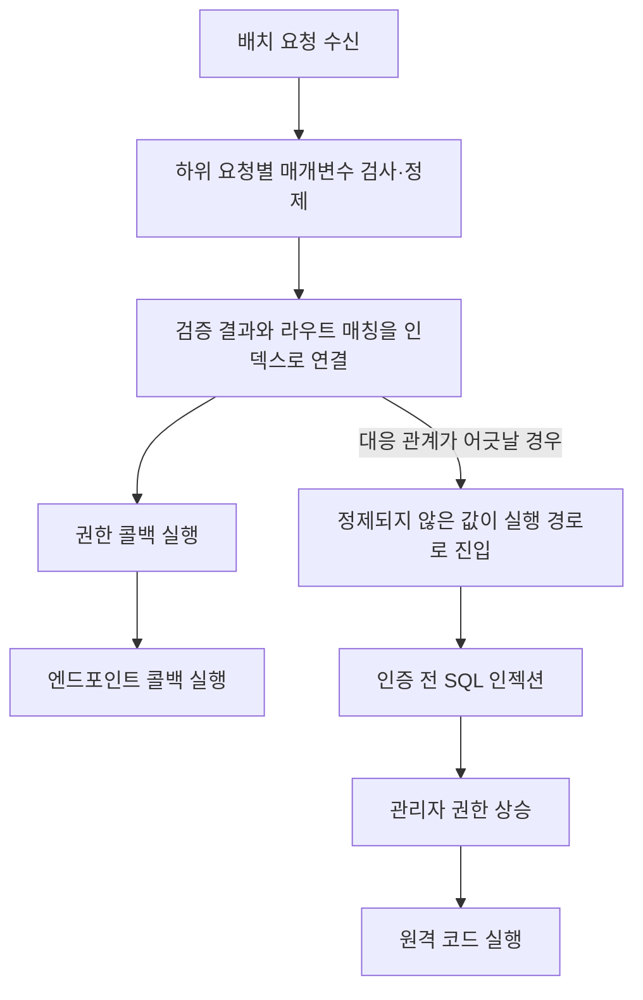

> 한 줄 요약: WordPress 원격 코드 실행(RCE) 취약점을 GPT5.6과 약 25달러로 찾았다는 사례가 나왔다. 모델 호출 비용은 낮았지만, 실제 취약점 판단에는 실행 권한과 안전 정책, 검증 비용이 따로 들었다. 같은 AI를 사용해도 공격자와 방어자의 조건은 다르다.

## 무슨 일이 있었나

2026년 7월 20일 Searchlight Cyber의 보안 연구자 Adam Kues는 최신 안정 버전 WordPress를 GPT5.6 Sol Ultra로 분석해 인증 전 원격 코드 실행(Pre-auth RCE) 체인을 발견했다고 공개했다.

연구자가 밝힌 모델 사용 비용은 200달러 구독료를 사용량에 따라 환산한 약 25달러다. 이 금액을 취약점 발견에 들어간 전체 비용으로 보기는 어렵다.

연구자는 WordPress 소스에서 Git 이력을 제거해 외부 패치와 비교하지 못하게 했다. 최대 4개 에이전트가 최소 6시간 동안 서로 다른 공격 경로를 탐색하도록 프롬프트도 설계했다. 모델이 비현실적인 설정이나 조작된 전제에 기대지 않도록 일반적인 MySQL 운영 환경과 인증 전 공격이라는 조건을 걸었다.

모델이 제시한 결과를 곧바로 공개한 것도 아니다. 연구자는 별도 서버에 기본 WordPress를 설치해 관리자 이메일을 탈취할 수 있는지 확인하고, 모델이 제안한 권한 상승과 RCE 체인을 직접 해석했다. 최초 SQL 인젝션(SQL Injection)은 비교적 단순했지만, 이후 체인은 모델이 생성한 시간보다 사람이 이해하고 검증한 시간이 더 길었다고 한다.

Searchlight Cyber의 설명에 따르면 취약점의 출발점은 WordPress 5.6에 도입된 REST 배치 API다. 일반 REST 요청은 매개변수 검사와 정제, 권한 확인을 거쳐 엔드포인트를 실행한다. 배치 API는 여러 하위 요청을 먼저 검증한 다음, 별도 반복문에서 권한 확인과 실행을 처리한다.



연구자의 분석은 라우트 매칭 배열과 검증 결과 배열이 같은 인덱스를 공유한다는 가정이 깨지면서 매개변수 정제를 우회할 수 있었다는 내용이다. 모델은 한 줄짜리 PHP 오류를 찾는 데 그치지 않고, 여러 계층에 흩어진 조건을 SQL 인젝션부터 RCE까지 이어지는 공격 경로로 묶었다.

Searchlight Cyber 글만으로 확인할 수 없는 내용도 있다. CVE 번호와 영향을 받는 정확한 WordPress 버전, 수정 버전, 공식 보안 권고문은 공개되지 않았다. 5억 개 이상 설치됐다는 수치도 여러 추정치를 인용한 표현이며, 실제로 취약한 공개 인스턴스가 5억 개라는 뜻은 아니다.

연구팀은 방어자가 업그레이드할 시간을 확보하도록 공개를 미뤘으며, 다른 연구자 두 명이 전체 체인을 독립적으로 재현했다고 밝혔다. 다만 해당 글에는 WordPress 측의 공식 확인이나 재현에 필요한 세부 조건이 담겨 있지 않다. 운영자는 제3자 검사 페이지에 사이트 정보를 입력하기 전에 WordPress 공식 배포 채널과 수정 내역부터 확인하는 편이 안전하다.

## 왜 사람들이 반응했나

### WordPress RCE를 정말 25달러에 찾은 걸까?

제목에 나온 25달러와 취약점 중개상이 지급한다는 50만 달러의 차이가 눈길을 끌었다. Hacker News에는 수집 시점 기준으로 269포인트와 140개 댓글이 달렸다. 이는 해당 글에 관심이 몰렸다는 뜻이지, 취약점이 독립적으로 검증됐거나 시장 가격이 확정됐다는 뜻은 아니다.

25달러는 모델을 추가로 실행하는 데 든 비용에 가깝다. 연구자의 프롬프트 설계와 대상 환경 구성, 실패 경로 관리, 익스플로잇 해석, 실제 서버 재현, 공개 조율에 들어간 시간은 포함되지 않았다.

그렇다고 비용 변화가 없는 것은 아니다. 한 사람이 모든 소스 코드를 차례로 읽는 대신 여러 에이전트가 입력 처리, 직렬화, 캐시, 권한 검사, 타입 변환 등 서로 다른 공격면을 동시에 조사했다. 실패한 접근을 중단하고 아직 살펴보지 않은 영역으로 에이전트를 다시 배정하는 과정도 자동화했다. 초기 탐색에 드는 비용이 낮아졌다고 볼 만한 부분이다.

### 신뢰 문제: 모델의 발견과 취약점의 발견은 다르다

보안 분석에서는 설명이 그럴듯해도 재현되지 않으면 증거가 되지 않는다. 모델은 존재하지 않는 호출 경로를 연결하거나, 공격자가 얻을 수 없는 권한을 전제로 삼을 수 있다. 드문 설정을 기본 환경처럼 취급하는 경우도 있다.

이번 주장이 설득력을 얻은 근거는 모델의 자신감이 아니다. 연구자가 기본 설치 환경에서 데이터 탈취를 재현했고, 후속 체인을 직접 분석했으며, 다른 연구자도 별도 환경에서 재현했다고 밝혔기 때문이다.

실무에서는 탐색과 판정을 나눠야 한다. AI로 후보를 넓게 수집할 수는 있지만, 실제 취약점인지는 재현 가능한 요청과 기본 설정에서의 도달 가능성, 권한 경계, 영향 범위를 기준으로 판단해야 한다.

### 권한 문제: 공격자는 멈추지 않는데 방어자는 멈춘다

Hugging Face 보안 사고 보고서를 다룬 LocalLLaMA 게시물은 공격자와 방어자가 AI를 사용할 때 적용받는 조건이 다르다는 문제를 다룬다. 게시물의 요약에 따르면 공격자는 자율 AI 에이전트를 공격 과정에 활용했고, 방어 측은 LLM 기반 이상 징후 분류로 침해를 포착했다.

문제는 포렌식 단계에서 발생했다. 실제 공격 명령과 익스플로잇 페이로드, 명령제어(C2) 흔적을 상용 모델 API에 대량으로 제출하자 안전 정책이 분석을 막았다는 것이 보고서의 주장이다. 공격자는 모델 제공자의 사용 정책을 따르지 않아도 되지만, 방어자는 정책과 데이터 반출 제한을 모두 지켜야 한다.

다만 해당 Reddit 페이지는 수집 당시 검증 대기 상태였고, 게시물도 원 보고서 일부를 옮긴 요약이었다. 이 내용만으로 세부 침해 범위를 단정하기는 어렵다. 악성 문자열을 새로 만들려는 요청과 이미 발생한 공격을 조사하려는 요청을 방어 도구가 구분할 수 있는지는 별도로 확인할 문제다.

### 비용 문제: 찾는 시간보다 확인하는 시간이 길어진다

WIRED가 소개한 Linux 권한 상승 취약점 사례도 AI로 오래된 코드를 다시 조사하는 흐름을 보여준다. 기사 제목은 15년 동안 발견되지 않았던 루트 권한 버그를 AI가 찾았다고 전한다.

하지만 확인할 수 있는 발췌문은 보안 뉴스 모음의 도입부뿐이다. 어떤 모델이 어떤 코드를 분석했고, 취약점을 어떻게 재현했는지는 알 수 없다. 따라서 WordPress 사례와 같은 수준의 근거로 다뤄서는 안 된다.

두 사례는 AI가 최신 코드뿐 아니라 오랫동안 다시 검토되지 않은 경계면까지 저렴하게 탐색할 수 있음을 보여준다. 후보가 빠르게 늘어나면 조직의 병목은 발견보다 사실 확인과 패치 우선순위 결정에서 생긴다.

## 내가 보는 핵심

### AI 취약점 탐색의 진짜 병목은 검증 예산이다

이 사례만으로 AI가 보안 연구자를 대체했다고 보기는 어렵다. 모델은 넓은 범위를 탐색했지만, 성공 조건을 정하고 비현실적인 전제를 차단한 사람은 연구자였다.

달라진 부분은 탐색 비용과 검증 비용이 따로 움직이기 시작했다는 점이다. 모델은 취약점 후보를 빠르게 만들 수 있지만, 각 후보를 실제 환경에서 재현하고 영향도를 판단할 인력과 격리 환경은 같은 속도로 늘지 않는다.

```text
AI 보안 연구 비용
= 모델 실행 비용
+ 대상 환경 구성
+ 재현과 반증
+ 익스플로잇 체인 해석
+ 패치 검증
+ 공개 조율
```

25달러만 강조하면 이 계산에서 첫 번째 항목만 남는다. 공격자는 거짓 양성(False Positive) 수백 개 중 성공하는 경로 하나를 고르면 된다. 방어자는 접수한 후보마다 서비스 영향과 패치 후 회귀 가능성까지 확인해야 한다.

안전 정책도 양쪽에 다르게 작용한다. 공격자는 로컬 모델을 수정하거나 정책이 없는 환경에서 계속 시도할 수 있다. 방어자는 고객 데이터와 비밀키, 공격 로그를 외부 모델에 전송해도 되는지 먼저 검토해야 한다. 모델 제공자가 포렌식 명령을 거부하면 조사 흐름이 중간에 끊길 수도 있다.

조직에는 모델 구독 외에도 격리된 실행 환경과 추적 가능한 증거가 필요하다. 사람이 승인해야 하는 지점을 정하고, 민감한 로그를 외부로 보내지 않고 처리할 방법도 마련해야 한다.

### 멀티에이전트가 강했던 이유는 숫자가 아니라 반증 구조다

이번 프롬프트에서는 에이전트가 네 개였다는 사실보다 탐색이 한 방향으로 몰리지 않도록 만든 운영 규칙이 중요했다. 연구자는 접근법을 계열별로 기록하고 막힌 경로를 표시했으며, 구체적인 버그가 나오면 적대적 검토를 한 차례 더 거치도록 했다.

이 방식은 일반적인 코드 리뷰에도 적용할 수 있다. 여러 에이전트에게 같은 질문을 반복한다고 병렬 분석이 되지는 않는다. 입력 검증, 권한 경계, 상태 불일치, 외부 라이브러리처럼 서로 다른 가설을 맡기고, 마지막에는 각 주장을 반증할 수 있는 형태로 합쳐야 한다.

모델이 작성한 보고서에는 최소한 다음 증거가 따라야 한다.

| 검증 항목 | 남겨야 할 증거 | 실패 신호 |
|---|---|---|
| 도달 가능성 | 인증 전 요청과 응답, 필요한 설정 | 관리자 권한이나 비기본 플러그인 전제 |
| 데이터 흐름 | 입력부터 위험 함수까지의 호출 경로 | 중간 정제·타입 변환 생략 |
| 재현성 | 고정된 버전과 격리 환경의 재현 절차 | 한 번만 성공하거나 환경이 불명확함 |
| 영향 | 읽기, 권한 상승, 코드 실행을 단계별 분리 | 중간 버그를 곧바로 RCE로 확대 |
| 반증 | 독립 실행 또는 별도 분석자의 확인 | 같은 모델 출력만 재서술 |
| 수정 | 패치 전후 테스트와 회귀 확인 | 공격만 막고 정상 배치 요청을 깨뜨림 |

이 표를 채우지 못한 결과는 조사할 제보가 될 수는 있지만, 확정된 취약점으로 보기는 어렵다.

## 앞으로 볼 기준

### 다음 AI 보안 뉴스를 볼 때 무엇을 확인해야 할까?

가격을 볼 때는 포함 범위부터 확인해야 한다. 토큰이나 구독료만 계산한 금액인지, 사람의 검증 시간과 테스트 인프라 비용까지 포함한 금액인지에 따라 해석이 달라진다.

공격 조건도 나눠서 봐야 한다. 기본 설정과 인증 전 상태에서 재현되는지, 특정 데이터베이스나 플러그인이 필요한지, 권한 상승에서 코드 실행으로 이어지려면 별도 조건이 필요한지 확인해야 한다.

독립 재현은 같은 모델이 같은 설명을 반복하는 방식으로 성립하지 않는다. 별도 환경에서 요청과 결과를 재현하고, 영향을 받는 버전과 수정된 버전을 특정해야 한다.

공식 대응이 빠져 있다면 그 범위는 확인되지 않은 상태로 남겨 둬야 한다. CVE와 공급자 권고, 패치 릴리스, 호스팅 사업자의 완화 조치가 공개됐는지 확인할 필요가 있다. 공식 수정이 나왔다면 원클릭 검사 사이트를 이용하기 전에 백업과 업데이트를 진행하고 침해 흔적을 점검하는 편이 낫다.

조직 내부의 AI가 실제 공격 자료를 처리할 수 있는지도 미리 시험해야 한다. 악성 코드가 포함된 로그를 분석할 수 있는지 확인하고, 외부 전송이 금지된 데이터의 처리 위치를 정해야 한다. 모델이 요청을 거부할 때 사용할 로컬 도구와 수동 절차도 준비해 둘 필요가 있다.

제목에는 WordPress RCE를 찾는 데 25달러가 들었다는 숫자가 남는다. 운영자가 따져야 할 것은 발견 이후 검증과 패치에 투입할 수 있는 인력과 격리 환경의 용량이다.

취약점 후보와 경보가 늘어난다고 방어 수준이 함께 높아지지는 않는다. 중요한 것은 AI 호출 횟수가 아니라, 모델의 주장을 얼마나 빨리 반증하고 재현 가능한 증거로 바꾸느냐다.

## 참고 자료

- [선정 글감] [Exploit brokers pay $500,000 for a WordPress RCE. I found one with GPT5.6 Sol Ultra and $25](https://slcyber.io/research-center/exploit-brokers-pay-500000-for-a-wordpress-rce-i-found-one-with-gpt5-6/) (Searchlight Cyber)
- [관련] [Hacker News 토론](https://news.ycombinator.com/item?id=48975665) (Hacker News)
- [관련] [HuggingFace security incident report 관련 토론](https://www.reddit.com/r/LocalLLaMA/comments/1v0ywoi/huggingface_security_incident_report_the_attacker/) (Reddit LocalLLaMA)
- [관련] [AI Found a Root Bug in Linux That Everyone Missed for 15 Years](https://www.wired.com/story/security-news-this-week-ai-found-a-root-bug-in-linux-that-everyone-missed-for-15-years/) (WIRED Security)