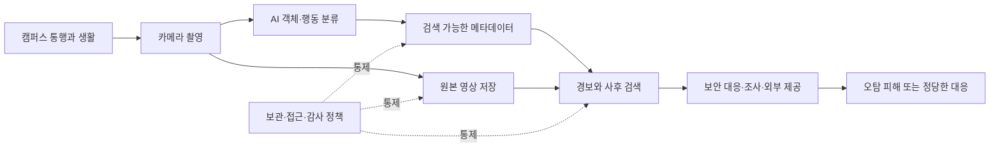

> 한 줄 요약: MIT의 AI 감시 카메라 도입 논란은 카메라 수보다 더 중요한 질문을 남긴다. 누가 어떤 목적으로 분류 결과를 조회하며, 오탐으로 피해가 생겼을 때 시스템을 멈추고 바로잡을 수 있는가.

## 무슨 일이 있었나

사람을 촬영하는 카메라는 이미 캠퍼스 곳곳에 있다. 이번에 논란이 커진 이유는 MIT가 설치하는 장비가 단순 녹화를 넘어 사람과 행동을 실시간으로 분류할 수 있기 때문이다.

Schneier on Security가 인용한 MIT 학생신문 The Tech의 취재에 따르면, MIT는 300만 달러가 넘는 예산을 들여 학술 건물과 기숙사, 메모리얼 드라이브 주변 야외 공간에 AI 영상 감시 카메라 500대 이상을 설치하고 있다. 공사는 2025년 11월 시작됐으며 2026년 9월까지 이어질 예정이다.

장비 대부분은 한화비전 Wisenet AI 계열이다. 공개된 기술 사양에는 움직임, 배회, 군중, 마스크 착용, 카메라 훼손을 감지하고 얼굴·번호판·차량·사물을 실시간으로 인식하는 기능이 포함돼 있다. 최대 11m 거리에서 옷 색상, 성별, 연령 같은 속성으로 사람을 분류할 수 있다는 설명도 있다.

얼굴 감지와 얼굴 인식(Facial Recognition)은 구분해야 한다. 화면 속 얼굴을 찾아내는 기능이 곧바로 특정인의 신원을 확인한다는 뜻은 아니다. The Tech와 Schneier on Security가 공개한 내용만으로는 MIT가 신원 식별용 얼굴 인식을 활성화했는지 확인할 수 없다.

MIT 대변인에 따르면 수집 데이터는 원칙적으로 최대 30일간 보관되지만 예외가 허용될 수 있다. Ai-RGUS를 이용한 지속적인 카메라 모니터링도 언급됐다. 다만 이 설명만으로 사람이 모든 영상을 실시간으로 지켜본다고 단정할 수는 없다.

현재 확인된 사실과 아직 답이 필요한 부분을 나누면 다음과 같다.

| 구분 | 확인된 범위 | 추가 확인이 필요한 범위 |
|---|---|---|
| 설치 | 500대 이상, 300만 달러 이상 | 최종 설치 대수와 위치별 배치 |
| 기간 | 2025년 11월 시작, 2026년 9월까지 예상 | 일정 변경 여부 |
| 장비 역량 | 객체·얼굴·번호판 감지, 행동 및 속성 분류 지원 | 실제 활성화한 기능과 임계값 |
| 보관 | 원칙적으로 최대 30일 | 예외 승인자, 연장 사유, 최대 연장 기간 |
| 접근 | 자료에 구체적 공개가 없음 | 열람 권한, 외부 제공, 감사 로그 |
| 자동화 | 실시간 분류 기능을 지원 | 경보가 징계·출입 통제·수사로 이어지는 절차 |

문제는 장비가 지원하는 기능과 MIT가 실제로 사용하는 기능 사이의 공백이다. 현재 기능을 꺼두었다는 설명만으로는 부족하다. 원격 설정이나 소프트웨어 업데이트로 나중에 활성화할 수 있다면, 도입 단계부터 설정 변경 권한과 승인 절차를 정해야 한다.

## 왜 사람들이 반응했나

### AI 감시 카메라와 일반 CCTV의 차이점은 무엇일까?

일반 CCTV는 사건이 발생한 뒤 사람이 특정 시간대의 영상을 찾아보는 방식에 가깝다. AI 감시 카메라는 촬영 단계부터 영상을 검색 가능한 속성과 사건 후보로 바꾼다.

이름을 알아내지 않더라도 빨간 옷을 입은 사람, 일정 시간 머문 사람, 마스크를 쓴 사람처럼 조건을 지정해 검색할 수 있다. 감시의 범위는 저장된 영상의 양뿐 아니라 사람을 얼마나 빠르고 넓게 골라낼 수 있는지에 따라 달라진다.

이 차이는 데이터 흐름에서도 드러난다.

카메라 한 대의 정확도가 높더라도 전체 처리 과정이 안전하다고 볼 수는 없다. 잘못된 입력이나 모델의 분류 오류에 부적절한 검색 조건과 담당자의 판단이 겹치면 작은 오탐이 실제 제지나 조사로 이어질 수 있다.

### 오탐은 왜 단순한 기술 오류로 끝나지 않을까?

Schneier on Security가 소개한 Flock 번호판 추적 사례가 이 문제를 보여준다. 도난 신고 대상 번호판은 `34 03 DTM`이었지만 시스템에는 가운데 작은 숫자가 빠진 `34 DTM`으로 기록됐다. 카메라도 비표준 형식으로 표시된 작은 숫자를 제대로 반영하지 못해 같은 구조의 다른 차량들이 도난 차량으로 분류됐다.

그 결과 도난 사건과 무관한 차량을 운전하던 사람이 추적과 체포를 당했다. Flock은 기계학습 시스템이 입력된 번호를 정확히 읽었다며 경찰의 잘못된 입력을 원인으로 지목했다.

그러나 각 구성요소가 사양대로 작동했더라도 전체 시스템은 엉뚱한 사람을 위험 대상으로 만들 수 있다. 따라서 개별 장비가 정상 작동했는지만 확인해서는 부족하다. 잘못된 입력이 어느 단계까지 전파되고, 실제 조치에 어떤 영향을 미치는지 살펴야 한다.

MIT의 배회 감지나 군중 분류가 어떤 조치와 연결되는지는 공개된 자료만으로 확인하기 어렵다. 경보 이후 담당자의 검토가 형식적인 절차에 그친다면 분류 결과가 사실상의 판단 기준으로 굳어질 수 있다.

### 캠퍼스에서는 동의를 받으면 해결될까?

학생과 교직원은 기숙사와 강의실, 연구실을 이용하기 위해 캠퍼스를 오간다. 촬영에 동의하지 않는 사람이 감시 구역을 실질적으로 피할 수 있는지부터 불분명하다. 표지판을 설치하거나 개인정보 처리 방침을 고지한다고 해서 선택권이 생기는 환경은 아니다.

법학자 Daniel Solove가 AI 시대의 개인정보 보호를 개인 동의에만 맡기기 어렵다고 주장하는 이유도 이와 맞닿아 있다. Solove는 데이터 최소화(Data Minimization), 기술 설계와 알고리즘이 일으킨 피해에 대한 책임, 여러 이해관계자가 참여하는 검토를 통제 수단으로 제시한다.

안전과 프라이버시 가운데 하나를 포기해야 하는 문제는 아니다. 안전을 위해 필요한 촬영 범위를 어디까지로 제한할지, 수집 목적이 달라질 때 누가 이를 막을지를 정하는 문제다.

### 수집이 합법이어도 유출 위험은 남는다

WIRED가 보도한 샌프란시스코 경찰의 Skydio 드론 영상 노출 사건은 수집 이후의 위험을 보여준다. 경찰 활동을 위해 촬영한 영상에는 차량 번호판과 이동 경로, 체포 과정처럼 민감한 장면이 담겨 있었다. 접근 통제에 실패하면서 이 영상은 외부에서 볼 수 있는 상태로 노출됐다.

캠퍼스 카메라도 같은 문제를 점검해야 한다.

- 원본 영상과 분류 메타데이터는 같은 저장소에 있는가
- 공급업체가 원격으로 접근하거나 진단 데이터를 가져갈 수 있는가
- 영상 내보내기와 공유 링크 생성 기록이 남는가
- 계정 탈취나 설정 오류를 탐지하는가
- 계약 종료 뒤 백업과 파생 데이터까지 삭제되는가

보관 기간이 30일이라는 설명만으로는 충분하지 않다. 예외가 반복되거나 복제본, 사건 파일, 모델 학습용 샘플이 별도로 남는다면 실제 보관 기간은 더 길어진다.

## 내가 보는 핵심

이번 사안의 핵심 위험은 오분류 자체보다 분류 결과가 조직의 권한과 결합하는 방식에 있다. 피해를 본 당사자가 분류와 판단 과정을 알 수 없고 이의를 제기하기도 어렵다면 오류를 바로잡을 기회조차 사라진다.

WIRED에 따르면 ACLU 매사추세츠는 형사 변호인이 감시 기술 공개와 증거 보존을 요구할 수 있도록 관련 도구를 만들었다. 얼굴 인식, 번호판 판독기, 위치정보, AI가 작성한 경찰 보고서가 사건에 사용됐는지 피고인이 모르면 오탐과 편향을 법정에서 검증하기 어렵기 때문이다.

캠퍼스는 형사사법기관과 다르다. 그래도 보안 조사나 징계에 AI 분류 결과를 사용한다면 최소한 다음 기록은 남겨야 한다.

- 어떤 카메라와 모델이 경보를 만들었는지
- 모델 버전과 당시 설정값이 무엇이었는지
- 누가 경보를 조회하고 영상과 대조했는지
- 결과가 어떤 조치의 근거가 됐는지
- 당사자가 기록 열람과 정정을 요구할 수 있는지

감시 체계는 오류가 없다고 약속할 수 없다. 대신 오류를 전제로 피해가 번지는 범위를 제한하고, 잘못된 판단을 취소하거나 정정할 수 있어야 한다.

이를 위해서는 기능 구매와 기능 승인을 분리할 필요가 있다. 장비가 성별·연령·배회를 분류할 수 있다고 해서 모든 기능을 기본으로 활성화해서는 안 된다. 기능별 사용 목적과 장소, 정확도 검증 방식, 보관 기간, 중단 조건을 따로 심사하고 승인해야 한다.

공급업체는 시스템이 정상 작동했다고 주장하고 운영기관은 입력 오류를 지목하는 식으로 책임이 흩어지는 상황도 막아야 한다. 카메라와 분석 모델, 관제 소프트웨어, 현장 대응을 하나의 사회기술 시스템(Sociotechnical System)으로 보고 최종 책임자를 정해야 한다.

## 앞으로 볼 기준

### AI 영상 감시 도입에서 무엇을 확인해야 할까?

AI 감시 카메라 도입 소식을 접할 때는 카메라 대수보다 다음 사항을 먼저 확인해야 한다.

1. 목적이 구체적인가  
   범죄 대응이나 시설 보호처럼 범위가 정해져 있는지, ‘안전 향상’처럼 해석에 따라 계속 확대할 수 있는 표현인지 살펴야 한다.

2. 지원 기능과 활성 기능을 공개하는가  
   제품 설명서에 적힌 기능이 아니라 실제 설정값과 적용 구역, 변경 이력을 확인해야 한다.

3. 경보 뒤에 독립적인 사람의 검토가 있는가  
   자동 경보만으로 제지나 징계, 수사 의뢰가 시작되지 않도록 별도의 증거 기준을 정해야 한다.

4. 보관 예외에 상한이 있는가  
   승인자와 연장 사유, 연장 기간, 복제본 삭제 기준을 문서로 남겨야 한다.

5. 검색과 내보내기 기록이 남는가  
   누가 누구를 어떤 조건으로 검색했는지 확인할 수 있어야 권한 남용을 추적할 수 있다.

6. 공급업체까지 책임 범위에 포함되는가  
   원격 접속과 하청 처리, 보안 사고 통지, 계약 종료 후 삭제 조건을 계약서에서 확인해야 한다.

7. 당사자가 이의를 제기할 수 있는가  
   감시 기술이 사용됐다는 사실과 판단 근거, 정정 절차를 알 수 없다면 오탐은 발견되지 않은 채 남는다.

8. 실제로 멈출 수 있는가  
   피해나 차별적 결과가 확인됐을 때 기능을 비활성화하고 다시 검토할 수 있는 중단 기준이 필요하다.

MIT의 장비가 어떤 결과를 낳을지는 아직 알 수 없다. 현재 공개된 자료로 확인할 수 있는 것은 설치 규모와 장비의 분류 기능, 30일 보관 원칙이다. 실제 활성 기능과 접근 통제 방식, 외부 제공 기준, 이의 제기 절차는 더 공개돼야 한다.

500대라는 숫자보다 중요한 것은 시스템이 사람을 의심 대상으로 분류한 다음의 절차다. 그 판단을 설명하고 멈추며 되돌릴 권한이 누구에게 있는지가 핵심이다.

## 참고 자료

- [선정 글감] [MIT to Become Hotbed of AI Video Surveillance](https://www.schneier.com/blog/archives/2026/07/mit-to-become-hotbed-of-ai-video-surveillance.html) — Schneier on Security
- [관련] [On Flock License Plate Tracking Cameras](https://www.schneier.com/blog/archives/2026/07/on-flock-license-plate-tracking-cameras.html) — Schneier on Security
- [관련] [Protecting Privacy in an AI Era](https://www.schneier.com/blog/archives/2026/07/protecting-privacy-in-an-ai-era.html) — Schneier on Security
- [관련] [A Leak of San Francisco Police Drone Footage Exposes the New Reality of Urban Surveillance](https://www.wired.com/story/sfpd-drone-video-leak-surveillance/) — WIRED Security
- [관련] [The ACLU Is Arming Lawyers to Expose State Surveillance Secrets](https://www.wired.com/story/the-aclu-is-arming-lawyers-to-expose-state-surveillance-secrets/) — WIRED Security