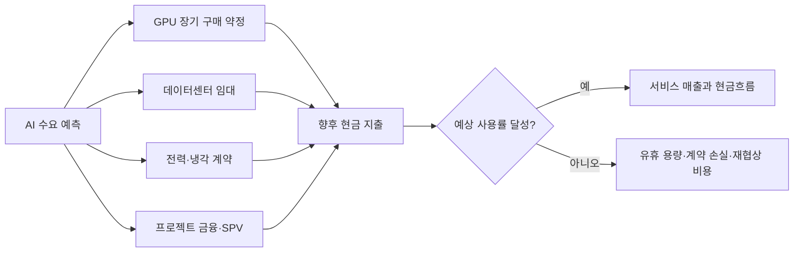

> 한 줄 요약: AI 투자에 얽힌 ‘숨은 부채’ 1조6500억달러를 이해하려면 먼저 부채의 범위부터 확인해야 한다. 데이터센터 임대와 GPU 구매 약정이 여러 계약과 주석에 흩어져 있다면, 기업이 감당해야 할 위험은 차입금 규모보다 되돌리기 어려운 장기 수요 예측에 있을 수 있다.

## 무슨 일이 있었나

2026년 7월 21일 니케이아시아는 미국 기술 대기업 5곳의 AI 투자 관련 숨은 부채가 약 4년 만에 8배로 늘어 1조6500억달러에 이르렀다고 보도했다.

이 추산에는 회사채와 은행 차입금뿐 아니라 데이터센터 임대, GPU 공급 계약처럼 앞으로 현금 지출을 요구하는 장기 약정도 포함됐다. 메타의 계약상 의무는 약 4200억달러로 추산됐다. 기사에서 투명한 부채로 분류한 금액의 약 세 배다.

다만 여기서 ‘숨은 부채’라는 표현은 주의해서 읽어야 한다. 기사에 나온 금액 전체가 회계장부에서 누락된 차입금이거나 기업이 공개하지 않은 비밀 채무라는 뜻은 아니다.

운영리스는 적용되는 회계기준과 계약 구조에 따라 사용권자산과 리스부채로 재무상태표에 반영된다. 반면 장기 구매 계약, 최소 사용량 약정, 아직 시작되지 않은 리스, 특수목적법인(SPV)을 통한 프로젝트 금융 등은 재무제표 본문보다 주석이나 계약상 의무 항목에서 확인해야 할 때가 있다.

따라서 기사에서 확인되는 내용과 별도의 검증이 필요한 부분을 구분할 필요가 있다.

| 구분 | 확인할 수 있는 내용 | 아직 확인이 필요한 내용 |
|---|---|---|
| 규모 | 니케이는 5개 기술 기업의 관련 의무를 1조6500억달러로 추산했다 | 기업별 포함 항목과 중복 제거 방식 |
| 증가 속도 | 약 4년 동안 8배 증가했다는 것이 기사의 분석이다 | 기준연도별 동일한 산정 기준을 적용했는지 |
| 계약 유형 | 데이터센터 임대와 GPU 공급 계약이 주요 대상으로 언급됐다 | 취소 가능 계약, 최소 구매액, 변동 지급액의 처리 |
| 메타 | 약 4200억달러라는 추산이 제시됐다 | 전액을 일반 금융부채와 같은 위험으로 볼 수 있는지 |
| 투명성 | 여러 계약 구조 때문에 투자자의 위험 평가가 어려워졌다는 문제 제기다 | 실제 미공시인지, 공시는 됐지만 흩어져 있는지 |

기사의 문제 제기는 타당하지만, 1조6500억달러를 회사채 잔액처럼 해석하면 위험을 과장하게 된다. 그렇다고 주석에 공개된 금액이니 현금흐름에 미칠 영향도 작다고 볼 수는 없다.

## 왜 사람들이 반응했나

이 기사는 집계 당시 Hacker News에서 313포인트와 218개 댓글을 기록했다. 큰 액수도 눈길을 끌었지만, AI 산업의 성장 전망이 실제로 어떤 장기 계약을 전제로 하는지 보여준다는 점에서 논쟁이 이어졌다.

### AI 숨은 부채는 정말 부채일까?

논쟁은 ‘부채’라는 용어에서 시작된다. 투자자는 부채라고 하면 만기와 이자율, 원금 상환을 떠올린다. 하지만 GPU 구매 약정과 데이터센터 리스에는 금융부채와 다른 조건과 위험이 따른다.

취소할 수 없는 10년짜리 데이터센터 계약은 은행 대출이 아니더라도 수요가 줄면 현금흐름을 압박한다. 반대로 실제 사용량에 따라 규모를 줄일 수 있는 계약까지 액면 총액으로 합산했다면 경제적 위험이 부풀려질 수 있다.

따라서 ‘숨겼는가’보다 ‘어디에 어떤 기준으로 공시했는가’를 먼저 물어야 한다. 재무제표 주석에 흩어진 정보를 모아 하나의 숫자로 계산한 것과 기업이 의무를 공개하지 않은 것은 다른 문제다.

### 왜 AI 데이터센터 계약이 불편한가?

AI 인프라 투자는 서버 구매만으로 끝나지 않는다. GPU와 네트워크 장비를 확보해야 하고, 전력과 냉각 설비, 토지, 데이터센터 건설, 클라우드 용량도 함께 준비해야 한다.

계약은 서로 다른 회사와 시점에 체결되지만 사업 위험은 연결돼 있다. GPU를 확보했는데 전력 공급이 늦어질 수 있고, 데이터센터 완공 전에 모델 효율이 크게 개선될 수도 있다. 이런 상황에서는 계약상 지출과 실제 활용률 사이의 차이가 커진다.

댓글에서 우려가 나온 이유도 여기에 있다. AI 서비스 매출은 변동 가능성이 큰 반면 인프라 계약은 수년간 고정될 수 있기 때문이다.

### 신뢰 문제는 공시량보다 연결 가능성에서 생긴다

계약 총액이 공시 문서 어딘가에 적혀 있다고 해서 독자가 위험을 쉽게 파악할 수 있는 것은 아니다. 차입금과 리스, 구매 약정, 관계사 보증, 프로젝트 금융이 서로 다른 표와 주석에 나뉘면 전체 노출액을 다시 계산하기 어렵다.

기업은 계약마다 회계적 성격이 달라 하나의 숫자로 합치기 어렵다고 설명할 수 있다. 하지만 법적 형식이 다른 계약들도 AI 수요가 예상에 못 미칠 때 동시에 현금 부담으로 돌아올 수 있다. 투자자에게는 이를 한데 묶은 설명이 필요하다.

이 문제는 회계 규정 위반 여부만으로 판단하기 어렵다. 규정에 맞게 공시했더라도 계약 사이의 관계와 전체 현금 부담을 설명하지 않으면 투자자가 경제적 위험을 파악하기 힘들다.

## 내가 보는 핵심

이번 이슈를 기술 대기업이 빚을 숨겼다는 이야기로 단정하기는 어렵다. 더 눈여겨볼 변화는 AI 경쟁이 연구개발비 지출을 넘어 장기 계약으로 인프라 용량을 먼저 확보하는 단계로 넘어갔다는 점이다.

과거에는 트래픽이 늘어나는 속도에 맞춰 서버 투자를 나눠 집행할 여지가 있었다. 지금은 GPU 공급과 전력, 데이터센터 부지를 먼저 확보하지 못하면 제품 개발 일정이 밀릴 수 있다. 기업들이 예상 수요보다 앞서 계약에 나서는 이유다.

장기 계약의 효과는 수요가 빗나갈 때 정반대로 바뀐다. 수요가 예상대로 늘면 공급 부족과 가격 상승을 피할 수 있지만, 수요가 꺾이면 같은 계약이 고정비 부담과 재협상 비용으로 돌아온다.

### AI 투자의 진짜 위험은 레버리지보다 비가역성이다

전통적인 부채 분석은 이자보상배율과 만기 구조, 현금성 자산을 주로 살핀다. AI 인프라를 분석할 때는 계약 규모를 줄일 수 있는지, 확보한 자원을 다른 용도로 전환할 수 있는지도 확인해야 한다.

GPU를 다른 워크로드에 사용할 수 있는지, 임대한 데이터센터를 제3자에게 재임대할 수 있는지, 전력 계약의 최소 사용량을 낮출 수 있는지에 따라 같은 100억달러 약정도 위험도가 달라진다. 전체 계약액만 보는 것보다 취소권과 전환권, 잔존가치를 함께 보는 편이 정확하다.

기술 변화 속도도 고려해야 한다. 새로운 GPU 세대나 효율이 높은 모델이 나오면 기존 설비가 정상적으로 작동하더라도 경제적 가치는 예상보다 빨리 떨어질 수 있다.

### 플랫폼 이용자에게도 남의 재무 문제가 아니다

이 문제는 주주에게만 영향을 주지 않는다. AI 플랫폼 기업이 대규모 고정비를 떠안으면 API 가격과 무료 사용량, 약정 할인, 데이터 보존 정책, 제품 지원 범위가 바뀔 수 있다.

실무에서 AI API나 클라우드 GPU를 선택할 때 현재 단가만 비교하면 이런 위험을 놓치기 쉽다. 공급자가 장기 계약을 바탕으로 낮은 가격을 유지하는지, 그 비용을 실제 수요와 매출로 감당하고 있는지도 살펴야 한다.

과잉 투자로 공급이 남으면 가격이 내려갈 수 있다. 반대로 계약 비용을 회수하기 위한 가격 인상이나 제품 통합, 지원 중단이 먼저 나타날 수도 있다.

## 앞으로 볼 기준

AI 기업의 숨은 부채나 데이터센터 투자 기사를 볼 때는 총액보다 다음 항목을 먼저 확인하는 편이 낫다.

- 부채의 정의에 회사채, 리스부채, 구매 약정, 보증, SPV 금융 중 무엇이 포함됐는가
- 같은 의무가 리스부채와 계약상 지급액 양쪽에 중복 계산되지 않았는가
- 계약을 취소하거나 규모를 줄일 수 있는 조건이 있는가
- 명목 계약액과 현재가치가 구분돼 있는가
- 향후 1년, 2~3년, 그 이후의 지급 시기가 어떻게 나뉘는가
- 설비가 특정 GPU나 특정 고객에게 묶여 있는가
- AI 매출과 영업현금흐름이 약정 증가 속도를 따라가고 있는가
- 데이터센터 가동률, 전력 확보, 건설 지연을 기업이 어떤 지표로 설명하는가
- 투자 파트너나 SPV에 대한 추가 출자·보증 의무가 있는가
- 경영진이 총투자액만 말하는지, 취소 불가능한 계약 규모도 함께 공개하는가

개발 조직과 구매 담당자는 공급자의 재무 위험을 아키텍처 문제로도 봐야 한다. 단일 모델이나 클라우드에 종속된 서비스라면 가격이나 정책이 바뀌었을 때 다른 공급자로 전환할 경로를 미리 마련해 둘 필요가 있다.

- 모델 호출 계층을 분리해 다른 공급자로 교체할 수 있는가
- 프롬프트와 평가 데이터가 특정 API 형식에 묶여 있지 않은가
- 약정 할인으로 절감하는 비용보다 최소 사용량 미달 위험이 크지 않은가
- 서비스 종료나 요금 변경 시 적용할 예산 상한과 서킷 브레이커(Circuit Breaker)가 있는가
- 학습·추론 데이터의 이동과 삭제 절차를 실제로 재현할 수 있는가

1조6500억달러는 서로 성격이 다른 계약을 합산한 추산치다. 무시해서도 안 되지만, 모두 회사채와 같은 부채라고 간주해서도 안 된다.

AI 인프라 투자의 위험을 판단하려면 GPU 구매액만 볼 것이 아니라 수요가 예상과 다를 때 계약 규모를 줄이거나 설비를 다른 용도로 전환할 수 있는지 확인해야 한다. 다음 실적 발표에서는 투자 총액과 함께 취소 불가능한 계약 규모, 지급 시기, 전환 가능한 설비의 범위를 살펴볼 필요가 있다.

## 참고 자료

- [선정 글감] [Five US tech giants' hidden debts soar to $1.65T on opaque AI funding](https://asia.nikkei.com/business/technology/five-us-tech-giants-hidden-debts-soar-to-1.65tn-on-opaque-ai-funding) (Nikkei Asia, Hacker News Best)