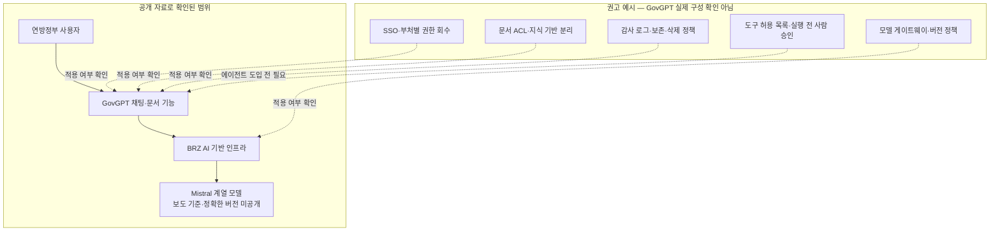

> 한 줄 요약: 오스트리아 GovGPT가 화제가 된 이유는 18만 명이라는 목표보다 익숙한 공개 코드 인터페이스와 오픈 웨이트 모델을 정부 인프라에 배포했다는 점에 있다. 다만 주권형 AI는 모델의 출신지가 아니라 데이터 흐름, 권한 관리, 감사 체계와 교체 가능성으로 증명해야 한다.

## 무슨 일이 있었나: 오스트리아 GovGPT 배포 일정

오스트리아 연방총리실은 2026년 7월 20일 Public AI 구상의 첫 내부 행정 서비스인 GovGPT 배포를 시작했다. 7월 20일부터 23일까지 연방총리실에 단계적으로 제공하며, 재무부는 21일, 노동·사회·보건·돌봄·소비자보호부는 28일부터 도입한다. 혁신·교통부와 교육부는 8월 배포를 준비하고 있다.

현재 제공되는 기능은 자유 채팅을 이용한 초안 작성과 아이디어 정리, 기초 분석, 긴 문서 요약, 여러 문서를 묶어 질문할 수 있는 개인 지식 라이브러리다. 전자 파일 분석은 8월 말부터 별도 단계로 진행된다. 의회 질의 지원과 에이전트형 자동화도 향후 Public AI 서비스로 제시됐지만, 현재 GovGPT에서 제공하는 기능과 예정된 사업은 구분해서 봐야 한다.

### 18만 명과 25만 명은 무엇이 다른가

[오스트리아 연방총리실의 공식 발표](https://www.bundeskanzleramt.gv.at/bundeskanzleramt/nachrichten-der-bundesregierung/2026/07/proell-public-ai-launcht-govgpt-fuer-die-bundesverwaltung.html)는 안전한 AI 애플리케이션으로 18만 명이 넘는 연방정부 직원을 지원한다는 목표를 제시한다. 18만 명은 Public AI의 목표 대상이지, 현재 GovGPT 계정을 발급받았거나 매일 사용하는 사람의 수가 아니다.

[derStandard의 7월 20일 현장 보도](https://www.derstandard.at/story/3000000332114/govgpt-wie-ki-den-sinkenden-personalstand-in-der-verwaltung-retten-soll)는 전체 공공부문 직원 약 25만 명 가운데 연방정부 직원이 18만 명이라고 구분했다. 같은 주에 우선 접근하는 연방총리실과 재무부 인원은 약 1만4천 명이라고 보도했다.

[ORF 보도](https://help.orf.at/stories/3236558/)는 연말까지 약 25만 명을 지원한다는 발표 내용을 전했다. 반면 연방총리실의 웹 발표에는 주 정부와 지방자치단체 등의 이용을 두고 협의 중이라고만 적혀 있다. 따라서 18만 명은 공식 발표에 명시된 연방정부 차원의 목표이고, 25만 명은 언론에 전달된 전체 공공부문 구상으로 구분하는 편이 정확하다. 이 글의 기준 시점인 2026년 7월 23일 현재 실제 활성 사용자 수는 공개되지 않았다.

### BRZ·Mistral·Open WebUI는 어디까지 확인됐나

연방총리실은 GovGPT에 입력한 질문과 업로드 문서가 오스트리아 연방 전산기관 BRZ의 AI 인프라에서 처리된다고 밝혔다. 데이터는 제3자에게 전달하지 않고 모델 학습에도 사용하지 않는다고 설명했다.

[BRZ의 LLM as a Service 기술 설명](https://www.brz.gv.at/blog/llmasaservice.html)에 따르면 공통 기반은 BRZ 데이터센터에서 운영된다. 조직별 분리, 역할 기반 접근제어(Role-Based Access Control, RBAC), OAuth 인증, 모델을 공통 방식으로 호출하는 게이트웨이, 접근 기록과 사용량 제한도 플랫폼 기능으로 제시돼 있다.

사용 모델과 사용자 화면에 관한 정보는 공식 발표보다 보도에서 구체적으로 확인된다. [Trending Topics의 3월 26일 최초 보도](https://www.trendingtopics.eu/brz-mistral-public-ai/)는 BRZ 서버에서 Mistral 3B·8B·14B 오픈 웨이트 모델을 운영하고, 사용자 화면으로 Open WebUI를 활용한다고 전했다. 7월 ORF 보도도 GovGPT가 현재 Mistral 기술을 사용하며 향후 공급자를 바꿀 수 있도록 설계됐다고 설명했다.

다만 연방총리실 발표에는 현재 GovGPT가 호출하는 모델의 정확한 이름과 버전, Open WebUI 배포판의 버전이 나와 있지 않다. 발표 화면에 Open WebUI 표기가 보였다는 사실만으로 플러그인 구성, 인증 설정이나 코드 수정 범위까지 판단할 수는 없다.

## 왜 사람들이 반응했나: Mistral·Open WebUI가 만든 긴장

개발자 커뮤니티가 먼저 주목한 것은 모델 성능표가 아니었다. 개인이 도커 컨테이너로 실행하던 것과 같은 계열의 화면이 정부 AI 서비스에 등장했다는 점이었다.

전용 포털을 처음부터 개발하는 대신 공개된 구성 요소를 조합한 선택은 구조를 점검하기 쉽다는 평가를 받았다. 행정 문서를 외부 상용 챗봇에 보내지 않고 정부가 관리하는 인프라에서 처리하며, 필요하면 모델을 교체할 수 있다는 점도 관심을 끌었다.

동시에 18만 명 규모의 서비스가 감당해야 할 동시 접속량과 보안 감사, 공급망 관리, 패치 책임을 둘러싼 질문도 나왔다. 사용 모델이 독일어 행정 문서를 제대로 처리할 수 있는지, 계정 수가 늘어났을 때 GPU 비용과 응답 품질을 유지할 수 있는지도 논쟁거리가 됐다.

### 정부 AI는 왜 오픈 웨이트 모델을 쓰려 할까?

오픈 웨이트 모델을 사용하면 운영자는 다음과 같은 선택을 할 수 있다.

- 지정한 환경에 모델 파일을 배치한다.
- 외부 API 호출을 줄이거나 차단한다.
- 모델 교체와 검증 시점을 운영자가 정한다.
- 공급자의 가격·정책 변경에 대응한다.
- 입력과 출력에 자체 감사 체계를 적용한다.

하지만 가중치를 내려받을 수 있다는 사실만으로 디지털 주권이 확보되지는 않는다. GPU, 추론 엔진, 관측 도구나 보안 업데이트가 특정 공급자에 묶여 있다면 종속되는 계층만 바뀐 셈이다.

Open WebUI도 라이선스와 운영 책임을 따로 확인해야 한다. [현재 저장소 안내](https://github.com/open-webui/open-webui)는 여러 라이선스가 함께 적용되며, 현행 코드 일부에는 Open WebUI 브랜드 유지 조건이 있다고 설명한다. GovGPT가 어느 버전을 사용했는지는 공개되지 않았다. 따라서 적용 라이선스와 코드 수정 범위, 장기지원 버전, 보안 패치 담당자를 배포 명세에 명시해야 한다.

### GovGPT 실제 구조와 권고 구조는 다르다

아래 도식의 위쪽은 공개 자료로 확인된 범위다. 아래쪽의 SSO, 문서 접근제어, 실행 승인 등은 공공기관 배포에서 확인해야 할 통제 항목이다. GovGPT에 그대로 구현됐다고 확인된 구성도가 아니다.

BRZ가 공통 LLM 플랫폼에 접근제어, 게이트웨이, 감사 로그 기능이 있다고 밝힌 것과 GovGPT의 부처별 설정이 공개됐다는 것은 서로 다른 주장이다. 실제 신뢰도는 각 통제가 GovGPT에 어떤 설정값으로 적용됐는지에 달려 있다.

### 기대와 불편은 같은 곳에서 나온다

| 쟁점 | 기대 | 확인해야 할 위험 |
|---|---|---|
| 데이터 | 문서가 외부 API로 나가지 않음 | 로그·백업·벡터 DB에 원문이 복제될 수 있음 |
| 권한 | 부처별 지식 검색 자동화 | 검색 단계에서 권한이 섞이면 다른 부처 문서가 노출됨 |
| 비용 | 외부 API 비용과 가격 변동을 줄임 | GPU·전력·운영 인력·대기시간 비용이 커질 수 있음 |
| 신뢰 | 모델과 구성 요소를 직접 점검 | 실제 설정과 수정된 배포판이 비공개면 검증이 제한됨 |
| 사용성 | 익숙한 채팅 방식으로 빠르게 보급 | AI 초안을 공식 기록처럼 복사하는 오용이 생길 수 있음 |
| 규제 | 데이터 위치와 처리 경로를 통제 | 업무 목적에 따라 AI Act 분류와 의무가 달라짐 |

내부 문서 요약이나 초안 작성이 자동으로 고위험 AI 시스템으로 분류되는 것은 아니다. 반면 인사, 필수 공공서비스, 권리 판단처럼 고위험 용도로 확장되면 공공기관 배포자에게 [EU AI Act 제27조의 기본권 영향평가](https://eur-lex.europa.eu/eli/reg/2024/1689/oj/eng) 의무가 적용될 수 있다. 법적 분류와 별개로 권한 누출과 오답, 자동 실행 오류에 대한 운영 영향평가는 도입 전에 필요하다.

## 내가 보는 핵심: 주권형 AI의 단위는 운영 체계다

GovGPT를 Mistral 도입 사례로만 보면 논점은 모델 순위에 머문다. 정부가 장기간 통제해야 할 대상은 특정 모델이 아니라 데이터가 오가는 경로와 업무 권한, 감사 기록, 장애 복구 절차다.

비교 사례인 [Solar Open 2 모델 카드](https://huggingface.co/upstage/Solar-Open2-250B)는 전체 250B 파라미터 중 토큰마다 15B를 활성화하는 전문가 혼합(Mixture-of-Experts, MoE), 최대 100만 토큰 문맥과 도구 호출 기능을 제시한다. 이는 제작사가 공개한 사양으로 GovGPT와 직접 관련이 없다. 지원 언어도 영어·한국어·일본어로 명시돼 있으므로 오스트리아 행정 업무에 쓸 수 있는 대체 모델로 검증됐다고 볼 수 없다.

Solar Open 2 사례는 오픈 웨이트 모델에도 각기 다른 라이선스와 지원 언어가 있다는 점을 보여준다. 따라서 교체 가능성은 다른 모델 파일을 연결할 수 있는지만으로 판단해서는 안 된다. 모델을 바꾼 뒤에도 동일한 권한·출처·감사 기준으로 평가할 수 있어야 한다.

### 문서 챗봇과 에이전트는 위험의 종류가 다르다

문서를 찾아 답하는 검색 증강 생성(Retrieval-Augmented Generation, RAG)과 시스템에 접속해 실제 업무를 수행하는 에이전트는 같은 단계가 아니다.

문서 챗봇의 잘못된 답은 사용자가 원문을 확인한 뒤 수정할 수 있다. 반면 에이전트가 전자결재 초안을 등록하거나 데이터를 변경하면 오류가 시스템 상태로 남는다. 의회 질의 자료처럼 정치적·법적 책임이 따르는 문서에서는 출처를 확인할 수 없는 문장 하나도 문제가 될 수 있다.

기능은 위험 수준에 따라 나누는 편이 낫다.

1. 공개 또는 저위험 문서 검색
2. 권한이 적용된 내부 문서 검색
3. 원문 출처가 표시되는 초안 작성
4. 읽기 전용 외부 도구 호출
5. 사람의 승인을 거치는 변경 작업
6. 제한된 범위의 자동 실행

파일 분석 기능이 안정적으로 운영됐다는 이유로 시스템 변경 권한까지 바로 확대해서는 안 된다. 특히 5단계와 6단계는 승인자를 지정하고 실행 전후 상태와 롤백 절차를 기록할 수 있을 때 허용해야 한다.

### 자체 호스팅도 데이터 유출 경로를 없애지 못한다

데이터가 BRZ 데이터센터 안에 있다는 설명만으로는 충분하지 않다. 입력 문서가 프롬프트 로그와 임시 파일, 임베딩(Embedding), 벡터 데이터베이스, 오류 추적 시스템에 어떻게 복제되는지도 확인해야 한다.

검색 시스템에서는 답변을 생성하기 전에 이미 권한 문제가 발생할 수 있다. 모델이 최종 답변을 거부하더라도 다른 부처 문서의 제목이나 일부 문장이 검색 문맥에 포함됐다면 정보가 노출된 것이다.

실제 도입 과정에서는 프롬프트 설계보다 아래 항목을 정하는 데 더 많은 시간이 든다.

- 원문 문서와 임베딩의 저장 위치
- 사용자별 검색 권한이 적용되는 시점
- 대화 기록의 보존·삭제 기간
- 관리자와 운영자의 열람 범위
- Open WebUI 배포판과 의존성의 패치 책임
- 외부 도구 호출 허용 목록
- 답변에 원문 출처를 표시하는 방식
- 모델 교체 전 회귀 평가와 롤백 절차

## 앞으로 볼 기준: GovGPT 성공은 무엇으로 판단할까?

먼저 계정 수와 실제 사용자 수를 분리해서 봐야 한다. 18만 명을 지원한다는 목표가 18만 명이 민감한 업무에 사용하고 있다는 뜻은 아니다. 부처와 문서 등급, 업무 유형별 허용 범위와 활성 사용자 수를 함께 공개해야 한다.

모델 이름보다 업무별 평가 결과도 필요하다. 독일어 행정 문서의 정확도, 인용 출처 일치율, 권한 밖 질문 차단률, 답변 대기시간과 환각 보고 건수를 같은 조건에서 측정해야 한다.

사람이 어디까지 책임지는지도 확인해야 한다. 의회 답변이나 행정 판단에 AI 초안이 사용됐다면 원문을 대조하고 승인하는 담당자가 누구인지, 생성 기록과 수정 이력을 얼마나 보관하는지부터 정해야 한다.

공급자를 실제로 교체할 수 있는지도 중요하다. Mistral을 다른 모델로 바꾼 뒤에도 인증과 검색 권한, 감사 기록, 승인 절차가 유지되고 같은 회귀 평가를 통과해야 교체 가능한 구조라고 할 수 있다.

사고를 분류하고 복구하는 기준도 필요하다. 잘못된 문장과 권한 누출, 자동 실행 오류를 서로 다른 사고 유형으로 기록하고 중단·조사·복구 책임자를 정해야 한다.

GovGPT의 화면이 개인용 도커 서비스처럼 익숙하다는 사실은 이 사례에 관심이 쏠린 계기였다. 실제 평가는 화면 뒤에서 누가 권한을 회수하고 오류가 발생한 경로를 추적하는지, 모델이나 공급자가 바뀌어도 서비스를 복구할 수 있는지를 확인한 뒤에 가능하다.

## 참고 자료

- [선정 글감] [Austria is rolling out a government AI-platform using Mistral models and Open WebUI](https://www.reddit.com/r/LocalLLaMA/comments/1v3hra4/austria_is_rolling_out_a_government_aiplatform/) — Reddit LocalLLaMA
- [관련] [Pröll: Public AI launcht GovGPT für die Bundesverwaltung](https://www.bundeskanzleramt.gv.at/bundeskanzleramt/nachrichten-der-bundesregierung/2026/07/proell-public-ai-launcht-govgpt-fuer-die-bundesverwaltung.html) — 오스트리아 연방총리실
- [관련] [BRZ LLM as a Service](https://www.brz.gv.at/blog/llmasaservice.html) — BRZ
- [관련] [Public AI: BRZ baut mit Open-Weights-Modellen von Mistral KI für Beamte](https://www.trendingtopics.eu/brz-mistral-public-ai/) — Trending Topics
- [관련] [GovGPT: Wie KI den sinkenden Personalstand in der Verwaltung retten soll](https://www.derstandard.at/story/3000000332114/govgpt-wie-ki-den-sinkenden-personalstand-in-der-verwaltung-retten-soll) — derStandard
- [관련] [KI: GovGPT soll Verwaltung unterstützen](https://help.orf.at/stories/3236558/) — ORF
- [관련] [Open WebUI](https://github.com/open-webui/open-webui) — GitHub
- [관련] [upstage/Solar-Open2-250B](https://huggingface.co/upstage/Solar-Open2-250B) — Hugging Face
- [관련] [Regulation (EU) 2024/1689, Article 27](https://eur-lex.europa.eu/eli/reg/2024/1689/oj/eng) — EUR-Lex