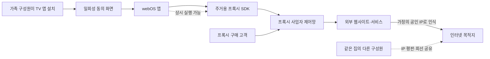

> 한 줄 요약: 스마트 TV의 주거용 프록시 차단은 앱 몇 개를 삭제하는 데서 끝날 일이 아니다. 사용자가 설치한 앱이 가정의 공인 IP와 인터넷 연결을 수익화할 수 있었고, LG가 이 구조를 플랫폼 차원에서 제한하기 시작했다.

## 무슨 일이 있었나

2026년 7월, LG전자 미국법인은 webOS 스마트 TV를 주거용 프록시 노드로 사용하는 앱을 차단하겠다고 밝혔다. 개발사가 프록시 기능을 제거하지 않으면 해당 앱의 서비스를 중단한다는 방침이다.

발단은 보안업체 Spur의 조사였다. KrebsOnSecurity가 7월 2일 소개한 조사 결과에 따르면, 조사 대상 LG webOS 스토어 앱 가운데 42% 이상에 주거용 프록시 소프트웨어 개발 키트(SDK)가 포함돼 있었다. 삼성 Tizen용 앱에서도 25%가 넘는 비율로 비슷한 구성요소가 발견됐다.

여기서 42%는 LG TV 사용자의 42%가 프록시를 사용했다는 뜻이 아니다. 실제 설치 대수와 기능 활성화 비율, 전송된 트래픽 규모는 공개된 자료만으로 알 수 없다. 스토어에서 내려받을 수 있었던 조사 대상 앱 가운데 해당 SDK를 포함한 비율이다.

프록시 SDK는 게임이나 화면보호기, 파일 유틸리티처럼 네트워크 중계와 직접 관련 없어 보이는 앱에도 들어갔다. Bright Data SDK를 사용한 한 팩맨 게임은 광고를 시청하거나 TV를 프록시 노드로 제공하는 선택지를 제시했다.

구조는 다음과 같다.

TV 앱이 외부 고객의 요청을 받아 인터넷으로 보내면 목적지 서비스에는 해당 가정에서 발생한 트래픽처럼 보인다. 앱 개발자는 SDK를 탑재한 대가를 받고, 프록시 사업자는 가정용 IP를 고객에게 판매한다.

현재 확인된 내용과 아직 확인되지 않은 부분은 구분해서 봐야 한다.

| 구분 | 현재 확인할 수 있는 내용 |
|---|---|
| 확인된 사실 | LG는 webOS 앱에서 주거용 프록시 기능을 제거하도록 요구하고, 따르지 않는 앱을 정지하겠다고 밝혔다. |
| 확인된 사실 | Spur 조사에서 LG 앱 42% 이상, 삼성 앱 25% 이상에 관련 SDK가 발견됐다고 보도됐다. |
| 사업자 주장 | 프록시 업체들은 고객확인제도(KYC)와 로컬 네트워크 접근 방지 장치를 운영한다고 주장한다. |
| 확인되지 않음 | 각 TV에서 기능이 실제로 얼마나 활성화됐는지, 어떤 고객 트래픽이 얼마나 흘렀는지는 공개되지 않았다. |
| 확인되지 않음 | 이 SDK가 같은 가정 내 다른 기기를 침해했다거나 LG TV를 통한 구체적 공격이 발생했다는 증거는 제시되지 않았다. |
| 적용 범위 | 공개된 LG 조치는 미국법인의 webOS 플랫폼 입장이다. 삼성 Tizen 앱에 대한 후속 조치는 이 자료만으로 확인할 수 없다. |

프록시 SDK를 곧바로 악성코드라고 단정하기는 어렵다. 반대로 동의 화면이 있었다는 이유만으로 문제가 없다고 보기도 어렵다.

## 왜 사람들이 반응했나

Hacker News에서는 이 글에 300개가 넘는 댓글이 달렸다. 댓글 수는 관심도를 보여주지만 커뮤니티의 합의를 뜻하지는 않는다. 반응이 컸던 이유는 TV를 시청하는 기기와 외부인의 네트워크 트래픽을 전달하는 서버 사이의 차이가 크기 때문이다.

### 스마트 TV 프록시는 왜 불편한가

사용자는 게임이나 화면보호기를 설치했지만, 앱은 TV를 상시 네트워크 인프라로 사용할 수 있었다. 설정 화면에 관련 설명이 있더라도 사용자가 앱의 실제 역할과 영향을 이해했다고 보기는 어렵다.

스마트 TV가 공유 기기라는 점도 문제를 복잡하게 만든다. 자녀나 방문객이 앱을 설치하고 동의했더라도 인터넷 회선의 명의자와 같은 집의 다른 구성원이 그 결과를 함께 감당한다.

외부 트래픽이 서비스 약관 위반이나 자동 수집, 계정 생성, 접근 제한 우회에 사용되면 목적지에서는 가정의 공인 IP가 먼저 확인된다. 실제 고객과 SDK 사업자는 뒤에 있지만 IP 차단이나 캡차 증가, 서비스 접속 제한은 해당 가정에 영향을 줄 수 있다.

- 회선 대역폭과 데이터 사용량 증가
- 공인 IP 평판 저하 가능성
- 프록시 고객의 행위가 가정 트래픽으로 오인될 위험
- 앱을 삭제할 때까지 이어질 수 있는 백그라운드 실행
- TV 화면에서 연결 상태와 사용량을 확인하기 어려운 문제

주거용 프록시 자체가 항상 불법이거나 공격에만 사용되는 것은 아니다. 지역별 서비스 확인과 광고 검증, 검색 결과 비교, 공개 웹 데이터 수집 등 합법적인 용도도 있다. 프록시 업체들은 고객을 심사하고 로컬 네트워크 접근을 차단하는 장치를 운영한다고 설명한다.

쟁점은 프록시 기술 자체보다 이 기능이 앱의 부수적인 수익모델로 들어가 공유 가전에서 장기간 실행됐다는 데 있다.

### 동의했는데도 LG가 차단해야 할까

사용자가 광고 시청 대신 프록시 제공을 선택했다면 자율적인 거래로 볼 여지도 있다. 무료 앱의 비용을 현금이 아닌 대역폭으로 지불하는 방식이라고 설명할 수도 있다.

그러나 이 거래에는 사용자가 판단할 만한 가격표가 없다. 트래픽이 얼마나 흐르는지, 어느 국가의 고객이 사용하는지, 어떤 목적지에 접속하는지 알기 어렵다. IP가 차단됐을 때 누가 복구를 맡는지도 불분명하다. 철회 방법이 앱 삭제뿐이라면 사용자가 기능을 계속 통제한다고 보기도 어렵다.

TV에 표시된 한 번의 동의만으로는 다음 질문에 답할 수 없다.

- 동의한 사람이 인터넷 회선과 기기를 처분할 권한을 가진 사람인가?
- 앱이 꺼져 있을 때도 프록시가 실행되는가?
- 월별 전송량과 최근 접속 목적지를 사용자가 확인할 수 있는가?
- 사업자가 바뀌거나 정책 범위가 확대되면 다시 동의를 받는가?
- 삭제 후 인증서, 토큰, 백그라운드 작업이 함께 제거되는가?

LG가 플랫폼 전체에서 기능을 금지하기로 한 것은 이런 문제를 앱마다 따로 관리하기 어렵다고 판단했기 때문일 수 있다. 다만 LG가 공개한 내용은 프록시 기능 제거 요구와 심사 강화 방침까지다. 기존 설치 앱을 어떻게 비활성화할지, 어떤 기준으로 탐지할지, 감사 결과를 공개할지는 아직 확인되지 않았다.

## 내가 보는 핵심

이번 일을 동의 없이 프록시를 실행한 사례로만 보면 플랫폼 관리 문제를 놓치게 된다. 일부 앱은 사용자에게 선택지를 제시했다. 내가 더 중요하게 보는 부분은 플랫폼이 허용한 권한과 수익모델의 조합을 계속 점검하지 못했다는 점이다.

앱스토어 심사는 보통 악성 파일이나 금지된 API 사용 여부, 화면 품질 등을 검사한다. 하지만 각각 허용된 기능이라도 서로 결합되면 앱의 성격이 달라질 수 있다.

`백그라운드 실행 + 임의 외부 연결 + 제3자 원격 작업 + 공유 회선`이 합쳐지면 게임 앱도 네트워크 인프라로 작동한다. 각 권한이 따로 안전한지만 볼 것이 아니라, 권한을 조합했을 때 누가 어떤 작업을 실행할 수 있는지 심사해야 한다.

### 외국산 SDK 논란과 같은 문제일까

WIRED가 소개한 별도 연구에서는 미군 구성원을 겨냥한 앱 가운데 8개 중 1개가 넘는 비율로 중국과 러시아 등 해외 업체의 코드가 발견됐다. 일부 앱에는 Huawei 코드나 Yandex 광고 서비스가 포함됐다고 보도됐다.

이 사례를 LG TV 프록시와 같은 침해 사고로 볼 수는 없다. 대상 국가와 사용자 집단, 다루는 데이터가 다르다. 다만 앱의 화면에 보이는 기능보다 제3자 SDK의 데이터 흐름과 사업 관계가 더 큰 위험을 만들 수 있다는 점은 비슷하다.

앱 이름과 개발사만 확인해서는 부족하다. 광고와 분석, 프록시, 푸시 알림 등 외부 SDK가 가진 권한과 업데이트 경로까지 소프트웨어 자재 명세서(SBOM) 수준으로 추적할 필요가 있다.

실무에서는 개인정보 수집 여부만 확인하고 검토를 끝내기 쉽다. 프록시 SDK는 데이터를 가져가는 대신 기기의 인터넷 연결과 IP 신뢰도를 외부에 제공하기 때문에 기존 개인정보 체크리스트만으로는 발견하기 어렵다.

검토 대상에는 다음 항목도 포함돼야 한다.

- 개인정보: 어떤 사용자 데이터가 외부로 나가는가
- 네트워크 정체성: 누구의 IP와 지역 정보가 사용되는가
- 연산 자원: CPU, 메모리, 전력, 저장공간을 누가 소비하는가
- 운영 권한: 외부 사업자가 기기에서 작업을 지속시킬 수 있는가
- 책임 소재: 오용과 차단, 민원 발생 시 누가 조사하고 복구하는가

LG의 차단은 필요한 조치지만 이것만으로 문제가 해결되지는 않는다. 특정 프록시 SDK 목록만 금지하면 이름을 바꾸거나 자체 구현한 기능을 놓칠 수 있다. SDK 서명과 함께 장시간 연결, 비정상적인 업로드, 앱 기능과 무관한 목적지 접속 같은 네트워크 행위도 탐지해야 한다.

## 앞으로 볼 기준

앞으로 스마트 TV 앱 정책을 볼 때는 금지 발표 자체보다 실제 집행 방식을 확인할 필요가 있다.

### 스마트 TV 앱 정책에서 무엇을 확인해야 할까

1. 기존 설치 앱도 원격으로 기능이 중단되는가  
   신규 등록만 막는다면 이미 설치된 TV는 계속 프록시 노드로 남을 수 있다.

2. 탐지 범위가 알려진 SDK 목록에 그치는가  
   자체 구현이나 난독화된 프록시 기능까지 찾으려면 네트워크 행위 분석이 필요하다.

3. 사용자가 직접 상태를 확인할 수 있는가  
   최근 연결, 전송량, 백그라운드 실행 시간과 철회 버튼이 기기 설정에 보여야 한다.

4. 공유 기기의 동의 모델을 따로 다루는가  
   앱을 실행한 사람의 클릭만으로 회선 전체를 제공할 수 없도록 소유자 승인이나 관리자 PIN이 필요하다.

5. 위반 앱과 개발사에 어떤 조치가 적용되는가  
   단일 앱 삭제인지, 동일 개발사의 다른 앱 재심사인지, 반복 위반 시 계정이 제한되는지 봐야 한다.

6. 조사 결과를 어느 수준까지 공개하는가  
   영향받은 앱 수, 설치 대수, 활성 노드 수, 중단 완료 시점이 공개돼야 조치의 실효성을 판단할 수 있다.

사용자는 TV의 앱 목록에서 출처가 불분명한 게임이나 화면보호기, 파일 유틸리티를 확인하고 사용하지 않는 앱을 삭제할 수 있다. 공유기에서 TV의 지속적인 업로드나 낯선 목적지 연결을 확인할 수 있다면 함께 점검하는 편이 좋다. 다만 일반 가정에 네트워크 분석 책임을 맡기는 방식으로는 문제를 해결할 수 없다.

이번 발표는 스마트 TV가 앱스토어와 상시 네트워크 연결을 갖춘 컴퓨터라는 점을 다시 확인시켰다. 판단 기준은 동의 문구의 길이가 아니다. 가족이 알지 못하는 사이 가정의 IP를 상품으로 사용하는 기능을 플랫폼이 발견하고 중단할 수 있는지가 중요하다.

## 참고 자료

- [선정 글감] [LG to ban residential proxies from smart TV apps](https://krebsonsecurity.com/2026/07/lg-to-ban-residential-proxies-from-smart-tv-apps/) — KrebsOnSecurity
- [관련] [Hacker News discussion: LG to ban residential proxies from smart TV apps](https://news.ycombinator.com/item?id=49000864) — Hacker News
- [관련] [Apps Marketed to US Troops Are Shipping Chinese and Russian Code](https://www.wired.com/story/apps-marketed-to-us-troops-are-shipping-chinese-and-russian-code/) — WIRED Security