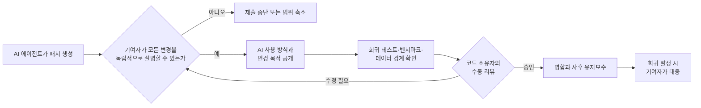

> 한 줄 요약: llama.cpp의 AI 생성 코드 허용 정책은 빗장을 푼 선언이 아니다. 코드의 출처보다 누가 설명하고 검증하며 유지보수할지를 묻는다. 다만 AI로 PR을 더 빨리 만들 수 있게 된 만큼, 리뷰 역량이 그 속도를 감당할 수 있는지는 남아 있다.

## 무슨 일이 있었나

AI가 코드를 작성하는 것은 허용하지만, 풀 리퀘스트(Pull Request, PR) 설명까지 대신 쓰게 하지는 않는다. 두 규칙은 서로 어긋나는 듯 보인다. 이 때문에 llama.cpp 커뮤니티에서도 논쟁이 벌어졌다.

2026년 7월 23일 Reddit LocalLLaMA에는 llama.cpp의 [PR #26012](https://github.com/ggml-org/llama.cpp/pull/26012)를 두고 의견을 묻는 글이 올라왔다. PR 제목은 모든 AI 생성 코드를 일반적으로 허용한다는 취지였다. 게시자는 이미 AI로 작성된 것으로 보이는 코드가 병합돼 왔다며, 이번 정책이 현실을 인정한 셈이라고 평가했다.

2026년 7월 24일 기준 llama.cpp의 `master` 브랜치에 있는 기여 문서는 다음 원칙을 명시한다.

- AI가 생성한 코드는 허용한다.
- 기여자는 제출한 모든 줄을 이해하고 설명할 수 있어야 한다.
- AI가 의미 있게 관여했다면 사용 방식을 공개해야 한다.
- 제출 전 사람이 전체 변경 사항을 검토해야 한다.
- AI가 작성한 PR 설명, 커밋 메시지, 리뷰 답변은 허용하지 않는다.
- 자동 커밋이나 자동 PR 제출은 금지되며, 완전 자율 에이전트는 기여 대상에서 llama.cpp를 제외해야 한다.

이번 변화는 AI가 만든 것을 무엇이든 받겠다는 뜻이 아니다. 생성 도구는 쓸 수 있지만 설계 판단과 대화, 제출 이후의 책임은 사람이 맡아야 한다.

| 구분 | 확인된 내용 | 확대 해석하면 안 되는 부분 |
|---|---|---|
| 적용 대상 | llama.cpp 저장소에 제출하는 코드 기여 | 모든 GitHub 활동에 AI 사용이 허용된 것은 아니다 |
| 품질 기준 | 수동 검토, 설명 가능성, 유지보수 의지 요구 | 테스트가 통과하면 자동 병합된다는 뜻이 아니다 |
| AI 공개 | 의미 있는 코드 생성은 공개해야 함 | 사소한 자동완성까지 모두 신고하는 규칙은 아니다 |
| 자동화 범위 | 자동 커밋·PR 제출 금지 | 로컬에서 AI 보조 도구를 사용하는 것까지 금지하지 않는다 |
| 기존 병합 코드 | Reddit 게시자는 과거에 AI 작성 PR이 병합됐다고 주장 | 구체적인 PR 목록이 없어 일반화할 수 없다 |

Reddit에서 제기된 회귀 증가나 특정 코드가 AI 때문에 복잡해졌다는 평은 커뮤니티 구성원의 경험담이다. 원인 분석이나 재현 자료가 함께 제시되지는 않았으므로, 확인된 프로젝트 결함과는 나눠서 읽어야 한다.

## 왜 사람들이 반응했나

### AI 생성 코드를 왜 금지하지 않았을까?

가장 현실적인 이유는 코드만 보고 어떤 도구로 작성했는지 확정하기 어렵기 때문이다. 사람이 작성한 코드도 엉성할 수 있다. 반대로 AI가 만든 코드라도 충분한 설계와 검증을 거쳤다면 프로젝트에 맞을 수 있다.

정책을 긍정적으로 본 사람들도 이 점을 짚었다. 프로젝트를 개선하고 테스트와 리뷰를 통과한다면 누가 처음 타이핑했는지는 중요하지 않다는 주장이다. 출처를 추정해 걸러내기보다 설명 가능성과 결과물로 심사하는 편이 집행하기도 쉽다.

이 반론에는 일리가 있다. AI 사용 자체를 결격 사유로 삼으면 기여자는 사용 사실을 숨길 수 있다. 유지관리자는 확인하기 어려운 출처 판별까지 떠안게 된다. 사용 사실을 공개하게 하고 책임 기준을 높이는 편이 기록을 더 정확하게 남길 수 있다.

### 커뮤니티가 말하는 AI 슬롭은 코드 모양이 아니다

우려하는 쪽에서 말하는 AI 슬롭(AI Slop)은 장황한 변수명이나 과도한 주석만을 뜻하지 않는다. 당장은 작동하지만 기존 추상화를 우회하고 비슷한 기능을 중복 구현해, 다음 변경의 비용을 높이는 코드를 가리킨다.

특히 llama.cpp는 여러 모델 형식과 CPU 및 GPU 백엔드를 지원한다. 운영체제와 하드웨어 조합도 다양하다. 한 환경에서 테스트에 성공했다고 해서 다른 백엔드의 메모리 동작이나 성능 회귀까지 검증됐다고 보기는 어렵다.

LocalLLaMA 댓글에서는 주변 도구나 빠르게 변하는 기능은 어느 정도 실험을 허용할 수 있지만, 저수준 연산을 담당하는 `lib-ggml`은 더 보수적으로 다뤄야 한다는 의견도 나왔다. 같은 저장소 안에서도 실패 비용이 다르다. AI 사용 여부만 따지기보다 변경 영역에 맞춰 위험 등급을 나눠야 한다는 얘기다.

### 진짜 비용은 생성이 아니라 검증에서 생긴다

AI 코딩 도구는 패치를 만드는 비용을 크게 낮춘다. 그렇다고 유지관리자가 읽어야 할 코드나 확인해야 할 설계 전제, 실행해야 할 하드웨어 테스트까지 같은 비율로 줄어들지는 않는다.

이 대목에서 개인의 생산성 향상과 오픈소스 프로젝트의 생산성이 갈린다. 기여자는 몇 분 만에 큰 패치를 만들 수 있지만, 리뷰 비용은 저장소 공동체가 나눠 부담한다. 제출자가 절약한 시간이 유지관리자의 대기열로 옮겨갈 수도 있다.

리뷰가 밀리면 작은 수정부터 늦어진다. 코드 소유자(Code Owner)는 지치고, 충분히 이해하지 못한 변경이 병합될 가능성도 커진다. 그래서 AI 생성 코드를 허용할 것인가는 곧 리뷰 자원을 누가 쓰고 복구 비용을 누가 부담할 것인가의 문제가 된다.

### 권한과 데이터 경계도 코드 품질만큼 중요하다

AI 에이전트는 코드를 생성하는 데서 끝나지 않는다. 파일을 읽거나 명령을 실행하고, 외부 서비스로 컨텍스트를 전송할 수도 있다.

The Pragmatic Engineer는 2026년 7월 16일 [Grok CLI가 로컬 파일을 클라우드로 업로드했다는 문제](https://newsletter.pragmaticengineer.com/p/the-pulse-groks-cli-caught-uploading)를 보도했다. 공개된 기사 내용만으로 영향 버전과 전송 범위, 벤더의 후속 조치까지 확정할 수는 없다. 다만 코드 생성 정책과 데이터 접근 정책을 따로 정해야 하는 이유는 잘 보여준다.

AI 사용 사실을 공개했다고 해서 비밀 키나 고객 데이터, 라이선스가 제한된 소스가 안전하게 처리됐다는 뜻은 아니다. 어떤 파일을 읽었고 원격 모델로 무엇을 보냈는지 확인해야 한다. 에이전트가 커밋과 네트워크 접근 권한을 가졌는지도 별도의 감사 대상이다.

## 내가 보는 핵심

이번 정책은 AI 사용을 허용하는 대신 책임질 사람을 분명히 지정한다. llama.cpp는 작성 도구를 제한하지 않지만, 기여자 한 명에게 이해와 공개, 설명, 유지보수 책임을 함께 묻는다.

이 기준은 사람을 검토 과정에 끼워 넣는 휴먼 인 더 루프(Human in the Loop)보다 엄격하다. 승인 버튼을 누르는 사람만 있어서는 부족하다. 도구 없이 설계 이유를 설명하고 문제가 생겼을 때 직접 고칠 수 있는 소유자가 필요하다.

[컨텍스트 엔지니어링(Context Engineering)](https://newsletter.pragmaticengineer.com/p/context-engineering-with-dex-horthy) 논의는 이 문제를 설명하는 데 도움이 된다. AI 결과물의 품질은 모델 이름만으로 정해지지 않는다. 저장소 규칙과 설계 문서, 관련 코드와 테스트 조건을 얼마나 정확하게 제공했는지도 영향을 준다.

문서를 많이 제공했다고 검증까지 끝나는 것은 아니다. 잘 정리된 컨텍스트는 AI가 프로젝트의 관례를 따르도록 도울 뿐이다. 설계 선택이 옳은지, 모든 플랫폼에서 안전한지는 따로 확인해야 한다.

[Bento Slides](https://bento.page/slides/)에서도 비슷한 문제를 볼 수 있다. 제작자는 코딩 도구로 만든 슬라이드의 짧은 문구를 고칠 때마다 다시 코드나 에이전트를 거쳐야 하는 불편을 줄이려고, 브라우저에서 직접 수정할 수 있는 단일 HTML 파일을 만들었다.

소프트웨어 기여에서도 사람의 통제권은 결과물을 직접 읽고 수정할 수 있는지에 달려 있다. AI를 다시 호출하지 않고는 패치를 설명하거나 고칠 수 없다면 그 코드는 아직 기여자의 코드가 아니다.

## 앞으로 볼 기준

다른 프로젝트가 AI 생성 코드 허용 정책을 발표하더라도 허용과 금지라는 문구만 봐서는 부족하다. 실제 운영 방식을 확인하려면 그 아래의 검증 절차를 봐야 한다.

| 확인할 질문 | 요구할 수 있는 증거 | 멈춰야 할 신호 |
|---|---|---|
| 변경자가 설계를 소유하는가 | 대안 비교, 변경하지 않은 범위, 주요 불변조건 설명 | 답변이 매번 AI 출력에 의존함 |
| 위험에 맞는 테스트가 있는가 | 회귀 재현, 실패 테스트, 백엔드별 결과 | 기본 CI 통과만으로 저수준 변경을 정당화함 |
| 성능 영향을 확인했는가 | 동일 조건의 전후 벤치마크와 실행 방법 | 빠르다는 주장만 있고 측정 조건이 없음 |
| 데이터 경계가 보이는가 | 읽은 경로, 외부 전송 설정, 비밀정보 제외 방식 | 저장소 전체 접근을 기본값으로 요구함 |
| 리뷰 범위가 감당 가능한가 | 작은 커밋, 관련 이슈, 기존 구조 재사용 | 하나의 PR이 여러 하위 시스템을 동시에 바꿈 |
| 병합 뒤 책임자가 있는가 | 버그 대응 의사, 롤백 방법, 코드 소유자 확인 | 생성 후 제출만 하고 후속 대응 계획이 없음 |
| AI 사용이 투명한가 | 사용 도구와 관여 범위 공개 | 출처 질문을 품질 논쟁으로만 회피함 |

현업에서 비슷한 정책을 만든다면 문서 작성과 반복 코드는 비교적 낮은 위험으로 분류할 수 있다. 메모리 관리나 인증, 암호화 변경에는 더 높은 기준을 적용하는 편이 낫다. 위험도가 높은 영역일수록 패치를 작게 나누고, 독립적인 사람의 리뷰와 재현 가능한 테스트를 거쳐야 한다. 롤백 경로도 미리 마련해야 한다.

정책의 효과는 AI 사용 비율보다 운영 결과로 판단해야 한다. 리뷰 대기 시간이 늘었는지, 중복 PR이 많아졌는지 확인할 수 있다. 병합 후 회귀와 되돌리기가 증가했는지, 유지관리자가 설명을 다시 작성하느라 시간을 쓰는지도 봐야 한다.

llama.cpp의 선택은 AI 생성 코드를 무조건 받아들이겠다는 뜻이 아니다. 작성 도구의 출처를 판별하는 데 매달리기보다, 기여자가 사용 사실을 공개하고 결과를 책임지는지 확인하는 방식이다.

다음 PR에서는 누가 이 코드를 타이핑했는지보다, AI를 끄고도 이 변경을 설명하고 고치며 끝까지 돌볼 사람이 누구인지 물어야 한다. 그 이름이 보이지 않으면 허용 정책은 리뷰 부채를 늘린다.

## 참고 자료

- [선정 글감] [contrib: allow all AI-generated code in general by ngxson · Pull Request #26012 · ggml-org/llama.cpp](https://www.reddit.com/r/LocalLLaMA/comments/1v48ssp/contrib_allow_all_aigenerated_code_in_general_by/), Reddit LocalLLaMA
- [관련] [contrib: allow all AI-generated code in general · PR #26012](https://github.com/ggml-org/llama.cpp/pull/26012), ggml-org/llama.cpp
- [관련] [AI Usage Policy](https://github.com/ggml-org/llama.cpp/blob/master/CONTRIBUTING.md), ggml-org/llama.cpp
- [관련] [Instructions for llama.cpp](https://github.com/ggml-org/llama.cpp/blob/master/AGENTS.md), ggml-org/llama.cpp
- [관련] [The Pulse: Grok’s CLI caught uploading all your local files to the cloud](https://newsletter.pragmaticengineer.com/p/the-pulse-groks-cli-caught-uploading), The Pragmatic Engineer
- [관련] [Context engineering with Dex Horthy](https://newsletter.pragmaticengineer.com/p/context-engineering-with-dex-horthy), The Pragmatic Engineer
- [관련] [Bento Slides](https://bento.page/slides/), Bento