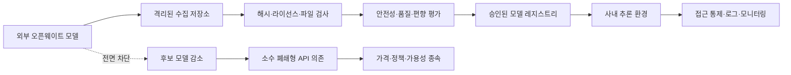

> 한 줄 요약: 중국 오픈웨이트 AI 금지 논의에 대한 반발은 중국 모델을 옹호하려는 움직임이 아니다. 스타트업과 개발자들은 검증되지 않은 모델의 위험과 함께, 정부가 모델 선택권과 로컬 배포 경로를 동시에 막을 가능성을 문제 삼고 있다.

## 무슨 일이 있었나

금지 논의에서 눈에 띈 건 잠재적 수혜자까지 반대했다는 점이다. LocalLLaMA에 공유된 게시물에 따르면, Y Combinator를 포함해 스타트업 커뮤니티의 약 200개사가 참여한 Little Tech Association은 트럼프 행정부에 중국산 오픈웨이트 AI를 금지하지 말라고 촉구했다.

Arcee AI의 반대 입장을 소개한 LocalLLaMA 게시물도 주목받았다. Arcee AI는 중국 모델의 미국 유통이 막히면 경쟁자가 줄어드는 미국 오픈 모델 기업이다. 그런데도 금지에 반대하면서 논의의 초점은 어느 나라 모델이 더 좋은지에서 정부가 모델 유통 계층 전체를 통제해도 되는지로 옮겨갔다.

2026년 7월 24일 기준, 이 글에 인용한 자료로 확인할 수 있는 정책 상태는 다음과 같다.

| 구분 | 확인된 내용 | 아직 확정되지 않은 내용 |
|---|---|---|
| 행정부 내부 논의 | WIRED는 백악관 일부와 상무부 사이에 중국 AI 대응 방식을 둘러싼 이견이 있다고 보도했다 | 최종 정책의 형태와 시행 시점 |
| 검토 배경 | 중국 AI 연구소가 미국 모델을 이용해 증류했다는 의혹이 논의의 계기로 제시됐다 | 각 의혹의 법적 판단과 기술적 입증 |
| 예상 조치 | WIRED 취재원은 대통령 차원의 조치 가능성을 언급했다 | 행정명령인지, 제재인지, 다른 수단인지 |
| 정책 범위 | 중국 AI 모델을 제한해야 한다는 제안이 논의되고 있다 | 가중치 다운로드, 클라우드 호스팅, API, 연구, 조달 중 무엇이 대상인지 |

WIRED 기사에 따르면 당시 상무부에는 정식 의견 요청도 전달되지 않았고, 검토 중인 조치가 행정명령 형태일 것으로 예상되지도 않았다. 따라서 중국 오픈웨이트 모델 금지가 확정됐다고 쓰면 확인된 사실보다 앞서가게 된다.

Moonshot AI의 Kimi K3가 미국의 선도 모델과 경쟁할 만하다는 평가도 논쟁에 불을 붙였다. 다만 이는 WIRED 기사에 소개된 평가다. 이 글에 인용한 자료에는 같은 조건에서 수행한 독립 벤치마크나 재현 결과가 포함돼 있지 않다. Kimi K3의 성능과 증류 의혹은 정책 논의의 배경일 뿐, 위법 행위가 확인됐다거나 금지 근거가 확정됐다는 뜻은 아니다.

오픈웨이트(open-weight)와 오픈소스(open source)도 구분할 필요가 있다. 오픈웨이트는 학습된 가중치를 내려받을 수 있다는 뜻에 가깝다. 학습 데이터와 전체 학습 코드, 라이선스까지 모두 공개됐다는 의미는 아니다.

## 왜 사람들이 반응했나

### 중국 오픈웨이트 AI 금지는 왜 개발자 선택권 문제인가

폐쇄형 AI 서비스에서는 공급자가 API 접근 조건이나 가격, 사용 정책, 모델 버전을 바꾸면 이용자가 그 결정에 맞춰야 한다. 오픈웨이트 모델은 가중치를 확보해 특정 버전을 고정하고, 자체 환경에서 평가하거나 인터넷과 분리된 환경에서 실행할 수 있다.

전면 금지의 영향은 모델 하나를 검색 결과에서 지우는 데서 끝나지 않는다. 다운로드 저장소와 모델 허브, 클라우드 배포, 파인튜닝 서비스, 연구용 공유까지 제한될 수 있다. 규제 범위가 넓어지면 작은 회사가 부담해야 할 규정 준수 비용도 늘어난다.

커뮤니티가 우려한 대목은 국적만으로 모델의 위험도를 판단할 가능성이다. 실무에서는 모델 이름보다 라이선스와 체크섬, 학습 데이터 설명, 로더의 취약점, 평가 결과를 확인한 뒤 배포 여부를 정한다. 국가 단위 차단은 이런 검증 절차를 거치지 않고 출처만으로 허용과 금지를 나누게 된다.

### 증류 의혹은 왜 이렇게 쉽게 확산될까

모델 증류(model distillation)라는 용어도 논쟁의 중심에 있다. 관련 LocalLLaMA 게시물은 성능이 좋은 오픈 모델이 나올 때마다 GPT나 Claude를 증류했다는 주장이 너무 빨리 따라붙는다고 지적한다.

교사 모델의 전체 확률 분포인 로짓(logits)을 이용하는 전통적인 지식 증류와 API가 반환한 문장을 합성 데이터로 활용하는 학습은 기술적으로 같은 작업이 아니다. 그렇다고 API 출력을 대량으로 수집하는 행위가 항상 허용되는 것도 아니다. 서비스 약관을 위반했는지, 접근 통제를 우회했는지, 영업비밀을 침해했는지는 따로 살펴야 한다.

서로 다른 행위를 모두 증류 공격이라고 부르면 문제가 흐려진다.

- 공개 논문과 합법적으로 확보한 데이터로 재현한 경우
- API 출력으로 합성 데이터를 만든 경우
- 자동화된 계정으로 접근 제한을 우회한 경우
- 비공개 로짓이나 내부 데이터를 탈취한 경우

이 네 가지는 기술적 행위도 다르고 법적 책임도 다르다. 의혹만으로 전면 금지를 설계하면 정상적인 연구와 악의적인 수집을 구분하기 어려워진다.

### 신뢰와 안보 우려는 과장으로 치부할 수 없다

금지론이 제기하는 우려에도 근거는 있다. 내려받은 가중치는 공급자가 운영하는 API보다 사용자가 직접 확인해야 할 항목이 많다. 모델 파일이나 로더에 악성 코드 실행 경로가 있을 수 있고, 특정 입력에 반응하는 백도어가 숨겨졌을 가능성도 점검해야 한다. 라이선스에 예상보다 강한 제한이 걸려 있을 수도 있다.

중국 기업이 미국 AI 서비스의 접근 통제를 조직적으로 우회했다는 의혹이 입증되면 제재나 수출 통제 논의의 전제도 달라진다. 국가기관이 민감한 문서를 출처가 불분명한 모델에 입력하는 문제 역시 개인 개발자의 실험과 같은 기준으로 다룰 수 없다.

정책 수단은 무제한 허용과 전면 금지 사이에도 있다. 정부 조달을 제한하거나 고위험 업무에 사전 평가를 요구할 수 있다. 데이터 반출을 통제하고 모델 출처 공개를 의무화하거나, 확인된 위반 행위만 개별적으로 제재하는 방식도 가능하다.

## 내가 보는 핵심

이번 갈등은 어떤 모델을 믿느냐보다 검증 권한을 누가 가지느냐에 더 가깝다.

오픈웨이트 모델이라고 해서 안전이 자동으로 보장되지는 않는다. 폐쇄형 미국 모델도 데이터 보존 정책 변경이나 장애, 가격 인상, 계정 차단, 모델 교체 문제에서 자유롭지 않다. 국적이나 공개 방식 하나만으로 모델을 신뢰할 수 없는 이유다.

조직이 오픈웨이트 모델을 도입하려면 가중치를 내려받아 곧바로 운영하는 대신 검증 절차를 갖춰야 한다.

정책이 이 흐름의 어느 지점을 규제하는지에 따라 결과가 달라진다. 검증하지 않은 모델을 운영 환경에 올리지 못하게 하는 것과 연구자가 격리된 환경에서 가중치를 분석하지 못하게 하는 것은 전혀 다른 정책이다.

오스트리아의 GovGPT 사례는 다른 접근을 보여준다. 관련 LocalLLaMA 게시물에 따르면 오스트리아는 연방 데이터센터의 주권형 인프라에서 Mistral 계열 오픈웨이트 모델과 Open WebUI를 사용하고 있으며, 약 18만 명의 연방 직원을 대상으로 배포할 계획이다. 규모와 세부 구성은 게시물의 설명에 따른 것이어서 공식 자료와 교차 확인할 필요가 있다. 이 사례가 설명하는 방식은 공개 가중치를 공공기관의 통제 범위 안에서 운영하는 것이다.

모델의 출신 국가만 따지는 대신 데이터가 어디에 저장되는지, 가중치를 누가 검증했는지, 어떤 업무에 연결되는지를 관리하는 방식이다. 현업에서는 모델 브랜드보다 배포 경로와 권한 설계가 사고의 범위를 더 크게 좌우하는 경우가 많다.

## 앞으로 볼 기준

### 실제 금지안이 나오면 무엇을 확인해야 할까

먼저 규제 대상을 어떻게 정의하는지 봐야 한다. 중국 기업이 개발한 모델만 해당하는지, 중국에서 학습된 모델까지 포함하는지, 중국 자본이 참여한 회사도 대상인지에 따라 파급 범위가 달라진다.

통제되는 계층도 구분해서 확인해야 한다.

- 가중치의 미국 내 다운로드와 재배포
- 모델 허브와 코드 저장소의 호스팅
- 미국 클라우드에서의 추론과 파인튜닝
- 정부기관 및 핵심 인프라의 조달
- 학술 연구와 보안 분석
- 중국 기업의 미국 AI API 접근

이 항목을 구분하지 않고 금지라고만 표현하면 정책의 실제 범위를 알기 어렵다.

증류 의혹은 증거의 수준을 따져야 한다. 출력 문장의 유사성과 합성 데이터 사용 정황, 접근 제한 우회 기록, 비공개 정보 탈취는 같은 무게의 증거가 아니다. 기업의 주장과 정부의 판단, 법원의 확정 판단도 분리해서 읽어야 한다.

예외와 이의제기 절차도 확인해야 한다. 보안 연구나 기존 서비스 유지, 모델 취약점 분석, 학술적 재현까지 막히면 모델의 위험을 검증할 사람마저 줄어들 수 있다.

조직 내부에서도 당장 점검할 항목이 있다.

- 운영 중인 모델의 개발사와 배포 지역을 기록하고 있는가
- 가중치 파일의 해시와 출처를 고정했는가
- 임의 코드 실행이 가능한 로더를 격리했는가
- 모델 교체 시 품질과 안전성을 다시 평가하는가
- 특정 모델 허브나 API가 차단돼도 전환할 후보가 있는가
- 고객 데이터와 내부 문서가 어느 국가의 서버로 이동하는가

Little Tech Association과 Arcee AI의 반대가 중국 모델의 안전성을 보증하는 것은 아니다. 위험한 모델을 골라낼 권한까지 소수 정부기관과 대형 플랫폼에 맡겨도 되는지 묻는 쪽에 가깝다.

경쟁자가 줄면 단기적으로 이익을 얻을 회사라도 다음 차단 대상이 누구일지 예측할 수 없다면 금지에 반대할 수 있다. 앞으로 정책을 볼 때는 중국 모델을 믿을 수 있는지만 물어서는 부족하다. 위험한 행위를 얼마나 구체적으로 정의했는지, 그 밖의 연구와 개발에 어느 정도 선택권을 남겼는지 함께 봐야 한다.

## 참고 자료

- [선정 글감] [The Little Tech Association, a new group of ~200 companies across the startup community, including Y Combinator, urges Trump not to ban Chinese open-weight AI](https://www.reddit.com/r/LocalLLaMA/comments/1v4b5nc/the_little_tech_association_a_new_group_of_200/) (Reddit LocalLLaMA)
- [관련] [Arcee AI has spoken out against the ban on open Chinese models in US](https://www.reddit.com/r/LocalLLaMA/comments/1v4a10b/arcee_ai_has_spoken_out_against_the_ban_on_open/) (Reddit LocalLLaMA)
- [관련] [Model distillation accusations are getting way overblown at this point](https://www.reddit.com/r/LocalLLaMA/comments/1v44aa6/model_distillation_accusations_are_getting_way/) (Reddit LocalLLaMA)
- [관련] [The White House Is Trying to Figure Out What to Do About Chinese AI](https://www.wired.com/story/the-white-house-is-trying-to-figure-out-what-to-do-about-chinese-ai/) (WIRED)
- [관련] [Austria is rolling out a government AI-platform using Mistral models and Open WebUI](https://www.reddit.com/r/LocalLLaMA/comments/1v3hra4/austria_is_rolling_out_a_government_aiplatform/) (Reddit LocalLLaMA)