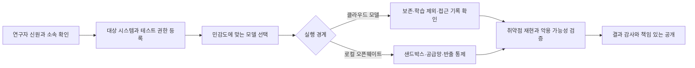

> **한 줄 요약** AI 보안 가드레일 논쟁은 답변 거부보다 플랫폼이 합법적인 연구자를 어떻게 판정하느냐에 달려 있다. 판정이 불안정하면 민감한 보안 작업은 감사 가능한 상용 모델을 떠나 통제하기 어려운 로컬 오픈웨이트 모델로 옮겨갈 수 있다.

## 무슨 일이 있었나

AI 모델에 취약한 코드를 보여주고 공격 가능성을 검증해 달라고 요청하면 어떤 날은 분석을 제공하고, 어떤 날은 사이버 공격에 악용될 수 있다는 이유로 멈춘다. 방어를 위해 취약점을 재현해야 하는 연구자에게 이런 거부는 검증 절차 자체를 멈추게 한다.

TechCrunch가 2026년 7월 23일 보도한 내용에 따르면 공격 보안(Offensive Security) 연구자들은 OpenAI와 Anthropic의 사이버 보안 가드레일 때문에 모델과 협상하는 시간이 늘었다고 말한다. 공격 보안은 허가받은 시스템을 능동적으로 공격해 실제 취약점을 찾고 악용 가능성까지 확인하는 방어 활동이다.

두 회사가 모든 보안 요청을 일률적으로 차단하는 것은 아니다. OpenAI는 Trusted Access for Cyber, Anthropic은 Cyber Verification Program을 운영하며 심사를 통과한 연구자에게 일반 사용자보다 완화된 접근을 제공한다.

심사를 통과해도 거부가 이어졌다는 점이 논란을 키웠다. 보도에 등장한 RemoteThreat의 크리스 톰프슨은 검증 프로그램 안에서도 가드레일이 일관되지 않았다고 말했다. 취약점을 분석하는 시간보다 모델이 출력을 과도하게 정제하거나 거부하는 이유를 파악하는 데 더 많은 시간을 쓰게 된다는 설명이다.

2026년 6월에는 미국 정부가 Anthropic의 Mythos와 Fable 모델에 수출통제를 적용했다. TechCrunch에 따르면 가드레일 우회 가능성을 다룬 보고서가 결정에 적어도 일부 영향을 줬다. 이후 Fable 5는 7월 1일 일반 접근이 재개됐고, Mythos 5는 정부 검토 과정에서 심사를 거친 미국 기관에 한해 다시 제공됐다.

기사와 당사자 발언으로 확인되는 내용은 여기까지다. 공개 자료만으로는 수출통제의 주된 원인이 실제 탈옥(Jailbreak) 우려였는지, 가드레일이 전체 취약점 연구 생산성을 얼마나 떨어뜨렸는지 단정하기 어렵다. 연구자들의 사례는 구체적이지만 거부율이나 작업 지연 시간을 비교한 통계는 제시되지 않았다.

용어도 구분할 필요가 있다. 기사에서 연구자들이 대안으로 언급한 모델은 흔히 오픈소스 AI라고 불리지만, 모델 가중치가 공개됐다고 해서 학습 코드와 데이터, 라이선스까지 모두 공개된 것은 아니다. 이 글에서는 다운로드해 로컬에서 실행할 수 있는 모델을 오픈웨이트(Open-weight) 모델로 부른다.

## 왜 사람들이 반응했나

### AI 보안 가드레일은 왜 정상적인 취약점 연구도 막을까?

취약점 검증은 공격과 방어가 같은 절차를 공유한다. 버퍼 오버플로를 일으키는 입력을 만들어 결함을 재현해야 하고, 권한 상승 경로도 직접 확인해야 한다. 패치 전후의 악용 가능성까지 비교해야 결함의 심각도를 판단할 수 있다.

NCC Group의 크리스 앤리는 이를 망치에 비유했다. 집을 지을 때 필요한 도구지만 무기로도 쓰일 수 있다는 얘기다. 모델이 요청자의 목적을 확인하지 않고 출력의 공격 가능성만 본다면 허가받은 침투 테스트와 범죄자의 공격 준비를 구별하기 어렵다.

가드레일을 없애는 것도 답은 아니다. 취약점 탐색과 익스플로잇(Exploit) 작성 능력이 높은 모델은 피싱 자동화나 대량 스캔보다 훨씬 직접적인 피해를 만들 수 있다. 모델 제공자가 사용자를 심사하고 고위험 기능을 제한하는 데는 현실적인 이유가 있다.

현재 판정 방식에는 다음과 같은 모호함이 남는다.

| 연구자가 하려는 일 | 방어 목적 | 공격 목적으로 해석될 여지 |
|---|---|---|
| 취약한 함수 분석 | 패치 우선순위 결정 | 공격 지점 탐색 |
| 충돌 입력 생성 | 결함 재현 | 익스플로잇 개발 |
| 인증 우회 검증 | 보안 통제 점검 | 무단 접근 |
| 패치 전후 비교 | 수정 효과 확인 | 우회 기법 발견 |
| 바이너리 역공학 | 악성코드와 제품 분석 | 비공개 로직 탈취 |

프롬프트의 단어만 검사해서는 이 두 목적을 안정적으로 분리할 수 없다. 합법성은 요청 문장보다 대상 시스템의 소유권과 테스트 권한, 실행 환경, 결과물의 반출 범위에 따라 결정되기 때문이다.

### 연구자 심사는 신뢰 문제를 해결했나?

검증 프로그램은 익명 사용자가 곧바로 고위험 기능을 쓰는 것보다 나은 절충안이다. 다만 회사가 연구자의 자격과 허용할 연구 범위를 정하면 민간 플랫폼의 정책이 사실상 보안 연구의 작업 허가서처럼 작동할 수 있다.

스마트폰 부품 제조사에서 일하는 익명의 연구자는 소속 회사가 Anthropic의 검증 프로그램에 참여하지 않아 도구가 보안 관련 작업을 감지하면 거의 사용할 수 없었다고 TechCrunch에 말했다. 연구 목적이 정당해도 소속 조직의 승인 여부에 따라 접근성이 달라진 사례다.

Crowdfense의 파올로 스타뇨는 다른 문제를 제기했다. 그는 프런티어 모델을 역공학 보조에는 사용하지만 미공개 취약점이나 익스플로잇을 찾는 단계에서는 클라우드 모델을 피한다고 밝혔다. 제로데이(Zero-day) 정보가 외부 서버로 전송되거나 향후 학습에 사용될 위험을 감수하기 어렵기 때문이다.

이 경우에는 가드레일 완화보다 데이터 경계가 먼저다. 모델이 답변을 허용하더라도 다음 질문에 답하지 못하면 민감한 취약점 정보를 입력하기 어렵다.

- 프롬프트와 첨부 파일이 저장되는가
- 운영자나 하청 인력이 내용을 열람할 수 있는가
- 모델 학습과 품질 평가에서 제외되는가
- 보존 기간과 삭제 절차가 계약에 명시되는가
- 어느 국가와 법률의 적용을 받는가
- 사고가 발생했을 때 접근 기록을 확인할 수 있는가

### 왜 중국 오픈웨이트 모델 이야기로 번졌나?

거부가 반복되면 연구자는 작업을 포기하기보다 다른 실행 환경을 찾는다. 톰프슨은 책임 있는 연구자들이 GLM 같은 중국계 오픈웨이트 모델로 밀려나고 있다고 주장했다. 로컬 모델은 별도 심사 없이 실행할 수 있고 취약점 자료를 외부 API에 전송하지 않아도 된다.

WIRED는 2026년 6월과 7월에 Z.ai의 GLM 5.2, Moonshot AI의 Kimi K3, Alibaba의 Qwen 3.8이 공개됐다고 전했다. 이들 모델은 에이전트형 코딩 작업과 오픈웨이트 접근성을 내세웠다. 서구권 프런티어 모델의 접근 제한이 강해질수록 안정적으로 쓸 수 있다는 점 자체가 경쟁력이 된다.

로컬에서 실행한다고 저절로 안전해지는 것은 아니다. 조직이 모델 가중치와 추론 코드의 공급망을 확인하고, 악성 파일을 처리할 샌드박스와 생성된 익스플로잇의 반출 절차를 관리해야 한다. 라이선스와 업데이트 출처도 직접 점검해야 한다. 클라우드 사업자의 통제가 사라지는 대신 운영 책임이 사용자에게 넘어온다.

2026년 7월 22일 Axios 기사는 OpenAI와 Anthropic이 중국의 강력한 오픈웨이트 모델이 가진 위험을 미국 정책 당국에 함께 경고하고 있다고 보도했다. 이 사안은 Hacker News에서 287포인트와 328개 댓글을 기록했다. 이 숫자는 관심의 크기만 보여준다. 댓글 전체가 어느 한쪽을 지지했다는 증거는 아니지만, 논의가 안전 규제로 대형 폐쇄형 모델 사업자의 지위가 강화될 수 있다는 규제 포획 문제까지 번졌다는 사실은 확인할 수 있다.

오픈웨이트 모델은 공개된 뒤 접근을 회수하거나 중앙에서 가드레일을 업데이트하기 어렵다. 폐쇄형 모델 사업자가 제기하는 위험은 이런 기술적 차이와 연결된다. 다만 해당 사업자가 더 강한 규제로 경제적 이익을 얻을 가능성도 있다. 위험에 관한 주장과 사업적 이해관계를 따로 떼어 볼 수 없는 이유다.

## 내가 보는 핵심

이번 논쟁을 가드레일을 없앨지 유지할지의 선택으로만 보면 해결책이 좁아진다. 실제 운영에서 따져야 할 것은 고위험 기능을 어떤 신원과 권한, 데이터 경계, 실행 환경에 연결할지다.

현재 방식은 주로 모델의 출력 단계에서 위험을 막는다. 하지만 공격 보안 작업은 요청 문장 하나로 판단할 수 없다. 승인된 대상과 격리된 실행 환경, 감사 기록까지 확인해야 한다.

이 구조에서는 같은 코드 생성 요청도 맥락에 따라 다르게 처리할 수 있다. 등록된 자산을 격리된 환경에서 검증하는 요청과 불특정 외부 시스템을 겨냥한 요청을 같은 위험 등급으로 볼 이유는 없다.

플랫폼에는 허용 버튼보다 세분된 통제 장치가 필요하다.

- 거부 사유를 기계가 읽을 수 있는 정책 코드로 반환
- 어떤 모델 버전과 정책 버전이 적용됐는지 기록
- 프로젝트 단위로 승인된 자산과 연구 범위 연결
- 고위험 출력은 격리된 실행 환경에서만 사용하도록 제한
- 오탐 거부에 대한 신속한 이의 제기 절차 제공
- 검증 프로그램의 자격 기준과 철회 조건 공개

연구 조직은 성능 순위만 보고 모델을 고르기 어렵다. 프런티어 API는 높은 성능과 관리형 운영을 제공하지만 정책 변경과 데이터 외부 전송에 의존한다. 로컬 오픈웨이트 모델은 안정적인 접근과 데이터 통제가 가능하지만 보안 운영과 오용 방지 책임을 내부에서 맡아야 한다.

| 판단 기준 | 클라우드 프런티어 모델 | 로컬 오픈웨이트 모델 |
|---|---|---|
| 고위험 요청 접근 | 심사와 가드레일에 좌우됨 | 자체 정책으로 결정 |
| 미공개 취약점 데이터 | 외부 전송 조건 확인 필요 | 내부에 유지 가능 |
| 정책 일관성 | 제공자 변경의 영향 받음 | 버전 고정 가능 |
| 감사 가능성 | 사업자가 제공하는 로그에 의존 | 자체 로그 설계 가능 |
| 패치와 모델 업데이트 | 사업자가 관리 | 조직이 직접 관리 |
| 공급망과 오용 통제 | 일부를 사업자가 부담 | 대부분 조직이 부담 |

이런 환경에서 하나의 모델로 전 과정을 처리하면 통제하기 어렵다. 문서 요약과 공개 코드 분석은 관리형 API로 처리하고, 미공개 취약점 재현은 네트워크가 격리된 로컬 환경에서 수행하는 식으로 작업을 나누는 편이 현실적이다.

모델을 나누면 결과 재현성이 떨어지고 운영도 복잡해진다. 같은 분석이 모델별로 다르게 나올 수 있고, 보안팀은 프롬프트 외에도 모델 해시와 추론 설정, 정책 버전, 입력 자료의 민감도를 기록해야 한다. 운영은 번거로워지지만 민감한 작업을 어디서 처리할지는 분명해진다.

## 앞으로 볼 기준

앞으로 AI 회사가 사이버 보안 기능을 강화했다거나 오픈웨이트 모델을 규제해야 한다는 뉴스가 나오면, 안전하다는 표현보다 적용 범위부터 확인하는 편이 낫다.

### AI 사이버 보안 정책에서 무엇을 확인해야 할까?

- 제한 대상이 모델 전체인지, 특정 도구 호출이나 자율 실행 기능인지
- 일반 사용자와 검증된 연구자에게 서로 다른 정책이 적용되는지
- 개인 연구자와 소규모 보안 업체도 검증 프로그램에 참여할 수 있는지
- 승인과 거부 기준, 처리 기간, 이의 제기 절차가 공개돼 있는지
- 정책이 바뀌었을 때 기존 프로젝트와 API 동작이 얼마나 보장되는지
- 미공개 취약점 데이터의 저장, 학습, 삭제 조건이 계약에 적혀 있는지
- 모델이 생성한 코드가 격리 환경 밖으로 나갈 때 추가 승인이 필요한지
- 사고 발생 시 누가 어떤 로그로 책임 범위를 입증할 수 있는지

연구팀이라면 동일한 승인 샘플을 정기적으로 실행해 모델 버전별 허용 및 거부 결과를 기록할 수 있다. 날짜와 모델명, 정책 버전, 입력의 민감도, 거부 코드, 재시도 여부를 남기면 막연한 불만을 재현 가능한 운영 데이터로 바꿀 수 있다.

오픈웨이트 모델도 국적이나 공개 여부만으로 판단하기는 어렵다. 가중치 출처와 해시, 라이선스, 추론 런타임, 네트워크 접근, 플러그인 권한, 생성물 저장 위치를 함께 검토해야 한다. 제한이 적으면 선택권은 넓어진다. 그만큼 운영 책임은 사용자가 진다.

여기서 생기는 역설이 있다. 미국 AI 기업이 위험한 작업을 막을수록 정당한 연구자가 더 통제하기 어려운 모델로 이동할 수 있다. 가드레일 평가는 거부 건수로 끝나선 안 된다. 허가받은 방어 작업을 안전하고 예측 가능한 경로 안에 계속 둘 수 있는지도 함께 봐야 한다.

## 참고 자료

- [선정 글감] [How AI guardrails are impeding the work of offensive cybersecurity researchers](https://techcrunch.com/2026/07/23/how-ai-guardrails-are-impeding-the-work-of-offensive-cybersecurity-researchers/) (TechCrunch)
- [관련] [OpenAI and Anthropic unite against China’s open models](https://www.axios.com/2026/07/22/openai-anthropic-open-models-trump-china) (Axios)
- [관련] [China’s Open AI Models Are Challenging Silicon Valley’s Playbook](https://www.wired.com/story/chinas-open-ai-models-are-challenging-silicon-valleys-playbook/) (WIRED)