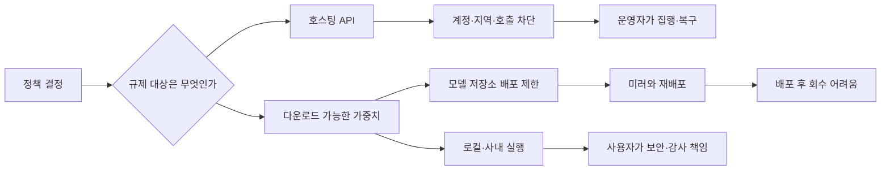

> 한 줄 요약: 오픈 웨이트 모델 규제의 쟁점은 AI를 풀어둘지 막을지가 아니다. 어떤 위험을 근거로 누가 모델 배포를 제한할지, 이미 내려받은 가중치를 어디에서 통제할 수 있을지가 문제다.

정책 하나로 모델 파일을 내려받을 선택지가 사라질 수 있다는 소식에 개발자 커뮤니티가 들썩였다. 중국 AI를 둘러싼 미·중 경쟁만으로는 이 반응을 설명하기 어렵다.

자체 서버에서 모델을 실행해 온 개발자와 스타트업에는 비용과 개인정보 보호, 공급자 종속이 걸려 있다. 한 번 복제된 모델은 API 차단이나 리콜만으로 회수하기 어렵다는 반론도 무시하기 어렵다.

## 무슨 일이 있었나

### 오픈 웨이트 모델 규제 반대 서한에는 누가 참여했나

2026년 7월, 20곳이 넘는 기업과 단체가 정책 입안자에게 오픈 웨이트 모델을 광범위하게 제한하거나 성급하게 규제하지 말라고 요구하는 공개서한에 이름을 올렸다. LocalLLaMA에 공유된 설명에 따르면 마이크로소프트가 서한을 주도했고 NVIDIA, Meta, Microsoft, Palantir, Hugging Face 등이 서명했다.

서한은 모델 증류(Model Distillation)도 별도로 언급했다. 합법적인 모델 증류와 영업비밀·지식재산권의 부당한 취득을 같은 행위로 취급하지 말고 구분해 달라는 주장이다.

같은 달 22일 Politico는 스타트업 창업자들이 미국 정부에 중국산 오픈 웨이트 AI 접근을 차단하지 말라고 촉구했다고 보도했다. 이 기사가 Hacker News에 올라온 뒤 수집 시점 기준 1,013포인트와 832개 댓글이 붙었다. 댓글 수는 논쟁이 컸다는 사실을 보여주지만 커뮤니티가 어느 한쪽으로 합의했다는 근거는 아니다.

공개된 서명자 명단에는 OpenAI, Anthropic, Google 등 주요 프런티어 모델 개발사가 보이지 않았다. 서명하지 않은 이유는 자료에 나와 있지 않다. 이 사실만으로 세 회사가 특정 규제안에 찬성한다고 해석할 수는 없다.

공개서한과 보도로 확인되는 내용은 다음과 같다.

- 20곳이 넘는 기업·단체가 오픈 웨이트 모델을 포괄적으로 조기에 제한하는 데 반대했다.
- 서한은 합법적인 증류와 부당한 정보 취득을 구분해 달라고 요구했다.
- 중국산 오픈 웨이트 모델의 접근 제한을 우려하는 스타트업의 별도 움직임이 보도됐다.
- LocalLLaMA와 Hacker News에서 큰 반응이 이어졌다.

실제 규제가 법률, 행정명령, 수출통제, 정부 조달 제한 가운데 어떤 형태로 구체화될지는 아직 제시된 자료에 없다. 적용할 모델의 성능 기준과 배포 경로, 대상 국가와 사용자 범위도 확정된 정책 문안과 구분해서 봐야 한다.

## 왜 사람들이 반응했나

### 왜 오픈 웨이트 AI 차단이 개발자 문제인가

오픈 웨이트(Open Weight)는 학습된 가중치를 내려받아 직접 실행할 수 있는 배포 형태를 가리킨다. 소스 코드와 학습 데이터, 학습 방법, 상업적 이용 권리까지 모두 공개하는 오픈 소스(Open Source)와는 범위가 다르다.

정책 논의에서 두 개념이 섞이면 제한 대상이 급격히 넓어진다. 연구용 체크포인트와 상업 이용이 허용된 모델, 출처가 불명확한 증류 모델에 같은 규칙이 적용될 수 있기 때문이다.

개발자가 가장 먼저 걱정하는 것은 선택권이다. API 모델에서는 운영사가 계정과 지역, 호출량, 사용 목적을 통제한다. 오픈 웨이트 모델은 이용자가 자체 인프라에서 실행할 수 있다. 인터넷이 끊긴 환경이나 민감정보를 외부로 보내기 어려운 업무, 공급자를 바꿀 수 있어야 하는 시스템에서 대안이 된다.

경쟁 문제도 있다. 법무·보안 조직을 갖춘 대기업은 높은 규제 비용을 감당할 여지가 있지만 작은 팀은 모델의 위험성을 평가하기도 전에 접근 경로부터 잃을 수 있다. 대형 기술기업이 서명했는데도 일부 개발자가 서한을 공익 선언으로만 받아들이지 않는 이유다. 각 회사가 어떤 모델과 유통 경로를 지키려는지도 함께 묻게 된다.

신뢰 문제는 더 복잡하다. 중국산 모델이라는 이유만으로 일괄 차단하면 보안 위험과 지식재산권 분쟁, 지정학적 판단을 국적 기준 하나로 처리하게 된다. 출처와 학습 과정이 불투명한 모델을 아무 조건 없이 배포해도 된다는 주장도 설득력을 얻기 어렵다.

### 모델 증류 vs 지식재산권 침해, 무엇이 다른가

모델 증류는 더 큰 모델의 출력이나 동작을 이용해 작은 모델을 학습시키는 기법이다. 공개 API에서 허용된 범위 안에서 생성한 데이터나 적법하게 확보한 데이터셋, 사용권이 분명한 모델을 활용할 수 있다.

문제는 같은 기술 이름 아래 성격이 다른 행위가 묶인다는 데 있다. 서비스 약관을 어기며 대량의 출력을 수집했는지, 보호된 가중치나 내부 데이터를 빼냈는지, 공개적으로 허용된 결과를 학습에 이용했는지는 각각 따져야 할 사실이다.

서한은 증류라는 기법과 부당한 취득 행위를 구분해 달라고 요구했다. 둘을 동일하게 취급하면 정상적인 연구와 모델 경량화까지 위축될 수 있다. 다만 합법적 증류라는 이름을 붙였다고 데이터 출처와 약관 위반 여부를 확인하지 않아도 되는 것은 아니다.

### 규제를 요구하는 쪽의 반론도 남는다

오픈 웨이트 모델은 한 번 공개되면 중앙 운영자가 일괄 회수하기 어렵다. 취약점이 발견되거나 위험한 파인튜닝(Fine-tuning)이 퍼져도 API처럼 즉시 버전을 내리거나 계정을 차단할 수 없다.

악용 가능성이 큰 모델은 배포 후 처벌만으로 피해를 막기 어렵다는 주장도 성립한다. 수출통제와 제재 회피, 사이버 공격 자동화, 안전장치 제거를 걱정하는 정책 담당자에게 사후 대응만으로는 부족할 수 있다.

전면 개방과 전면 차단 사이에는 여러 선택지가 있다. 위험 수준에 따른 평가와 배포자 의무, 특정 사용처 제한, 접근 기록, 연구자 예외, 이의 제기 절차 가운데 실제로 집행할 수 있는 수단을 따져야 한다. 공개서한도 모든 규제를 거부하기보다는 범위가 불명확한 선제 제한을 경계하는 쪽에 가깝다.

## 내가 보는 핵심

이번 논쟁을 볼 때는 오픈이라는 단어나 중국이라는 국적보다 위험의 근거와 통제 지점을 구분해야 한다.

API와 오픈 웨이트는 통제 구조부터 다르다. API는 서비스 운영자에게 차단 지점이 모이지만 다운로드된 가중치는 여러 저장소와 조직으로 복제된다.

이 차이를 무시하고 API 규제를 가중치 파일에 그대로 적용하면 집행 가능한 곳만 막힐 수 있다. 공식 저장소와 정상 기업은 제한을 따르지만 이미 복제된 파일과 비공식 미러는 남는다. 규제 비용은 규칙을 지키는 이용자에게 집중되고 실제 위험 행위는 다른 경로로 옮겨갈 가능성이 있다.

로컬 실행을 곧 데이터 안전으로 보는 것도 문제다. 모델 파일이 변조됐는지, 추론 로그와 프롬프트를 어디에 저장하는지, 플러그인에 어떤 권한을 주는지, 업데이트를 어떻게 받는지는 운영 조직이 직접 책임져야 한다.

이런 환경에서는 모델의 국적보다 데이터 흐름을 먼저 그려보는 편이 낫다.

- 가중치를 어디에서 받았는가
- 파일의 해시와 서명을 검증할 수 있는가
- 라이선스가 상업 이용과 재배포를 허용하는가
- 입력 데이터와 추론 로그가 어디에 저장되는가
- 모델이 외부 도구나 사내 시스템에 어떤 권한으로 접근하는가
- 배포 중단이나 보안 업데이트가 필요할 때 교체할 수 있는가

오픈 웨이트라는 이유만으로 안전이나 자유가 보장되지는 않는다. 접근 자체를 제한하려면 위험이 모델 성능에서 생기는지, 취득 과정이나 특정 사용 행위에서 생기는지부터 나눠서 판단해야 한다.

## 앞으로 볼 기준

### 다음 오픈 웨이트 규제 뉴스에서 무엇을 확인해야 할까

| 확인할 기준 | 물어야 할 질문 | 놓쳤을 때 생기는 문제 |
|---|---|---|
| 규제 대상 | API, 가중치, 코드, 학습 데이터 중 무엇을 제한하는가 | 오픈 웨이트와 오픈 소스를 혼동한다 |
| 적용 기준 | 국적, 성능, 연산량, 용도 중 무엇이 기준인가 | 위험과 무관한 모델까지 묶일 수 있다 |
| 집행 지점 | 저장소, 클라우드, 기업, 개인 중 누가 의무를 지는가 | 우회 경로만 늘고 정상 이용자 비용이 커진다 |
| 증류 판단 | 데이터 출처와 이용 권한을 어떻게 입증하는가 | 합법적 연구와 부당 취득을 구분하기 어렵다 |
| 예외 절차 | 연구, 보안 검증, 공익 목적의 예외가 있는가 | 검증 능력까지 약해질 수 있다 |
| 사후 구제 | 차단 사유 공개와 이의 제기가 가능한가 | 잘못된 분류가 장기간 유지될 수 있다 |
| 재검토 조건 | 정책의 종료 시점과 효과 검증 방식이 있는가 | 임시 제한이 사실상 영구 규칙이 된다 |

기업이 공개서한에 참여했다는 사실도 각자의 이해관계와 함께 읽어야 한다. 서명자의 규모가 주장을 자동으로 옳게 만들지는 않는다. 다만 클라우드, 반도체, 모델 유통, 정부 사업에 참여하는 기업들이 함께 움직였다는 사실은 정책의 영향이 여러 산업에 미친다는 신호다.

서명하지 않은 기업의 침묵에 임의로 뜻을 붙일 필요도 없다. 확인해야 할 것은 각 회사가 제시하는 구체적인 정책 문안과 적용 범위, 안전 대안이다. 서명 여부보다 제안이 얼마나 구체적인지가 판단 기준이 된다.

모델 다운로드 버튼을 없애는 일은 쉽다. 그 조치가 위험한 이용을 줄였는지, 검증 가능한 배포 경로와 작은 개발팀의 선택지만 줄였는지는 훨씬 늦게 드러난다.

다음 규제 뉴스에서는 진영 구분보다 제한 대상과 근거, 집행 지점, 잘못된 차단을 되돌릴 절차를 확인해야 한다. 이 질문에 답하지 못한 제한은 성급하다는 비판을 피하기 어렵다.

## 참고 자료

- [선정 글감] [More than 20 companies including NVIDIA, Meta, Microsoft, Palantir, and Hugging Face have signed a letter urging policymakers to avoid premature restrictions on open weight models.](https://www.reddit.com/r/LocalLLaMA/comments/1v5c3vt/more_than_20_companies_including_nvidia_meta/) (Reddit LocalLLaMA)
- [관련] [Startup founders urge U.S. government not to shut off Chinese open weight AI](https://www.politico.com/news/2026/07/22/startup-founders-urge-trump-not-to-shut-off-chinese-open-weight-ai-01008992) (Politico)
- [관련] [Hacker News discussion](https://news.ycombinator.com/item?id=49023016) (Hacker News)