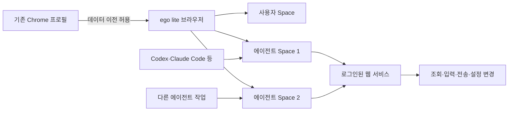

> 한 줄 요약: ego lite에서 눈에 띄는 점은 로그인된 Chrome 상태를 그대로 사용할 수 있다는 것이다. 하지만 로그인 절차를 생략하는 순간 에이전트는 단순한 웹 도구를 넘어 사용자 권한으로 행동하게 된다.

## 무슨 일이 있었나

GitHub Trending에 등장한 ego lite는 사람과 AI 에이전트가 한 브라우저에서 동시에 작업할 수 있도록 만든 macOS용 브라우저다. Codex, Claude Code, Cursor 같은 외부 에이전트가 전용 Space에서 웹페이지를 읽고 클릭하거나 내용을 입력하는 동안 사용자는 자신의 탭을 계속 이용할 수 있다.

제공된 스냅샷에는 저장소의 별이 3,234개, 하루 증가량이 986개로 표시돼 있다. 별 개수는 계속 바뀌며, 정확한 출시일과 집계 시각은 자료만으로 확인하기 어렵다.

설치 방법은 세 가지다. macOS 앱을 직접 내려받거나, `npx skills add citrolabs/ego-lite`로 연결용 스킬을 추가하거나, 에이전트에게 저장소의 설치 문서를 읽고 설정하도록 맡길 수 있다.

처음 실행할 때 Chrome 데이터 이전을 허용하면 로그인 정보와 쿠키, 확장 프로그램, 북마크를 가져온다. 이후에는 다음과 같이 자연어로 브라우저 작업을 지시할 수 있다.

```text
/ego-browser follow @ego_agent on x.com for me
```

에이전트는 페이지의 스냅샷(Snapshot)을 읽고 `fill`, `click`, `wait`, `navigate`, `capture` 같은 JavaScript 함수를 조합해 작업한다. 명령을 하나씩 호출하고 매번 결과를 확인하는 대신 여러 단계를 하나의 코드로 실행해 도구 호출 횟수와 토큰 사용량을 줄인다는 설명이다.

프로젝트 측은 네 가지 복합 작업에서 Vercel의 agent-browser보다 최대 2.5배 빨랐다고 주장한다. 평균이 아닌 최대 성능을 비교한 수치다. 공개된 자료에는 작업별 원본 결과, 반복 횟수, 하드웨어 조건이 충분히 나와 있지 않아 독립적으로 검증된 결과로 보기는 어렵다.

성공한 작업을 재사용 가능한 워크플로로 저장해 이후 실행 속도를 최대 5배 높인다는 기능도 아직 출시 전이다. 현재 제공되는 기능과 로드맵에 적힌 성능 전망은 구분해서 볼 필요가 있다.

## 왜 사람들이 반응했나

### AI 브라우저 자동화에서 로그인이 왜 어려웠나

기존 자동화 프레임워크는 별도의 브라우저나 새 프로필을 실행하는 경우가 많다. 격리에는 유리하지만 로그인과 다중 인증, 쿠키 동의, 초기 설정을 반복해야 한다.

평소 쓰는 브라우저를 에이전트가 직접 조작하면 로그인 문제는 줄어든다. 대신 사용자와 에이전트가 탭이나 마우스 포커스를 두고 충돌할 수 있다. ego lite는 같은 브라우저 안에 에이전트별 Space를 두는 방식으로 이 문제를 줄이려 한다.

여러 에이전트가 각자의 Space에서 동시에 작업할 수 있다는 점도 눈길을 끌 만하다. 경쟁사 조사나 잠재 고객 정보 보강, 여러 사이트에 걸친 반복 입력처럼 작업을 나눌 수 있는 업무에서는 병렬 실행으로 시간을 줄일 수 있다.

다만 제공된 자료에는 실제 커뮤니티 댓글이나 GitHub Discussions의 구체적인 반응이 없다. 높은 별 증가량은 관심이 몰렸다는 사실만 보여줄 뿐, 사용자들이 성능과 보안 관련 설명에 동의했다는 증거는 아니다.

### 로그인 마찰이 사라지면 권한 마찰도 사라진다

Chrome 데이터를 이전하는 것은 북마크만 가져오는 일이 아니다. 유효한 세션 쿠키까지 이전하면 메일, 클라우드 콘솔, 사내 도구, 소셜미디어, 쇼핑몰처럼 이미 인증된 서비스에 접근할 수 있다.

웹사이트에서는 사람의 클릭과 에이전트의 클릭이 같은 로그인 세션에서 발생한다. 계정 권한이 넓으면 브라우저 자동화가 행사할 수 있는 권한도 함께 넓어진다.



여기서는 탭보다 권한이 어떻게 격리되는지를 확인해야 한다. Space가 탭과 작업 화면을 나눠 제공하더라도 쿠키 저장소, 확장 프로그램 상태, 다운로드 파일, 클립보드, 인증 토큰까지 분리된다는 뜻은 아니다.

프로젝트 측은 브라우징 데이터가 기기에 남으며 Chrome 데이터 이전에 동의했는지만 기록한다고 설명한다. 이 설명만으로 프로세스 간 격리나 저장 데이터 암호화, 네트워크 요청 범위, 크래시 리포트 수집 여부, 자동 업데이트 경로까지 확인할 수는 없다.

### 편리한 설치와 공급망 신뢰는 같은 문제가 아니다

에이전트가 설치 문서를 읽고 앱을 설정하는 방식은 설치 과정을 간단하게 만든다. 반면 사용자는 어떤 스킬 파일이 추가되는지, 어떤 바이너리를 내려받는지, 업데이트가 어디에서 오는지 놓치기 쉽다.

저장소 내용은 MIT 라이선스로 공개돼 있지만, 프로젝트 설명에서는 ego lite 브라우저 자체를 별도의 무료 다운로드로 구분한다. 공개 저장소의 코드를 검토했다고 해서 설치된 브라우저 바이너리 전체까지 같은 수준으로 확인했다고 볼 수는 없다.

설정이 간단하다는 설명과 보안 검토가 필요 없다는 말은 다르다.

## 내가 보는 핵심

### AI 에이전트 브라우저는 도구보다 위임 시스템에 가깝다

이 제품에서 눈여겨볼 부분은 빠른 스냅샷이나 병렬 Space 자체보다 권한을 넘기는 방식이다. 기존 브라우저 자동화는 새 브라우저에 필요한 권한을 하나씩 추가했다. ego lite는 이미 여러 서비스에 로그인된 브라우저 상태에서 시작한다.

이 방식은 자동화 성공률을 높일 수 있다. 로그인 화면이나 봇 탐지, 확장 프로그램 의존성, 사용자별 설정 때문에 중단되던 작업도 기존 세션에서는 이어질 가능성이 크다.

대신 실패했을 때의 영향도 커진다. 격리된 테스트 프로필에서 잘못 클릭하면 테스트 데이터가 망가지는 정도로 끝날 수 있다. 실제 세션에서는 게시물 공개나 메시지 전송, 결제 단계 진입, 관리자 설정 변경으로 이어질 수 있다.

업무 자동화를 검토할 때는 모델이 페이지를 얼마나 정확히 이해하는지에 먼저 관심이 가기 쉽다. 실제 운영에서는 에이전트가 무엇을 볼 수 있는지보다 어떤 동작을 실행할 수 있으며 어디에서 멈추게 할 수 있는지가 더 중요하다.

### 별도 브라우저 vs 로그인 공유 브라우저 차이점

| 기준 | 별도 자동화 브라우저 | 로그인 상태를 공유하는 브라우저 |
|---|---|---|
| 초기 설정 | 로그인과 환경 구성이 반복됨 | 기존 상태를 이전하면 빠름 |
| 작업 성공률 | 인증·확장 기능에서 막힐 수 있음 | 일상 환경과 유사해 유리할 수 있음 |
| 사용자 충돌 | 사용자 브라우저와 분리됨 | Space 격리 품질에 좌우됨 |
| 사고 영향 | 전용 계정과 테스트 데이터로 제한 가능 | 실제 계정 권한까지 번질 수 있음 |
| 감사 가능성 | 실행 환경을 고정하기 쉬움 | 개인별 쿠키와 확장 상태가 변수로 남음 |
| 적합한 작업 | 테스트, 크롤링, 반복 조회 | 로그인 후 반복 입력, 개인 워크플로 |

어느 한쪽이 항상 낫지는 않다. 조회 위주이고 계정 권한이 낮은 작업에는 세션 공유 방식이 적합할 수 있다. 결제나 배포, 관리자 설정 변경처럼 되돌리기 어려운 작업에는 별도 프로필과 권한이 제한된 계정을 사용하는 편이 안전하다.

## 앞으로 볼 기준

### ego lite를 쓰기 전에 무엇을 확인해야 할까

처음부터 개인용 Chrome 프로필 전체를 이전할 필요는 없다. 자동화 전용 계정을 만들거나 권한이 제한된 프로필에서 시작하면 기능을 시험하면서 사고 범위를 줄일 수 있다.

도입 전에는 다음 항목을 확인해야 한다.

- Space마다 쿠키, 로컬 스토리지(Local Storage), 다운로드, 클립보드가 실제로 분리되는가
- 에이전트가 접근할 수 있는 도메인과 실행할 수 있는 동작을 제한할 수 있는가
- 메시지 전송, 게시, 구매, 삭제, 관리자 변경 전에 사람의 승인을 요구할 수 있는가
- 실행한 JavaScript와 클릭·입력 기록을 나중에 감사할 수 있는가
- 에이전트를 중지했을 때 진행 중인 요청과 백그라운드 작업도 함께 종료되는가
- 앱과 스킬의 버전을 고정하고 업데이트 출처를 검증할 수 있는가
- Chrome 데이터 이전을 취소하거나 세션을 일괄 폐기하는 절차가 있는가
- 회사 계정에서 브라우저 프로필 이전이 내부 보안 정책이나 서비스 약관에 어긋나지 않는가

성능도 실제 업무를 기준으로 다시 확인해야 한다. 최대 2.5배라는 수치 하나보다 자주 쓰는 사이트에서의 성공률과 재시도 횟수, 토큰 사용량, 사람이 개입한 횟수를 기록하는 편이 판단에 도움이 된다.

### 다음 AI 브라우저 뉴스를 볼 때의 기준

AI 브라우저가 로그인 상태와 개인 설정을 더 많이 활용할수록 제품 설명에서는 간편한 자동화를 강조할 가능성이 크다. 이때는 로그인 지원 여부와 함께 권한 최소화, 승인 시점, 실행 기록, 세션 폐기 방법을 확인해야 한다.

ego lite가 풀려는 문제는 명확하다. 사용자의 브라우저 작업을 방해하지 않으면서 여러 에이전트가 기존 로그인 상태로 일할 수 있다면 반복 로그인과 사용자 입력 충돌을 줄일 수 있다.

다만 편리한 로그인은 그만큼 넓은 권한 위임으로 이어지기 쉽다. 이 제품을 평가할 때는 에이전트가 얼마나 빨리 클릭하는지보다 잘못 클릭했을 때 어디까지 실행할 수 있는지를 먼저 봐야 한다.

## 참고 자료

- [선정 글감] [citrolabs/ego-lite — GitHub](https://github.com/citrolabs/ego-lite)