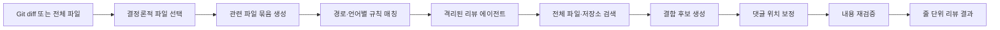

> 한 줄 요약: AI 코드 리뷰가 화제가 된 건 모델이 더 똑똑해져서가 아니다. 검토 범위와 규칙, 댓글 위치는 코드로 고정하고 판단이 필요한 부분만 대규모 언어 모델(LLM)에 맡기는 설계가 범용 에이전트의 불안정성을 직접 겨냥했기 때문이다.

## 무슨 일이 있었나: Open Code Review가 GitHub Trending에 오른 배경

2026년 7월 26일 기준 GitHub Trending 스냅샷에서 Alibaba의 `open-code-review`는 스타 12,688개, 하루 증가분 1,066개를 기록했다. 짧은 기간에 많은 개발자가 관심을 보인 오픈소스 프로젝트다.

Open Code Review는 Git 변경 내역을 읽고 코드 결함을 찾는 명령줄 인터페이스(CLI) 도구다. 변경된 줄만 확인하지 않는다. 필요하면 전체 파일을 읽고 저장소를 검색하거나 함께 변경된 다른 파일을 살펴보며 문맥을 확보한다. 의미 있는 Git 이력이 없거나 처음 보는 저장소에서는 `ocr scan`으로 전체 파일을 검사할 수도 있다.

프로젝트 설명에 따르면 Alibaba 내부의 공식 AI 코드 리뷰 보조 도구로 시작했다. 개발팀은 지난 2년간 수만 명의 개발자가 사용했고 수백만 건의 코드 결함을 찾았다고 밝혔다. 공개 저장소는 Apache-2.0 라이선스를 사용한다. OpenAI·Anthropic 호환 모델 엔드포인트뿐 아니라 자체 모델 공급자도 설정할 수 있다.

여기까지는 저장소에서 확인되는 내용과 개발팀이 공개한 설명이다. 내부 사용자 수와 결함 발견 건수, 발견 이후 실제 수정률을 독립적으로 검증할 자료는 선정 글감에 포함돼 있지 않다. GitHub 스타 증가도 관심도를 보여주는 지표일 뿐 코드 품질이나 운영 안정성을 입증하지는 않는다.

프로젝트가 공개한 벤치마크도 같은 기준으로 봐야 한다. 개발팀은 인기 오픈소스 저장소 50개에서 실제 풀 리퀘스트(Pull Request) 200개를 골랐으며, 10개 프로그래밍 언어에 걸친 정답 이슈 1,505개를 80명 이상의 시니어 엔지니어가 교차 검증했다고 설명한다.

이 자체 벤치마크에서는 같은 기반 모델을 사용한 범용 에이전트 Claude Code보다 정밀도(Precision)와 F1 점수가 높았고, 토큰 사용량은 약 9분의 1이었다고 한다. 재현율(Recall)은 범용 에이전트보다 낮았다. 가능한 한 많은 결함을 잡기보다 잘못된 경고를 줄이는 쪽을 택했다는 뜻이다.

## 왜 사람들이 반응했나: AI 코드 리뷰의 피로를 건드렸다

실제 댓글이나 토론 자료가 제공되지 않았으므로 커뮤니티 전체의 반응을 단정하기는 어렵다. 확인할 수 있는 신호는 GitHub Trending 진입과 스타 증가다. 다만 저장소가 앞세운 문제를 보면 어떤 점이 개발자의 관심을 끌었는지는 짐작할 수 있다.

범용 코딩 에이전트에 코드 리뷰를 맡기면 결과가 그럴듯하더라도 실행할 때마다 품질이 달라질 수 있다. 큰 변경에서 일부 파일을 빠뜨리거나 지적 내용은 맞는데 줄 번호가 어긋나는 경우가 있다. 프롬프트를 조금 바꿨을 뿐 결과가 흔들리기도 한다. 한 번 실행하는 데모에서는 잘 드러나지 않지만, 풀 리퀘스트마다 반복해서 사용하면 운영 문제가 된다.

특히 오탐(False Positive)은 정확도 수치만으로 설명하기 어려운 비용을 만든다. 개발자는 AI의 지적을 읽은 뒤 관련 코드를 다시 확인하고, 받아들이지 않은 이유까지 설명해야 할 수 있다. 틀린 경고가 쌓이면 리뷰 알림 자체를 무시하게 된다.

Open Code Review는 정밀도를 우선하는 방식으로 이 문제에 대응한다. 많은 의견을 남기는 것보다 실제 결함일 가능성이 높은 의견만 남겨야 협업 과정에서 계속 사용할 수 있다는 판단이다. 재현율이 낮다는 점을 숨기지 않고 설계상의 절충으로 명시한 것도 눈에 띈다.

반대쪽 위험도 분명하다. 보안 결함이나 데이터 손상처럼 한 번 놓쳤을 때 피해가 큰 문제에서는 낮은 재현율이 치명적일 수 있다. 댓글 수가 줄었다는 이유만으로 리뷰 품질이 좋아졌다고 판단하면 발견하지 못한 결함의 비용을 놓치게 된다.

| 쟁점 | 기대하는 효과 | 함께 생기는 위험 |
|---|---|---|
| 정밀도 우선 | 개발자가 처리할 오탐 감소 | 실제 결함을 놓칠 가능성 증가 |
| 파일 선택 자동화 | 큰 변경에서도 검토 범위 고정 | 필터 규칙이 틀리면 파일이 구조적으로 제외됨 |
| 규칙 세트 적용 | NPE, 스레드 안전성, XSS, SQL 삽입 등을 반복 검사 | 조직의 프레임워크와 위협 모델에 맞지 않을 수 있음 |
| 여러 하위 에이전트로 분할 | 대형 변경의 문맥 크기와 실행 시간을 제어 | 파일 묶음 사이의 상호작용을 놓칠 수 있음 |
| 외부 LLM 연결 | 모델 선택과 비용 조절 가능 | 소스 코드와 비밀정보가 외부로 전송될 수 있음 |
| 줄 단위 댓글 | 사람이 바로 확인하기 쉬움 | 리베이스 후 위치 정합성을 별도로 검증해야 함 |

모델을 선택할 수 있다는 점도 관심을 끌 만하다. 특정 모델이나 단일 SaaS에 묶이지 않고 호환 엔드포인트를 지정할 수 있으며, 코딩 에이전트가 자체 LLM을 사용하도록 하는 위임 모드(Delegation Mode)도 제공한다. 모델과 비용, 데이터 전송 범위를 직접 관리하려는 팀에 필요한 기능이다.

그렇다고 공급자 종속이 저절로 사라지는 것은 아니다. 모델마다 도구 호출과 긴 문맥 처리 능력이 다르고 구조화된 출력을 얼마나 안정적으로 만드는지도 차이가 난다. 호환 API에 연결할 수 있다는 것과 같은 리뷰 품질을 재현할 수 있다는 것은 별개의 문제다.

## 내가 보는 핵심: 모델보다 검토 절차를 통제해야 한다

이 프로젝트에서 주목할 부분은 AI가 코드 리뷰를 잘한다는 주장이 아니다. 언어 모델에 맡기지 말아야 할 영역을 따로 분리했다는 점이다.

변경 파일 선택과 제외 규칙, 관련 파일 묶기, 파일별 규칙 매칭, 댓글 위치 계산은 결정론적 파이프라인(Deterministic Pipeline)이 처리한다. 에이전트는 추가로 살펴볼 코드 문맥을 판단하고 결함 가능성을 추론한 뒤 리뷰 문장을 작성한다.

이 구조의 장점은 실패 원인을 단계별로 추적할 수 있다는 것이다. 특정 파일이 빠졌다면 모델의 집중력 문제가 아니라 파일 선택 로직부터 확인할 수 있다. 엉뚱한 규칙이 적용됐다면 템플릿 매칭을 살펴보고, 지적 위치가 틀렸다면 위치 보정 단계를 조사하면 된다.

프롬프트 하나에 모든 책임을 넣으면 결과가 나빠졌을 때 어느 단계가 문제인지 찾기 어렵다. 결정할 수 있는 절차를 코드로 고정하면 실행 과정과 결과를 다시 확인하기 쉬워진다. OpenTelemetry 연동과 세션 재개·열람 기능도 이런 운영 방식에 맞춰 제공되는 기능이다.

물론 결정론적이라는 말이 정확하다는 뜻은 아니다. 잘못 만든 파일 필터는 중요한 파일을 매번 같은 방식으로 제외한다. 부적절한 규칙 매칭도 같은 오탐을 반복해서 만들 수 있다. 실행할 때마다 달라지는 오류를 줄이는 대신 구조적인 오류가 고착될 수 있다.

현업에서는 첫 실행 결과보다 몇 달 뒤의 운영 상태가 더 중요하다. 반복해서 기각되는 경고가 무엇인지, 놓친 결함이 어느 단계에서 빠졌는지 기록해야 한다. 모델을 바꾼 뒤 품질과 비용이 어떻게 변했는지도 추적해야 한다. 이런 기록이 없으면 하이브리드 구조도 원인을 알기 어려운 시스템이 된다.

보안과 데이터 전송 범위도 도입 전에 확인해야 한다. 저장소 검색 권한을 가진 에이전트는 변경 파일 밖의 코드까지 모델에 보낼 수 있다. API 키나 고객 데이터가 포함된 테스트 픽스처, 내부 알고리즘과 생성 파일이 프롬프트에 섞이지 않도록 전송 범위와 로그 보존 정책을 점검해야 한다.

`ocr scan`은 검사 범위가 특히 넓다. 오래된 저장소를 감사할 때는 유용하지만 전체 디렉터리를 대상으로 하므로 비용과 기밀정보 노출 범위도 커진다. 개발자 개인 키로 조직 저장소 전체를 검사하도록 두기 전에 권한과 전송 정책부터 정해야 한다.

## 앞으로 볼 기준: AI 코드 리뷰 도입 전에 무엇을 확인할까

새로운 AI 코드 리뷰 도구를 평가할 때는 발견 건수보다 다음 질문을 먼저 확인하는 편이 낫다.

- 벤치마크의 정답 이슈를 누가 어떤 기준으로 확정했는가
- 정밀도와 재현율 중 무엇을 우선하며, 사용자가 그 기준을 설정할 수 있는가
- 대형 풀 리퀘스트에서 대상 파일을 빠짐없이 검토했다는 실행 기록이 남는가
- 파일 묶음 사이의 API 계약과 권한 변화, 트랜잭션 경계를 다시 합쳐 검사하는 단계가 있는가
- 생성 코드와 벤더 코드, 테스트 데이터, 비밀정보를 제외하는 규칙이 기본으로 제공되는가
- 소스 코드가 어느 모델 공급자에게 전송되며 얼마나 오래 보관되는가
- 모델·프롬프트·규칙 버전을 고정해 같은 조건의 리뷰를 재현할 수 있는가
- 오탐 기각률과 실제 수정률, 놓친 결함을 조직 내부에서 측정할 수 있는가
- AI가 남긴 댓글을 필수 병합 조건으로 사용할지 참고 정보로만 사용할지 명확한가
- 장애나 사용량 제한이 발생해도 사람의 리뷰와 기존 정적 분석이 계속 동작하는가

도입 초기에는 병합을 막지 않는 관찰 모드로 실행하는 방법이 현실적이다. 사람이 발견한 문제와 AI의 지적을 함께 기록한 뒤 언어와 저장소, 결함 유형별 정밀도와 재현율을 계산한다. 효과가 확인된 규칙만 병합 조건으로 올리면 된다.

기존 정적 분석기와의 역할도 구분해야 한다. 컴파일 오류나 알려진 취약 패턴, 포맷과 타입 규칙처럼 기계적으로 판별할 수 있는 항목은 린터와 정적 애플리케이션 보안 테스트(SAST)가 더 저렴하고 재현하기 쉽다. AI 리뷰는 여러 파일 사이의 의도 불일치나 누락된 예외 처리, 변경 맥락처럼 규칙으로 표현하기 어려운 영역에 집중하는 편이 적절하다.

Open Code Review의 인기는 AI가 사람 리뷰어를 대체한다는 증거가 아니다. 모델에 모든 절차를 맡겨서는 반복 가능한 리뷰 시스템을 만들기 어렵다는 문제를 보여주는 사례에 가깝다.

개발자에게 필요한 것은 많은 AI 댓글이 아니라 검토할 가치가 있는 댓글이다. 이런 도구를 평가할 때는 모델 크기보다 어떤 절차를 코드로 고정했는지, 모델에 허용한 범위는 어디까지인지, 놓친 문제를 어떻게 측정하는지를 살펴봐야 한다.

## 참고 자료

- [선정 글감] [alibaba/open-code-review — Open Code Review](https://github.com/alibaba/open-code-review) — GitHub Trending