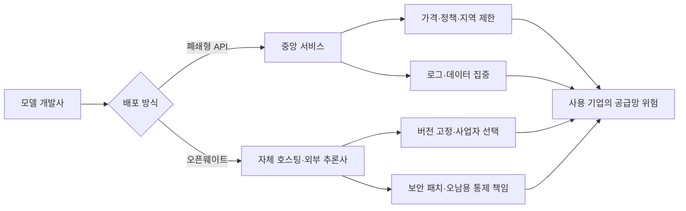

> 한 줄 요약: 오픈웨이트 AI 모델 규제 논쟁은 안전과 개방성 중 하나를 고르는 문제가 아니다. 모델 접근권을 누가 통제하는지, 기업과 개발자가 어떤 공급망 위험을 감수해야 하는지 따져야 한다.

## 무슨 일이 있었나

2026년 7월 27일 기준, LocalLLaMA에는 OpenAI와 Anthropic이 워싱턴 규제 당국에 오픈소스 AI 모델 제한을 요구했다는 제목의 게시물이 올라왔다. 샘 올트먼이 공개적으로 오픈소스를 지지해 온 것과 회사의 로비 방향이 다르다는 주장까지 더해지면서 논쟁이 커졌다.

하지만 해당 게시물의 본문은 Reddit 검증 화면에 막혀 있다. 로비 문서와 당국에 제출한 의견서, 당사자의 답변도 확인되지 않았다. 두 회사가 실제로 어떤 규제를 요청했는지, 오픈소스 전체를 제한하려 했는지, 일부 고성능 모델의 배포 조건만 다뤘는지는 현재 자료만으로 판단하기 어렵다.

별도로 확인되는 사실은 있다. WIRED는 2026년 6~7월 Z.ai의 GLM 5.2, Moonshot AI의 Kimi K3, Alibaba의 Qwen 3.8이 잇달아 공개됐으며, 이 모델들이 에이전틱 코딩(Agentic Coding)과 오픈웨이트(Open Weight)를 내세웠다고 보도했다.

기사에 따르면 미국 정부 관계자들은 중국 모델의 성능과 개발 과정에 공개적으로 우려를 나타냈다. 백악관 과학기술정책실장 마이클 크라치오스는 Moonshot AI가 Anthropic 모델을 증류(Distillation)해 Kimi K3를 개발했다는 정보를 갖고 있다고 주장했다. 다만 제공된 발췌문에는 이를 뒷받침하는 기술 자료나 Moonshot의 답변이 없다.

우선 용어부터 구분할 필요가 있다.

| 구분 | 일반적으로 공개되는 것 | 사용자가 확인해야 할 것 |
|---|---|---|
| 폐쇄형 API | 입력·출력 인터페이스 | 가격, 데이터 보존, 지역 제한, 서비스 중단 정책 |
| 오픈웨이트 모델 | 학습된 가중치 | 라이선스, 재배포 조건, 학습 데이터 공개 범위 |
| 오픈소스 AI | 코드·가중치·문서 등의 공개 조합 | 실제 재현 가능성, 수정·상업 이용 권한 |

가중치를 내려받을 수 있다고 해서 학습 데이터와 개발 과정 전체가 공개되는 것은 아니다. 오픈소스와 오픈웨이트를 같은 뜻으로 사용하면 무엇을 규제하는지, 누가 책임지는지부터 불분명해진다.

## 왜 사람들이 반응했나

### 오픈웨이트 AI 모델 규제가 개발자에게 불편한 이유

LocalLLaMA 이용자에게 오픈웨이트는 이념보다 실무에 가까운 문제다. 모델을 로컬이나 자체 클라우드에서 실행할 수 있고, 추론 사업자를 바꾸거나 필요한 버전을 고정해서 쓸 수 있기 때문이다.

Kimi K3의 가중치 공개 예고를 다룬 게시물에서도 작성자는 직접 모델을 실행할 장비는 없지만, 가중치 공개를 계기로 새로운 추론 사업자가 등장할 수 있다고 기대했다. 개인용 컴퓨터로 대형 모델을 돌리지 못하더라도 여러 사업자가 같은 모델을 제공하면 가격과 서비스 조건을 비교할 여지가 생긴다는 뜻이다.

규제 이야기가 나오면 개발자들이 주로 걱정하는 부분은 다음과 같다.

- 다운로드와 자체 호스팅이 허가제로 바뀌는가
- 특정 국가·기업·컴퓨팅 규모만 제한하는가
- 이미 받은 가중치의 재배포와 파생 모델도 대상인가
- 보안 연구와 취약점 분석까지 위축되는가
- 폐쇄형 API 사업자에게 유리한 규칙이 되는가

거센 반응에는 신뢰 문제도 섞여 있다. 공개적으로 개방 생태계를 지지한 기업이 비공개 정책 협의에서는 경쟁 모델의 배포를 제한하려 했다는 인상을 주면, 실제 제안의 범위보다 말과 행동이 다르다는 논란이 앞서기 쉽다.

그렇다고 현재 선정 글감만으로 이런 불일치를 사실로 단정할 수는 없다. 생물학이나 사이버 공격에 악용될 수 있는 일부 역량의 통제를 요구하는 것과 경쟁 오픈웨이트 모델 전체를 막으려는 것은 다른 정책이다.

### 규제 찬성론에도 현실적인 근거가 있다

가중치는 한 번 공개되면 API 차단이나 계정 정지만으로 회수하기 어렵다. 안전 필터가 제거된 파생 모델이 나올 수 있으며, 원본 공급자가 사용 기록을 파악하거나 긴급 패치를 강제로 적용하기도 어렵다.

폐쇄형 API라고 해서 저절로 안전해지는 것도 아니다. 프롬프트와 업무 데이터가 중앙 사업자에게 모이고, 가격 변경이나 지역 차단, 사용 정책 개정의 영향이 모든 이용자에게 한꺼번에 미친다.

중국 오픈웨이트 모델의 약진을 둘러싼 미국 당국의 반응에는 이 두 문제가 겹쳐 있다. 모델이 부당한 증류를 거쳤는지 검증하는 일과 개발사의 국적을 이유로 접근 자체를 제한하는 일은 구분해서 다뤄야 한다.

Google이 오픈웨이트 모델을 지지했다는 제목의 다른 LocalLLaMA 게시물도 기업 간 대립 구도를 부각했다. 하지만 제공된 본문에는 공식 입장문이나 구체적인 정책 범위가 없다. 이를 모든 기술 기업과 Anthropic의 대립으로 해석하는 것 역시 게시물 작성자의 주장에 가깝다.

## 내가 보는 핵심

### 오픈소스 AI 논쟁은 공급망 통제권의 문제다

이 논쟁에서 중요한 것은 모델 공개 여부만이 아니라 배포 이후의 통제권과 책임이 누구에게 가는지다. 폐쇄형 API에서는 공급자가 배포와 회수를 통제한다. 오픈웨이트에서는 운영자가 더 많은 통제권을 갖는 대신 배포 이후의 책임도 더 많이 부담한다.

이런 조건에서는 모델 성능표만 보고 도입을 결정하기 어렵다. API가 갑자기 제한됐을 때 다른 모델로 옮길 수 있는지, 가중치를 직접 운영한다면 패치와 접근 통제를 감당할 수 있는지가 장기적으로 더 중요하다.

규제가 필요하더라도 회사 이름이나 공개 방식만으로 대상을 정하면 규제 회피와 과잉 규제가 함께 발생할 수 있다. 모델이 가진 구체적인 위험 역량과 배포 규모, 접근 통제 수준, 사고 대응 의무를 기준으로 삼는 편이 낫다.

증류 의혹도 같은 기준으로 봐야 한다. 벤치마크 성능이 비슷하다는 사실만으로 도용이 입증되지는 않는다. 모델 출력의 사용 조건과 접근 기록, 기술적 유사성, 계약 위반 여부를 함께 확인해야 한다.

### 오픈웨이트와 폐쇄형 API 중 무엇을 선택해야 할까

현업에서는 완전한 개방이나 완전한 폐쇄 중 하나를 고르기보다 업무 성격에 따라 나누는 편이 현실적이다.

- 민감한 내부 데이터는 자체 호스팅 또는 보존 정책이 명확한 API로 처리한다.
- 외부 API에는 데이터 삭제, 학습 이용, 저장 지역, 하위 처리업체 조건을 확인한다.
- 오픈웨이트 모델은 라이선스뿐 아니라 출처와 체크섬, 배포자의 서명까지 기록한다.
- 특정 모델에 종속되지 않도록 평가 데이터와 프롬프트를 이식 가능한 형태로 관리한다.
- 규제나 제재로 공급이 끊겼을 때 사용할 대체 모델과 품질 하락 범위를 미리 측정한다.

오픈웨이트를 선택하면 모델에 대한 통제권과 함께 운영 책임도 가져온다. 폐쇄형 API를 선택하면 운영 부담은 줄지만 사업자의 정책과 관할권이 공급망의 일부가 된다.

## 앞으로 볼 기준

### 다음 오픈웨이트 AI 규제 뉴스를 볼 때 확인할 것

첫째, 주장보다 원문 문서를 확인해야 한다. 로비 관련 보도라면 제출 의견서와 회의 기록, 법안 문구에서 당사자와 수신 기관, 제안 날짜를 확인할 필요가 있다.

둘째, 규제 대상의 범위를 봐야 한다. 모든 가중치 공개를 제한하는지, 일정 연산량을 넘는 모델만 다루는지, 위험 역량 평가를 통과하지 못한 모델을 대상으로 하는지에 따라 개발 생태계에 미치는 영향이 달라진다.

셋째, 의무를 지는 주체가 누구인지 확인해야 한다.

- 모델 개발사
- 가중치 배포 플랫폼
- 클라우드와 추론 사업자
- 파생 모델 제작자
- 최종 도입 기업

넷째, 같은 위험 기준이 폐쇄형 모델에도 적용되는지 봐야 한다. 오남용 가능성이 비슷한데도 배포 방식이나 기업 국적에 따라 규칙이 달라진다면 안전 규제보다 산업 정책의 성격이 강할 수 있다.

다섯째, 검증 가능한 증거와 당사자의 반론이 함께 공개됐는지 확인해야 한다. 증류·도용·국가안보처럼 강한 표현이 등장할수록 기술적 증거와 법적 판단, 정치적 주장을 구분해서 읽어야 한다.

이번 Reddit 게시물이 제기한 로비 의혹은 아직 확인되지 않았다. 다만 커뮤니티의 반응은 한 가지 질문을 보여준다. 한 기업이나 정부의 결정으로 개발 경로 전체가 막히지 않도록 사용자가 선택권을 가질 수 있느냐는 문제다.

다음 관련 뉴스에서는 누가 오픈소스를 지지한다고 말했는지보다 어떤 모델의 어떤 역량을, 무슨 근거로, 누구에게 제한하려는지부터 확인해야 한다.

## 참고 자료

- [선정 글감] [OpenAI와 Anthropic의 오픈소스 AI 규제 로비 의혹 게시물](https://www.reddit.com/r/LocalLLaMA/comments/1v74j62/sources_openai_and_anthropic_quietly_lobby/) — Reddit LocalLLaMA
- [관련] [China’s Open AI Models Are Challenging Silicon Valley’s Playbook](https://www.wired.com/story/chinas-open-ai-models-are-challenging-silicon-valleys-playbook/) — WIRED
- [관련] [Kimi K3 gets open weighted tomorrow!](https://www.reddit.com/r/LocalLLaMA/comments/1v722bp/kimi_k3_gets_open_weighted_tomorrow/) — Reddit LocalLLaMA
- [관련] [Google comes out in favor of OpenWeight models](https://www.reddit.com/r/LocalLLaMA/comments/1v6axx3/google_comes_out_in_favor_of_openweight_models_it/) — Reddit LocalLLaMA