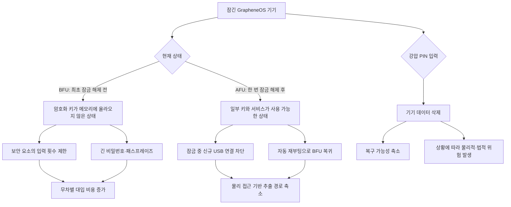

> 한 줄 요약: GrapheneOS 강압 PIN은 잠긴 휴대전화의 데이터를 지우는 비상 기능이다. 하지만 미국 국경 수색 사건에서 보듯, 데이터를 지우는 데 성공해도 법적 위험까지 사라지는 것은 아니다. 실제 보안 수준을 판단할 때는 삭제 기능보다 암호화, 잠금 상태, USB 차단, 자동 재부팅이 어떻게 함께 작동하는지 살펴봐야 한다.

## 무슨 일이 있었나

미국 법무부는 애틀랜타 주민이자 미국 시민인 새뮤얼 튜닉(Samuel Tunick)을 국경 당국에 휴대전화 비밀번호를 제공하는 과정에서 기기 데이터를 삭제한 혐의로 기소했다. TechCrunch는 2026년 7월 24일 이 사건을 보도했다. 해당 기기는 구글 픽셀에 보안 운영체제 GrapheneOS를 설치한 상태였다.

정부 측은 튜닉이 정상적인 잠금 해제 비밀번호 대신 데이터를 지우도록 설정한 강압 비밀번호(Duress Password)를 입력했다고 주장한다. GrapheneOS의 강압 PIN·비밀번호는 잠금 화면과 민감한 설정을 변경할 때 나타나는 인증 창에서 작동한다. 실행되면 기본 사용자와 보조 사용자, 비공개 공간(Private Space)의 데이터가 함께 삭제된다.

현재까지 알려진 내용은 기소장과 변호인 측 서류를 바탕으로 보도된 양측의 주장이다. 튜닉이 어떤 의도로 해당 값을 입력했는지, 압수와 수색은 적법했는지, 데이터 삭제 행위를 범죄로 처벌할 수 있는지는 법원이 판단해야 한다.

변호인 측은 국경 당국의 구금과 휴대전화 압수가 위법했으므로 그 과정에서 확보한 증거를 배제해야 한다고 주장했다. TechCrunch는 강압 비밀번호를 이용한 데이터 삭제로 연방 검찰이 사용자를 기소한 미국 최초의 알려진 사례로 보인다고 전했다. 아직 확정 판결이 나온 사건은 아니다.

### GrapheneOS 강압 PIN은 무엇을 지우나

강압 PIN은 사용자가 위협받는 상황에서 기기 데이터를 즉시 삭제하는 기능이다. GrapheneOS 프로젝트는 이를 잠긴 기기의 주된 방어 수단이 아니라 여러 보호 계층 가운데 하나로 설명한다.

GrapheneOS 보안의 기본은 디스크 암호화다. 잠긴 기기에서 데이터를 얻으려는 공격자는 암호화 자체를 깨기보다, 최초 잠금 해제 후(After First Unlock·AFU) 상태의 운영체제를 공격하거나 PIN·비밀번호를 추측하려 할 가능성이 크다.

지원 기기의 보안 요소(Secure Element)는 인증 실패가 누적될수록 다음 입력까지의 대기 시간을 늘린다. 프로젝트가 인용한 Android 인증 문서에 따르면 10회 실패 후에는 4시간, 15회 실패 후에는 41일의 지연이 적용되며 전체 시도 횟수는 20회로 제한된다. 최근 입력한 서로 다른 실패 값 5개는 반복된 실수 때문에 시도 횟수가 소진되지 않도록 따로 처리된다.

GrapheneOS는 잠금 상태에서 새로운 USB 연결을 차단하고 메모리 안전성을 강화한다. 최대 128자의 비밀번호를 지원하며, 일정 시간이 지나면 잠긴 기기를 자동으로 재부팅할 수도 있다. 자동 재부팅은 기기를 최초 잠금 해제 전(Before First Unlock·BFU) 상태로 되돌려 암호화 키와 메모리에 남은 데이터를 정리한다.

강압 PIN은 이런 방어 수단이 실패하거나 정상 비밀번호가 노출된 상황에서 선택할 수 있는 파괴적 수단이다. 데이터 복구를 어렵게 만들 수 있지만, 실행 사실이 별도의 법적 분쟁이나 물리적 위험으로 이어질 수 있다.

## 왜 사람들이 반응했나

이 글은 Hacker News에서 215포인트와 115개 댓글을 기록했다. 관심이 쏠린 이유는 GrapheneOS의 기능 자체보다 휴대전화 잠금 해제를 요구받은 사용자가 어디까지 대응할 수 있는지, 그 대응이 다시 처벌 근거가 될 수 있는지가 한 사건에서 맞부딪혔기 때문이다.

### 데이터를 지울 권리와 증거를 없앤 책임은 어떻게 구분할까?

원격 초기화와 자동 삭제는 평소에는 분실한 기기의 개인정보를 보호하는 기능이다. 같은 기능이 정부 수색 직전에 실행되면 수사기관은 이를 증거 인멸로 볼 수 있다.

사용자에게는 하나의 보안 설정이지만, 법원에서는 설정한 시점과 입력 의도, 수색의 적법성, 삭제된 데이터의 성격을 따로 따질 수 있다. 기능이 암호학적으로 안전하다고 해서 그 기능을 사용하는 행위까지 법적으로 안전한 것은 아니다.

국경 수색이라는 조건도 쟁점을 복잡하게 만든다. 미국 국경에서는 일반적인 국내 수색과 다른 법리가 적용될 수 있지만, 모든 전자기기 수색이 자동으로 적법해지는 것은 아니다. 이번 사건에서 변호인 측이 데이터 삭제 행위보다 압수의 적법성을 먼저 다투는 이유도 여기에 있다.

### 왜 강압 PIN만 믿으면 위험할까?

강압 PIN은 작동 방식이 눈에 잘 띄고 설명하기도 쉽다. 하지만 실제 데이터 추출을 막을 때 더 자주 작동하는 장치는 BFU 상태와 강한 패스프레이즈, 입력 횟수 제한, USB 차단, 자동 재부팅이다.

| 방어 수단 | 막으려는 경로 | 사용자가 치르는 비용 | 남는 위험 |
|---|---|---|---|
| 긴 패스프레이즈 | PIN 무차별 대입 | 입력이 번거로움 | 사용자가 직접 공개할 가능성 |
| 보안 요소의 횟수 제한 | 반복 추측 | 오입력 시 긴 대기 | 구현 결함이나 OS 취약점 |
| 잠금 중 USB 차단 | 물리 연결 기반 추출 | 일부 액세서리 사용 제한 | 기존 연결이나 다른 공격 경로 |
| 자동 재부팅 | AFU 상태 장기 유지 | 백그라운드 작업 중단 | 재부팅 전에 이뤄지는 공격 |
| 강압 PIN | 정상 인증 정보가 노출된 뒤의 복구 | 데이터의 영구 손실 | 법적·물리적 보복과 오작동 |

GrapheneOS는 강압 PIN을 기억하는 방법으로 휴대전화 케이스나 지갑 속 종이에 번호를 적어 두는 방식을 안내한다. 동시에 실제 강압 상황에서는 데이터 삭제로 생길 수 있는 물리적·법적 결과를 신중하게 고려하라고 경고한다. 프로젝트도 이 기능을 모든 사용자에게 필요한 기본 설정으로 취급하지는 않는다.

### 보안 기능이 오히려 신뢰를 흔드는 순간

사용자는 운영체제가 자신의 데이터를 보호하기를 기대한다. 수사기관은 같은 기능이 적법한 증거 확보를 방해할 수 있다고 본다. 플랫폼 개발자가 두 요구를 동시에 충족하기는 어렵다.

강압 PIN을 없애면 폭력이나 스토킹, 권위주의적 감시를 당하는 사용자가 데이터를 보호할 수단도 줄어든다. 반대로 너무 쉽게, 흔적 없이 실행되면 실수나 내부자 공격에 악용되거나 증거 보존 의무를 위반할 수 있다.

이 문제는 기능 자체를 좋거나 나쁘다고 규정하는 것만으로 풀리지 않는다. 누가 어떤 권한으로 기기에 접근하는지, 사용자가 그 요구를 거부할 수 있는지, 삭제 뒤의 책임은 누가 지는지까지 함께 따져야 한다.

## 내가 보는 핵심

이번 사건에서 따져야 할 문제는 강압 PIN을 켤지 말지가 아니다. 데이터를 파괴하는 보안 기능을 검토할 때는 기술적 위협 모델(Threat Model)과 현장에서의 대응 모델(Response Model)을 나눠 봐야 한다.

위협 모델은 공격자가 기기를 빼앗은 뒤 운영체제 취약점을 이용하거나 비밀번호를 추측해 데이터를 추출하는 과정을 다룬다. 이때는 암호화와 BFU 복귀, 보안 요소의 입력 제한, USB 차단이 방어 수단이 된다.

대응 모델은 사용자가 현장에서 어떤 행동을 할지 다룬다. 국경 수색과 경찰 조사, 회사 감사, 가정폭력 상황은 상대방의 권한과 예상되는 반응이 서로 다르다. 같은 삭제 기능을 실행해도 결과가 달라질 수 있다.

이런 기능을 검토할 때 데이터가 제대로 삭제되는지만 확인해서는 부족하다. 실수로 실행할 가능성과 삭제 사실이 상대방에게 어떻게 드러나는지, 백업 데이터가 남아 있는지, 법적 보존 의무가 있는지 살펴봐야 한다. 복구 불가능한 삭제가 업무 중단으로 이어질 가능성도 고려해야 한다.

회사 관리 기기에 개인용 강압 PIN을 적용하면 문제는 더 복잡해진다. 개인정보를 보호하는 데는 도움이 될 수 있지만 전자증거 보존(Legal Hold), 사고 조사, 모바일 기기 관리(MDM) 정책과 충돌할 수 있다. 조직은 이런 기능을 배포하기 전에 적용 대상과 승인 절차를 정하고, 백업 범위와 로그 보존 기준을 문서로 남겨야 한다.

개인 사용자도 우선은 데이터를 지우는 것보다 노출 범위를 줄이는 편이 낫다. 민감한 데이터를 처음부터 휴대하지 않거나 별도 프로필에 격리할 수 있다. 강한 패스프레이즈와 짧은 자동 재부팅 시간을 설정하는 방법도 데이터 전체를 즉시 삭제하는 것보다 되돌릴 여지가 많다.

## 앞으로 볼 기준

강압 PIN이나 잠긴 기기의 데이터 추출과 관련된 사건이 나오면 다음 내용을 먼저 확인할 필요가 있다.

- 아직 기소 단계인지, 법원이 사실관계를 인정하고 판결까지 내렸는지
- 수색 영장이나 국경 수색, 회사 내부 조사 중 어떤 권한에 따라 기기에 접근했는지
- 기기가 BFU와 AFU 중 어느 상태였으며 당시 어떤 데이터에 접근할 수 있었는지
- 강압 PIN이 실제로 추출을 막았는지, 기존 암호화와 자동 재부팅만으로 이미 접근이 차단된 상태였는지
- 삭제된 데이터가 다른 기기나 클라우드 백업, 서버 로그에도 남아 있었는지

제품을 고를 때도 눈에 띄는 기능보다 기본 설정을 먼저 봐야 한다. 자동 재부팅 주기와 잠금 중 USB 정책, 보안 업데이트 기간, 보안 요소의 입력 제한, 보조 사용자 키 분리 방식은 평소 강압 PIN보다 더 자주 데이터를 보호한다.

이번 기소로 강압 PIN 자체가 불법이라는 결론이 내려진 것은 아니다. 개인정보 보호 기능이라는 이유만으로 어떤 상황에서든 안전하게 실행할 수 있다는 뜻도 아니다.

잠긴 휴대전화의 데이터는 암호화로 보호할 수 있지만, 기기를 들고 있는 사람까지 기술로 보호할 수는 없다. 삭제 기능을 설정하기 전에 어떤 데이터를 휴대할지, 언제 기기를 BFU 상태로 돌릴지, 삭제 후 발생할 책임을 감당할 수 있는지부터 판단해야 한다.

## 참고 자료

- [선정 글감] [GrapheneOS protections against data extraction from locked devices](https://discuss.grapheneos.org/d/40700-grapheneos-protections-against-data-extraction-from-locked-devices) — GrapheneOS Discussion Forum
- [관련] [US accuses American of allegedly wiping his phone using a duress password during border search](https://techcrunch.com/2026/07/24/us-accuses-american-of-allegedly-wiping-his-phone-using-a-duress-password-during-border-search/) — TechCrunch
- [관련] [Authentication rate limiting](https://source.android.com/docs/security/features/authentication/rate-limiting) — Android Open Source Project
- [관련] [Insider Attack Resistance](https://android-developers.googleblog.com/2018/05/insider-attack-resistance.html) — Android Developers Blog
- [관련] [GrapheneOS features](https://grapheneos.org/features) — GrapheneOS
- [관련] [Hacker News discussion](https://news.ycombinator.com/item?id=49055169) — Hacker News